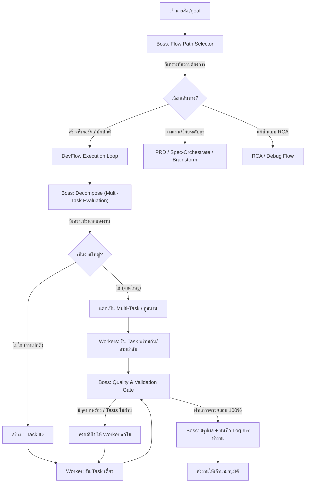

# Implementation Plan - Antigravity IDE Autonomous /goal Execution Engine

> [!NOTE]
> แผนงานนี้ถูกออกแบบมาเพื่อสร้างระบบลูปการทำงานแบบอัตโนมัติ `/goal` สำหรับ Antigravity IDE โดยไม่ขึ้นกับ Claude Code โดยยึดหลักการทำงานแบบ **Boss-Worker Architecture** และรองรับกระบวนการมาตรฐานของ **Nexus-DevFlow** ทุกขั้นตอนอย่างสมบูรณ์แบบ (Task -> Plan -> Code -> Verify)

---

## 🎯 Goals & Features

1. **Dedicated Antigravity IDE /goal Feature**: พัฒนาขึ้นเพื่อทำงานบน Antigravity IDE อย่างสมบูรณ์และเป็นเอกเทศ
2. **Dynamic Flow Path Selection**: ระบบสามารถประเมินคำสั่ง (Goal Description) และเลือกเส้นทาง Flow/Path ที่เหมาะสมที่สุดก่อนรัน (เช่น PRD, Brainstorm, Task Coding, RCA/Debug, Refactor)
3. **High-Fidelity Output**: ผลลัพธ์สุดท้ายและไฟล์ Artifacts ทั้งหมดที่ได้จาก `/goal` จะเหมือนกับการที่ผู้ใช้ทำตามขั้นตอน DevFlow ด้วยตนเองทีละสเต็ปเป๊ะๆ (`spec.md`, `implementation_plan.json`, `plan.md`, `qa_report.md`, และโค้ดจริงในระบบ)
4. **Turn & Performance Metrics Logging**: ระบบจะบันทึก Log การทำงานอย่างละเอียด ได้แก่:
   - เวลาเริ่มต้น (Start Time), เวลาสิ้นสุด (End Time)
   - ระยะเวลาการทำงานทั้งหมด (Duration)
   - จำนวน Turn ทั้งหมด และจำนวน Turn ในแต่ละขั้นตอน (เช่น Phase 30, Phase 31, Phase 32, Phase 33)
   - บันทึกการตัดสินใจของ Boss และประวัติการทำของ Worker
5. **Configurable Max-Turns**: ตั้งค่าขีดจำกัด Turn สูงสุดได้ผ่าน CLI/Config พร้อมกำหนดค่าเริ่มต้นที่ปลอดภัย (Default: `20` turns) เพื่อป้องกัน Infinite Looping
6. **Multi-Task & Parallel Execution**: หากเป็นงานขนาดใหญ่ Boss Agent สามารถประเมินและแตกงานออกเป็นหลายๆ Sub-Tasks ทำงานเชื่อมโยงหรือรันคู่ขนานกันได้

---

## 🎨 Proposed Architecture (Boss-Worker)



---

## 🛠️ Proposed Changes

### Component 1: CLI and Workflow Setup

#### [NEW] [05-Goal.md](file:///d:/Projects/nexus-devflow/.agent/workflows/05-Goal.md)
* เป็นคู่มือ Workflow สำหรับ Agent เมื่อเจ้านายเรียกคำสั่ง `/goal` บน Antigravity IDE
* ระบุขั้นตอนปฏิบัติ:
  1. การประเมินเพื่อเลือก Flow Path (Flow Routing)
  2. การแตกเป็น Multi-Task (ถ้างานใหญ่) และประสานงาน Worker
  3. การควบคุมขีดจำกัด `max-turns` และระยะเวลา
  4. การตรวจรับงานและออกรายงาน Log การทำงานโดย Boss

#### [NEW] [goal-runner.mjs](file:///d:/Projects/nexus-devflow/.agent/scripts/goal-runner.mjs)
* เป็น Script หลักในการขับเคลื่อนลูป `/goal`
* จัดการระบบ Turn Counter, เช็ค `max-turns` และ Time limits
* จัดเก็บ Log การทำงานอย่างเป็นระเบียบลงใน `.workspaces/specs/goal-sessions/session-{id}.json` และสร้าง symlink/copy เป็น `goal_latest_session.json`
* รองรับคำสั่งเรียกใช้เช่น:
  ```powershell
  node .agent/scripts/goal-runner.mjs --goal "Implement goal command" --max-turns 30 --parallel
  ```

#### [NEW] [prp-core-boss.md](file:///d:/Projects/nexus-devflow/.agent/agents/prp-core-boss.md)
* Agent Persona สำหรับสวมบทบาทเป็น **Boss** คอยคุมตรวจสอบ, วิเคราะห์ Flow Path, แตก Task, และประเมินผลงานของ Worker

#### [NEW] [prp-core-worker.md](file:///d:/Projects/nexus-devflow/.agent/agents/prp-core-worker.md)
* Agent Persona สำหรับสวมบทบาทเป็น **Worker** คอยรับมอบหมายงานย่อย เขียนโค้ด และทดสอบความถูกต้องของตัวเอง

### Component 2: Project Metadata and Config

#### [MODIFY] [package.json](file:///d:/Projects/nexus-devflow/package.json)
* เพิ่ม scripts สำหรับการรัน `/goal`:
  ```json
  "scripts": {
    "goal": "node ./.agent/scripts/goal-runner.mjs"
  }
  ```

---

## 📊 Goal Execution Log Schema

บันทึกประวัติการทำงานลงใน `.workspaces/specs/goal_execution_log.json` ด้วยโครงสร้างดังนี้:
```json
{
  "goal_id": "goal-20260520-1410",
  "goal_description": "ขอเสริม goal ที่อยากเอามาใช้...",
  "status": "success",
  "config": {
    "max_turns": 30,
    "default_turns": 20,
    "parallel_enabled": true
  },
  "metrics": {
    "start_time": "2026-05-20T14:10:00Z",
    "end_time": "2026-05-20T14:20:00Z",
    "duration_seconds": 600,
    "total_turns": 12,
    "turns_by_phase": {
      "routing": 1,
      "decomposition": 1,
      "task_001_planning": 1,
      "task_001_coding": 5,
      "task_001_validation": 2,
      "synthesis": 2
    }
  },
  "flow_selected": "DevFlow Task Execution",
  "tasks_decomposed": [
    {
      "task_id": "001",
      "slug": "implement-goal-command",
      "status": "completed",
      "parallel_group": 1
    }
  ],
  "execution_steps": [
    {
      "step_index": 1,
      "phase": "routing",
      "actor": "Boss",
      "message": "Selected DevFlow Task Execution based on user goal.",
      "timestamp": "2026-05-20T14:10:05Z"
    }
  ]
}
```

---

## 🧪 Verification Plan

### Automated Tests
- ตรวจสอบความถูกต้องของ JSON schemas ด้วยคำสั่ง `npm run validate`
- เขียนเทสตรวจสอบการสร้างและอัปเดตไฟล์ของสคริปต์ `goal-runner.mjs`
- ตรวจสอบความถูกต้องของการคำนวณและแสดงค่า Metrics (Start Time, End Time, Duration, Turns count)

### Manual Verification
- รันสคริปต์ `npm run goal -- --goal "Create a small test task" --max-turns 15`
- ตรวจสอบไฟล์ผลลัพธ์ใน `.workspaces/specs/` ว่าเกิด spec.md, implementation_plan.json, plan.md, qa_report.md และซอร์สโค้ดครบถ้วนตามขั้นตอนปกติ
- ตรวจสอบไฟล์บันทึกประวัติการทำงาน `goal_execution_log.json` ว่ามีข้อมูลสถิติ Turn และระยะเวลาทำงานอย่างถูกต้องแม่นยำ

---

## ❓ Open Questions / Clarification

> [!IMPORTANT]
> **เรียน เจ้านาย (เจ้านายครับ):**
> 1. เจ้านายอยากให้ตัวเก็บสถิติ Turn และ Log บันทึกเป็นไฟล์ชื่อ `goal_execution_log.json` ไว้ที่ระดับโฟลเดอร์รากของ Workspace เสมอเลยดีไหมครับ หรืออยากให้แยกเก็บไว้ในโฟลเดอร์ Task ของแต่ละรอบ? (เบื้องต้นผมเสนอให้สร้างโฟลเดอร์ `.workspaces/specs/goal-sessions/` เพื่อรวมสถิติทุกรอบ และทำ Copy ล่าสุดไว้ที่โฟลเดอร์รากครับ)
> 2. ในส่วนการรัน Parallel (คู่ขนาน) เนื่องจากสิทธิ์การแก้ไขไฟล์ใน workspace อาจเกิดการทับซ้อนกัน หากแบ่งเป็น multi-task ที่แก้คนละส่วน จะใช้การแตก worker ทำงานแบบแยกโฟลเดอร์หรือจำลองทีละส่วน เจ้านายต้องการความซับซ้อนในระดับไหนครับ?
