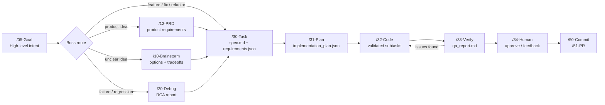

<div align="center">


# Nexus-DevFlow

### From loose intent to validated implementation, one DevFlow at a time.

**Agent-ready PRP workflow framework** for turning ideas into specs, plans, code changes, QA reports, roadmap artifacts, and reusable engineering knowledge.

[Usage](./USAGE.md) · [Quickstart](./docs/quickstart.md) · [Agents](./AGENTS.md) · [Roadmap](./ROADMAP.md) · [Workspace Artifacts](./docs/workspace-artifacts.md)


</div>

---

## What It Is

Nexus-DevFlow is a structured Context Engineering framework for AI-assisted software development. It gives agents and humans the same operating contract: create a task, write a spec, build an implementation plan, execute in small validated steps, and keep the resulting artifacts traceable.

The framework uses one active bundle, [`.agent`](./.agent), plus workspace conventions that tell AI agents how to plan, edit, validate, and report work consistently.

Its most important rule is simple:

> JSON artifacts are script-first. The AI should update task artifacts through the PRP tooling instead of rewriting full JSON files by hand.

---

## Why Teams Use It

| Capability | What You Get |
| :--- | :--- |
| **Goal-first routing** | `/05-Goal` classifies broad intent into DevFlow, PRD, Brainstorm, or Debug paths. |
| **Repeatable PRP lifecycle** | `/30-Task` → `/31-Plan` → `/32-Code` → `/33-Verify`, with artifacts at every step. |
| **Script-managed JSON** | The AI mutates task artifacts through PRP helpers instead of fragile manual edits. |
| **Specialist agents** | Planners, coders, reviewers, test engineers, security auditors, DevOps, docs, and coaches. |
| **Traceable workspaces** | Specs, PRDs, research, debug reports, QA reports, roadmap data, and lessons live under `.workspaces`. |
| **Validation gates** | Framework validation, plan validation, task validation, and dedicated runner tests. |

---

## The DevFlow



---

## How You Use It

You normally do not need to run the internal commands yourself. In an AI-enabled IDE such as Antigravity, you ask for the workflow you want, and the AI uses the framework tools behind the scenes.

Start with plain intent:

```text
/05-Goal "add password reset with email token and regression tests"
```

Or use a specific phase when you already know where the work belongs:

```text
/30-Task "Add password reset"
/31-Plan 007
/32-Code 007
/33-Verify 007
```

The AI handles the behind-the-scenes artifact updates, validation commands, status changes, and session logs. For the complete workflow catalog and examples, use [USAGE.md](./USAGE.md).

---

## Example User Flows

### Small Feature

Ask:

```text
/05-Goal "add password reset with email token and regression tests"
```

Expected route:

```text
DevFlow Task Execution
```

Recommended flow:

```text
/30-Task "Add password reset with email token and regression tests"
/31-Plan 007
/32-Code 007
/33-Verify 007
/34-Human Approve 007
```

### Debug / RCA

Ask:

```text
/05-Goal "debug login redirect loop after session expires"
```

Recommended flow:

```text
/20-Debug "debug login redirect loop after session expires"
/30-Task "Fix login redirect loop after session expires"
/31-Plan 008
/32-Code 008
/33-Verify 008
```

The AI records the routing decision, task breakdown, metrics, and latest session under `.workspaces/specs/`.

---

## PRP Lifecycle

| Phase | Workflow | Main Artifacts |
| :--- | :--- | :--- |
| Create | `/30-Task` | `spec.md`, `requirements.json`, `task_metadata.json` |
| Plan | `/31-Plan` | `implementation_plan.json`, `context.json`, `plan.md` |
| Execute | `/32-Code` | source changes, `task_logs.json`, subtask statuses |
| Verify | `/33-Verify` | `qa_report.md`, validation result, final task status |
| Approve | `/34-Human` | approval, feedback, rejection, or follow-up direction |
| Ship | `/50-Commit`, `/51-PR` | commit message, PR summary, release-ready diff |

For the full command catalog, see [USAGE.md](./USAGE.md).

---

## Agent Roles

Specialist personas live in [`.agent/agents`](./.agent/agents).

| Area | Agents |
| :--- | :--- |
| Planning | `prp-core-planner`, `discuss-spec`, `prp-core-prd-architect`, `orchestrator`, `prp-core-boss` |
| Research | `codebase-explorer`, `codebase-analyst`, `web-researcher` |
| Implementation | `prp-core-coder`, `prp-core-worker`, `backend-specialist`, `frontend-specialist`, `database-architect` |
| Quality | `test-engineer`, `code-reviewer`, `security-auditor`, `performance-optimizer`, `silent-failure-hunter` |
| Git & Docs | `prp-core-git-committer`, `prp-core-git-pr-maker`, `docs-impact-agent` |
| Support | `coach-guideline`, `prp-core-codebase-assistant`, `devops-engineer` |

Invoke a specialist manually:

```text
/90-Agent code-reviewer .workspaces/specs/007
```

Most users call these workflows in chat. The specialist agent then reads the target, applies its persona, and uses the repository tooling as needed.

---

## Workspace Map

```text
Nexus-DevFlow/
  .agent/                    # Active Antigravity agent framework bundle
  .workspaces/               # Generated artifacts and task workspaces
    debug/                   # RCA and debug reports
    issues/                  # GitHub issue triage artifacts
    prds/                    # Product requirements documents
    reports/                 # QA, specialist, design, and review reports
    research/                # Research notes and brainstorm outputs
    specs/                   # PRP task workspaces and goal sessions
    roadmap/                 # Machine-readable roadmap artifacts
  docs/                      # Human-readable guides
  scripts/                   # Root automation scripts
```

| Folder | Related Workflows |
| :--- | :--- |
| `.workspaces/specs` | `/05-Goal`, `/30-Task` through `/35-Followup`, `/39-QA-Orchestrate`, `/54-Insight` |
| `.workspaces/research` | `/10-Brainstorm`, `/11-Research`, `/15-Spec-Research`, `/16-Competitor` |
| `.workspaces/prds` | `/12-PRD`, `/18-Spec-Orchestrate` |
| `.workspaces/debug` | `/20-Debug` |
| `.workspaces/reports` | `/14-Orchestrate`, `/40-Test`, `/41-Simplify`, `/55-PR-Review`, `/56-PR-Followup`, `/90-Agent` |
| `.workspaces/roadmap` | `/17-Roadmap` |

---

## Validation Model

Validation is part of the workflow, not a separate ritual for the user to memorize. During `/32-Code` and `/33-Verify`, the AI should run the appropriate project checks, validate PRP artifacts, repair broken JSON contracts when needed, and summarize the result in the task workspace.

For maintainers who are changing the framework itself, the exact validation commands live in [USAGE.md](./USAGE.md) and the docs under [docs/](./docs).

---

## Documentation

| Guide | Covers |
| :--- | :--- |
| [Usage Guide](./USAGE.md) | Full workflow catalog, SOP paths, `/05-Goal`, and command examples. |
| [Quickstart](./docs/quickstart.md) | First setup and framework activation. |
| [Workspace Artifacts](./docs/workspace-artifacts.md) | Folder responsibilities and artifact cleanup rules. |
| [Agent Bundle](./docs/agent-bundle.md) | `.agent` bundle structure and activation model. |
| [JSON Artifact Contract](./docs/json-artifact-contract.md) | Required PRP JSON files and schema expectations. |
| [Script-First JSON Workflow](./docs/script-first-json-workflow.md) | Safe CLI commands for JSON mutation. |
| [Prompt Addons](./docs/prompt-addons.md) | Research, competitor, roadmap, QA, insight, and follow-up workflows. |
| [Roadmap](./ROADMAP.md) | Current roadmap summary. |
| [Agents](./AGENTS.md) | Persona list and specialist responsibilities. |

---

## Maintainer Notes

- `.agent` is the only active framework bundle.
- `.workspaces` is the canonical generated artifact directory.
- Root npm scripts are the internal command surface used by agents and maintainers.
- Regenerate project indexes after structural changes.
- Validate the framework before committing framework changes.

<div align="center">

**Nexus-DevFlow: make the work visible, make the steps repeatable, make the result verifiable.**

</div>
