<div align="center">


# Nexus-DevFlow (DVA: Dev Variance Authority)

### แปลงเจตจำนงกระจัดกระจาย สู่ผลลัพธ์การเขียนโค้ดที่รัดกุม ทีละสเปก ผ่านระบบจัดกระแสเวลา DVA

**เฟรมเวิร์กจัดการเวิร์กโฟลว์สำหรับ AI Agent (Agent-Ready PRP)** เพื่อแปลงเป้าหมายฟีเจอร์ระดับสูงให้กลายเป็นสเปกความต้องการทางเทคนิค แผนสถาปัตยกรรม ชุดรหัสลอจิก รายงานการทดสอบ และวิกิสะสมความรู้สำหรับทีมพัฒนา

[Setup](./SETUP.md) · [AI Setup](./SETUP-BY-AI.md) · [Usage](./USAGE.md) · [Quickstart](./docs/quickstart.md) · [Agents](./AGENTS.md) · [Roadmap](./ROADMAP.md) · [Workspace Artifacts](./docs/workspace-artifacts.md)


</div>

---

## 🌀 DVA: Dev Variance Authority (ระบบควบคุมเวิร์กโฟลว์และกิ่งพัฒนาซอฟต์แวร์)

<div align="center">

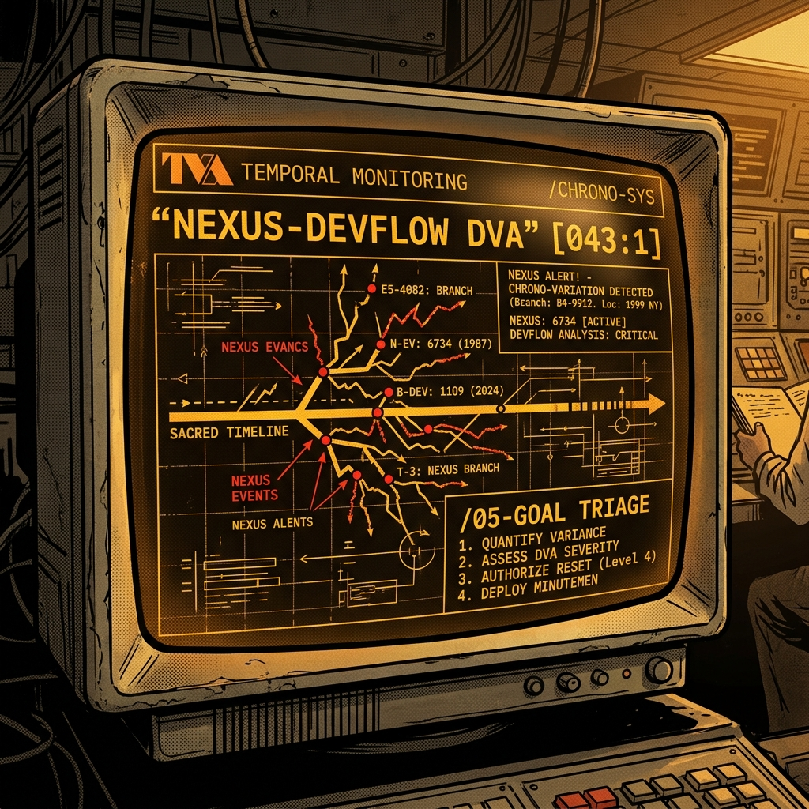

</div>

**Nexus-DevFlow** ได้รับการออกแบบโครงสร้างภายใต้แนวคิด **DVA: Dev Variance Authority** (หยิบยืมธีมภาพยนตร์ Loki มาเป็นเมทาฟอร์ในการอธิบายสถาปัตยกรรม) ซึ่งทำหน้าที่เป็นระบบควบคุมเวิร์กโฟลว์และวงจรกระบวนการพัฒนาซอฟต์แวร์ (Software Development Lifecycle / SDLC) เพื่อป้องกันไม่ให้นักพัฒนา (Human Dev) และ AI Agent ทำงานอย่างไร้ทิศทาง หรือสร้างโค้ดที่ก่อให้เกิดผลข้างเคียงและข้อบกพร่อง (Bugs & Regressions) แก่ระบบหลัก

เมื่อมีฟีเจอร์ใหม่ การเปลี่ยนแปลงความต้องการ (Requirement Changes) หรือตรวจพบบั๊กที่ต้องแก้ไข (เปรียบเสมือน **Dev Variance Event**) DVA จะคัดแยกประเภทงานและส่งประเมินความเสี่ยง (State-Driven Lifecycle Routing) จากนั้นจะนำทางเวิร์กโฟลว์เข้าสู่พื้นที่ทำงานจำลองแยกส่วนเป็นเอกเทศ (Isolated Branching Workspaces / Sandbox Pipelines) เพื่อพัฒนาและทดสอบคุณภาพโค้ดอย่างเข้มงวด ก่อนจะส่งกลับเข้าไปผสานรวมกับกิ่งโค้ดหลัก (Main Branch / Production Line) อย่างปลอดภัย

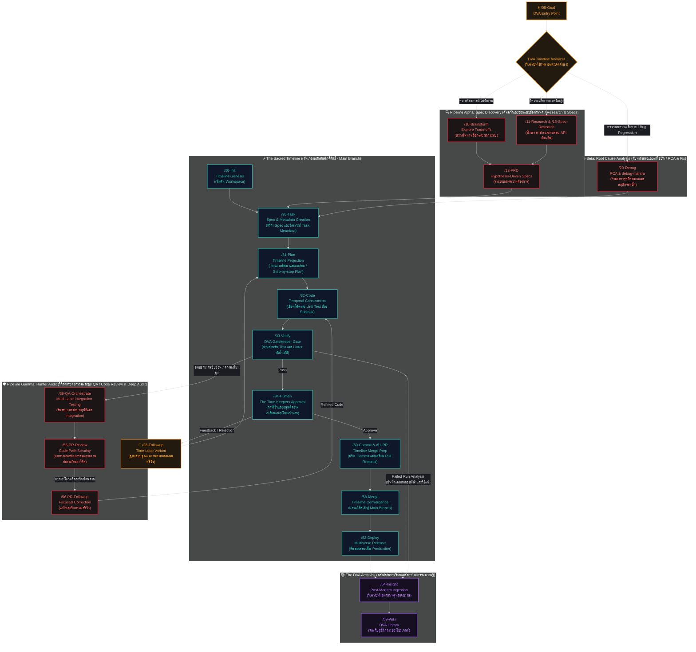
```mermaid
%%{init: {'theme': 'dark', 'themeVariables': { 'primaryColor': '#ff9f1c', 'edgeLabelBackground': '#1b1b22', 'tertiaryColor': '#2ec4b6'}}}%%
flowchart TD
    classDef cdL stroke:#2ec4b6,stroke-width:2px,fill:#0f172a,color:#2ec4b6;
    classDef branch stroke:#e71d36,stroke-width:2px,fill:#1b1515,color:#ff6b6b;
    classDef triage stroke:#ff9f1c,stroke-width:2px,fill:#221a0f,color:#ff9f1c;
    classDef archive stroke:#9b5de5,stroke-width:2px,fill:#160f22,color:#c084fc;

    Goal["🌀 /05-Goal<br/>DVA Entry Point"]:::triage
    Triage{"DVA Timeline Analyzer<br/>(วิเคราะห์เป้าหมายและเจตจำนง)"}:::triage
    Goal --> Triage

    %% Canonical Development Lifecycle (CDL)
    subgraph CDL ["⚡ The Sacred Timeline (เส้นเวลาหลักอันศักดิ์สิทธิ์ - Main Branch)"]
        Init["/00-Init<br/>Timeline Genesis<br/>(เริ่มต้น Workspace)"]
        Task["/30-Task<br/>Spec & Metadata Creation<br/>(สร้าง Spec และวิเคราะห์ Task Metadata)"]
        Plan["/31-Plan<br/>Timeline Projection<br/>(วางแผนพัฒนาและทดสอบ / Step-by-step Plan)"]
        Code["/32-Code<br/>Temporal Construction<br/>(เขียนโค้ดและ Unit Test ทีละ Subtask)"]
        Verify["/33-Verify<br/>DVA Gatekeeper Gate<br/>(ผ่านด่านรัน Test และ Linter อัตโนมัติ)"]
        Human["/34-Human<br/>The Time-Keepers Approval<br/>(การรีวิวและอนุมัติความเปลี่ยนแปลงโดยเจ้านาย)"]
        Commit["/50-Commit & /51-PR<br/>Timeline Merge Prep<br/>(สร้าง Commit และเตรียม Pull Request)"]
        Merge["/58-Merge<br/>Timeline Convergence<br/>(ผสานโค้ดเข้าสู่ Main Branch)"]
        Deploy["/52-Deploy<br/>Multiverse Release<br/>(ดีพลอยระบบขึ้น Production)"]

        Init --> Task
        Task --> Plan
        Plan --> Code
        Code --> Verify
        Verify -->|Pass| Human
        Human -->|Approve| Commit
        Commit --> Merge
        Merge --> Deploy
    end
    class Init,Task,Plan,Code,Verify,Human,Commit,Merge,Deploy cdL;

    %% Branch Alpha
    subgraph Alpha ["🔍 Pipeline Alpha: Spec Discovery (ค้นคว้าและออกแบบข้อกำหนด / Research & Specs)"]
        Brain["/10-Brainstorm<br/>Explore Trade-offs<br/>(ประเมินทางเลือกและผลกระทบ)"]
        Res["/11-Research & /15-Spec-Research<br/>(ศึกษาเอกสารและทดสอบ API เพิ่มเติม)"]
        PRD["/12-PRD<br/>Hypothesis-Driven Specs<br/>(ร่างขอบเขตความต้องการ)"]
    end
    class Brain,Res,PRD branch;

    Triage -->|ความต้องการยังไม่ชัดเจน| Brain
    Triage -->|มีความเสี่ยงทางเทคนิคสูง| Res
    Brain --> PRD
    Res --> PRD
    PRD --> Task

    %% Branch Beta
    subgraph Beta ["🐞 Pipeline Beta: Root Cause Analysis (สืบหาต้นตอและแก้ไขบั๊ก / RCA & Fix)"]
        Debug["/20-Debug<br/>RCA & debug-mantra<br/>(จำลองหาจุดผิดพลาดและพฤติกรรมบั๊ก)"]
    end
    class Debug branch;

    Triage -->|ตรวจพบความเสียหาย / Bug Regression| Debug
    Debug --> Task

    %% Branch Gamma
    subgraph Gamma ["🛡️ Pipeline Gamma: Hunter Audit (รีวิวสถาปัตยกรรมและลูป QA / Code Review & Deep Audit)"]
        QA["/39-QA-Orchestrate<br/>Multi-Lane Integration Testing<br/>(รันระบบทดสอบพหุมิติและ Integration)"]
        PR_Rev["/55-PR-Review<br/>Code Path Scrutiny<br/>(ทบทวนสถาปัตยกรรมและความปลอดภัยของโค้ด)"]
        PR_Follow["/56-PR-Followup<br/>Focused Correction<br/>(แก้ไขลอจิกตามผลรีวิว)"]
    end
    class QA,PR_Rev,PR_Follow branch;

    Verify -->|ขอบข่ายงานซับซ้อน / ความเสี่ยงสูง| QA
    QA --> PR_Rev
    PR_Rev -->|พบช่องโหว่หรือลอจิกผิดพลาด| PR_Follow
    PR_Follow -->|Refined Code| Code

    %% Loopback (Delta)
    Loopback["🔄 /35-Followup<br/>Time-Loop Variant<br/>(ลูปปรับปรุงแผนงานตามคอมเมนต์รีวิว)"]:::triage
    Human -->|Feedback / Rejection| Loopback
    Loopback --> Plan

    %% Knowledge Archive
    subgraph Archives ["📚 The DVA Archives (คลังสะสมบทเรียนและสถาปัตยกรรมความรู้)"]
        Insight["/54-Insight<br/>Post-Mortem Ingestion<br/>(วิเคราะห์ผลหาสาเหตุหลังจบงาน)"]
        Wiki["/59-Wiki<br/>DVA Library<br/>(จัดเก็บสู่วิกิกลางของโปรเจกต์)"]
    end
    class Insight,Wiki archive;

    Deploy --> Insight
    Insight --> Wiki
    Verify -->|"Failed Run Analysis<br/>(บันทึกเคสทดสอบที่พังและวิธีแก้)"| Insight
```

### 🏛️ เสาหลักในการควบคุมกิ่งโค้ดและคุณภาพของ DVA (Core Pillars)

#### 1. The Sacred Timeline: Canonical Development Lifecycle (CDL)
กิ่งพัฒนาหลัก (Main Branch) ที่ถูกขับเคลื่อนด้วยขั้นตอนอย่างเป็นระบบและสืบค้นย้อนกลับได้แบบ 100% เริ่มต้นตั้งแต่การตั้งค่า Workspace ให้สะอาด (`/00-Init`), สร้างข้อกำหนดความต้องการที่วัดผลได้จริงลงในสเปก (`/30-Task`), ออกแบบลำดับขั้นตอนการเขียนโค้ดและแผนการตรวจสอบอย่างประณีต (`/31-Plan`), ลงมือส่งให้เอเจนต์เขียนโค้ดทีละ subtask อย่างระมัดระวัง (`/32-Code`), รันระบบทดสอบอัตโนมัติ (Linter & Unit Tests) ที่ด่านตรวจสิทธิ์ (`/33-Verify`), และส่งให้มนุษย์รีวิวความสอดคล้องอย่างสมบูรณ์แบบ (`/34-Human`)

#### 2. DVA Intent Triage Engine (`/05-Goal`)
จุดคัดกรองเจตจำนงแรกรับที่จะคอยวิเคราะห์สเปก ความเสถียร และความซับซ้อนของคำสั่งที่เจ้านายมอบหมาย หากตรวจพบว่าความต้องการยังคลุมเครือหรือมีความเสี่ยงที่จะเกิด Side-effects สูง DVA จะสับสวิตช์นำทางความต้องการนั้นแยกออกไปประเมินในท่อส่งข้อมูลสาขา (Branching Workspaces) เพื่อปกป้องโค้ดเบสหลักไม่ให้ปนเปื้อน

#### 3. Context-Driven Branching & Loopbacks (ระบบแตกสาขาและควบคุมความเสถียร)
เมื่อระบบเจอความไม่แน่นอน DVA จะแบ่งกระบวนการทำงานออกเป็นเอกเทศ เพื่อความคล่องตัวและเสถียรภาพสูงสุด:
*   **Pipeline Alpha (Spec Discovery - ออกแบบขอบเขตความต้องการ)**: เมื่อสเปกยังไม่นิ่ง ระบบจะแยกกิ่งไปทำงานผ่าน `/10-Brainstorm` และ `/11-Research` (ทดสอบ API หรือวิจัยโครงสร้าง) เพื่อเขียนไฟล์ `/12-PRD` ที่สมบูรณ์และลดข้อผิดพลาดตั้งแต่ต้นทาง
*   **Pipeline Beta (Root Cause Analysis - สืบหาต้นตอและแก้ไขบั๊ก)**: หากตรวจพบบั๊กหรือความเสียหาย DVA จะทำการตัดกิ่งเพื่อส่งเอเจนต์เข้าไปแก้ไขผ่าน `/20-Debug` โดยปฏิบัติตามระเบียบ `debug-mantra` (หาจุดผิดพลาด -> บันทึกเบาะแส -> วางสมมติฐานเพื่อพิสูจน์) ทำให้ได้แผนซ่อมแซมบั๊กที่ตรงจุด
*   **Pipeline Gamma (Hunter Audit - รีวิวสถาปัตยกรรมและระบบ QA)**: หากขอบเขตงานมีความเสถียรต่ำหรือมีความสำคัญสูง เส้นเวลาจะถูกดึงเข้ารันในระบบจำลองการทำงานพหุมิติผ่าน `/39-QA-Orchestrate` และระดมผู้เชี่ยวชาญร่วมตรวจสอบโค้ดเชิงลึก (`/55-PR-Review`) หากพบช่องโหว่จะถูกซ่อมแซมทันทีผ่าน `/56-PR-Followup`
*   **Pipeline Delta (Time-Loop Variant - ลูปปรับปรุงข้อกำหนดตามผลรีวิว)**: หากเจ้านายเห็นว่าโค้ดยังไม่สมบูรณ์และต้องการปรับปรุงในด่าน `/34-Human` ระบบจะดึงแผนงานกลับเข้ารีสเปกผ่าน `/35-Followup` เพื่อแก้ไขแผนงานที่ `/31-Plan` ป้องกันปัญหาเอเจนต์เขียนโค้ดหลุดสเปก

#### 4. The DVA Archives (คลังสะสมบทเรียนและสถาปัตยกรรมความรู้)
เมื่อโค้ดได้รับการผสานคืนกิ่งหลักและใช้งานจริง ความรู้ทางวิศวกรรม บทเรียนจากบั๊กที่พัง และโครงสร้างคอนฟิกใหม่ทั้งหมดจะถูกสกัดแยกออกมาโดยเอเจนต์ผ่าน `/54-Insight` (ด้วยกฎ `post-mortem`) เพื่อจดจำความคุ้มค่าและนำไปอัปเดตใส่คลังความรู้กลางที่ `/59-Wiki` ช่วยอัปเกรดขีดความสามารถของ AI ในครั้งต่อๆ ไปไม่ให้ล้มเหลวในจุดเดิมอีก

---

## 🏛️ DVA คืออะไร (What It Is)

<div align="center">


</div>

Nexus-DevFlow คือเฟรมเวิร์กจัดการบริบท (Context Engineering) แบบมีโครงสร้างสำหรับการพัฒนาซอฟต์แวร์ร่วมกับ AI มันมอบข้อตกลงการทำงาน (Operating Contract) ในระดับเดียวกันแก่นักพัฒนา (Human Dev) และ AI Agent: เริ่มจากการสร้างหน้างานย่อย บันทึกขอบเขตลอจิกในข้อกำหนด สร้างแผนพัฒนาและแนวทางการทดสอบอย่างละเอียด เขียนโค้ดทีละ Subtask พร้อมผ่านด่านรัน Test และ Linter และจัดเก็บประวัติผลงานทั้งหมดให้สอบกลับได้ 100%

เฟรมเวิร์กรันผ่านกิ่งขยายความสามารถกลาง [`.agent`](./.agent) ร่วมกับโครงสร้างโฟลเดอร์เวิร์กสเปซที่คอยควบคุมเอเจนต์ให้รันการวิเคราะห์ ออกแบบแผน เขียนโค้ด และสรุปรายงานความคืบหน้าอย่างคงเส้นคงวาและเป็นระบบ

กฎเหล็กสำคัญที่สุดของสถาปัตยกรรม DVA คือ:

> ไฟล์ประเมินความคืบหน้าแบบ JSON ทั้งหมดต้องจัดการด้วยสคริปต์อัตโนมัติ (Script-First) โดย AI จะต้องรันเครื่องมือ PRP ของระบบแทนการเปิดแก้ไขโครงสร้างไฟล์ JSON เองด้วยมือเพื่อหลีกเลี่ยงความเสถียรที่บิดเบี้ยว

---

## 🚀 ทำเนียบจุดเด่น DVA (Why Teams Use It)

<div align="center">

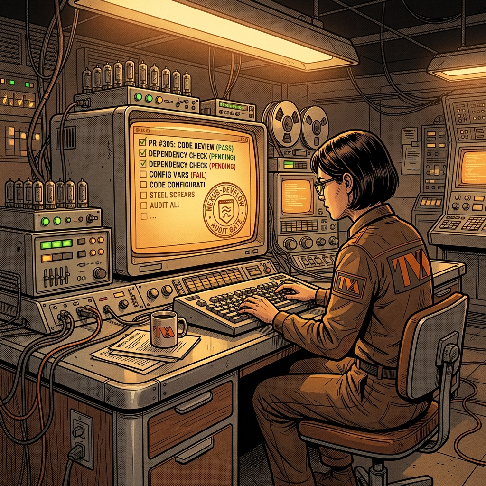

</div>

| ขีดความสามารถ | สิ่งที่เจ้านายจะได้รับ |
| :--- | :--- |
| **ระบบคัดกรองมิติแรกรับ** | คำสั่ง `/05-Goal` จะคอยวิเคราะห์ความต้องการระดับสูง และสับเปลี่ยนเวิร์กโฟลว์ไปยังกิ่งแยกที่เหมาะสมโดยอัตโนมัติ |
| **กระแสเวลาพัฒนาศักดิ์สิทธิ์ (CDL)** | ลูปความเสถียรที่สืบย้อนได้: `/30-Task` → `/31-Plan` → `/32-Code` → `/33-Verify` พร้อมประวัติที่บันทึกละเอียดยิบ |
| **ความมั่นคงของสัญญางาน JSON** | เอเจนต์จะแก้ไขไฟล์ JSON ผ่านเครื่องมือระบบแบบอัตโนมัติ เพื่อป้องกันลอจิกพังเสียหายจากการเขียนมือ |
| **ทำเนียบกองกำลังเอเจนต์ DVA** | การแบ่งแยกบทบาทหน้าที่อย่างชัดเจน เช่น Planners, Coders, Reviewers, Test Engineers, และ Security Auditors |
| **แผนที่เวิร์กสเปซสืบค้นย้อนกลับ** | แยกประเภทของ Specs, PRDs, โน้ตวิจัย, รายงานแก้บั๊ก และบันทึกบทเรียนไว้อย่างสะอาดและเป็นระบบใต้ `.workspaces` |
| **ด่านประเมินคุณภาพที่เข้มงวด** | การตรวจสอบแบบปิดลูปทั้งความเสถียรของเฟรมเวิร์ก ความถูกต้องของแผน และความสมบูรณ์ของโค้ด |
| **นามแฝงคำสั่งแบบเบาบาง** | คำสั่งหรือพฤติกรรมเสริมแบบคาบเกี่ยวจะถูกผูกเข้ากับสกิลดั้งเดิมของเอเจนต์ ไม่นำมารวมสร้างเป็น Slash workflow ภายนอก |
| **9arm-Skills วินัยวิศวกรรมสกัดบทเรียน** | การดัดแปลงหลักการคิดระดับพรีเมียมจาก `thananon/9arm-skills` เพื่อเพิ่มความเสถียรให้กระบวนการดีบั๊ก การรีวิว และ Post-mortem |

---

## 🌀 ระบบคัดกรองมิติเวลาขั้นสูง (Advanced Goal Flow)

<div align="center">


</div>

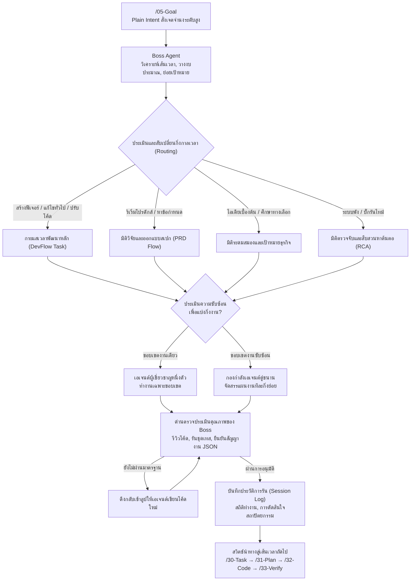
```mermaid
flowchart TD
    Goal["/05-Goal<br/> Plain Intent สั่งเจตจำนงระดับสูง"] --> Boss["Boss Agent<br/>วิเคราะห์เส้นเวลา, วางงบประมาณ, ย่อยเป้าหมาย"]
    Boss --> Route{"ประเมินและสับเปลี่ยนกิ่งกาลเวลา (Routing)"}
 
    Route -->|สร้างฟีเจอร์ / แก้ไขทั่วไป / ปรับโค้ด| DevFlow["กระแสเวลาพัฒนาหลัก (DevFlow Task)"]
    Route -->|ริเริ่มโปรดักส์ / หาข้อกำหนด| SpecFlow["มิติวิจัยและออกแบบสเปก (PRD Flow)"]
    Route -->|ไอเดียเบื้องต้น / ศึกษาทางเลือก| IdeaFlow["มิติระดมสมองและเป้าหมายธุรกิจ"]
    Route -->|ระบบพัง / บั๊กรันไทม์| DebugFlow["มิติตรวจจับและสืบสวนหาต้นตอ (RCA)"]
 
    DevFlow --> Split{"ประเมินความซับซ้อน<br/>เพื่อแบ่งกิ่งงาน?"}
    SpecFlow --> Split
    IdeaFlow --> Split
    DebugFlow --> Split
 
    Split -->|ขอบเขตงานเดียว| WorkerOne["เอเจนต์ผู้เชี่ยวชาญหนึ่งตัว<br/>ทำงานเฉพาะขอบเขต"]
    Split -->|ขอบเขตงานซับซ้อน| WorkerGroup["กองกำลังเอเจนต์คู่ขนาน<br/>จัดสรรแผนงานทีละกิ่งย่อย"]
 
    WorkerOne --> Gate["ด่านตรวจประเมินคุณภาพของ Boss<br/>รีวิวโค้ด, รันชุดเทส, ยืนยันสัญญางาน JSON"]
    WorkerGroup --> Gate
 
    Gate -->|ยังไม่ผ่านมาตรฐาน| Revise["ดึงกลับเข้าลูปให้เอเจนต์เขียนโค้ดใหม่"]
    Revise --> Gate
    Gate -->|ผ่านการอนุมัติ| Session["บันทึกประวัติการรัน (Session Log)<br/>สถิติทำงาน, การตัดสินใจสถาปัตยกรรม"]
    Session --> Next["สวิตช์นำทางสู่เส้นเวลาถัดไป<br/>/30-Task → /31-Plan → /32-Code → /33-Verify"]
```

เจ้านายสามารถใช้คำสั่ง `/05-Goal` เมื่อต้องการให้เอเจนต์ระดับสูงเป็นผู้เลือกเวิร์กโฟลว์ที่เหมาะสม จัดสรรแบ่งกิ่งงานให้เอเจนต์ผู้เชี่ยวชาญ คุมงบประมาณ Tokens และเขียนสรุปรายงานบันทึกประวัติลอจิกทั้งหมดก่อนเข้าสู่เวิร์กโฟลว์พัฒนาหลัก

---

## 🏛️ กระบวนการพัฒนาหลัก (Basic DevFlow - CDL)

<div align="center">

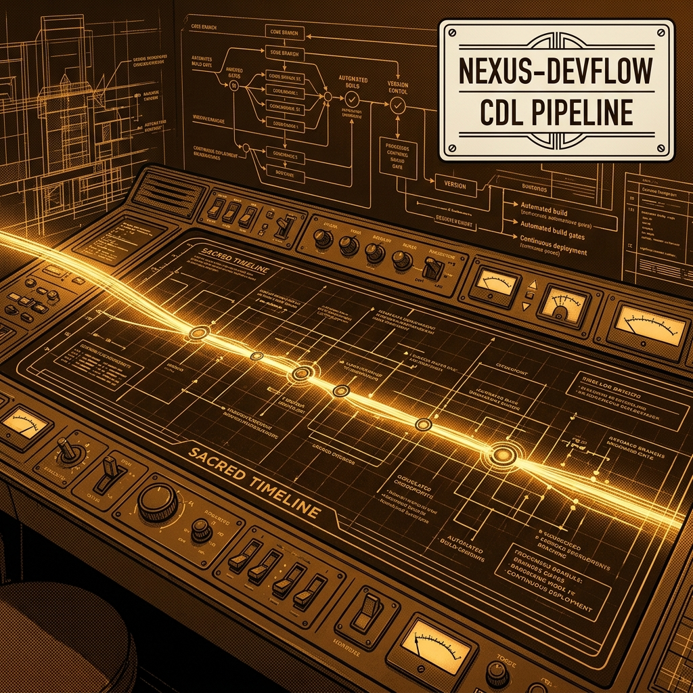

</div>

กิ่งพัฒนาหลัก (Main Branch) ที่ถูกขับเคลื่อนด้วยขั้นตอนอย่างเป็นระบบและสืบค้นย้อนกลับได้แบบ 100% เริ่มต้นตั้งแต่การตั้งค่า Workspace ให้สะอาด (`/00-Init`), สร้างข้อกำหนดความต้องการที่วัดผลได้จริงลงในสเปก (`/30-Task`), ออกแบบลำดับขั้นตอนการเขียนโค้ดและแผนการตรวจสอบอย่างประณีต (`/31-Plan`), ลงมือส่งให้เอเจนต์เขียนโค้ดทีละ subtask อย่างระมัดระวัง (`/32-Code`), รันระบบทดสอบอัตโนมัติ (Linter & Unit Tests) ที่ด่านตรวจสิทธิ์ (`/33-Verify`), และส่งให้มนุษย์รีวิวความสอดคล้องอย่างสมบูรณ์แบบ (`/34-Human`)

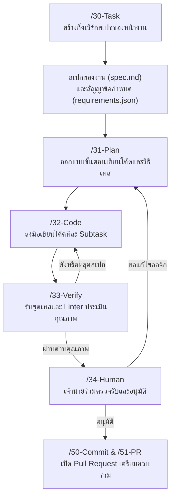
```mermaid
flowchart TD
    Task["/30-Task<br/>สร้างกิ่งเวิร์กสเปซของหน้างาน"]
    Spec["สเปกของงาน (spec.md)<br/>และสัญญาข้อกำหนด (requirements.json)"]
    Plan["/31-Plan<br/>ออกแบบขั้นตอนเขียนโค้ดและวิธีเทส"]
    Code["/32-Code<br/>ลงมือเขียนโค้ดทีละ Subtask"]
    Verify["/33-Verify<br/>รันชุดเทสและ Linter ประเมินคุณภาพ"]
    Human["/34-Human<br/>เจ้านายร่วมตรวจรับและอนุมัติ"]
    Ship["/50-Commit & /51-PR<br/>เปิด Pull Request เตรียมควบรวม"]
 
    Task --> Spec
    Spec --> Plan
    Plan --> Code
    Code --> Verify
    Verify -->|ผ่านด่านคุณภาพ| Human
    Verify -->|พังหรือหลุดสเปก| Code
    Human -->|อนุมัติ| Ship
    Human -->|ขอแก้ไขลอจิก| Plan
```

เจ้านายสามารถเลือกใช้เวิร์กโฟลว์นี้ได้โดยตรงหากมีขอบเขตและเป้าหมายที่ชัดเจนอยู่แล้ว เช่น การสร้างฟีเจอร์เฉพาะเจาะจง การแก้ไขบั๊กธรรมดา หรือการอัปเดตชุดการทดสอบ

---

## 🗺️ รูปแบบเวิร์กโฟลว์แนะนำประจำกิ่งกาลเวลา (Recommended Flow Patterns)

### 🔍 มิติการวิจัยและออกแบบความต้องการ (Product / Spec Flow)

<div align="center">

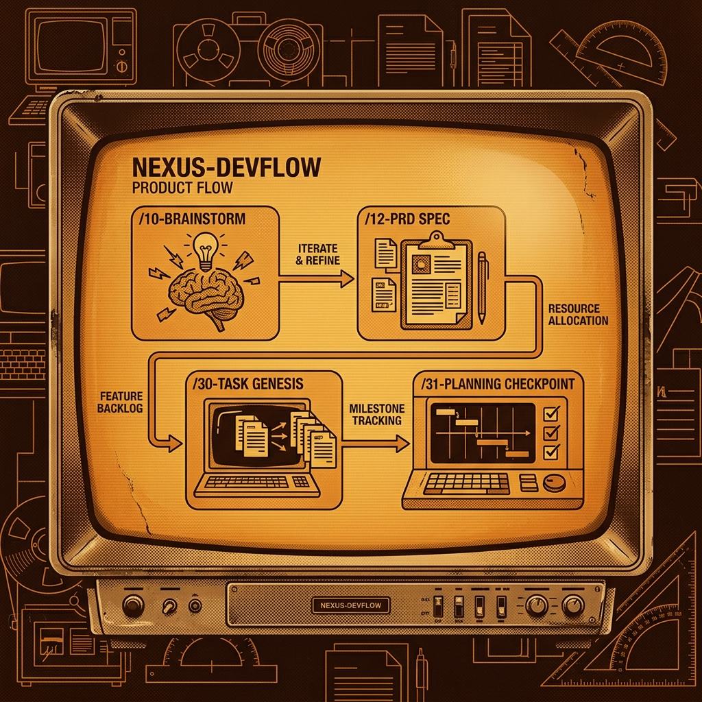

</div>

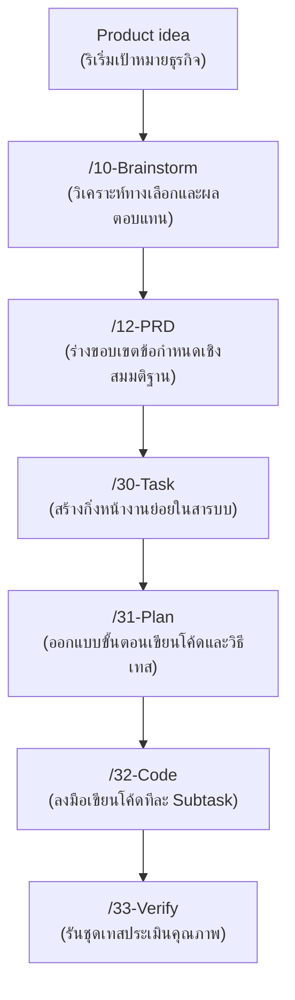
```mermaid
flowchart TD
    Idea["Product idea<br/>(ริเริ่มเป้าหมายธุรกิจ)"]
    Brainstorm["/10-Brainstorm<br/>(วิเคราะห์ทางเลือกและผลตอบแทน)"]
    PRD["/12-PRD<br/>(ร่างขอบเขตข้อกำหนดเชิงสมมติฐาน)"]
    Task["/30-Task<br/>(สร้างกิ่งหน้างานย่อยในสารบบ)"]
    Plan["/31-Plan<br/>(ออกแบบขั้นตอนเขียนโค้ดและวิธีเทส)"]
    Code["/32-Code<br/>(ลงมือเขียนโค้ดทีละ Subtask)"]
    Verify["/33-Verify<br/>(รันชุดเทสประเมินคุณภาพ)"]
 
    Idea --> Brainstorm
    Brainstorm --> PRD
    PRD --> Task
    Task --> Plan
    Plan --> Code
    Code --> Verify
```

---

### 🐞 มิติตรวจจับและซ่อมแซมบั๊ก (Debug / RCA Flow)

<div align="center">

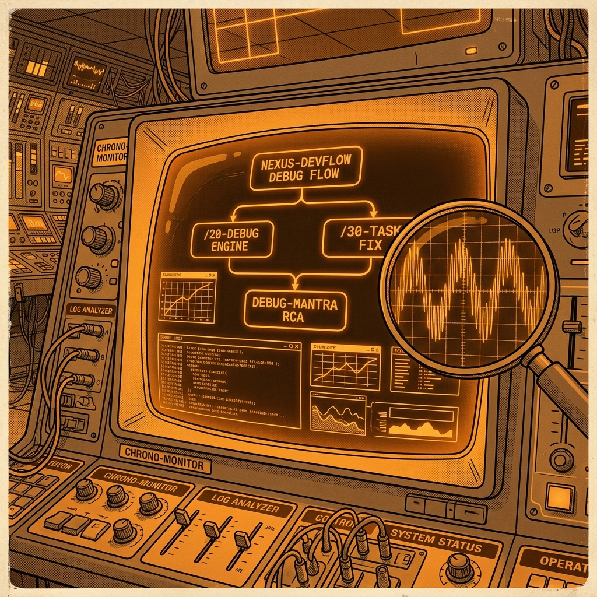

</div>

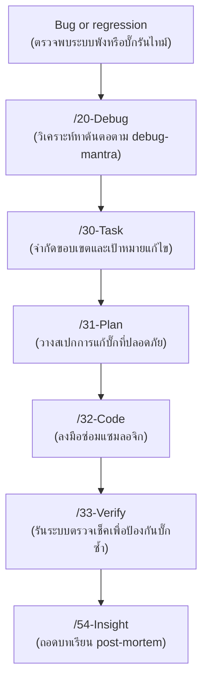
```mermaid
flowchart TD
    Symptom["Bug or regression<br/>(ตรวจพบระบบพังหรือบั๊กรันไทม์)"]
    Debug["/20-Debug<br/>(วิเคราะห์หาต้นตอตาม debug-mantra)"]
    Task["/30-Task<br/>(จำกัดขอบเขตและเป้าหมายแก้ไข)"]
    Plan["/31-Plan<br/>(วางสเปกการแก้บั๊กที่ปลอดภัย)"]
    Code["/32-Code<br/>(ลงมือซ่อมแซมลอจิก)"]
    Verify["/33-Verify<br/>(รันระบบตรวจเช็คเพื่อป้องกันบั๊กซ้ำ)"]
    Insight["/54-Insight<br/>(ถอดบทเรียน post-mortem)"]
 
    Symptom --> Debug
    Debug --> Task
    Task --> Plan
    Plan --> Code
    Code --> Verify
    Verify --> Insight
```

---

### 🛡️ มิติการรีวิวและระบบ QA (QA / Review Flow)

<div align="center">

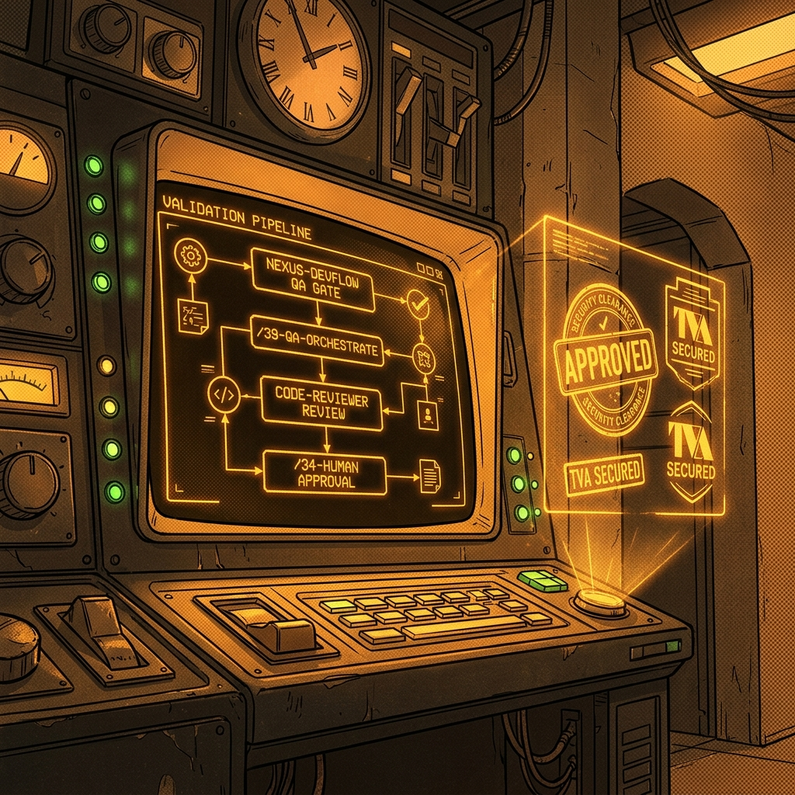

</div>

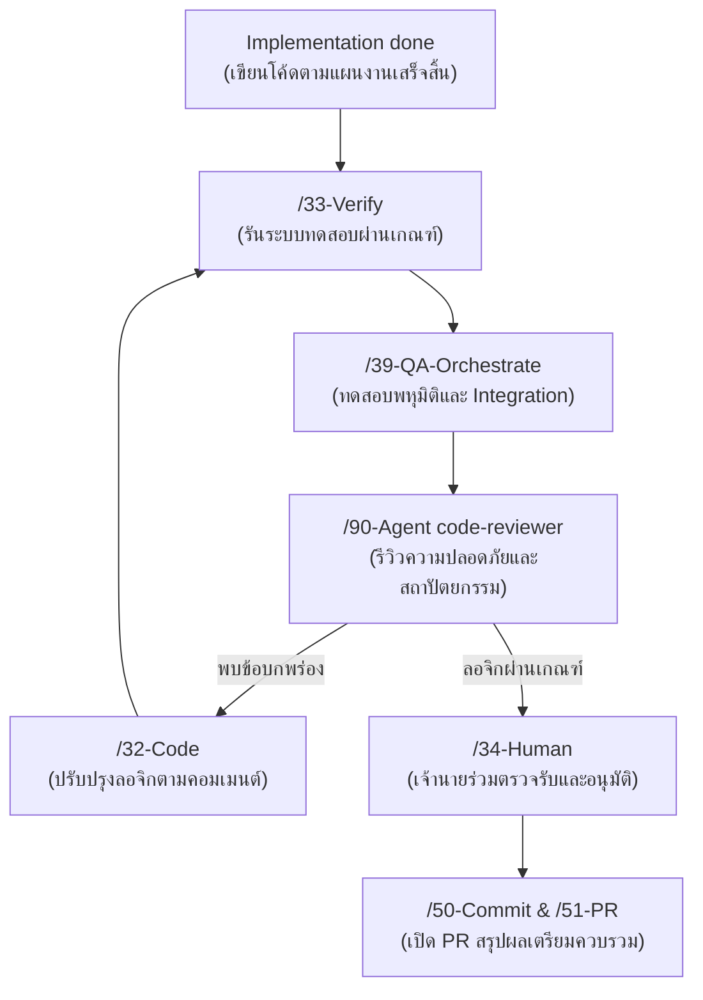
```mermaid
flowchart TD
    Done["Implementation done<br/>(เขียนโค้ดตามแผนงานเสร็จสิ้น)"]
    Verify["/33-Verify<br/>(รันระบบทดสอบผ่านเกณฑ์)"]
    QA["/39-QA-Orchestrate<br/>(ทดสอบพหุมิติและ Integration)"]
    Review["/90-Agent code-reviewer<br/>(รีวิวความปลอดภัยและสถาปัตยกรรม)"]
    Fix["/32-Code<br/>(ปรับปรุงลอจิกตามคอมเมนต์)"]
    Human["/34-Human<br/>(เจ้านายร่วมตรวจรับและอนุมัติ)"]
    Commit["/50-Commit & /51-PR<br/>(เปิด PR สรุปผลเตรียมควบรวม)"]
 
    Done --> Verify
    Verify --> QA
    QA --> Review
    Review -->|พบข้อบกพร่อง| Fix
    Fix --> Verify
    Review -->|ลอจิกผ่านเกณฑ์| Human
    Human --> Commit
```

DVA มอบระบบประกันคุณภาพเพิ่มเติมเพื่อช่วยป้องกันปัญหาความมั่นคงของโค้ดเบสหลัก ด้วยเอเจนต์วิเคราะห์สถาปัตยกรรม และด่านพิทักษ์ความปลอดภัยสูงสุด:

<div align="center">


</div>

เมื่อใดก็ตามที่โค้ดเบสหลักผสานเสร็จสิ้น ข้อมูลบทเรียนจากการแก้ไขหรือบั๊กที่พบจะถูกนำไปอัปเดตลงในคลังหอสมุดความรู้กลางทันที เพื่ออัปเกรดความฉลาดของเอเจนต์ในลูปถัดไป:

<div align="center">

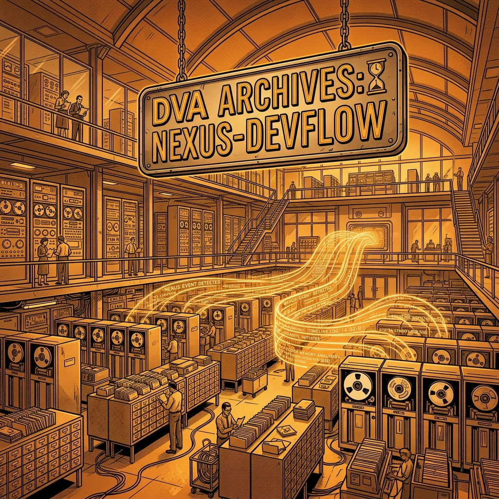

</div>

---

## ⚡ วิธีสั่งงาน DVA (How You Use It)

<div align="center">

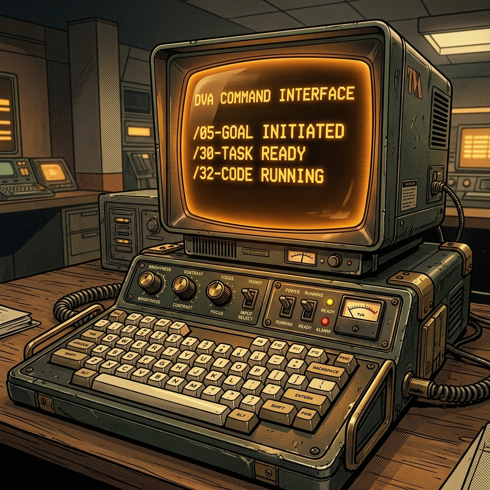

</div>

ปกติแล้วเจ้านายไม่จำเป็นต้องเปิดรันคำสั่งเบื้องหลังเหล่านี้ด้วยตนเองครับ ในระบบ AI-enabled IDE อย่าง Antigravity เจ้านายเพียงสั่งงานเป้าหมายระดับสูงที่ต้องการในช่องแชทได้โดยตรง แล้วกองกำลังเอเจนต์ DVA จะรันเรียกใช้เวิร์กโฟลว์และจัดการกิ่งงานให้โดยอัตโนมัติ

เริ่มต้นพิมพ์สั่งงานด้วยเจตจำนงระดับทั่วไป (Plain Intent):

```text
/05-Goal "add password reset with email token and regression tests"
```

หรือเจ้านายจะระบุเฟสงานที่ต้องการโดยตรงเมื่อประเมินประเภทและขอบเขตงานได้แล้ว:

```text
/30-Task "Add password reset"
/31-Plan 007
/32-Code 007
/33-Verify 007
```

ระบบจะดูแลงานเบื้องหลังให้เจ้านายทั้งหมด ทั้งการอัปเดตไฟล์ Artifacts, รันคำสั่งตรวจสอบความปลอดภัย, สลับสถานะ Task และบันทึกประวัติการรันใน Session Log ครับ เจ้านายสามารถอ่านรายละเอียดสารบัญคำสั่งและตัวอย่างเพิ่มเติมได้ใน [USAGE.md](./USAGE.md)

---

## 💡 ตัวอย่างเวิร์กโฟลว์การใช้งาน (Example User Flows)

<div align="center">


</div>

### 1. ฟีเจอร์ย่อย (Small Feature)
สั่งการ:
```text
/05-Goal "add password reset with email token and regression tests"
```
เส้นทางที่ DVA คัดเลือกโดยอัตโนมัติ:
```text
DevFlow Task Execution (สวิตช์รันกระแสเวลาพัฒนาหลัก)
```
ลำดับเวิร์กโฟลว์เบื้องหลังที่ระบบจัดสรร:
```text
/30-Task "Add password reset with email token and regression tests"
/31-Plan 007
/32-Code 007
/33-Verify 007
/34-Human Approve 007
```

### 2. สืบหาต้นตอและซ่อมแซมลอจิก (Debug / RCA)
สั่งการ:
```text
/05-Goal "debug login redirect loop after session expires"
```
ลำดับเวิร์กโฟลว์เบื้องหลังที่ระบบจัดสรร:
```text
/20-Debug "debug login redirect loop after session expires"
/30-Task "Fix login redirect loop after session expires"
/31-Plan 008
/32-Code 008
/33-Verify 008
```
ระบบ DVA จะทำการบันทึกเหตุผลการสับเปลี่ยนกิ่งงาน ข้อมูลความซับซ้อน และผลลัพธ์ลอจิกเชิงสถิติทั้งหมดแยกไว้ใต้สารบบ `.workspaces/specs/` โดยอัตโนมัติ

---

## 🔄 มิติสถานะของหน้างาน (PRP Lifecycle)

<div align="center">


</div>

| เฟสของงาน | Slash Workflow | ไฟล์หลักในเวิร์กสเปซ (Main Artifacts) |
| :--- | :--- | :--- |
| **Create (สร้างหน้างาน)** | `/30-Task` | `spec.md`, `requirements.json`, `task_metadata.json` |
| **Plan (ออกแบบแผน)** | `/31-Plan` | `implementation_plan.json`, `context.json`, `plan.md` |
| **Execute (ลงมือแก้ไข)** | `/32-Code` | กิ่งโค้ดที่แก้ไข, `task_logs.json`, ประวัติสถานะย่อย |
| **Verify (ตรวจสอบคุณภาพ)** | `/33-Verify` | `qa_report.md`, สัญญายืนยันผลลัพธ์ลอจิก, สถานะปิดงาน |
| **Approve (ตรวจรับมอบ)** | `/34-Human` | บันทึกความพึงพอใจ, ข้อคิดเห็นแก้ไขงานใหม่, หรือการปิดกิ่ง |
| **Ship (ผสานรวมคลังหลัก)** | `/50-Commit`, `/51-PR` | คำอธิบายสัญญางาน Git Commit, รายงาน PR, โค้ดพร้อมขึ้นโปรดักส์ |

เจ้านายสามารถเข้าศึกษาตัวอย่างและรายการคำสั่งทั้งหมดแบบละเอียดได้ที่ [USAGE.md](./USAGE.md) ครับ

---

## 🤖 ทำเนียบกองกำลังเอเจนต์ DVA (Agent Roles)

<div align="center">


</div>

โครงสร้างบุคลากรเอเจนต์ถูกจัดประเภทอย่างมีระเบียบและจัดเก็บอยู่ใต้สารบบ [`.agent/agents`](./.agent/agents) โดยแบ่งแยกหน้าที่และความรับผิดชอบอย่างเคร่งครัด:

| หน้าที่และความรับผิดชอบ | เอเจนต์ประจำมิติ (DVA Agents) |
| :--- | :--- |
| **ฝ่ายวางแผน (Planning)** | `prp-core-planner`, `requirements-engineer`, `prp-core-prd-architect`, `orchestrator`, `prp-core-boss` |
| **ฝ่ายค้นคว้าวิจัย (Research)** | `codebase-explorer`, `codebase-analyst`, `web-researcher` |
| **ฝ่ายพัฒนา (Implementation)** | `prp-core-coder`, `prp-core-worker`, `backend-specialist`, `frontend-specialist`, `database-architect` |
| **ฝ่ายประเมินคุณภาพ (Quality)** | `test-engineer`, `code-reviewer`, `security-auditor`, `performance-engineer` |
| **ฝ่ายควบคุม Git และเอกสาร** | `prp-core-git-committer`, `prp-core-git-pr-maker`, `documentation-maintainer` |
| **ฝ่ายช่วยเหลือและเป็นโค้ช** | `coach-guideline`, `prp-core-codebase-assistant`, `devops-engineer` |

ชุดทักษะประเมินโค้ดที่นำกลับมาใช้ซ้ำได้ เช่น `code-simplification`, `type-design` และ `silent-failure-audit` จะถูกจัดแยกอยู่ใต้คลังความสามารถกลาง [`.agent/skills`](./.agent/skills) เพื่อให้เอเจนต์ผู้รับผิดชอบกิ่งงานเรียกใช้งานได้อย่างมีประสิทธิภาพ

เจ้านายยังสามารถสั่งเรียกใช้งานกองกำลังเอเจนต์เฉพาะทางได้โดยตรงเมื่อต้องการตรวจสอบไฟล์ใดๆ ผ่านช่องแชท:
```text
/90-Agent code-reviewer .workspaces/specs/007
```

---

## 🧠 9arm-Skills คลังหลักการคิดระดับผู้เชี่ยวชาญ (9arm-Skills Discipline Pack)

<div align="center">

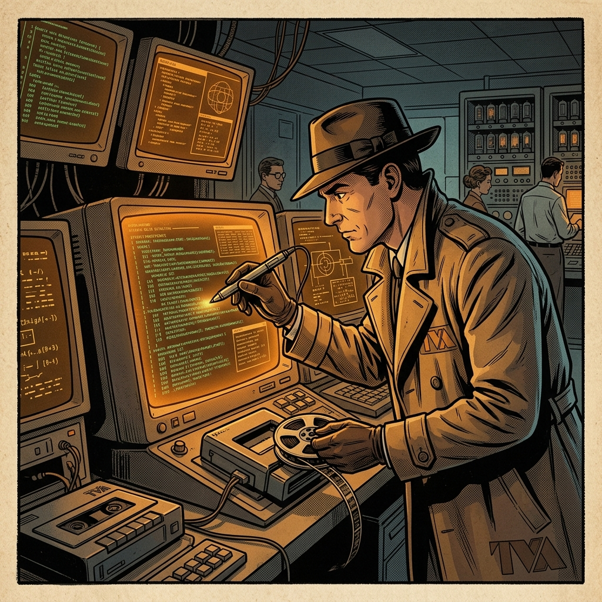

</div>

Nexus-DevFlow มีการปรับประยุกต์ใช้วินัยและวินิจฉัยงานวิศวกรรมแบบพรีเมียมจากคลังความรู้สาธารณะ [`thananon/9arm-skills`](https://github.com/thananon/9arm-skills) โดยผนวกรวมไว้ใต้ `.agent/skills/9arm-skills/` อย่างเป็นสากล

คลังหลักความคิดนี้ไม่ได้สร้างขึ้นมาเพื่อทดแทนลูปทำงานหลัก แต่เป็นเลนส์แก้วคอยซ้อนทับความประณีตให้เหมาะสมในแต่ละเฟสงาน:

| เวิร์กโฟลว์ปกติ | เลนส์ความคิดแบบ 9arm-skills |
| :--- | :--- |
| `/20-Debug` (ดีบั๊กลดความเสียหาย) | **`debug-mantra`**: ต้องจำลองจุดพังได้จริง (Reproduce), ไล่ตามสายเหตุการณ์ที่เสียหาย (Fail Path), พิสูจน์ขัดแย้งสมมติฐาน (Falsify), และจดบันทึกเบาะแสรอยแผล (Breadcrumbs) เสมอก่อนเสนอแก้ไข |
| `/54-Insight` (สกัดองค์ความรู้) | **`post-mortem`**: แปลงข้อมูลจากความผิดพลาดและบั๊กที่ผ่านการประกันคุณภาพแล้ว ให้กลายเป็นสัญญาสถาปัตยกรรมความรู้และวิกิกลางของทีมพัฒนาทันที |
| `/55-PR-Review`, `/90-Agent code-reviewer` | **`scrutinize`**: ตรวจจับเป้าหมายของการเขียนโค้ด, มองหาทางเลือกสถาปัตยกรรมที่เล็กกว่า, และประเมินพฤติกรรมการรันไทม์จริงก่อนยืนยันยินยอมอนุมัติกิ่งโค้ด |
| `/51-PR`, `/53-Changelog`, `/99-Help` | **`management-talk`**: แปลงรายละเอียดเทคนิคอันซับซ้อนให้กลายเป็นข้อความรายงานที่เรียบง่าย สรุปสถานการณ์ ผลกระทบทางธุรกิจ เจ้าของเรื่อง และขั้นตอนการเดินทางต่อ เพื่อการสื่อสารอย่างเข้าใจของ stakeholders ทั้งหมด |

---

## 🗺️ แผนที่โลกเวิร์กสเปซ DVA (Workspace Map)

<div align="center">


</div>

```text
Nexus-DevFlow/
  .agent/                    # แกนกลางควบคุมเฟรมเวิร์กเอเจนต์ DVA และเครื่องมืออัตโนมัติ
  .workspaces/               # สารบบกิ่งมิติเวลาและหน้างานที่เกิดขึ้นจากการทดลองและพัฒนา
    debug/                   # รายงานวิเคราะห์หาสาเหตุ RCA และแนวทางแก้ไขบั๊ก
    issues/                  # ด่านคัดกรองบั๊กและประเด็นแรกรับจาก GitHub
    prds/                    # เอกสารข้อกำหนดเชิงสัญญางานโปรดักส์และเป้าหมายธุรกิจ
    reports/                 # รายงานประกันคุณภาพการรันชุดเทส, รายงานดีไซน์ และรีวิวโค้ด
    research/                # บันทึกระดมสมองและประวัติการวิจัย API เทคโนโลยีใหม่
    specs/                   # หน้างานย่อยของแต่ละ Task และกิ่งประวัติ Goal Session
    roadmap/                 # ข้อตกลงความคืบหน้าของฟีเจอร์ในรูปของ JSON และ markdown
    wiki/                    # ห้องหอสมุดรวบรวมและสกัดองค์ความรู้เชิงสถาปัตยกรรมสำหรับทีม
  docs/                      # คู่มือการใช้งานอย่างประณีตสำหรับนักพัฒนา
  scripts/                   # คำสั่งระบบควบคุมและรันเวิร์กโฟลว์เบื้องหลัง
```

| สารบบเป้าหมาย | ความเกี่ยวข้องกับ Slash Workflow ของ DVA |
| :--- | :--- |
| `.workspaces/specs` | `/05-Goal`, `/30-Task` ถึง `/35-Followup`, `/39-QA-Orchestrate`, `/54-Insight` |
| `.workspaces/research` | `/10-Brainstorm`, `/11-Research`, `/15-Spec-Research`, `/16-Competitor` |
| `.workspaces/prds` | `/12-PRD`, `/18-Spec-Orchestrate` |
| `.workspaces/debug` | `/20-Debug` |
| `.workspaces/reports` | `/14-Orchestrate`, `/40-Test`, `/41-Simplify`, `/55-PR-Review`, `/56-PR-Followup`, `/90-Agent` |
| `.workspaces/roadmap` | `/17-Roadmap` |
| `.workspaces/wiki` | `/54-Insight`, `/59-Wiki`, `/90-Agent`, `/99-Help` |

---

## 🛡️ ระบบการตรวจสิทธิ์และประเมินคุณภาพ (Validation Model)

<div align="center">


</div>

ระบบประกันความเสถียร (Validation) ถูกรวมอยู่ในขั้นตอนลูปเวิร์กโฟลว์อยู่แล้ว ไม่ได้เป็นภาระเพิ่มเติมที่นักพัฒนาจะต้องจดจำ ในระหว่างขั้นตอนแก้ไขงาน (`/32-Code`) และขั้นตอนประกันคุณภาพ (`/33-Verify`) กองกำลังเอเจนต์ DVA จะทำการรันชุดทดสอบความถูกต้องของลอจิก, เช็คประเด็นความปลอดภัยด้วย Linter, บำรุงซ่อมแซมโครงสร้างสัญญางาน JSON เมื่อตรวจพบข้อผิดพลาด และเขียนข้อสรุปผลลัพธ์แยกไว้อย่างเป็นระเบียบใต้กิ่งเวิร์กสเปซของแต่ละหน้างานโดยอัตโนมัติ

สำหรับผู้ดูแลที่กำลังแก้ไขความสามารถของแกนหลักระบบ DVA สารบัญคำสั่งตรวจสิทธิ์และสเปกโครงสร้างทั้งหมดได้รับการบันทึกไว้ใน [USAGE.md](./USAGE.md) และโฟลเดอร์เอกสารคู่มือ [docs/](./docs) ครับ

---

## 📚 ห้องหอสมุดคู่มือการใช้งาน (Documentation)

<div align="center">


</div>

| คลังคู่มือการเรียนรู้ | ขอบเขตการอธิบายและการรันระบบ |
| :--- | :--- |
| [Setup](./SETUP.md) | ขั้นตอนติดตั้งสำหรับผู้ใช้ทั่วไป, การลงเครื่องมือ Codex, และประโยคสั่งการด่วนให้ AI ติดตั้งระบบให้แบบอัตโนมัติ |
| [Setup By AI](./SETUP-BY-AI.md) | แผนปฏิบัติตามวินัยสำหรับ AI ในการเช็คเวอร์ชัน, ดาวน์โหลดระบบติดตั้ง, และรันคำสั่ง Validate ตรวจความสมบูรณ์ |
| [Usage Guide](./USAGE.md) | รายการกระบวนการเวิร์กโฟลว์ SOP ทั้งหมดใน DVA, คู่มือคำสั่ง Slash commands และตัวอย่างการสั่ง Plain Intent |
| [Quickstart](./docs/quickstart.md) | ด่านต้อนรับนักพัฒนาหน้าใหม่และการเปิดใช้งานเฟรมเวิร์กเป็นครั้งแรก |
| [Workspace Artifacts](./docs/workspace-artifacts.md) | ขอบเขตความรับผิดชอบของโฟลเดอร์เวิร์กสเปซและกฎเหล็กการล้างขยะใน Artifacts |
| [Agent Bundle](./docs/agent-bundle.md) | สถาปัตยกรรมความสามารถภายใน `.agent` bundle และกระบวนการผูกลอจิกเอเจนต์ |
| [JSON Artifact Contract](./docs/json-artifact-contract.md) | โครงสร้างและสเปกสัญญาข้อกำหนด JSON ใน PRP รวมถึงความคาดหวังของ schemas |
| [Script-First JSON Workflow](./docs/script-first-json-workflow.md) | สารบัญคำสั่งแก้ไขและอัปเดตไฟล์ JSON เพื่อความปลอดภัยและความเสถียรของลอจิก |
| [Prompt Addons](./docs/prompt-addons.md) | โทเค็นคำสั่งและสกิลของเอเจนต์ย่อยสำหรับการประเมิน QA, ค้นหาคู่แข่ง, วิเคราะห์ roadmap, และการวาง Insight |
| [Roadmap](./ROADMAP.md) | สรุปภาพรวมแผนการเดินทางของฟีเจอร์ระดับพรีเมียมทั้งหมด |
| [Agents](./AGENTS.md) | รายนามของทำเนียบเจ้าหน้าที่เอเจนต์ DVA และสายงานความรับผิดชอบเชิงลึก |

---

## 📝 บันทึกสำหรับเจ้าหน้าที่ผู้ดูแลระบบ (Maintainer Notes)

<div align="center">

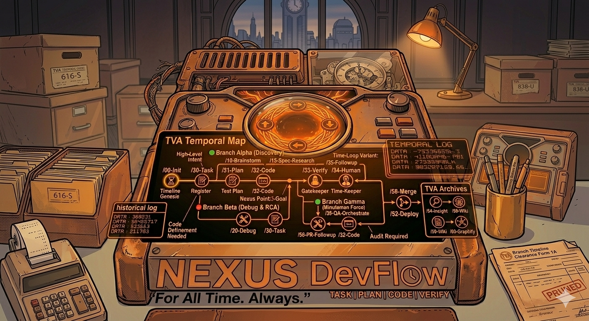

</div>

- สารระบายความสามารถทั้งหมดของเอเจนต์ต้องผูกอยู่ภายใต้ [`.agent`](./.agent) เป็นหลักเท่านั้น
- คลังบันทึกหน้างานย่อยและกิ่งประวัติลอจิกจะต้องจัดเก็บอย่างเด็ดขาดไว้ใต้ [`.workspaces`](./.workspaces)
- รันและทดสอบความพร้อมของระบบ DVA ทั้งหมดก่อนดำเนินการ Commit หรือเปิดประเมินความคืบหน้าของเฟรมเวิร์ก
- หลังมีการแก้ไขเชิงโครงสร้างหรือขยายความสามารถ ให้ทำการรีแมปสลักข้อความสเปกและ rebuild คลัง index ใหม่ทุกครั้ง

<div align="center">

**Nexus-DevFlow: make the work visible, make the steps repeatable, make the result verifiable.**

**พิทักษ์มิติสายเวลาพัฒนาอย่างเสถียร ทรงพลัง และมีสัญญางานที่สอบกลับได้ 100% ตลอดกาล**

</div>
