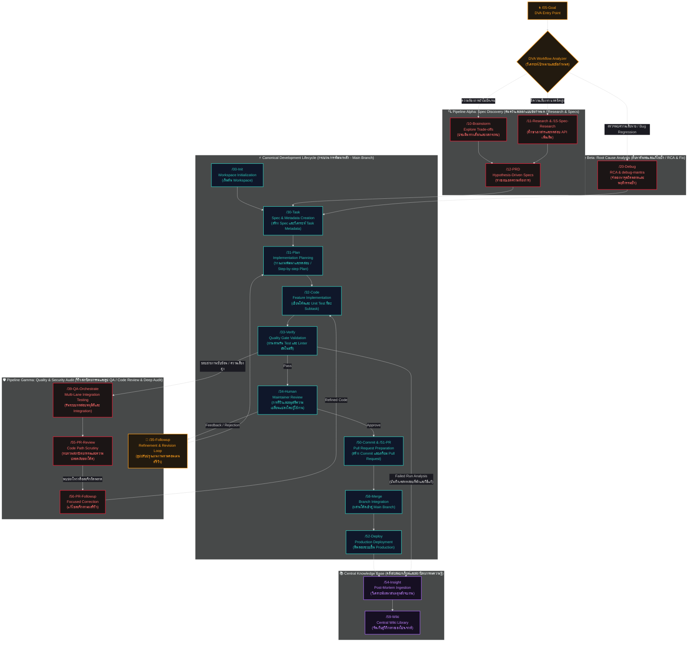
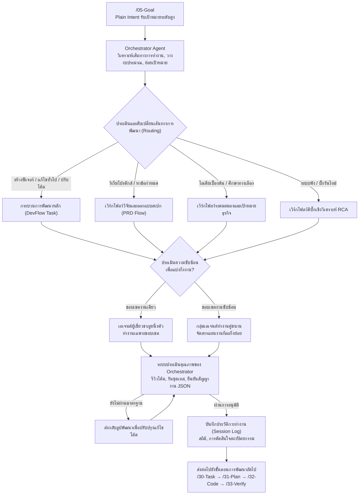
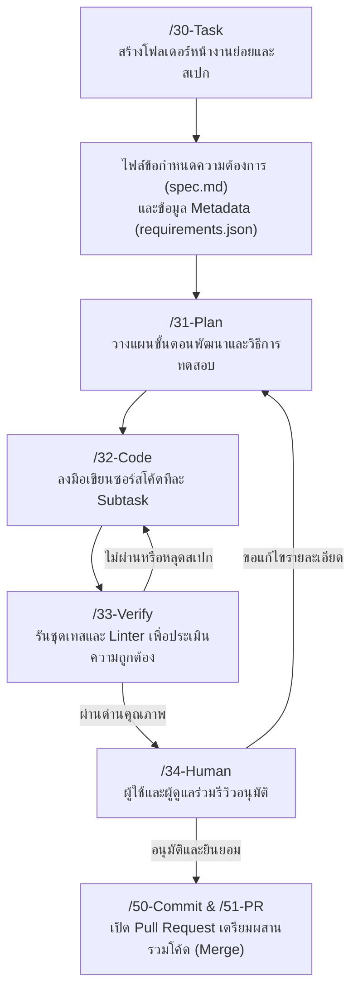
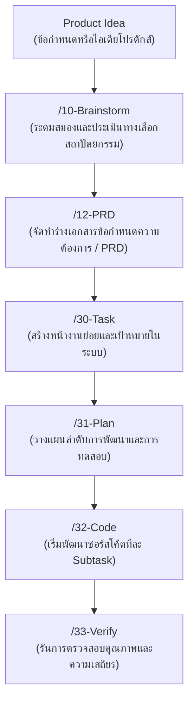
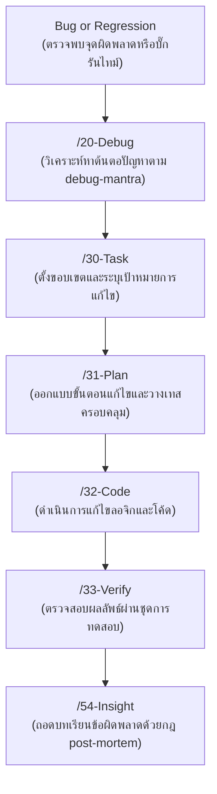
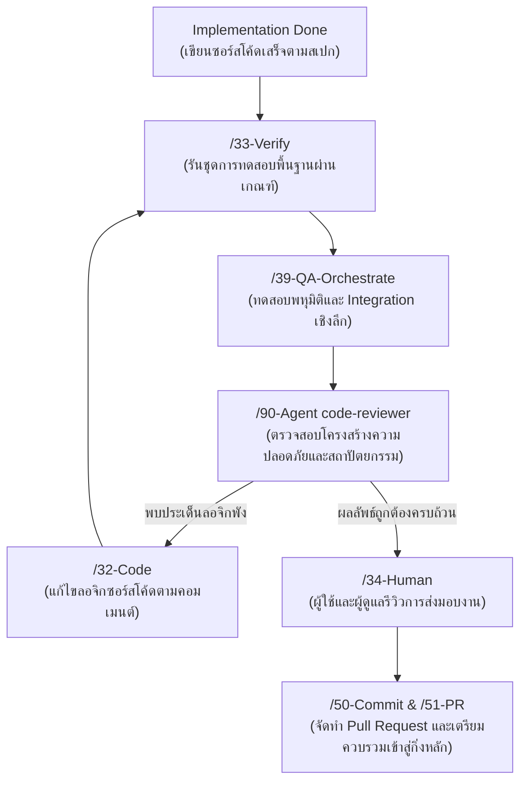

<div align="center">


# Nexus-DevFlow (DVA: Dev Variance Authority)

### แปลงเป้าหมายกระจัดกระจาย สู่ผลลัพธ์การพัฒนาโค้ดที่รัดกุม ทีละสเปก ผ่านระบบควบคุมเวิร์กโฟลว์ DVA

**เฟรมเวิร์กจัดการเวิร์กโฟลว์สำหรับ AI Agent (Agent-Ready PRP)** เพื่อแปลงเป้าหมายฟีเจอร์ระดับสูงให้กลายเป็นสเปกความต้องการทางเทคนิค แผนสถาปัตยกรรม ชุดรหัสลอจิก รายงานการทดสอบ และวิกิสะสมความรู้สำหรับทีมพัฒนา

[Setup](./SETUP.md) · [AI Setup](./SETUP-BY-AI.md) · [Usage](./USAGE.md) · [Quickstart](./docs/quickstart.md) · [Agents](./AGENTS.md) · [Roadmap](./ROADMAP.md) · [Workspace Artifacts](./docs/workspace-artifacts.md)


</div>

---

## 🌀 DVA: Dev Variance Authority (ระบบควบคุมเวิร์กโฟลว์และกระบวนการพัฒนาซอฟต์แวร์)

<div align="center">


</div>

**Nexus-DevFlow** ได้รับการออกแบบโครงสร้างภายใต้สถาปัตยกรรม **DVA: Dev Variance Authority** ซึ่งทำหน้าที่เป็นระบบควบคุมเวิร์กโฟลว์และควบคุมวงจรกระบวนการพัฒนาซอฟต์แวร์ (Software Development Lifecycle / SDLC) เพื่อป้องกันไม่ให้นักพัฒนา (Human Dev) และ AI Agent ทำงานอย่างกระจัดกระจาย หรือสร้างโค้ดที่ก่อให้เกิดผลข้างเคียงและข้อบกพร่อง (Bugs & Regressions) แก่ระบบหลัก

เมื่อมีฟีเจอร์ใหม่ การเปลี่ยนแปลงความต้องการ (Requirement Changes) หรือตรวจพบบั๊กที่ต้องแก้ไข (เรียกว่า **Dev Variance Event**) DVA จะคัดแยกประเภทงานและประเมินความเสี่ยงเชิงโครงสร้าง (State-Driven Lifecycle Routing) จากนั้นจะนำทางเวิร์กโฟลว์เข้าสู่พื้นที่ทำงานจำลองแยกส่วนเป็นเอกเทศ (Isolated Branching Workspaces / Sandbox Pipelines) เพื่อพัฒนาและตรวจสอบคุณภาพโค้ดอย่างเข้มงวด ก่อนจะส่งกลับเข้าไปผสานรวมกับกิ่งหลัก (Main Branch / Production Line) อย่างปลอดภัย



### 🏛️ เสาหลักในการควบคุมคุณภาพโค้ดของ DVA (Core Pillars)

#### 1. Canonical Development Lifecycle (CDL)
กิ่งพัฒนาหลัก (Main Branch) ที่ถูกขับเคลื่อนด้วยขั้นตอนอย่างเป็นระบบและสืบค้นย้อนกลับได้แบบ 100% เริ่มต้นตั้งแต่การเตรียมพื้นที่ทำงานย่อยให้สะอาด (`/00-Init`), สร้างข้อกำหนดความต้องการที่วัดผลได้จริงลงในสเปก (`/30-Task`), ออกแบบลำดับขั้นตอนการพัฒนาโค้ดและแผนการตรวจสอบอย่างประณีต (`/31-Plan`), ลงมือให้เอเจนต์เขียนโค้ดและทดสอบย่อยทีละส่วน (`/32-Code`), รันระบบตรวจสอบคุณภาพอัตโนมัติ (Linter & Unit Tests) ผ่านขั้นตอนรันการตรวจสอบ (`/33-Verify`), และส่งต่อให้ผู้รีวิวตรวจสอบความถูกต้อง (`/34-Human`)

#### 2. DVA Intent Triage Engine (`/05-Goal`)
ระบบวิเคราะห์ความต้องการแรกรับที่จะคอยตรวจสอบรายละเอียด ความเสถียร และความซับซ้อนของเป้าหมายที่ได้รับมอบหมาย หากประเมินแล้วพบว่าความต้องการยังมีความไม่ชัดเจนหรือมีความเสี่ยงที่จะส่งผลกระทบข้างเคียงเชิงระบบ DVA จะทำหน้าที่แยกกิ่งพื้นที่ทำงานจำลอง (Isolated Branching Workspaces) เพื่อพัฒนาทดลองก่อนผสานรวมกับกิ่งโค้ดหลัก เพื่อรักษาสภาพและความมั่นคงของซอร์สโค้ดหลัก

#### 3. Context-Driven Branching & Loopbacks (ระบบแยกสายการทำงานเพื่อความเสถียร)
เมื่อระบบตรวจพบความไม่แน่นอนของข้อกำหนด DVA จะสับเปลี่ยนและคัดแยกเวิร์กโฟลว์ไปยังท่อส่งข้อมูลการพัฒนาที่เหมาะสม เพื่อความยืดหยุ่นและเสถียรภาพสูงสุด:
*   **Pipeline Alpha (Spec Discovery - การวิเคราะห์และออกแบบข้อกำหนด)**: ในกรณีที่สเปกยังไม่นิ่ง ระบบจะแยกสาขาเพื่อทำการระดมสมองผ่าน `/10-Brainstorm` และศึกษาวิจัยโครงสร้างผ่าน `/11-Research` (ศึกษาเอกสารและทดสอบ API) เพื่อจัดทำร่าง `/12-PRD` ที่รัดกุมก่อนเริ่มพัฒนาโค้ด
*   **Pipeline Beta (Root Cause Analysis - การวิเคราะห์หาสาเหตุและแก้ไขบั๊ก)**: หากตรวจพบข้อผิดพลาดหรือปัญหาในระบบ DVA จะแยกสภาพแวดล้อมเพื่อแก้ไขผ่าน `/20-Debug` โดยปฏิบัติตามมาตรฐาน `debug-mantra` (จำลองจุดเกิดเหตุ -> บันทึก Breadcrumbs -> วางสมมติฐานเพื่อพิสูจน์) เพื่อวางแผนการแก้ไขบั๊กที่รัดกุมและปลอดภัย
*   **Pipeline Gamma (Quality & Security Audit - การตรวจสอบเชิงลึกและการรีวิวโค้ด)**: หากเป็นงานที่มีความซับซ้อนสูงหรือจุดที่มีความสำคัญสูง เวิร์กโฟลว์จะถูกดึงเข้าสู่การรันชุดทดสอบพหุมิติ (Multi-dimensional Integration Testing) ผ่าน `/39-QA-Orchestrate` และระดมผู้เชี่ยวชาญเข้ารีวิวโค้ดเชิงลึก (`/55-PR-Review`) และทำการแก้ไขลอจิกทันทีผ่าน `/56-PR-Followup`
*   **Pipeline Delta (Revision & Feedback Loop - ลูปการปรับปรุงตามความเห็นผู้รีวิว)**: หากผู้ใช้มีคำแนะนำเพิ่มเติมในขั้นตอนตรวจรับงาน (`/34-Human`) ระบบจะส่งกลับไปปรับปรุงแผนงานผ่าน `/35-Followup` เพื่อแก้ไขแผนงานและอัปเดตสเปกใหม่ที่ขั้นตอน `/31-Plan` ป้องกันปัญหาการพัฒนาโค้ดหลุดขอบเขตความต้องการ

#### 4. DVA Knowledge Engine (คลังองค์ความรู้สะสมและบทเรียนสถาปัตยกรรม)
เมื่อซอร์สโค้ดได้รับการควบรวมเข้าสู่กิ่งหลักและผ่านการใช้งานจริง ข้อมูลทางวิศวกรรม บทเรียนจากจุดผิดพลาด และโครงสร้างการแก้ไข จะถูกดึงและถอดบทเรียนผ่าน `/54-Insight` (ด้วยมาตรฐาน `post-mortem`) เพื่อวิเคราะห์ปัญหาและส่งข้อมูลไปบันทึกไว้ในฐานข้อมูลวิกิกลางของโปรเจกต์ที่ `/59-Wiki` เพื่อเป็นแนวทางและตัวอย่างความรู้แก่ AI และทีมพัฒนาในการทำงานครั้งต่อไป

---

## 🏛️ DVA คืออะไร (What It Is)

<div align="center">


</div>

Nexus-DevFlow คือเฟรมเวิร์กจัดการบริบท (Context Engineering) แบบมีโครงสร้างสำหรับการพัฒนาซอฟต์แวร์ร่วมกับ AI มันมอบข้อกำหนดการทำงานร่วมกัน (Operating Contract) ระหว่างนักพัฒนา (Human Dev) และ AI Agent: เริ่มจากการจัดทำข้อกำหนดความต้องการย่อย (Sub-spec Creation) จัดเก็บลอจิกความต้องการในรูปแบบไฟล์ข้อกำหนด วางแผนขั้นตอนการพัฒนาและกลยุทธ์การทดสอบอย่างเป็นระบบ เขียนซอร์สโค้ดทีละส่วนอย่างรอบคอบ พร้อมผ่านชุดตรวจสอบความถูกต้องและการทดสอบอัตโนมัติ และจัดเก็บประวัติข้อมูลความเปลี่ยนแปลงทั้งหมดให้สามารถตรวจสอบย้อนกลับได้ 100%

เฟรมเวิร์กนี้ทำหน้าที่ผ่านโมดูลประมวลผลเอเจนต์ [`.agent`](./.agent) ร่วมกับรูปแบบโครงสร้างโฟลเดอร์เวิร์กสเปซที่คุมการประมวลผล การวางแผนพัฒนา และการรายงานความคืบหน้าของ AI เอเจนต์อย่างเป็นระบบและสอดคล้องกัน

กฎเหล็กสำคัญที่สุดของโครงสร้างสถาปัตยกรรมระบบคือ:

> ไฟล์สรุปความคืบหน้าและข้อมูลเชิงประวัติที่เป็น JSON ทั้งหมด ต้องทำรายการเปลี่ยนแปลงด้วยสคริปต์ของระบบ (Script-First JSON Rule) โดย AI เอเจนต์ต้องเรียกใช้เครื่องมือ PRP CLI แทนการเปิดเข้าไปแก้ไขด้วยมือโดยตรง เพื่อหลีกเลี่ยงความผิดพลาดของโครงสร้างข้อมูลและข้อผิดพลาดในระบบตรวจสิทธิ์

---

## 🚀 จุดเด่นและขีดความสามารถ (Key Capabilities)

<div align="center">


</div>

| ขีดความสามารถ | รายละเอียดสิทธิประโยชน์และประสิทธิภาพระบบ |
| :--- | :--- |
| **ระบบคัดกรองความต้องการแรกรับ** | คำสั่ง `/05-Goal` ทำหน้าที่วิเคราะห์เป้าหมายระดับสูงและจัดสรรเวิร์กโฟลว์ไปยังกิ่งการทำงานย่อยตามความเหมาะสมโดยอัตโนมัติ |
| **กระบวนการพัฒนาหลักที่เสถียร (CDL)** | วงจรพัฒนาและประเมินคุณภาพที่ตรวจสอบย้อนกลับได้: `/30-Task` → `/31-Plan` → `/32-Code` → `/33-Verify` พร้อมจัดเก็บประวัติอย่างละเอียด |
| **การจัดการไฟล์ข้อกำหนดแบบ Script-First** | การแก้ไขและอัปเดตสถานะไฟล์ JSON ผ่าน PRP CLI ป้องกันการเสียหายของข้อมูลโครงสร้างจากการแก้ไขแบบ Manual |
| **ระบบจัดสรรบทบาทของเอเจนต์** | จัดการแบ่งหน้าที่และความรับผิดชอบอย่างชัดเจน เช่น Planners, Coders, Reviewers, Test Engineers และ Security Auditors |
| **สถาปัตยกรรมเวิร์กสเปซที่สืบค้นได้ง่าย** | จัดระเบียบแยกเก็บ Specs, PRDs, ข้อมูลวิจัยทางเทคนิค, รายงานการแก้บั๊ก และสรุปบทเรียนไว้เป็นหมวดหมู่ใต้ `.workspaces` |
| **การตรวจรับประเมินผลเชิงบูรณาการ** | การทำสอบเกทอัตโนมัติเพื่อตรวจสอบความพร้อม ความเสถียรของโค้ด และผลลัพธ์ของลอจิกให้ตรงตามสเปก |
| **ระบบขยายทักษะเชิงโมดูล** | ทักษะเสริมเฉพาะด้านของเอเจนต์จะถูกรันในฐานะ Skills เฉพาะจุดโดยตรง ลดภาระการสร้าง Slash Command เพิ่มเติม |
| **9arm-Skills วินัยการสกัดบทเรียนระดับสูง** | การประยุกต์ใช้วินัยทางวิศวกรรมชั้นนำจาก `thananon/9arm-skills` เพื่อยกระดับความแม่นยำในการดีบั๊ก การรีวิว และ Post-mortem |

---

## 🌀 ระบบวิเคราะห์และนำทางเวิร์กโฟลว์ขั้นสูง (Advanced Goal Routing)

<div align="center">


</div>



ผู้ใช้สามารถใช้คำสั่ง `/05-Goal` เมื่อต้องการให้เอเจนต์หลักทำหน้าที่เลือกเวิร์กโฟลว์พัฒนาที่เหมาะสมที่สุด จัดสรรส่งงานให้เอเจนต์เฉพาะทาง ควบคุมงบประมาณ Tokens และจัดทำสรุปรายงานการบันทึกการตัดสินใจทางสถาปัตยกรรมก่อนส่งมอบเข้าลูปกระบวนการพัฒนาหลัก

---

## 🏛️ กระบวนการพัฒนาหลักมาตรฐาน (Basic DevFlow - CDL)

<div align="center">


</div>

กระบวนการพัฒนาหลัก (Main Branch Pipeline) ที่ขับเคลื่อนด้วยขั้นตอนเป็นระบบและสืบค้นข้อมูลย้อนหลังได้ 100% เริ่มตั้งแต่การเตรียมเคลียร์พื้นที่ทำงานย่อย (`/00-Init`), กำหนดขอบเขตความต้องการที่วัดผลได้ในไฟล์สเปก (`/30-Task`), ออกแบบแผนการเขียนโค้ดและรายการประเมินผลอย่างละเอียด (`/31-Plan`), ลงมือพัฒนาโค้ดและรันย่อยราย subtask (`/32-Code`), ตรวจประเมินผลทางเทคนิคด้วยการรัน Test & Linter (`/33-Verify`) และส่งต่อให้ทีมผู้รีวิวและผู้ใช้ร่วมตรวจรับความสมบูรณ์ (`/34-Human`)



ผู้ใช้สามารถเข้าทำงานตามลูปกระบวนการพัฒนาหลักนี้ได้โดยตรงหากมีความต้องการและเป้าหมายที่ชัดเจนอยู่แล้ว เช่น การเพิ่มฟีเจอร์ใหม่ที่ขอบเขตชัดเจน การแก้ไขบั๊กทั่วไป หรือการทำแบบทดสอบ Unit Test เพิ่มเติม

---

## 🗺️ รูปแบบเวิร์กโฟลว์ที่แนะนำสำหรับการพัฒนา (Recommended Flow Patterns)

### 🔍 กระบวนการวิจัยและออกแบบความต้องการ (Product / Spec Flow)

<div align="center">


</div>



---

### 🐞 กระบวนการวิเคราะห์หาสาเหตุและแก้ไขข้อผิดพลาด (Debug / RCA Flow)

<div align="center">


</div>



---

### 🛡️ กระบวนการรีวิวซอร์สโค้ดและประกันคุณภาพเชิงลึก (QA / Review Flow)

<div align="center">


</div>



Nexus-DevFlow จัดเตรียมกลไกการประกันคุณภาพและความเสถียรเสริม เพื่อปกป้องโค้ดเบสหลักจากการเปลี่ยนแปลงที่อาจส่งผลกระทบข้างเคียงเชิงระบบ ด้วยการใช้เอเจนต์ตรวจสอบสถาปัตยกรรมเฉพาะจุดและกระบวนการคัดกรองความปลอดภัยเชิงลึก:

<div align="center">


</div>

เมื่อใดก็ตามที่ซอร์สโค้ดได้รับการควบรวมเข้าสู่กิ่งหลัก ข้อมูลสรุปบทเรียน ข้อผิดพลาดที่แก้ไข และการปรับแต่งสถาปัตยกรรมที่สำคัญ จะถูกจัดเก็บและประมวลผลเพื่อนำไปบันทึกยังฐานความรู้กลางของทีมพัฒนาโดยอัตโนมัติ เพื่อเป็นชุดแนวทางอ้างอิงและเพิ่มขีดความสามารถการแก้ปัญหาของ AI เอเจนต์ในเวิร์กโฟลว์ถัดไป:

<div align="center">


</div>

---

## ⚡ วิธีการเปิดสั่งงานเวิร์กโฟลว์ (Workflow Operations)

<div align="center">


</div>

ในกระบวนการทำงานร่วมกับ AI-enabled IDE อย่าง Antigravity ผู้ใช้ไม่จำเป็นต้องเรียกใช้คำสั่งระดับต่ำหรือจัดการประวัติการเปลี่ยนแปลงด้วยตนเอง เพียงแค่ระบุเป้าหมายระดับสูงที่ต้องการในช่องแชทโดยตรง จากนั้นระบบจัดสรรเวิร์กโฟลว์เอเจนต์ DVA จะคัดกรอง วางแผน และรันเครื่องมือประมวลผลงานเบื้องหลังทั้งหมดโดยอัตโนมัติ

เริ่มต้นพิมพ์สั่งงานด้วยการระบุเป้าหมายการพัฒนาระดับทั่วไป (Plain Intent):

```text
/05-Goal "add password reset with email token and regression tests"
```

หรือระบุคำสั่งควบคุมเวิร์กโฟลว์เฉพาะเจาะจงโดยตรงเมื่อผู้ใช้ประเมินขอบเขตของงานและหมายเลขหน้างานย่อยได้แล้ว:

```text
/30-Task "Add password reset"
/31-Plan 007
/32-Code 007
/33-Verify 007
```

ระบบจะรันเวิร์กโฟลว์เบื้องหลังและอัปเดตสถานะให้โดยอัตโนมัติ ทั้งการบันทึกประวัติลอจิกในเอกสาร Artifacts การรันระบบประเมินความถูกต้องของโค้ด และการจัดเก็บข้อมูล Session Log ผู้ใช้สามารถเข้าดูสารบัญรายละเอียดประโยคสั่งการและกรณีศึกษาเพิ่มเติมได้ที่ [USAGE.md](./USAGE.md)

---

## 💡 ตัวอย่างขั้นตอนการดำเนินเวิร์กโฟลว์ (Example Execution Flows)

<div align="center">


</div>

### 1. การพัฒนาฟีเจอร์ย่อย (Small Feature Implementation)
ผู้ใช้สั่งการ:
```text
/05-Goal "add password reset with email token and regression tests"
```
เส้นทางการพัฒนาที่ระบบกำหนดให้โดยอัตโนมัติ:
```text
DevFlow Task Execution (สับเปลี่ยนเข้าสู่กระบวนการพัฒนาหลัก)
```
ลำดับขั้นตอนที่ระบบนำทางประมวลผลเบื้องหลัง:
```text
/30-Task "Add password reset with email token and regression tests"
/31-Plan 007
/32-Code 007
/33-Verify 007
/34-Human Approve 007
```

### 2. การวิเคราะห์หาสาเหตุและซ่อมแซมจุดผิดพลาด (Debug / RCA Flow)
ผู้ใช้สั่งการ:
```text
/05-Goal "debug login redirect loop after session expires"
```
ลำดับขั้นตอนที่ระบบนำทางประมวลผลเบื้องหลัง:
```text
/20-Debug "debug login redirect loop after session expires"
/30-Task "Fix login redirect loop after session expires"
/31-Plan 008
/32-Code 008
/33-Verify 008
```
ระบบ DVA จะระบุเหตุผลการนำทางงานเข้าท่อส่งซ่อมแซม ประเมินสถิติความซับซ้อนเชิงเทคนิค และจัดเก็บประวัติผลการดำเนินงานแยกไว้ในโฟลเดอร์สำหรับแก้ไขโดยตรงภายใต้ `.workspaces/specs/` โดยอัตโนมัติ

---

## 🔄 วงจรชีวิตและสถานะของหน้างานพัฒนา (PRP Lifecycle States)

<div align="center">


</div>

| เฟสและกระบวนการทำงาน | คำสั่งเวิร์กโฟลว์ (Slash Workflow) | ไฟล์ข้อกำหนดหลักที่บันทึกข้อมูล (Main Artifacts) |
| :--- | :--- | :--- |
| **Create (สร้างหน้างาน)** | `/30-Task` | `spec.md`, `requirements.json`, `task_metadata.json` |
| **Plan (ออกแบบแผนพัฒนา)** | `/31-Plan` | `implementation_plan.json`, `context.json`, `plan.md` |
| **Execute (ดำเนินการเขียนโค้ด)** | `/32-Code` | ซอร์สโค้ดส่วนที่แก้ไข, `task_logs.json`, ประวัติสถานะย่อย |
| **Verify (ตรวจสอบประเมินคุณภาพ)** | `/33-Verify` | `qa_report.md`, ผลสรุปการรันการทดสอบและเกณฑ์ตรวจสอบ, สถานะปิดงาน |
| **Approve (รีวิวและตรวจรับงาน)** | `/34-Human` | บันทึกการรีวิว, ข้อคิดเห็นความเห็นการแก้ไขงานย่อย, การปิดหน้างาน |
| **Ship (ผสานรวมกิ่งโค้ดหลัก)** | `/50-Commit`, `/51-PR` | ข้อความสรุป Git Commit, รายงานโครงสร้าง PR, โค้ดที่พร้อมผสานขึ้น Main Branch |

ผู้ใช้สามารถเข้าศึกษาตัวอย่างและรายการคำสั่งประมวลผลทั้งหมดแบบละเอียดได้ที่ [USAGE.md](./USAGE.md)

---

## 🤖 บทบาทหน้าที่ของกลุ่มเอเจนต์วิศวกรรม (Agent Roles & Specialties)

<div align="center">


</div>

โครงสร้างและบทบาทของเอเจนต์ถูกจัดหมวดหมู่แยกจัดเก็บอย่างมีระเบียบภายใต้โฟลเดอร์ [`.agent/agents`](./.agent/agents) โดยแบ่งแยกขอบเขตและหน้าที่ความรับผิดชอบอย่างชัดเจน:

| บทบาทหน้าที่และความรับผิดชอบ | รายชื่อกลุ่มเอเจนต์เฉพาะทาง (DVA Agents) |
| :--- | :--- |
| **ฝ่ายวิเคราะห์และวางแผน (Planning)** | `prp-core-planner`, `requirements-engineer`, `prp-core-prd-architect`, `orchestrator`, `prp-core-boss` |
| **ฝ่ายค้นคว้าและการวิจัยระบบ (Research)** | `codebase-explorer`, `codebase-analyst`, `web-researcher` |
| **ฝ่ายพัฒนาและการเขียนลอจิก (Implementation)** | `prp-core-coder`, `prp-core-worker`, `backend-specialist`, `frontend-specialist`, `database-architect` |
| **ฝ่ายตรวจสอบและรับประกันคุณภาพ (Quality)** | `test-engineer`, `code-reviewer`, `security-auditor`, `performance-engineer` |
| **ฝ่ายจัดระเบียบ Git และเอกสารคู่มือ** | `prp-core-git-committer`, `prp-core-git-pr-maker`, `documentation-maintainer` |
| **ฝ่ายให้คำแนะนำและช่วยเหลือทางเทคนิค** | `coach-guideline`, `prp-core-codebase-assistant`, `devops-engineer` |

ชุดโมดูลประเมินโค้ดและเครื่องมือทางวิศวกรรมที่นำกลับมาใช้ซ้ำได้ เช่น `code-simplification`, `type-design` และ `silent-failure-audit` จะถูกจัดแยกไว้ภายใต้โฟลเดอร์ทักษะกลาง [`.agent/skills`](./.agent/skills) เพื่อเป็นเครื่องมือสนับสนุนให้เอเจนต์ประจำงานเรียกใช้งานได้อย่างรวดเร็ว

ผู้ใช้สามารถระบุเรียกใช้งานเอเจนต์ย่อยเฉพาะทางได้โดยตรงเมื่อต้องการตรวจสอบเป้าหมายใดๆ ผ่านข้อความสั่งการในช่องแชท:
```text
/90-Agent code-reviewer .workspaces/specs/007
```

---

## 🧠 9arm-Skills วินัยการพัฒนาและการสกัดบทเรียนวิศวกรรม (9arm-Skills Discipline Layer)

<div align="center">


</div>

Nexus-DevFlow ได้ประยุกต์ใช้วินัยการออกแบบและการวิเคราะห์เชิงลึกคุณภาพสูงจากคลังความรู้วิศวกรรมสาธารณะ [`thananon/9arm-skills`](https://github.com/thananon/9arm-skills) โดยรวบรวมและรันระบบทำงานย่อยภายใต้ `.agent/skills/9arm-skills/`

กรอบความคิดเชิงวิศวกรรมนี้ไม่ได้เข้ามาเปลี่ยนลูปเวิร์กโฟลว์ปกติ แต่ทำหน้าที่เป็นเลเยอร์วินัย (Discipline Layer) ครอบคลุมเพื่อควบคุมคุณภาพสูงสุดในการส่งมอบงานแต่ละขั้นตอน:

| เวิร์กโฟลว์และคำสั่งหลัก | วินัยทางวิศวกรรมแบบ 9arm-skills |
| :--- | :--- |
| `/20-Debug` (การแก้ไขจุดบกพร่องระบบ) | **`debug-mantra`**: ต้องทำซ้ำจุดผิดพลาดได้จริง (Reproduce), วิเคราะห์เหตุการณ์ความเสียหาย (Fail Path), วางสมมติฐานหักล้างเพื่อหาสาเหตุที่แท้จริง (Falsify) และเก็บประวัติเบาะแสของปัญหา (Breadcrumbs) ทุกครั้งก่อนดำเนินการแก้ไข |
| `/54-Insight` (การสะสมองค์ความรู้หลังจบงาน) | **`post-mortem`**: การวิเคราะห์จุดบกพร่องและแนวทางแก้ไขจากปัญหาที่แก้ไขเสร็จแล้ว เพื่อถอดบทเรียนเป็นสัญญาสถาปัตยกรรมความรู้และอัปเดตลงฐานความรู้หลักของทีมทันที |
| `/55-PR-Review`, `/90-Agent code-reviewer` | **`scrutinize`**: การประเมินเจตจำนงของโค้ดที่เปลี่ยน, มองหาทางเลือกโครงสร้างที่เล็กและรัดกุมกว่า และประเมินผลลัพธ์ของโค้ดในสภาวะรันไทม์จริงก่อนอนุมัติผสานรวมโค้ด |
| `/51-PR`, `/53-Changelog`, `/99-Help` | **`management-talk`**: การแปลงรายละเอียดเชิงเทคนิคที่ซับซ้อนให้กลายเป็นรายงานสถานะที่เป็นรูปธรรม กระชับ ชี้จุดปัญหา ผลกระทบการทำงาน ผู้รับผิดชอบ และแนวทางการดำเนินการถัดไป เพื่อให้ผู้มีส่วนได้ส่วนเสีย (Stakeholders) ทุกฝ่ายเข้าใจตรงกัน |

---

## 🗺 โครงสร้างระบบและแผนผังเวิร์กสเปซ (Workspace Structure Map)

<div align="center">


</div>

```text
Nexus-DevFlow/
  .agent/                    # โฟลเดอร์ประมวลผลหลักของ AI เอเจนต์และสคริปต์ควบคุมระบบ
  .workspaces/               # โฟลเดอร์จัดเก็บข้อมูลหน้างานย่อยและกิ่งประวัติความเปลี่ยนแปลงย่อย
    debug/                   # โฟลเดอร์บันทึกรายงานการสืบสวนหาสาเหตุ RCA และแนวทางซ่อมแซมบั๊ก
    issues/                  # แฟ้มจัดเก็บบั๊กและปัญหาแรกรับที่ส่งมาจาก GitHub Issues
    prds/                    # เอกสารข้อกำหนดเชิงเทคนิคและสัญญารูปแบบเป้าหมายโปรดักส์ (PRD)
    reports/                 # ส่วนจัดเก็บรายงานการประเมินคุณภาพ, ผลการรีวิวโค้ด และผลการเทส
    research/                # สมุดจดข้อมูลระดมสมองและประวัติการทดสอบวิจัย API/ไลบรารีใหม่
    specs/                   # แฟ้มจัดเก็บสถานะหน้างานย่อย (Task.md) และประวัติ Goal Session
    roadmap/                 # ข้อกำหนดและเป้าหมายความคืบหน้าของโปรเจกต์ในรูป JSON และ markdown
    wiki/                    # คลังเก็บรวบรวมองค์ความรู้หลักของทีมและผลจากการถอดบทเรียน
  docs/                      # คู่มือการศึกษาขั้นตอนการพัฒนาซอฟต์แวร์ของนักพัฒนา
  scripts/                   # คำสั่งระบบระดับปฏิบัติการและเวิร์กโฟลว์เบื้องหลัง
```

| โฟลเดอร์พื้นที่การทำงาน | ขอบเขตความเกี่ยวข้องกับคำสั่งเวิร์กโฟลว์ (Workflow Context) |
| :--- | :--- |
| `.workspaces/specs` | `/05-Goal`, `/30-Task` ถึง `/35-Followup`, `/39-QA-Orchestrate`, `/54-Insight` |
| `.workspaces/research` | `/10-Brainstorm`, `/11-Research`, `/15-Spec-Research`, `/16-Competitor` |
| `.workspaces/prds` | `/12-PRD`, `/18-Spec-Orchestrate` |
| `.workspaces/debug` | `/20-Debug` |
| `.workspaces/reports` | `/14-Orchestrate`, `/40-Test`, `/41-Simplify`, `/55-PR-Review`, `/56-PR-Followup`, `/90-Agent` |
| `.workspaces/roadmap` | `/17-Roadmap` |
| `.workspaces/wiki` | `/54-Insight`, `/59-Wiki`, `/90-Agent`, `/99-Help` |

---

## 🛡️ ระบบการตรวจประเมินและทดสอบคุณภาพ (Validation & Verification Model)

<div align="center">


</div>

ระบบประเมินความถูกต้อง (Automated Quality Gate) ถูกผสานรวมอยู่ภายในลูปเวิร์กโฟลว์ของเฟรมเวิร์กเรียบร้อยแล้ว โดยไม่เป็นภาระเพิ่มเติมแก่นักพัฒนา ในระหว่างขั้นตอนการพัฒนาและเขียนลอจิก (`/32-Code`) และขั้นตอนการตรวจสอบความถูกต้องก่อนปิดงาน (`/33-Verify`) เอเจนต์ระบบจะร่วมรันชุดทดสอบความถูกต้อง ตรวจสอบมาตรฐานและความปลอดภัยด้วย Linter ซ่อมแซมและตรวจสอบความสมบูรณ์ของโครงสร้างไฟล์ข้อกำหนด JSON พร้อมส่งออกรายงานบันทึกความคืบหน้าแยกเก็บไว้เป็นระบบอย่างเป็นเอกเทศภายใต้โฟลเดอร์เวิร์กสเปซของแต่ละหน้างานโดยอัตโนมัติ

สำหรับผู้พัฒนาแกนหลักที่กำลังปรับปรุงระบบจัดสรรเวิร์กโฟลว์ รายละเอียดไฟล์สเปกข้อกำหนดทางเทคนิคและสัญญารูปแบบข้อมูลได้รับการจัดเตรียมไว้ใน [USAGE.md](./USAGE.md) และเอกสารคู่มือ [docs/](./docs)

---

## 📚 เอกสารคู่มือและการใช้งาน (Documentation & Reference)

<div align="center">


</div>

| หมวดหมู่ข้อมูลอ้างอิง | ขอบเขตการประเมินและการเตรียมระบบ |
| :--- | :--- |
| [Setup](./SETUP.md) | คู่มือการติดตั้งสำหรับนักพัฒนาทั่วไป, การเตรียมสภาพแวดล้อม และชุดคำสั่งอำนวยความสะดวกในการจัดสรรเครื่องมืออัตโนมัติ |
| [Setup By AI](./SETUP-BY-AI.md) | เอกสารนำทางและตรวจสอบความสมบูรณ์สำหรับ AI ในการยืนยันเวอร์ชันเครื่องมือและโครงสร้างระบบอัตโนมัติ |
| [Usage Guide](./USAGE.md) | คู่มือกระบวนการปฏิบัติงานมาตรฐาน (SOP) ในเวิร์กโฟลว์, ตารางอธิบายชุดคำสั่ง Slash command และกรณีศึกษา Plain Intent |
| [Quickstart](./docs/quickstart.md) | คู่มือการเริ่มต้นใช้งานอย่างรวดเร็วสำหรับนักพัฒนาใหม่และการรันเวิร์กโฟลว์ครั้งแรก |
| [Workspace Artifacts](./docs/workspace-artifacts.md) | แผนผังโฟลเดอร์เวิร์กสเปซ, ขอบเขตของไฟล์ประวัติการทำงาน และแนวทางควบคุมความคลีนของข้อมูล |
| [Agent Bundle](./docs/agent-bundle.md) | สถาปัตยกรรมหลักและความสามารถของเอเจนต์ย่อยภายใน `.agent` bundle และกระบวนการติดตั้ง |
| [JSON Artifact Contract](./docs/json-artifact-contract.md) | โครงสร้างและคุณลักษณะที่จำเป็นในสัญญาข้อกำหนด JSON ใน PRP รวมถึงคำแนะนำ Schema ของโครงสร้างข้อมูล |
| [Script-First JSON Workflow](./docs/script-first-json-workflow.md) | คำอธิบายและรายละเอียดวิธีการแก้ไขไฟล์สถานะผ่าน PRP CLI เพื่อความถูกต้องเสถียรของโครงสร้างข้อมูล |
| [Prompt Addons](./docs/prompt-addons.md) | ชุดข้อความ Prompt และสกิลของเอเจนต์เฉพาะทางในการรันเทสเชิงลึก, วิเคราะห์เป้าหมาย หรือสรุปองค์ความรู้ |
| [Roadmap](./ROADMAP.md) | แผนงานและทิศทางการพัฒนาความสามารถของระบบและฟีเจอร์ระดับสูงในอนาคต |
| [Agents](./AGENTS.md) | เอกสารอธิบายบทบาทและสายงานความรับผิดชอบเชิงลึกของกลุ่มเอเจนต์วิศวกรรม |

---

## 📝 บันทึกความปลอดภัยสำหรับผู้ดูแลระบบ (Maintainer Guidelines)

<div align="center">


</div>

- ขีดความสามารถหลักและพฤติกรรมการทำงานของเอเจนต์ทั้งหมดต้องถูกจัดเก็บไว้ภายใต้โฟลเดอร์ [`.agent`](./.agent) เป็นสำคัญ
- ข้อมูลบันทึกการประมวลผล สัญญานานย่อย และรายงานการทำงานทั้งหมดต้องถูกแยกจัดเก็บอย่างเข้มงวดไว้ภายใต้ [`.workspaces`](./.workspaces)
- รันการตรวจสอบความถูกต้องและระบบประกันคุณภาพทั้งหมดอย่างสม่ำเสมอก่อนส่งมอบงานขึ้นกิ่งพัฒนาหลัก
- เมื่อมีความเปลี่ยนแปลงของสถาปัตยกรรมข้อมูลหรือสเปก ให้ดำเนินการอัปเดตระบบดัชนีคำค้นและความต้องการใหม่เสมอ

<div align="center">

**Nexus-DevFlow: make the work visible, make the steps repeatable, make the result verifiable.**

**ควบคุมกระบวนการพัฒนาซอฟต์แวร์อย่างเสถียร มีประสิทธิภาพ และมีข้อกำหนดที่สืบค้นย้อนกลับได้ 100%**

</div>
