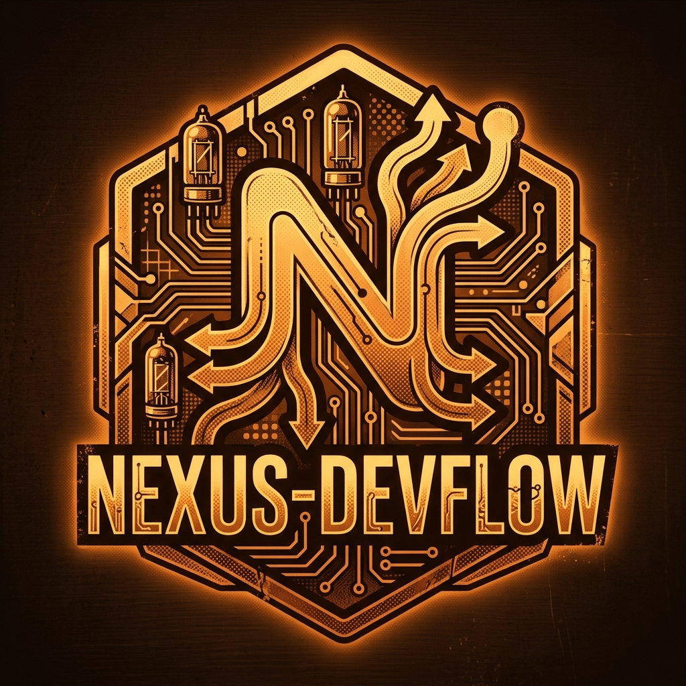
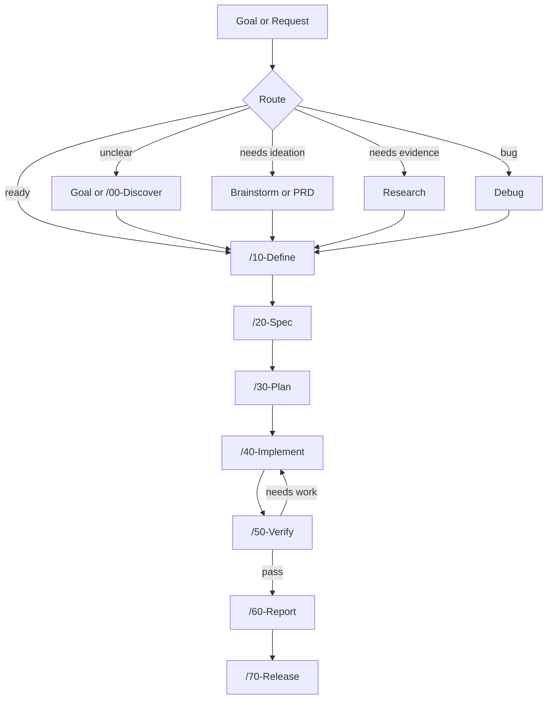

<div align="center">



# Nexus-DevFlow

### From rough goal to verified development workflow.

**Agent-ready DevFlow 2.0 framework** for discovery, definition, specification, planning, implementation, verification, release, and reporting with markdown-first workspace contracts.

[Setup](./SETUP.md) | [Usage](./USAGE.md) | [Quickstart](./docs/quickstart.md) | [Agents](./AGENTS.md) | [Roadmap](./ROADMAP.md) | [License](./LICENSE)

<sub>MIT | Node >=18.17 | `.agent` bundle | markdown-first stage contracts</sub>

</div>

---

## One Workflow Contract For Human And AI Development

Nexus-DevFlow 2.0 gives humans and AI agents one shared operating model for real software work.

A request starts as a rough goal, becomes a grounded definition, turns into a formal specification, moves through planning and implementation, gets verified with evidence, and ends as release-ready output plus a readable final report.

The framework keeps that lifecycle explicit:

- `.agent` contains workflows, agents, skills, rules, templates, and framework helpers
- `.workspaces` contains project-local artifacts produced by the running flow
- optional `checklists/` folders inside each running ID keep human-visible live task tracking, now with checklist-style markers such as `[ ]`, `[x]`, `[/]`, `[!]`, and `[-]`
- numbered workflows represent only true mainline stage states
- companion commands stay available for discovery, research, debugging, roadmap work, review, and specialist routing
- stage handoff lives in Markdown, not task JSON

---

## The Timeline

```text
/00-Discover -> /10-Define -> /20-Spec -> /30-Plan -> /40-Implement -> /50-Verify -> /60-Report -> /70-Release
```

This is the canonical DevFlow 2.0 Timeline.

- `00-Discover`: ground the request, context, and running ID
- `10-Define`: lock the problem, scope, constraints, and success criteria
- `20-Spec`: write the delivery contract and acceptance criteria
- `30-Plan`: create an executable implementation plan
- `40-Implement`: perform the code changes and implementation work
- `50-Verify`: validate behavior, quality, and evidence, optionally producing `50-verify-impact.md` for impact and rollback analysis
- `60-Report`: produce the final standardized summary in Markdown and HTML before release packaging
- `70-Release`: package release-facing outputs such as commit, PR, merge, or deploy coordination after report sign-off

### Why `00`, `10`, `20`, and `30` are separate

Teams often ask why DevFlow does not jump straight from "spec" to "plan". The short answer is that each stage locks a different level of clarity:

- `00-Discover`: "What are we actually talking about?" Gather the request, missing context, unknowns, and the likely route forward.
- `10-Define`: "What exactly are we agreeing to do?" Lock the problem, scope, constraints, and success criteria.
- `20-Spec`: "What must the finished thing do?" Write the delivery contract, behavior, flows, and acceptance criteria.
- `30-Plan`: "How will we build it?" Break the work into execution steps, files, risks, and verification strategy.

This split prevents a common failure mode where a team starts designing or tasking too early, while the real problem, scope, or acceptance criteria are still fuzzy.

Rule of thumb:

- `00` is for understanding the request
- `10` is for agreeing on scope
- `20` is for defining the required outcome
- `30` is for deciding the implementation path

When a team already has a strong ticket or stable context, it is fine to keep `00` and `10` very short, or enter at `/20-Spec` directly. What DevFlow tries to avoid is skipping all of those thinking layers at once.

---

## Companion Commands

DevFlow 2.0 keeps a smaller public companion surface around the mainline:

- `Goal`
- `Brainstorm`
- `Research`
- `Debug`
- `PRD`
- `Issue-Triage`
- `Security-Review`
- `Wiki`
- `Check-For-Updates`
- `Help`

These commands support the mainline, but they do not replace it.

See [docs/workflow-surface-map.md](./docs/workflow-surface-map.md) for the current distinction between public commands, internal companions, and archive/history surfaces.

Examples:

```text
Unclear request: Goal -> /00-Discover -> /10-Define
New idea:       /00-Discover -> Brainstorm -> /10-Define -> /20-Spec
Bug fix:        Debug -> /10-Define -> /20-Spec -> /30-Plan -> /40-Implement -> /50-Verify
Issue intake:   Issue-Triage -> /10-Define -> /20-Spec
```

---

## How It Works



Every stage writes its own artifact under `.workspaces/specs/{RUNNING_ID}/`, so the work remains resumable, reviewable, and easy to hand off.

---

## What Makes 2.0 Different

|  |  |
| --- | --- |
| **Numbered mainline only** | Workflow numbers now belong only to real lifecycle stages. Companion commands do not compete with the mainline. |
| **Markdown-first contracts** | `discover.md`, `define.md`, `spec.md`, `plan.md`, `implement.md`, `verify.md`, `release.md`, and `report.md` are the source of truth. |
| **Running-ID discipline** | Artifacts stay grouped by running ID, making long tasks easier to track and resume. |
| **Checklist visibility** | Optional `checklists/` artifacts make execution status visible throughout the run, not only in final notes. |
| **Companion, skill, and agent separation** | Mainline state, reusable behavior, and specialist roles are modeled separately instead of mixing everything into workflows. |
| **Report-ready output** | The flow ends in a consistent summary format, including HTML output for human communication. |
| **Project-local workspaces** | Generated work stays inside the target project's `.workspaces`, not in a cross-project runtime store. |
| **Validation by default** | Structural, naming, docs, and contract checks are part of the normal framework loop. |
| **Migration away from legacy engine** | Dashboard-first runtime, task JSON contracts, and JSON mutation scripts are no longer the active engine. |

---

## Quick Start

From the framework root:

```powershell
npm.cmd run activate
npm.cmd run validate
```

If you are new to DevFlow:

1. Read `docs/quickstart.md`
2. Use `/00-Discover` for new work or `Help` if the route is unclear
3. Use `docs/example-runs.md` for concrete flow examples

---

## Install And Update In 3 Ways

Project-local Nexus-DevFlow setup now has three supported paths:

| If you want... | Use this method |
| --- | --- |
| one central framework shared across many projects | `Central clone + link` |
| no links or junctions in the target project | `Manual copy / overwrite` |
| AI to perform the setup for you | `Let AI install or update it` |

Recommended project-local path:

```powershell
cd D:\Projects\nexus-devflow
npm.cmd run link-project -- D:\Path\To\TargetProject
```

`link-project` installs the managed Nexus-DevFlow bundle into the target project while keeping `.workspaces` local to that project.

Optional Codex global install is supported too, but it is separate from installing Nexus-DevFlow into a project.

See [SETUP.md](./SETUP.md) for the full install and update guide.

---

## Repository Layout

```text
.
|-- .agent/       # workflows, agents, skills, templates, rules, and framework helpers
|-- .workspaces/  # generated project-local artifacts and reports
|-- docs/         # human-readable guides and reference documents
|-- scripts/      # activation, validation, sync, and install scripts
|-- AGENTS.md     # framework operating model
|-- SETUP.md      # human install guide
|-- SETUP-BY-AI.md
|-- USAGE.md
|-- ROADMAP.md
`-- package.json
```

---

## Current 2.0 Direction

DevFlow 2.0 intentionally moved away from:

- dashboard-first task views
- JSON task schemas as the active workflow contract
- script-driven JSON mutation as the primary handoff mechanism
- oversized workflow families where every support behavior needed a numbered command

If you see those concepts in older documents, read them as migration or historical context unless the file explicitly says otherwise.

---

## HTML Rendering

DevFlow keeps markdown as the source of truth for stage artifacts.

HTML is a derived artifact controlled by stage policy. In the current framework round:

- `60-report` requires `60-report.html`
- other stages remain markdown-first unless they explicitly opt into HTML rendering later

Current commands:

```powershell
npm.cmd run report:html -- <workspace-path-or-running-id>
npm.cmd run render:html -- --stage 60-report <workspace-path-or-running-id>
npm.cmd run artifact-language:switch -- en
npm.cmd run artifact-language:switch -- th
```

In phase 1, `artifact_language` controls markdown template defaults. Switch it when you want newly written markdown artifacts to default to Thai or English.

---

## Validation

```powershell
npm.cmd run roadmap:validate
npm.cmd run validate
npm.cmd run validate:all
npm.cmd run sync:check
```

Use validation whenever the framework surface, templates, workflow names, docs, or bundle structure change.

---

## Documentation

| Guide | What It Covers |
| --- | --- |
| [Setup](./SETUP.md) | Human installation and upgrade guidance |
| [Setup By AI](./SETUP-BY-AI.md) | AI-assisted installation and migration guidance |
| [Usage](./USAGE.md) | Workflow usage and command routing |
| [Quickstart](./docs/quickstart.md) | Fastest valid local startup path |
| [Team Presets](./docs/team-presets.md) | Maintainer-facing guidance for recommending DevFlow adoption shapes |
| [Governance Rules](./docs/governance-rules.md) | Maintainer-facing rules for placing future framework changes without expanding the public surface |
| [Agent Bundle](./docs/agent-bundle.md) | `.agent` bundle structure and rules |
| [Workspace Artifacts](./docs/workspace-artifacts.md) | `.workspaces` layout and stage artifact contracts |
| [Prompt Addons](./docs/prompt-addons.md) | How external prompt families map into DevFlow 2.0 |
| [Spec Kit Rules](./docs/spec-kit-devflow-rules.md) | How Spec Kit may support DevFlow development without becoming user-facing surface |
| [Agents](./AGENTS.md) | Specialist agent catalog and operating notes |
| [Roadmap](./ROADMAP.md) | Current framework direction |

---

## License

MIT. See [LICENSE](./LICENSE).

<div align="center">

**Nexus-DevFlow: make the work visible, repeatable, and verifiable.**

</div>
