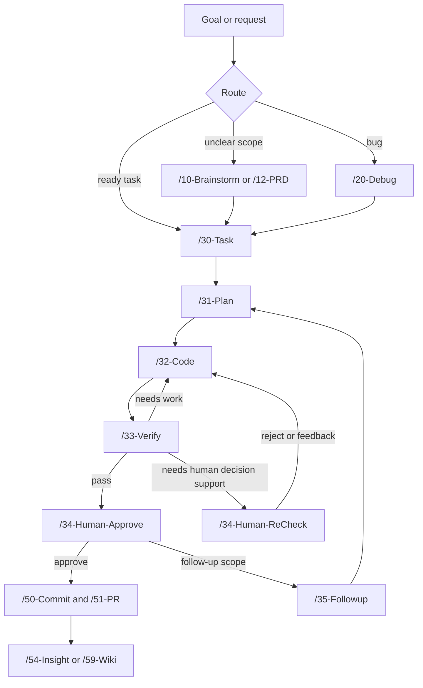

<div align="center">


# Nexus-DevFlow

### From rough goal to verified development workflow.

**Agent-ready PRP workflow framework** for specs, plans, implementation tasks, validation reports, and release artifacts.

[Setup](./SETUP.md) · [Usage](./USAGE.md) · [Quickstart](./docs/quickstart.md) · [Agents](./AGENTS.md) · [Roadmap](./ROADMAP.md) · [License](./LICENSE)

<sub>MIT · Node >=18.17 · `.agent` bundle · script-first JSON artifacts</sub>

</div>

---

## One Workflow Contract For Human And AI Development

Nexus-DevFlow gives developers and AI agents a shared operating contract. A task starts as a goal, becomes a scoped specification, turns into an implementation plan, moves through code and verification, then leaves behind reviewable artifacts.

The framework keeps the moving parts explicit:

- `.agent` contains reusable workflows, agents, schemas, scripts, skills, and dashboard assets.
- `.workspaces` contains generated project state: specs, plans, reports, research, debug notes, and wiki artifacts.
- PRP CLI commands update JSON artifacts instead of hand-editing structured state.
- Generated Markdown uses a shared frontmatter and Obsidian heading-tag contract for reports, research, specs, decisions, and wiki pages.
- Validation gates keep tasks, plans, and framework files reviewable before handoff.

---

## The Flow

```text
  1. Goal              2. Spec + Plan          3. Code + Verify       4. Review + Ship
  ----------------     ----------------        ----------------       ----------------
  "/05-Goal ..."  ->   /30-Task             -> /32-Code            -> /34-Human-Approve
                       /31-Plan                /33-Verify             /50-Commit
                                                                        /51-PR
```

The same flow can start from discovery, debugging, or direct task execution:

```text
Discovery:  /10-Brainstorm -> /12-PRD -> /30-Task -> /31-Plan
Bug fix:    /20-Debug -> /30-Task -> /31-Plan -> /32-Code -> /33-Verify
Feature:    /30-Task -> /31-Plan -> /32-Code -> /33-Verify -> /34-Human-Approve
Release:    /50-Commit -> /51-PR -> /53-Changelog -> /54-Insight
```

---

## What Makes It Different

|  |  |
| --- | --- |
| **Workflow gates** | Task -> Plan -> Code -> Verify -> Human approval. Each phase has a clear output and handoff point. |
| **Script-first artifacts** | Requirements, plans, and task state are updated through PRP CLI commands to avoid malformed JSON. |
| **Agent-ready bundle** | `.agent` packages workflows, specialist agents, schemas, rules, skills, and scripts as one portable framework bundle. |
| **Project-local state** | `.workspaces` keeps generated artifacts in the target project instead of mixing state across repos. |
| **Obsidian-ready Markdown** | Generated `.md` files use structured frontmatter plus heading tags so reports remain readable, queryable, and vault-friendly. |
| **Debug-first fixes** | Bug work starts with `/20-Debug` so fixes are based on reproduction, trace, and root-cause notes. |
| **Validation by default** | Framework validation, doc contract scans, plan validation, and task validation are part of the normal loop. |
| **Specialist agents** | Use `/90-Agent` for focused roles such as code review, backend, frontend, database, testing, security, docs, and DevOps. |
| **Open source. MIT.** | Fork it, customize it, ship your own version, and keep the MIT notice with substantial copies. |

---

## How It Works



Each command produces or updates artifacts under `.workspaces`, so the task can be reviewed, resumed, audited, and converted into future project knowledge.

---

## Quick Start

From the framework root:

```powershell
cd D:\Projects\nexus-devflow
npm.cmd run activate
npm.cmd run validate
npm.cmd run agent:status
```

Create a first task:

```powershell
npm.cmd run agent -- init 001 "First Task" first-task "Describe the first task"
npm.cmd run agent -- validate 001
```

Run a normal feature workflow in chat:

```text
/30-Task "Add password reset"
/31-Plan 001
/32-Code 001
/33-Verify 001
/34-Human-Approve 001
```

---

## PRP CLI Examples

Use the PRP CLI for structured JSON artifacts:

```powershell
npm.cmd run agent -- artifact:get 001 requirements
npm.cmd run agent -- artifact:set 001 requirements priority high
npm.cmd run agent -- artifact:append 001 requirements acceptance_criteria "User can complete the target flow"
npm.cmd run agent -- plan:add-phase 001 "Backend implementation" --type implementation
npm.cmd run agent -- plan:add-subtask 001 phase-1 "Create API endpoint" --service backend
npm.cmd run agent -- plan:set-subtask-status 001 subtask-1.1 completed
npm.cmd run agent -- validate 001
```

Repair malformed JSON through the CLI:

```powershell
npm.cmd run agent -- json:repair 001 requirements
npm.cmd run agent -- validate 001
```

---

## Command Surface

| Script | Purpose |
| --- | --- |
| `npm run activate` | Prepare the local `.agent` bundle and workspace defaults. |
| `npm run validate` | Validate framework files, bundle paths, roadmap artifacts, and generated indexes. |
| `npm run validate:all` | Run the broader validation suite. |
| `npm run validate:docs` | Scan documentation contracts. |
| `npm run agent:status` | Show PRP framework status. |
| `npm run agent -- <command>` | Run PRP CLI commands. |
| `npm run index` | Regenerate project index artifacts. |
| `npm run sync:check` | Check `.agent` bundle consistency. |
| `npm run security:scan` | Scan for basic security hygiene issues. |
| `npm run dashboard` | Serve the local dashboard. |
| `npm run codex:update-global` | Install or update the global Codex Nexus-DevFlow skill. |
| `npm run codex:check-global` | Validate the global Codex install. |

---

## Workflow Index

| Group | Commands | Use When |
| --- | --- | --- |
| Goal routing | `/05-Goal` | You have a high-level request and want the framework to recommend the right path without executing it automatically. |
| Setup and status | `/00-Init`, `/02-Status` | You need to initialize or inspect project/framework state. |
| Discovery | `/10-Brainstorm`, `/11-Research`, `/12-PRD` | Scope, requirements, or technical direction are not ready yet. |
| Debugging | `/20-Debug` | You need root cause analysis before planning a fix. |
| Core execution | `/30-Task`, `/31-Plan`, `/32-Code`, `/33-Verify`, `/34-Human-Approve`, `/34-Human-Reject`, `/34-Human-Feedback`, `/34-Human-ReCheck`, `/35-Followup` | You are moving work from spec to implementation, validation, human decision, and follow-up. |
| Quality | `/39-QA-Orchestrate`, `/40-Test`, `/41-Simplify`, `/42-Preview` | You need deeper QA, tests, simplification, or preview checks. |
| Release | `/50-Commit`, `/51-PR`, `/52-Deploy`, `/53-Changelog`, `/54-Insight`, `/58-Merge` | You are packaging, releasing, or recording lessons. |
| Review and triage | `/55-PR-Review`, `/56-PR-Followup`, `/57-Issue-Triage` | You are reviewing PRs, applying comments, or triaging issues. |
| Knowledge and specialists | `/59-Wiki`, `/60-Graphify`, `/90-Agent`, `/99-Help` | You need wiki output, graph artifacts, specialist agents, or guidance. |

---

## Lifecycle Gates

| Phase | CLI contract |
| --- | --- |
| `/31-Plan` | Record human approval with `npm run agent -- plan:approve {ID} --actor "{name}" --summary "{summary}"`. |
| `/32-Code` | Confirm approval with `plan:approval`, enter coding with `transition {ID} in_progress`, and finish with `transition {ID} ai_review`. |
| `/33-Verify` | Move to `human_review` or back to `in_progress` with `transition`. |
| `/34-Human-Approve` | Move to `done` with `transition` and a human approval summary. |
| `/34-Human-Reject` | Move back to `in_progress` with `transition` and a rejection reason. |
| `/34-Human-Feedback` | Move back to `in_progress` with `transition` and feedback history. |
| `/34-Human-ReCheck` | Read-only decision support after verification or completion; status is unchanged by default. |
| `/34-Human` | Compatibility dispatcher for legacy approve, reject, feedback, and recheck commands. |
| `/35-Followup` | Start additional scope with `followup:start` before appending phases/subtasks. |

---

## Project Layout

```text
.
|-- .agent/                         # Framework bundle: agents, commands, schemas, scripts, skills
|-- .workspaces/                    # Generated task, research, report, wiki, and roadmap artifacts
|-- docs/                           # Reference documentation
|-- scripts/                        # Root automation and validation scripts
|-- AGENTS.md                       # Agent and project operating instructions
|-- SETUP.md                        # Human installation guide
|-- SETUP-BY-AI.md                  # AI-assisted installation guide
|-- USAGE.md                        # Full workflow command reference
|-- ROADMAP.md                      # Framework roadmap
|-- LICENSE                         # MIT license
`-- package.json                    # npm command surface
```

Keep `.workspaces` project-specific. Do not share generated workspace artifacts between unrelated projects.

Generated Markdown files should follow the [Markdown Metadata Contract](./docs/markdown-metadata-contract.md).

---

## Codex Global Install

Install or update Nexus-DevFlow for Codex:

```powershell
cd D:\Projects\nexus-devflow
npm.cmd run codex:update-global
npm.cmd run codex:check-global
```

The installer manages:

```text
%USERPROFILE%\.codex\skills\nexus-devflow\SKILL.md
%USERPROFILE%\.codex\nexus-devflow.json
%USERPROFILE%\.codex\AGENTS.md
```

Pull before updating the global install:

```powershell
npm.cmd run codex:update-global:pull
```

This refuses to pull when the working tree is dirty.

---

## Documentation

| Guide | What It Covers |
| --- | --- |
| [Setup](./SETUP.md) | Manual install and upgrade instructions. |
| [Setup By AI](./SETUP-BY-AI.md) | AI-assisted install and upgrade playbook. |
| [Usage](./USAGE.md) | Full workflow guide and command reference. |
| [Quickstart](./docs/quickstart.md) | Minimal local startup flow. |
| [Agent Bundle](./docs/agent-bundle.md) | `.agent` bundle model and rules. |
| [Workspace Artifacts](./docs/workspace-artifacts.md) | Workspace artifact layout. |
| [JSON Artifact Contract](./docs/json-artifact-contract.md) | JSON artifact structure and contracts. |
| [Script-First JSON Workflow](./docs/script-first-json-workflow.md) | CLI-first artifact editing workflow. |
| [Prompt Addons](./docs/prompt-addons.md) | Prompt addon and specialist workflow notes. |
| [Agents](./AGENTS.md) | Agent roles and operating instructions. |
| [Roadmap](./ROADMAP.md) | Planned framework direction. |

---

## Development

```powershell
npm.cmd run validate
npm.cmd run validate:all
npm.cmd run sync:check
npm.cmd run roadmap:validate
npm.cmd run security:scan
```

For task-specific checks:

```powershell
npm.cmd run agent -- validate 001
npm.cmd run agent -- plan:validate 001
```

---

## License

MIT. See [LICENSE](./LICENSE).

<div align="center">

**Nexus-DevFlow: make the work visible, repeatable, and verifiable.**

</div>
