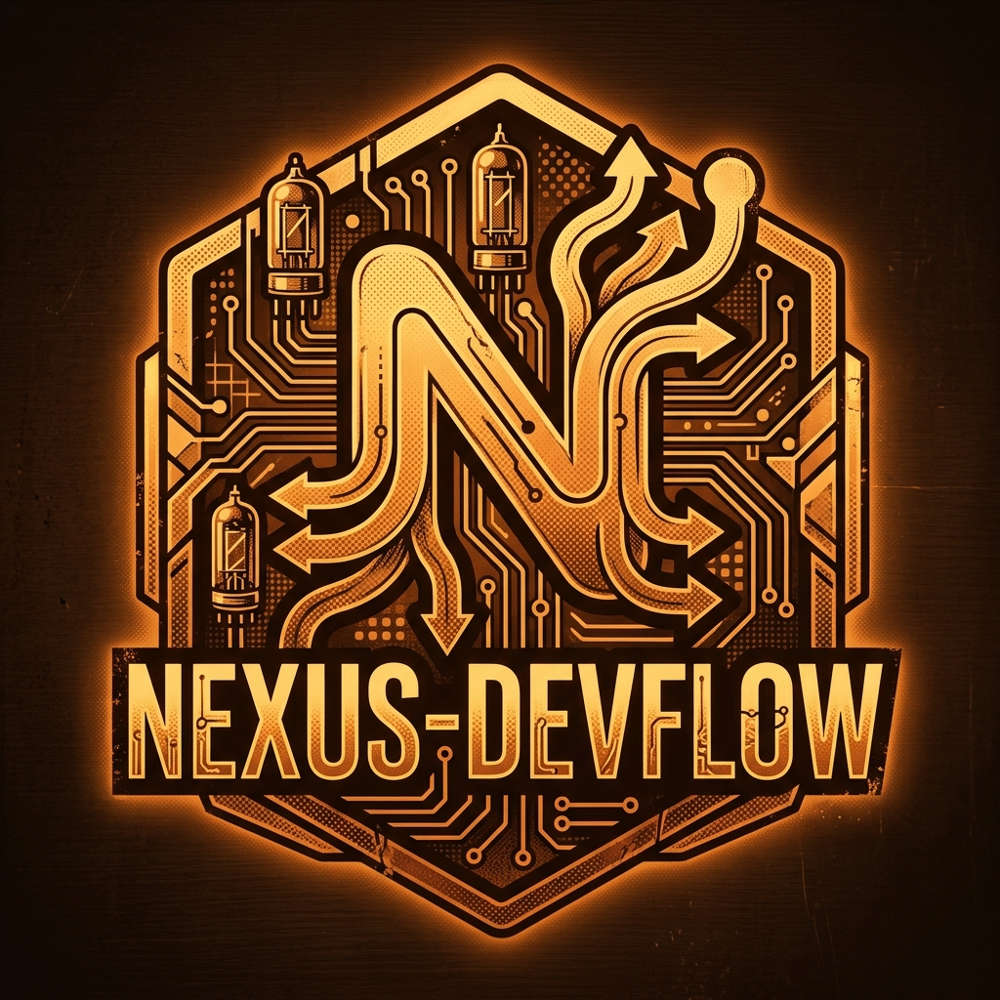

<p align="center">
  
</p>

<h1 align="center">Nexus-DevFlow</h1>

<p align="center"><strong>A file-backed, spec-driven workflow layer with The 3-Pillars Architecture & Single Living Spec Model for building production software with AI while staying in control.</strong></p>

<p align="center">
  <a href="https://www.npmjs.com/package/@jakkrichm/create-nexus-devflow"></a>
  <a href="https://github.com/Jakkrich/nexus-devflow/actions/workflows/validate.yml"></a>
  <a href="LICENSE"></a>
</p>

<p align="center"><strong>English</strong> | <a href="README.th.md">ไทย</a></p>

<p align="center">
  <a href="https://github.com/Jakkrich/nexus-devflow">Repository</a> |
  <a href="https://www.npmjs.com/package/@jakkrichm/create-nexus-devflow">npm</a> |
  <a href="https://github.com/Jakkrich/nexus-devflow/releases">Releases</a> |
  <a href="CHANGELOG.md">Changelog</a>
</p>

You capture ideas, architectural decisions, and product requirements in structured markdown documents. The AI transforms them into project context, single living feature specs, and granular TDD execution steps. You build one feature at a time, review every spec before code exists, and review every diff and test verification before it lands.

Install it inside an already scaffolded or existing Git repository in seconds:

```bash
npx -y @jakkrichm/create-nexus-devflow@latest -y
```

> [!NOTE]
> Nexus-DevFlow is designed as a non-intrusive workflow layer that overlays on top of your application codebase, bringing multi-agent skills (`.agents/skills` & `.claude/skills`), structured context (`devflow/`), and senior QA gates to your favorite AI IDE (**Google Antigravity**, **Claude Code**, **OpenAI Codex**, **Cursor**, **GitHub Copilot**, **Gemini CLI**, **Aider**, **OpenCode**, and others).

---

## What this is

Vibe coding is describing a vague idea and blindly accepting whatever the AI returns. It feels fast initially, but quickly leads to unmaintainable spaghetti code, regression debt, and fragile software that cannot be safely refactored.

**Nexus-DevFlow** provides a disciplined, controlled engineering loop:

1. **Spec before code.** Planning skills write a complete living spec and pause. You review scope, data contracts, and edge cases before a single line of code is written.
2. **Small, reviewable TDD steps.** Each implementation step enforces strict Red-Green-Refactor discipline with an observable diff, test proof, and empirical verification.
3. **One work item at a time.** `devflow/context/current-feature.md` holds exactly one feature, fix, or rollback as a Single Living Spec. Finish it, archive it to `devflow/history/`, and move on.
4. **Findings & Quality Gates with teeth.** Review findings get durable IDs in a persistent ledger (`findings.md`), and critical findings (P0/P1) block release until verified or explicitly waived on the record. Nothing gets lost when context clears.

The goal is not just writing code faster—it is staying firmly in control of a production codebase built with AI assistance.

---

## At a glance

| Principle | What it means |
| :--- | :--- |
| **Spec first** | The AI writes a structured living spec and pauses for developer review before code is created. |
| **Strict TDD discipline** | Implementation progresses through `[TDD-Red]`, `[TDD-Green]`, and `[TDD-Refactor]` steps with verified test logs. |
| **The 3-Pillars Workspace** | Clean separation of Future (`ideas.md`), Present (`context/`), and Past (`history/` & `decisions/`). |
| **Findings gate** | `/audit` findings live in `findings.md` with durable IDs; unresolved P0/P1 issues strictly block `/complete`. |
| **Universal tool adapters** | Antigravity, Claude Code, OpenAI Codex, Cursor, GitHub Copilot, and OpenCode share compatible skills. |
| **Real-time observability** | Built-in local Web Dashboard with 0ms first paint, Multi-Agent Swarm visualizer, and Code Graph RAG. |
| **Zero-drop context** | Markdown-backed state survives AI context window resets and agent session restarts. |

---

## Contents

- [What this is](#what-this-is)
- [At a glance](#at-a-glance)
- [Quick start](#quick-start)
  - [Already have a codebase?](#already-have-a-codebase)
  - [Keep DevFlow current](#keep-devflow-current)
  - [Check project status](#check-project-status)
  - [Open the local dashboard](#open-the-local-dashboard)
- [Tool support](#tool-support)
- [The AI workflow](#the-ai-workflow)
- [See it in action](#see-it-in-action)
- [Visual overview](#visual-overview)
- [The 3-Pillars Workspace Architecture](#the-3-pillars-workspace-architecture)
- [The Single Living Spec Model](#the-single-living-spec-model)
- [Pre-Flight Discovery & Architectural Alignment](#pre-flight-discovery--architectural-alignment)
- [What gets generated](#what-gets-generated)
- [Using the workflow](#using-the-workflow)
  - [Fixes](#fixes)
  - [Rollbacks](#rollbacks)
- [Command reference](#command-reference)
  - [Autopilot](#autopilot)
- [Automatic GitHub checks](#automatic-github-checks)
- [Testing & Strict TDD Discipline](#testing--strict-tdd-discipline)
- [Code quality audits & Findings ledger](#code-quality-audits--findings-ledger)
- [Manual try guides](#manual-try-guides)
- [Enterprise Web Dashboard & Real-Time Studio](#enterprise-web-dashboard--real-time-studio)
- [CLI Management Commands](#cli-management-commands)
- [Recommended Third-Party Skills & Extensions](#recommended-third-party-skills--extensions)
- [Deployment readiness](#deployment-readiness)
- [Picking up where you left off](#picking-up-where-you-left-off)
- [File map](#file-map)
- [Documentation and governance](#documentation-and-governance)
- [Support and contributing](#support-and-contributing)
- [License](#license)
- [Notes](#notes)

---

## Quick start

Scaffold your application first, then overlay Nexus-DevFlow.

**Prerequisites:**
- Node.js 20 or newer
- An application scaffolded with your preferred stack (Next.js, Vite, NestJS, Python, Go, etc.)
- A Git repository initialized for that application

> [!IMPORTANT]
> Scaffold your application first, then install Nexus-DevFlow. Do not run a framework scaffolder inside a directory that already contains DevFlow workflow files.

### 1. Scaffold your app
In a new, empty directory (Next.js is used here as an example):

```bash
npx create-next-app@latest my-app
cd my-app
git init
```

### 2. Add Nexus-DevFlow
Run the non-intrusive installer from the project root:

```bash
npx -y @jakkrichm/create-nexus-devflow@latest -y
```

The installer configures multi-agent skill adapters (`.agents/skills/` and `.claude/skills/`), sets up the `devflow/` workspace, and updates `AGENTS.md` and `CLAUDE.md`.

### 3. Run onboard before anything else
Run `/onboard` to detect your stack, configure test commands, verify git conventions, and align standards:

```text
/onboard
```

*(In Google Antigravity / Claude Code: `/onboard` | In OpenAI Codex: `$onboard` | In Cursor/Copilot: ask the agent to run onboard)*

### 4. Review the setup
Inspect the generated configuration files:
- `devflow/context/coding-standards.md` — customize code conventions, lint rules, and test gates.
- `devflow/context/ai-interaction.md` — adjust AI operational preferences and communication rules.

If something feels misconfigured, run `/doctor` for an instant read-only health check.

### 5. Plan & Capture Ideas
Capture initial requirements, user stories, or raw thoughts:
- Add high-level concepts into `devflow/ideas.md` or use `/idea` for AI feasibility scoring.
- Run `/grill` (or `/align`) to stress-test architecture and record Decision Records (`devflow/decisions/`).
- Run `/discovery` for deep multi-turn domain exploration.

### 6. Generate the project overview
Run `/overview` to distill your planning notes into `devflow/context/project-overview.md`, which serves as the AI's source of truth:

```text
/overview
```

### 7. Repeat the build loop
Once your overview is generated, deliver one feature or fix at a time:

```text
/feature -> review spec -> /implement -> /check -> /audit current -> /complete
```

---

### Already have a codebase?

If you are bootstrapping DevFlow into an existing brownfield application with shipped features, use `/adopt` instead of `/onboard`:

```text
/adopt
```

`/adopt` surveys your codebase, preserves your existing README, detects existing test runners and CI workflows, and generates baseline planning docs and coding standards from what is already running.

---

### Keep DevFlow current

Check for updates without modifying files:

```bash
npx @jakkrichm/create-nexus-devflow update --check
```

Apply managed updates safely:

```bash
npx @jakkrichm/create-nexus-devflow update
```

DevFlow updates only managed workflow skills under `.agents/skills/` and `.claude/skills/`. Your project plans, living specs, context, history, and source code are never overwritten.

---

### Check project status

Run the read-only CLI status checker at any time:

```bash
npx @jakkrichm/create-nexus-devflow status
```

For tool integrations, output structured JSON:

```bash
npx @jakkrichm/create-nexus-devflow status --json
```

---

### Open the local dashboard

Launch the high-performance local Web Dashboard:

```bash
npx @jakkrichm/create-nexus-devflow dashboard
# Or via package script:
npm run dashboard
```

Opens an interactive dashboard on `http://127.0.0.1:4318` providing real-time visibility into the living spec, stage progress, Multi-Agent Swarm status, and Code Graph RAG.

---

## Tool support

Nexus-DevFlow supports all major AI coding assistants through native adapters:

| Tool / IDE | Support & Location | Invocation Syntax |
| :--- | :--- | :--- |
| **Google Antigravity** | Native project skills in `.agents/skills/` | Slash commands (e.g. `/feature`, `/implement`, `/devflow`) |
| **Claude Code** | Native project skills in `.claude/skills/` | Slash commands (e.g. `/feature`, `/implement`, `/devflow`) |
| **OpenAI Codex CLI** | Native project skills in `.agents/skills/` | Dollar invocation (e.g. `$feature`, `$implement`, `$devflow`) |
| **Cursor / Copilot** | `AGENTS.md` + shared `.agents/skills/` | Prompt by canonical name or follow `SKILL.md` |
| **OpenCode / Windsurf** | Compatible shared skill trees | Direct skill execution on demand |
| **Gemini CLI / Aider** | Shared instructions via `AGENTS.md` | Ask agent to follow matching `SKILL.md` |

---

## The AI workflow

Nexus-DevFlow structures AI development into a disciplined, repeatable engineering loop with clear human review gates and permanent audit logs.

### The Standard Feature Loop

```text
/feature ──▶ review spec ──▶ /implement ──▶ /check ──▶ /audit current ──▶ /complete
```

- **`/feature`**: Allocates sequential ID (`xxx-slug`), defines scope, establishes data contracts, and creates the Single Living Spec (`devflow/context/current-feature.md`).
- **`/implement`**: Builds each task incrementally with strict TDD (`[TDD-Red]`, `[TDD-Green]`, `[TDD-Refactor]`) and logs diff evidence.
- **`/check`**: Senior QA verification across multi-lane test suites (types, lints, unit tests, manual proof).
- **`/audit current`**: Audits branch deltas for code quality, security boundaries, and performance regressions; records findings in `findings.md`.
- **`/complete`**: Final safety check, records Release Digest, archives spec to `devflow/history/features/`, and squash-merges with user approval.

---

### The Fix Loop (Ad-hoc bugs)

For unplanned bugs or small changes:

```text
/fix "issue description" ──▶ review spec ──▶ /implement ──▶ /check ──▶ /complete
```

---

### The Debug Loop (Diagnostics)

When the root cause is unclear, investigate without modifying application state:

```text
/debug "failing test or error" ──▶ review evidence ──▶ /fix "confirmed cause" ──▶ /implement
```

---

### The Rollback Loop (Safe Reversals)

To safely revert a completed feature while preserving audit history:

```text
/rollback 054 ──▶ review risk & spec ──▶ /implement ──▶ /check ──▶ /complete
```

Matches the archived spec and squash commit, verifies later dependency risk, and applies only product diffs in reverse without rewriting Git history.

---

## See it in action

DevFlow makes handoffs explicit and reviewable at every stage:

```text
You: Run the next feature: user authentication.
AI:  Created Single Living Spec at devflow/context/current-feature.md (001-user-authentication).
     Defined 3 Acceptance Criteria, 4 TDD tasks. Paused for your review.

You: The spec looks solid. Implement task 1.
AI:  [TDD-Red] Added failing test in auth.test.ts.
     [TDD-Green] Implemented TokenValidator service.
     [TDD-Refactor] Extracted jwt verify helper.
     Diff and test logs attached. Ready for review.

You: Run the check.
AI:  Verified Multi-Lane Matrix: Typecheck ✔, Lint ✔, Vitest (14 passing) ✔.
     Empirical evidence recorded in living spec.

You: Audit current feature.
AI:  Audited branch delta: Quality ✔, Security ✔ (0 vulnerabilities, 0 leaks), Tests ✔.
     Findings ledger clean (0 open blockers).

You: Complete it.
AI:  Recorded Release Digest in living spec.
     Archived to devflow/history/features/001-user-authentication.md.
     Updated devflow/history/HISTORY.md master ledger.
     Ready to squash-merge branch 'feature/001-user-authentication' into main. Proceed? [Y/n]
```

---

## Visual overview & Interactive System Maps

Explore the interactive system architecture and living spec lifecycle generated with **Archify**:

- 🌐 **[Nexus-DevFlow System Architecture Map (Interactive HTML)](docs/diagrams/nexus-devflow-architecture.html)** — Trace the 3-Pillars workspace, multi-agent adapters, and senior QA gates.
- ⚡ **[Nexus-DevFlow Living Spec Lifecycle & State Machine (Interactive HTML)](docs/diagrams/nexus-devflow-lifecycle.html)** — Step through the 4-stage progressive rail (`/feature` ➔ `/implement` ➔ `/check` ➔ `/complete`), blocker gates, and reversals.


1. **Pre-Flight Discovery**: Explore ideas (`/idea`), stress-test architectural decisions (`/grill`), and conduct deep domain research (`/discovery`).
2. **Context Setup**: Run `/onboard` (or `/adopt`) followed by `/overview` to establish the living source of truth.
3. **Delivery Loop**: Execute `/feature` or `/fix`, build with `/implement`, verify with `/check`, audit with `/audit`, and close with `/complete`.
4. **Permanent Archive**: Completed specs and findings are preserved permanently in `devflow/history/` and `devflow/decisions/`.

---

## The 3-Pillars Workspace Architecture

DevFlow organizes all project intelligence and workflow history into three clean pillars representing **Future**, **Present**, and **Past**:

```text
devflow/
│
├── 🔮 ideas.md                 # [1. Future / Backlog] Centralized Idea Inbox with AI feasibility scoring
│
├── ⚡ context/                  # [2. Present / Active] Living Source of Truth & Active Work
│   ├── project-overview.md     # Primary source of truth for architecture and tech stack
│   ├── coding-standards.md     # Engineering conventions, strict TDD rules, and test gates
│   ├── ai-interaction.md       # AI agent interaction rules and operational preferences
│   ├── findings.md             # Quality, security, and verification findings ledger (P0-P3)
│   ├── current-stage.md        # Active stage run tracker and state pointer
│   └── current-feature.md      # The Single Living Spec (Active delivery spec / idle stub)
│
├── 🏛️ decisions/                # Architecture Decision Records (ADR-xxx-slug.md)
│
├── 📦 history/                  # [3. Past / Completed] Permanent Categorized Delivery Archives
│   ├── features/               # Completed features, migrations, and tooling (xxx-slug.md)
│   ├── fixes/                  # Completed bug fixes, hotfixes, security patches (xxx-slug.md)
│   ├── rollbacks/              # Safely reversed feature records (YYYY-MM-DD-xxx-slug.md)
│   └── HISTORY.md              # Master release history ledger summary table
│
└── 🔍 discoveries/              # Pre-delivery discovery records (DISC-YYYYMMDD-NNN-slug.md)
```

### Why 3 Pillars?
- **Token Efficiency**: Agents only load active context (`devflow/context/`), saving up to 80% token overhead on each prompt.
- **Durable History**: Completed work is archived with full commit references and retrospectives.
- **Survivable Context Resets**: Even if the AI context window clears, active work instantly resumes from `current-feature.md`.

---

## The Single Living Spec Model

Every delivery task operates on `devflow/context/current-feature.md`, structured into **6 standard sections**:

1. **🎯 1. Define & Boundaries**: Problem statement, proposed solution, scope boundaries, and non-breaking invariants.
2. **📐 2. Technical Spec & Contracts**: Data contracts, API schemas, and testable Acceptance Criteria (AC-1..AC-N).
3. **📋 3. Execution Plan & TDD Checklist**: Sequential task breakdown with granular `[TDD-Red]`, `[TDD-Green]`, and `[TDD-Refactor]` sub-tasks.
4. **⚡ 4. Implementation Log & Evidence**: Live engineering log recording step-by-step implementation evidence and diffs.
5. **🧪 5. Multi-Lane Verification Matrix**: Empirical test logs, benchmark data, and manual proof verification.
6. **📦 6. Release Digest & Retrospective**: Release summary, key architectural decisions, and retrospective notes.

---

## Pre-Flight Discovery & Architectural Alignment

Before committing to code, use specialized companion skills to brainstorm, stress-test, and align on complex requirements:

```text
/idea (Inbox) ──▶ /grill (Socratic ADR) ──▶ /discovery (Explore) ──▶ /feature (Deliver)
```

- **`/idea`**: Quick capture of raw ideas into `devflow/ideas.md` with automatic AI scoring across Feasibility, Effort, and Business Value.
- **`/grill`** (or **`/align`**): Socratic alignment & domain modeling. Challenges assumptions, extracts domain terminology into `devflow/context/glossary.md`, and generates Architecture Decision Records (`devflow/decisions/ADR-xxx.md`).
- **`/brainstorm`**: Structured divergent and convergent ideation, creating 2–3 viable options with trade-off matrices.
- **`/discovery`**: Multi-turn guided domain exploration producing comprehensive discovery artifacts (`devflow/discoveries/DISC-xxx.md`).

---

## What gets generated

| File / Location | Generated By | Description |
| :--- | :--- | :--- |
| `devflow/context/project-overview.md` | `/overview` | AI source of truth containing architecture, stack, and active roadmap. |
| `devflow/context/current-feature.md` | `/feature`, `/fix`, `/rollback` | The Single Living Spec for the active work item. |
| `devflow/context/findings.md` | `/audit` | Quality, security, and test findings ledger with durable IDs (`F-01`). |
| `devflow/context/current-stage.md` | Stage Skills | State tracking pointer showing active stage and progress. |
| `devflow/decisions/ADR-xxx.md` | `/grill` | Architecture Decision Record documenting context, choices, and consequences. |
| `devflow/discoveries/DISC-xxx.md` | `/discovery` | Pre-delivery exploration and deep feasibility document. |
| `devflow/history/features/xxx.md` | `/complete` | Archived feature spec with execution logs and verification evidence. |
| `devflow/history/fixes/xxx.md` | `/complete` | Archived fix spec with regression proof. |
| `devflow/history/rollbacks/xxx.md` | `/complete` | Archived rollback record with dependency risk assessment. |
| `devflow/history/HISTORY.md` | `/complete` | Master release ledger table summarizing all delivered milestones. |

---

## Using the workflow

### Step-by-Step Delivery
1. **Briefing & Spec**: Run `/brief` to preview an upcoming feature, or run `/feature "feature name"` to generate the living spec in `current-feature.md`.
2. **Review Spec**: Verify scope boundaries, acceptance criteria, and task breakdown before approving code work.
3. **Incremental Implementation**: Run `/implement`. The AI executes tasks sequentially under strict TDD, presenting diffs for your approval.
4. **Verification**: Run `/check` for empirical multi-lane QA verification.
5. **Human Try Guide**: Run `/try` for a step-by-step manual test guide (routes, clicks, expected behavior).
6. **Branch Audit**: Run `/audit current` to inspect changed code for security, performance, and standards compliance.
7. **Complete & Deliver**: Run `/complete`. Performs safety checks, logs Release Digest, archives the spec to `devflow/history/`, and squash-merges with your approval.

---

### Fixes

Use `/fix` for ad-hoc bug fixes or quick patches:

```text
/fix "fix JWT token expiration handling in auth middleware"
```

The AI drafts a focused fix spec with reproduction steps, executes under TDD, verifies the fix, and archives it under `devflow/history/fixes/`.

---

### Rollbacks

To safely revert a completed feature:

```text
/rollback 054 because of unexpected latency spike in snapshot calculation
```

Inspects the archived feature spec, identifies the exact commit, reviews later commits for dependency risk, creates a rollback spec, and reverses product diffs safely.

---

## Command reference

Nexus-DevFlow ships **30 bundled Core Skills**, defined by the canonical
`core_skills` inventory in `agent-bundle.manifest.json`. A workspace may also
contain Local or Personal Skills, but those extensions are not part of the Core
count and are excluded from the published package unless explicitly promoted.

| Skill | Canonical Invocation | Category | Description |
| :--- | :--- | :--- | :--- |
| **adopt** | `/adopt` / `$adopt` | Setup | Bootstrap DevFlow into an existing codebase with shipped features. |
| **audit** | `/audit` / `$audit` | Quality | Branch-aware or full-project code audit (Quality, Security, Perf, Tests). |
| **autopilot** | `/autopilot` / `$autopilot` | Delivery | Bounded single-pass spec/build/check with self-review and safe repair. |
| **brainstorm** | `/brainstorm` | Companion | Structured divergent/convergent ideation with trade-off analysis. |
| **brief** | `/brief` / `$brief` | Planning | Read-only briefing on an upcoming feature before writing spec. |
| **browser-tests** | `/browser-tests` / `$browser-tests` | Setup | Add or normalize Playwright browser test harness & connect with MCP browseros-neo. |
| **check** | `/check` / `$check` | QA | Dual-Axis review: empirical spec fidelity plus standards, architecture, and quality gates. |
| **ci** | `/ci` / `$ci` | DevOps | Configure Verify command and automated GitHub Actions workflow. |
| **complete** | `/complete` / `$complete` | Delivery | Safety pass, Release Digest, archive spec, and squash-merge gate. |
| **continuous** | `/continuous` / `$continuous` | Delivery | Autonomous serial multi-feature delivery loop with local branches, quality gates, and squash-merges. |
| **convert-any-to-md** | `/convert-any-to-md` | Utility | Convert PDF, XLSX, DOCX, CSV, logs into clean Markdown in `devflow/reference/`. |
| **debug** | `/debug` / `$debug` | Diagnostics | Scientific six-phase diagnosis using a red-capable feedback loop without changing source. |
| **devflow** | `/devflow` / `$devflow` | Router | Flagship state inspector, stage router, and workflow guide. |
| **discovery** | `/discovery` / `$discovery` | Companion | Pre-delivery multi-turn exploration and domain research. |
| **doctor** | `/doctor` / `$doctor` | Health | Read-only workspace health check for setup, adapters, and drift. |
| **feature** | `/feature` / `$feature` | Delivery | Transform feature request into Single Living Spec in `current-feature.md`. |
| **fix** | `/fix` / `$fix` | Delivery | Document and spec an ad-hoc bug fix or patch. |
| **grill** | `/grill` / `/align` | Companion | Socratic alignment, domain modeling, and ADR generation. |
| **idea** | `/idea` | Companion | Quick idea capture in `devflow/ideas.md` with AI feasibility scoring. |
| **implement** | `/implement` / `$implement` | Delivery | Incrementally execute living spec tasks with strict TDD discipline. |
| **onboard** | `/onboard` / `$onboard` | Setup | Initial setup for freshly scaffolded projects. |
| **overview** | `/overview` / `$overview` | Planning | Generate `project-overview.md` from ideas and planning docs. |
| **prototype** | `/prototype` / `$prototype` | UI/UX | Generate throwaway static HTML/CSS mockups in `prototypes/`. |
| **release** | `/release` / `$release` | DevOps | Prepare deployment config and readiness checks for Render or Vercel. |
| **report-html** | `/report-html` | Reporting | Render interactive standalone HTML delivery dashboard on demand. |
| **rollback** | `/rollback` / `$rollback` | Delivery | Plan and safely execute reversal of a completed feature. |
| **setup-tests** | `/setup-tests` / `$setup-tests` | Setup | Add or normalize stack-native unit test runner. |
| **status** | `/status` / `$status` | Monitoring | Read-only progress summary, active work, and next suggested action. |
| **test** | `/test` | Testing | Test execution, missing test generation, and coverage analysis. |
| **try** | `/try` / `$try` | QA | Generate step-by-step human manual review and QA walkthrough. |

---

### Autopilot

`/autopilot` is an explicit opt-in mode for a bounded, single-pass delivery:
- Picks up or resumes the active feature.
- Drafts the living spec if missing.
- Implements small steps with TDD and checkpoint commits on the feature branch.
- Runs verification and targeted `/audit current`.
- Repairs confirmed in-scope P0/P1 findings and re-verifies.
- **Stops before `/complete`, merge, push, deploy, or destructive operations**, presenting a clean review packet.

---

## Automatic GitHub checks

Automatic CI verification gives your team and AI agents a shared standard of truth:

```text
/ci
```

1. **Verify Recipe**: Detects stack-native checks (typecheck -> test -> build) and defines a unified command in `AGENTS.md` (e.g. `npm run verify`).
2. **GitHub Actions Worker**: Creates `.github/workflows/verify.yml` running on pull requests and default branch pushes.
3. **Zero Magic**: Does not inject heavy external dependencies or require secret management.

---

## Testing & Strict TDD Discipline

Testing in DevFlow is built on **Strict TDD Discipline**:

```text
[TDD-Red] Write failing test ──▶ [TDD-Green] Implement minimal code ──▶ [TDD-Refactor] Clean up & optimize
```

To configure or normalize unit testing in your repository:

```text
/setup-tests
```

Configures the stack-native runner (Vitest, Jest, pytest, go test), adds an initial example test, and updates `AGENTS.md` commands.

Architecture review follows the **Deep Modules** principle: keep public
interfaces small, hide complexity behind stable seams, and avoid spreading one
change across many callers. `/check` evaluates this standards axis independently
from whether the implementation satisfies the living spec.

---

## Code quality audits & Findings ledger

`/audit` performs a thorough review of code health, architecture, security boundaries, and test quality:

```text
/audit current                  # All lenses across active feature branch
/audit quality changed          # Standards & maintainability in uncommitted changes
/audit security current         # Trust boundaries, auth, and secret leaks
/audit performance src/api      # Runtime performance and memory leaks
/audit tests src/auth           # Test coverage and edge-case gaps
/audit full                     # Full repository audit
```

### The Findings Ledger (`devflow/context/findings.md`)
Every confirmed issue is recorded with a durable ID (`F-01`), severity (P0-P3), and status:

| Status | Meaning |
| :--- | :--- |
| `open` | Confirmed finding, awaiting repair |
| `fixed` | Repaired by developer/AI, awaiting re-audit |
| `closed` | Verified resolved by fresh audit |
| `accepted` | Waived with documented rationale |
| `invalid` | Disproven upon deeper review |

> [!IMPORTANT]
> **Blocker Gate**: `/complete` will refuse to merge if any P0 or P1 finding remains `open` or `fixed`.

---

## Manual try guides

Run `/try` to generate a human-friendly manual review guide:

```text
/try
```

Reads the active living spec or latest archived feature and provides:
- Exact server start command and local URL.
- Step-by-step click/navigation path.
- Expected visual and functional behavior.
- Clear indicators of what constitutes a defect or regression.

---

## Enterprise Web Dashboard & Real-Time Studio

Launch the local high-performance Web Dashboard:

```bash
npm run dashboard
# Or via CLI:
npx @jakkrichm/create-nexus-devflow dashboard [--port 4318]
```

```text
+----------------------------------------------------------------------------------------------------+
|  nexus-devflow                                                                                     |
|  D:\Projects\devtools\nexus-devflow                                                                |
|                                                                                                    |
|  [v2.X.X]  [HEALTH OK]  [✔ GATE PASSED]  [✔ IN SYNC]  [TRACK FAST]                                 |
+----------------------------------------------------------------------------------------------------+
|  [🔮 Pre-Flight Discovery]   [⚡ Living Spec · 4 steps]   [🤖 Multi-Agent Swarm]   [🗺️ Code Graph]   |
+----------------------------------------------------------------------------------------------------+
|  [ Card: Current Work ]        |  [ Card: Git & Branch ]                                           |
+--------------------------------+-------------------------------------------------------------------+
|  [ Card: Findings Ledger ]     |  [ Card: Completion & Gate ]                                      |
+----------------------------------------------------------------------------------------------------+
```

### Key Dashboard Highlights:
- ⚡ **0ms First Paint**: Server-Side Hydration (`window.__INITIAL_SNAPSHOT__`) renders instantly without client-side loading spinners.
- ⚡ **Single-Flight Git Cache**: Coalesced Git readers return snapshots in **< 120ms** without subprocess thrashing.
- 🤖 **Multi-Agent Swarm Visualizer**: Monitors 4 specialized agent roles in real time:
  - 👑 **Lead Architect**: Architecture boundaries, data contracts, ADR sign-off.
  - 👨‍💻 **Core Coder**: Clean, type-safe implementation adhering to standards.
  - 🕵️ **QA Verifier**: Red-team test writing, edge-case validation, behavioral proof.
  - 🛡️ **Security Auditor**: Vulnerability scanning, secret detection, zero-blocker sign-off.
- 🗺️ **Semantic Code Graph RAG**: AST dependency parser with transitive blast-radius calculation.
- 📋 **Live Kanban Studio**: Real-time visual tracking of living spec tasks and stage transitions.

---

## CLI Management Commands

Nexus-DevFlow provides a rich suite of CLI automation tools:

```bash
# Start Web Dashboard
npx @jakkrichm/create-nexus-devflow dashboard [--port 4318]

# Automated Quality Gatekeeper & Pre-commit Hooks
npx @jakkrichm/create-nexus-devflow check-gate [--strict]
npx @jakkrichm/create-nexus-devflow hook install pre-commit

# Model Context Protocol (MCP) Server Hub (12 Native Tools)
npx @jakkrichm/create-nexus-devflow mcp

# Just-In-Time (JIT) Dynamic Context Slicing
npx @jakkrichm/create-nexus-devflow slice --stage implement

# Git Diff Drift Detection & Reconciler
npx @jakkrichm/create-nexus-devflow drift
npx @jakkrichm/create-nexus-devflow reconcile

# Multi-Agent Swarm Visualizer & Code Graph Inspector
npx @jakkrichm/create-nexus-devflow swarm
npx @jakkrichm/create-nexus-devflow graph --file src/index.ts

# Generate Standalone Interactive HTML Delivery Report
npm run report:html -- 054-optimize-dashboard-snapshot-latency

# Check and Apply Framework Updates
npx @jakkrichm/create-nexus-devflow update [--check]
```

---

## Recommended Third-Party Skills & Extensions

Nexus-DevFlow ships with **30 Core Skills** out-of-the-box. You can easily extend your workflow with specialized community and third-party skills using `nexus-devflow skill add`:

> [!TIP]
> **🚀 Install All 8 Recommended Skills in One Command**:
> ```bash
> npx @jakkrichm/create-nexus-devflow skill add --recommended
> ```
> **🔄 Update All Recommended Skills to Latest Version**:
> ```bash
> npx @jakkrichm/create-nexus-devflow skill update --recommended
> ```

| Skill | Category | Description | Installation Command |
| :--- | :--- | :--- | :--- |
| **archify** | Visual Architecture | Interactive, verifiable technical diagrams (Architecture, Dataflow, Sequence, Lifecycle HTML/SVG with motion & dark theme) | `npx @jakkrichm/create-nexus-devflow skill add https://github.com/tt-a1i/archify` |
| **diagram-design** | Editorial Diagram | 39 editorial visual diagram templates (Business, Quadrants, Timelines, Mindmaps, Radar) | `npx @jakkrichm/create-nexus-devflow skill add https://github.com/cathrynlavery/diagram-design` |
| **debug-mantra** | Diagnostics | 4-mantra scientific debugging discipline (Reproduce, Trace, Falsify, Cross-reference) | `npx @jakkrichm/create-nexus-devflow skill add https://github.com/thananon/9arm-skills --name debug-mantra` |
| **post-mortem** | Quality / RCA | Canonical engineering record of fixed bugs (Root cause, fix mechanism, regression proof) | `npx @jakkrichm/create-nexus-devflow skill add https://github.com/thananon/9arm-skills --name post-mortem` |
| **scrutinize** | Code Review | Outsider-perspective deep plan, PR, and diff review | `npx @jakkrichm/create-nexus-devflow skill add https://github.com/thananon/9arm-skills --name scrutinize` |
| **management-talk** | Communication | Rewrite engineering updates for leadership across Slack/Jira/Email/Meetings | `npx @jakkrichm/create-nexus-devflow skill add https://github.com/thananon/9arm-skills --name management-talk` |

> [!NOTE]
> **Batch Install 9arm-skills**: Install all 4 skills from 9arm-skills in a single command:
> ```bash
> npx @jakkrichm/create-nexus-devflow skill add https://github.com/thananon/9arm-skills --all
> ```

---

## Deployment readiness

Run `/release` to prepare your project for production deployment to Render or Vercel:

```text
/release render
/release vercel
```

Validates environment variables, inspects `render.yaml` or `vercel.json`, verifies production builds locally, and provides a smoke-test checklist. Stops before any remote deployment or external modification.

---

## Picking up where you left off

Nexus-DevFlow maintains state in files, never in volatile AI context:

- `devflow/context/project-overview.md` — persistent architecture source of truth.
- `devflow/context/current-feature.md` — Single Living Spec with completed and remaining tasks.
- `devflow/context/current-stage.md` — active stage pointer.
- `devflow/history/` + Git — permanent delivery ledger.

When starting a new session or resuming after clearing context:
- Run `/devflow` or `/status` to inspect current state.
- Run `/implement` to immediately resume the next unchecked living spec task.

---

## File map

```text
.
├── AGENTS.md                  (cross-tool agent instructions: Codex, Antigravity, Cursor, Copilot, OpenCode)
├── CLAUDE.md                  (Claude Code entry point; imports AGENTS.md)
├── .agents/
│   └── skills/                (shared multi-agent skills for Antigravity, Codex, Copilot, OpenCode)
│       ├── adopt/             ($adopt: bootstrap brownfield codebase)
│       ├── audit/             ($audit: code quality, security, and test audit)
│       ├── autopilot/         ($autopilot: bounded single-pass execution)
│       ├── brainstorm/        ($brainstorm: ideation and trade-off analysis)
│       ├── brief/             ($brief: preview upcoming feature)
│       ├── check/             ($check: empirical QA verification)
│       ├── ci/                ($ci: configure automated GitHub Actions checks)
│       ├── complete/          ($complete: safety gate, archive spec, squash-merge)
│       ├── convert-any-to-md/ ($convert-any-to-md: document ingestion utility)
│       ├── debug/             ($debug: isolate failures without side-effects)
│       ├── devflow/           ($devflow: state inspector & stage router)
│       ├── discovery/         ($discovery: deep domain exploration)
│       ├── doctor/            ($doctor: workspace health check)
│       ├── feature/           ($feature: living spec generator)
│       ├── fix/               ($fix: ad-hoc bug fix spec)
│       ├── grill/             ($grill: Socratic ADR alignment)
│       ├── idea/              ($idea: idea inbox capture & scoring)
│       ├── implement/         ($implement: strict TDD build execution)
│       ├── onboard/           ($onboard: fresh project onboarding)
│       ├── overview/          ($overview: generate project-overview.md)
│       ├── prototype/         ($prototype: static UI mockups)
│       ├── release/           ($release: Render & Vercel deployment prep)
│       ├── report-html/       ($report-html: standalone HTML dashboard)
│       ├── rollback/          ($rollback: safe feature reversal)
│       ├── setup-tests/       ($setup-tests: setup stack-native test runner)
│       ├── status/            ($status: progress and drift summary)
│       ├── test/              ($test: test execution & missing test gen)
│       └── try/               ($try: manual human QA guide)
├── .claude/
│   └── skills/                (Claude Code skill mirrors)
└── devflow/
    ├── ideas.md               (Pillar 1: Future / Idea Inbox with AI scoring)
    ├── context/               (Pillar 2: Present / Active Living Context)
    │   ├── project-overview.md  (source of truth, generated by /overview)
    │   ├── coding-standards.md  (engineering conventions & TDD gates)
    │   ├── ai-interaction.md    (AI agent rules & preferences)
    │   ├── findings.md          (quality & security findings ledger)
    │   ├── current-stage.md     (active stage pointer)
    │   └── current-feature.md   (Single Living Spec / idle stub)
    ├── decisions/             (Architecture Decision Records: ADR-xxx.md)
    ├── discoveries/           (Pre-delivery discovery docs: DISC-xxx.md)
    └── history/               (Pillar 3: Past / Categorized Archives)
        ├── features/          (completed feature specs)
        ├── fixes/             (completed fix specs)
        ├── rollbacks/         (completed rollback records)
        └── HISTORY.md         (master release history ledger table)
```

---

## Documentation and governance

- [Comprehensive usage guide](docs/USAGE.md) — full operating instructions and Core Skill inventory.
- [Workflow surface map](docs/workflow-surface-map.md) — canonical commands, categories, and artifacts.
- [Skill selection policy](docs/skill-selection-policy.md) — choose the smallest appropriate workflow or companion skill.
- [Governance rules](docs/governance-rules.md) — public-surface and documentation placement rules for maintainers.
- [Markdown metadata contract](docs/markdown-metadata-contract.md) — frontmatter and semantic heading requirements.
- [Manual review workflow](docs/manual-review-workflow-spec.md) — human review gates from spec through delivery.
- [Living Spec examples](docs/examples/living-spec/) — reference artifacts for specs, discoveries, ADRs, and ideas.

---

## Support and contributing

- Follow [SUPPORT.md](SUPPORT.md) for usage questions, bug reports, and feature requests.
- Read [CONTRIBUTING.md](CONTRIBUTING.md) before submitting pull requests.
- Read [SECURITY.md](SECURITY.md) to report vulnerabilities privately.
- Review [CHANGELOG.md](CHANGELOG.md) for release history.
- Adhere to our [CODE_OF_CONDUCT.md](CODE_OF_CONDUCT.md).

---

## License

Nexus-DevFlow is open-source software licensed under the [MIT License](LICENSE).

---

## Notes

### Not an app skeleton
Nexus-DevFlow is an architectural workflow overlay, not a boilerplate or application starter. Scaffold your application with any language or framework first, then overlay DevFlow.

### Prototyping is separate
Exploratory UI prototyping (Figma, v0, throwaway HTML) happens before the delivery loop. Use `/prototype` to draft static mockups in `prototypes/` before committing to a formal living spec.

### Multi-tool interoperability
DevFlow works seamlessly across Google Antigravity, Claude Code, OpenAI Codex, Cursor, GitHub Copilot, OpenCode, and Gemini CLI. The state lives in markdown files under `devflow/`, allowing you to switch tools at any time without losing project history or momentum.
