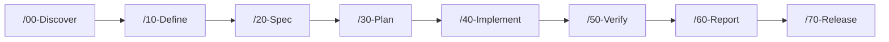
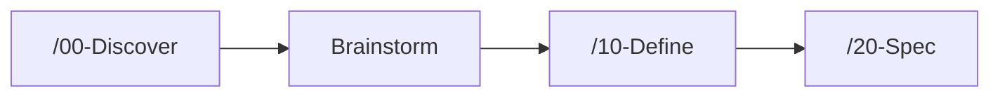
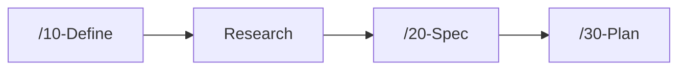
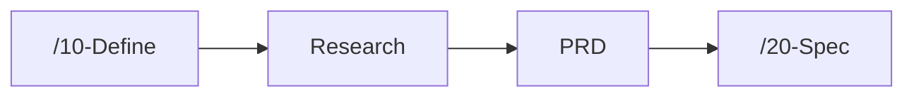
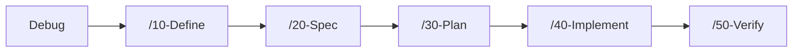

# Nexus-DevFlow Usage Guide

This guide describes the active DevFlow 2.0 surface used in the current repository.

## New To DevFlow?

- Start with `docs/quickstart.md` if you need the fastest valid setup path
- Start with `/00-Discover` if the work is new
- Start with `Help` if you do not know which command fits
- Read `docs/example-runs.md` if you want concrete flow examples before starting

## Core Rules

- Use the numbered mainline as the primary delivery path.
- Use public companion commands only when the task needs routing, ideation, research, debugging, PRD framing, issue intake, security checking, wiki access, or help.
- Treat stage markdown files as the source of truth.
- Use `checklists/` under the running ID when people need live execution visibility across stages.
- Treat skills and agents as support layers, not as replacements for the mainline.
- Do not start new work from retired workflows or legacy dashboard/JSON-driven patterns.

## Timeline Workflow

```text
/00-Discover -> /10-Define -> /20-Spec -> /30-Plan -> /40-Implement -> /50-Verify -> /60-Report -> /70-Release
```

Short meaning:

- `/00-Discover`: capture the request, context, and running ID
- `/10-Define`: lock scope, decisions, constraints, and success criteria
- `/20-Spec`: write the delivery contract and acceptance criteria
- `/30-Plan`: create the execution plan
- `/40-Implement`: do the implementation work
- `/50-Verify`: validate behavior, quality, and evidence, with optional `50-verify-impact.md` when impact and rollback analysis are needed
- `/60-Report`: produce the final summary before release packaging
- `/70-Release`: prepare release-facing outputs after the report is approved

## Why `00`, `10`, `20`, and `30` are separate

If your team used to go straight from "spec" to "plan", this is the easiest way to think about the split:

- `/00-Discover`: understand the request, context, unknowns, and likely route
- `/10-Define`: agree on the real problem, scope, constraints, and success criteria
- `/20-Spec`: define what the finished work must do
- `/30-Plan`: decide how the team will build and verify it

They are separate because they answer different questions:

- `00`: "What are we dealing with?"
- `10`: "What are we agreeing to do?"
- `20`: "What outcome is required?"
- `30`: "How will we execute it?"

Without that split, teams often mix problem framing, acceptance criteria, and implementation tasks into one document, which makes review harder and causes plans to inherit untested assumptions.

Practical shortcut:

- Keep `/00-Discover` and `/10-Define` short when the ticket is already clear
- Start at `/20-Spec` when the problem and scope are already stable
- Avoid skipping directly to `/30-Plan` unless the spec already exists and the expected behavior is genuinely settled

## Public Companion Commands

These are the public non-mainline commands:

| Command | Use when |
| :--- | :--- |
| `Goal` | the request is still broad and needs routing |
| `Brainstorm` | the direction is still fuzzy |
| `Research` | more evidence or source knowledge is needed |
| `Debug` | root-cause analysis is needed |
| `PRD` | product framing is needed before spec work |
| `Issue-Triage` | the work starts from issue intake |
| `Wiki` | knowledge needs to be queried or captured |
| `Check-For-Updates` | Nexus-DevFlow setup or upgrade needs to be installed, checked, or repaired |
| `Help` | the next route is unclear |

See [workflow-surface-map.md](D:/Projects/nexus-devflow/docs/workflow-surface-map.md) for the current distinction between public commands, internal companions, and archive/history surfaces.

## Internal Companion Surfaces

Some wrapper-style companion files still exist internally, but they are not the recommended starting surface for users.

If you are unsure, start from `Help`, a public companion command, or the mainline instead.

Examples of internal companions include:

- `Preview`
- `Simplify`
- `Spec-Research`
- `Competitor`
- `Roadmap`
- `Spec-Orchestrate`
- `Test`
- `QA-Orchestrate`
- `Followup`
- `Human-*`
- `Commit`
- `PR`
- `PR-Review`
- `PR-Followup`
- `Merge`
- `Deploy`
- `Changelog`
- `Insight`
- `Agent`

## Where To Start

| Situation | Start with |
| :--- | :--- |
| the request is still unclear | `/00-Discover` or `Brainstorm` |
| scope must be locked | `/10-Define` |
| a delivery contract must be written | `/20-Spec` |
| spec is ready and work must be broken down | `/30-Plan` |
| implementation can begin | `/40-Implement` |
| completed work must be checked | `/50-Verify` |
| final summary before release is needed | `/60-Report` |
| release-facing packaging is needed | `/70-Release` |
| the work starts from an issue | `Issue-Triage` |
| a bug must be understood first | `Debug` |
| the route is still unclear | `Help` |

## Recommended Flows

### 1. Standard new work



```text
/00-Discover "Add password reset"
/10-Define
/20-Spec
/30-Plan
/40-Implement
/50-Verify
/60-Report
/70-Release
```

### 2. Idea still needs shaping



```text
/00-Discover "Improve onboarding"
Brainstorm
/10-Define
/20-Spec
```

### 3. Needs extra integration knowledge



```text
/10-Define "Subscription billing"
Research "Stripe subscription webhook and customer portal"
/20-Spec
/30-Plan
```

### 4. Needs product and market framing



```text
/10-Define "AI workflow product direction"
Research "AI coding workflow tools and market context"
PRD "Top priority initiative"
/20-Spec
```

### 5. Starts from a bug



```text
Debug "Login redirects forever after session expiry"
/10-Define "Fix login redirect loop"
/20-Spec
/30-Plan
/40-Implement
/50-Verify
```

## Maintainer Preset Guidance

Maintainers who need to recommend a lighter or heavier adoption shape should use [docs/team-presets.md](D:/Projects/nexus-devflow/docs/team-presets.md) as recommendation guidance only.

Presets sit on top of the same mainline and public companion commands described in this guide. They do not replace the workflow, create new command families, or introduce alternate DevFlow systems.

## Maintainer Governance Guidance

Maintainers who are deciding where a future framework change belongs should use [docs/governance-rules.md](D:/Projects/nexus-devflow/docs/governance-rules.md).

The governance guide keeps workflow, skill, script, validation, and high-surface doc placement aligned without changing the public onboarding story or command model.

## Workspace Layout

See the full contract in [workspace-artifacts.md](D:/Projects/nexus-devflow/docs/workspace-artifacts.md).

Common paths:

| Path | Purpose |
| :--- | :--- |
| `.workspaces/specs/` | stage artifacts grouped by running ID |
| `.workspaces/specs/{ID}-{slug}/checklists/` | live operational tracking for plan, implementation, verification, and release gates |
| `.workspaces/research/` | research and brainstorm outputs when used |
| `.workspaces/prds/` | PRD artifacts when used |
| `.workspaces/roadmap/` | roadmap discovery notes |
| `.workspaces/issues/` | issue-triage outputs when used |
| `.workspaces/debug/` | debug and RCA notes when used |
| `.workspaces/reports/` | cross-cutting reports when used |
| `.workspaces/wiki/` | knowledge artifacts when used |

## Validation

Use these commands:

```powershell
npm.cmd run roadmap:validate
npm.cmd run validate
npm.cmd run validate:all
```

Meaning:

- `roadmap:validate`: validate roadmap markdown contracts
- `validate`: validate the core framework surface
- `validate:all`: run the broader validation and hygiene set

Artifact language default:

```powershell
npm.cmd run artifact-language:switch -- en
npm.cmd run artifact-language:switch -- th
```

In phase 1, this updates `artifact_language` across markdown schema templates so new markdown artifacts should be written in the selected language.

## Goal Runner

Use `Goal` when the work still needs routing before entering the mainline.

Example:

```text
Goal "Add password reset with regression tests"
```

CLI:

```powershell
npm.cmd run goal -- goal "Add password reset with regression tests" max-turns 20 dry-run
```

Notes:

- goal session logs are internal runtime detail, not the main workflow surface
- do not use goal logs as a replacement for stage markdown artifacts

## Checklist Layer

When a team wants detailed follow-through, create checklist artifacts inside the run:

```text
.workspaces/specs/{ID}-{slug}/checklists/
  master-checklist.md
  implementation-checklist.md
  verification-checklist.md
```

Preferred checklist UI format:

```markdown
- [ ] Draft verification steps
- [x] Ship implemented task
- [/] Run active smoke test
- [!] Waiting on external dependency
- [-] Skip optional release task
```

Status markers:

- `[ ]` = `pending`
- `[x]` = `done`
- `[/]` or `[~]` = `in_progress`
- `[!]` = `blocked`
- `[-]` = `skipped`

Use this layer to:

- expose current status to humans at a glance
- track units of work across `/30-Plan`, `/40-Implement`, and `/50-Verify`
- attach evidence directly to checklist items
- record blockers without hiding them inside long notes
- feed final completion and blocker summaries into `/60-Report`

Treat checklist files as the live operational view. Treat stage files as the formal handoff and decision record.

Markdown tables with a `Status` column are still accepted for older runs, but checklist lines are now the preferred UI.

## Skill And Agent Boundary

Simple rule:

- if it is work state, use a workflow
- if it is a reusable method, use a skill
- if it is a specialist owner role, use an agent

Examples:

- `code-reviewer`, `requirements-engineer`, `backend-specialist` are agents
- `spec-research`, `preview-local-check`, `roadmap-strategy`, `pr-review-analysis` are skills
- internal companions may wrap those skills or agents, but should not be the default public route

## Legacy Note

DevFlow 2.0 no longer uses retired numbered workflows, dashboard-first flow, or task JSON contracts as the active operating surface.

If older documents mention those concepts, treat them as historical reference only.

## Quick Reference

| Need | Use |
| :--- | :--- |
| find the right route | `Help` |
| explore options before locking direction | `Brainstorm` |
| gather evidence or source knowledge | `Research` |
| find root cause | `Debug` |
| do product framing | `PRD` |
| run high-severity security check | `Security-Review` |
| write the delivery contract | `/20-Spec` |
| break work into execution steps | `/30-Plan` |
| implement the changes | `/40-Implement` |
| verify the work | `/50-Verify` |
| produce the final wrap-up before release | `/60-Report` |
| package release-facing work | `/70-Release` |
