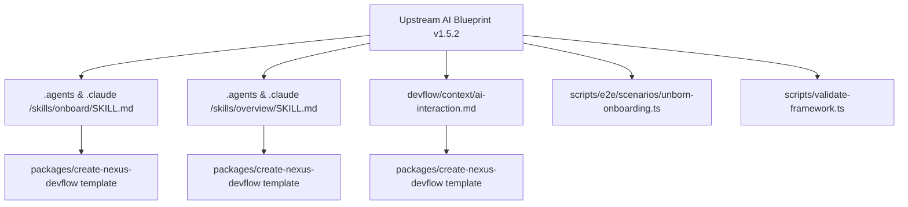

# Codebase Impact & Blast Radius Analysis

> **Requirement ID**: `REQ-20260903-001-sync-upstream-ai-blueprint`  
> **Date**: 2026-09-03  
> **Complexity Score**: `Low-to-Medium (Controlled Enhancement)`  
> **Risk Level**: `Low (No Breaking Changes, Backward-Compatible)`  

---

## 1. Blast Radius Map (ขอบเขตผลกระทบ)

---

## 2. Affected Files & Modules (รายการไฟล์ที่ได้รับผลกระทบ)

| File Path | Action | Description |
| :--- | :--- | :--- |
| `.agents/skills/onboard/SKILL.md` | `MODIFY` | เพิ่ม Step 0 ตรวจจับ Unborn repository และเสนอกระบวนการ Root scaffold commit |
| `.claude/skills/onboard/SKILL.md` | `MODIFY` | ปรับปรุงพฤติกรรมให้ตรงกับ `.agents/` |
| `.agents/skills/overview/SKILL.md` | `MODIFY` | เพิ่มความสามารถ Setup branch baseline finalization (`git merge --ff-only`) |
| `.claude/skills/overview/SKILL.md` | `MODIFY` | ปรับปรุงพฤติกรรมให้ตรงกับ `.agents/` |
| `devflow/context/ai-interaction.md` | `MODIFY` | อัปเดตระเบียบการ baseline commit บน setup branch |
| `scripts/e2e/scenarios/unborn-onboarding.ts` | `NEW` | เพิ่มชุดทดสอบ E2E scenario ตัวที่ 9 สำหรับ unborn repo & fast-forward baseline |
| `scripts/validate-framework.ts` | `MODIFY` | เพิ่ม verification contracts สำหรับ onboard unborn check และ overview finalization prompt |
| `packages/create-nexus-devflow/template/` | `SYNC` | ซิงก์ template ผ่าน `npm run check` |

---

## 3. Risk & Breaking Change Assessment

- **Contract Breaking Risk**: `None` — ไม่มีการเปลี่ยนแปลงโครงสร้างคำสั่งหรือโฟลเดอร์หลัก ทุกการเปลี่ยนแปลงเป็นส่วนขยายเพื่อรองรับ Edge Case ที่ยังไม่มี commit
- **Git Safety Risk**: `Zero Remote Exposure` — มีการล็อกกฎความปลอดภัยไม่ให้มีการ push ไปยัง remote ในระหว่าง Onboard และ Overview อย่างเข้มงวด
- **Test Coverage Impact**: เพิ่ม Coverage โดยมี scenario ใหม่ `unborn-onboarding.ts` ในชุด E2E Agent Runner
