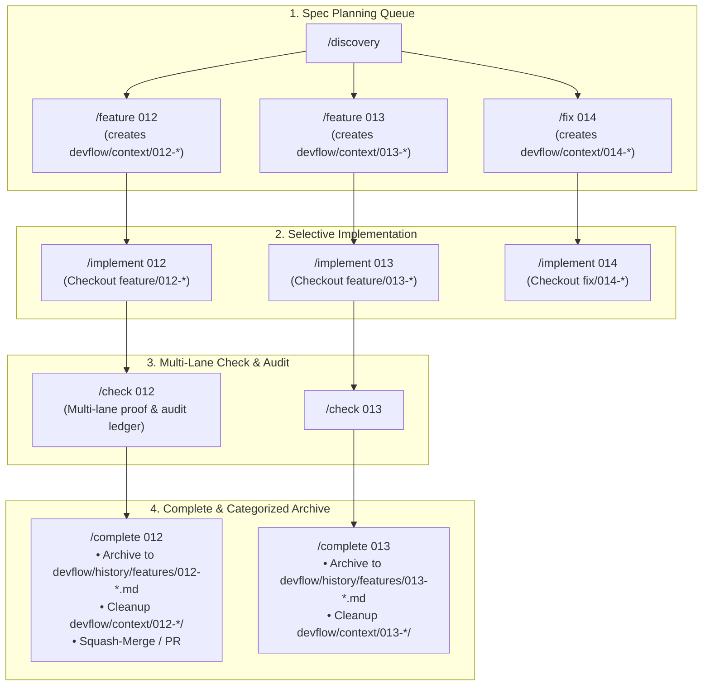

# Discovery Document: [DISC-20260826-001] Multi-Run Context Architecture & Spec Queue Engine

> **Discovery ID**: `DISC-20260826-001`  
> **Topic**: Architecture Evolution for Multi-Run / Multi-Context Living Specs in Nexus-DevFlow  
> **Date**: 2026-08-26  
> **Status**: `Proceed (Ready for Definition / Architecture RFC)`  
> **Target Scope**: Framework Core, Context Slicing, Spec Queue, and CLI/Skill Adapters  

---

## 1. Problem Statement & Motivation

ในปัจจุบัน Nexus-DevFlow ใช้แนวคิด **Single Active Run Guardrail** (One Thing at a Time) ซึ่งบังคับให้มีงานที่กำลังทำอยู่ได้เพียง 1 รายการใน `devflow/context/current-feature.md` และ `devflow/context/current-stage.md`:

### ข้อจำกัดของโครงสร้างปัจจุบัน:
1. **ไม่สามารถ Spec งานล่วงหน้าได้ (No Spec-Ahead / Batch Planning)**: ผู้ใช้หรือทีมงานที่ต้องการสำรวจ (`/discovery`) และร่าง Acceptance Criteria + Task Breakdown ของฟีเจอร์หลายๆ ตัวเตรียมไว้ล่วงหน้า (เช่น Feature 12, 13, 14) ไม่สามารถทำได้ เพราะการเปิด `/feature` ใหม่จะไปทับ `current-feature.md` ของงานเดิมทันที
2. **ไม่รองรับ Multi-Agent / Parallel Development**: เมื่อมี AI Agent หลายตัว (เช่น Swarm Orchestrator, Background Workers) หรือนักพัฒนาหลายคนทำงานในคนละ Branch จะเกิด **Context Collision** เพราะแย่งกันอ่าน/เขียนไฟล์เดียวกันใน `devflow/context/`
3. **การสลับงานทำได้ยาก (High Context Switching Friction)**: หากกำลัง Implement งานหนึ่งอยู่แล้วมี Urgent Fix หรือต้องการสลับไปทำอีกฟีเจอร์ ต้องเสร็จสิ้นงานเดิม (`/complete`) หรือล้างไฟล์ทิ้งเท่านั้น

---

## 2. การวิเคราะห์ไฟล์ใน `devflow/context/` (Separation of Concerns)

เมื่อพิจารณาไฟล์ทั้งหมดใน `devflow/context/` สามารถแบ่งออกเป็น 2 กลุ่มอย่างชัดเจน:

```text
┌────────────────────────────────────────────────────────────────────────┐
│                        devflow/ Context Layer                          │
├───────────────────────────────────┬────────────────────────────────────┤
│ 🌐 Global Shared Context          │ ⚡ Task-Specific Context (Per Run) │
│ (Living Source of Truth ทั่วระบบ) │ (ข้อมูลเฉพาะงานที่ทำในแต่ละรอบ)    │
├───────────────────────────────────┼────────────────────────────────────┤
│ • project-overview.md             │ • current-feature.md (Living Spec) │
│ • coding-standards.md             │ • current-stage.md (Stage Pointer) │
│ • ai-interaction.md               │ • findings.md (Audit Ledger)       │
│ • glossary.md                     │ • verification evidence / proofs   │
└───────────────────────────────────┴────────────────────────────────────┘
```

### รายละเอียดการแยกไฟล์:
1. **🌐 Shared Global Context (`devflow/context/`)**:
   - `project-overview.md`: แกนหลักสถาปัตยกรรม, Tech Stack, Data Models, System Invariants (คงที่และแชร์ทุก Run)
   - `coding-standards.md`: กฎเกณฑ์การเขียนโค้ด, TDD Rules, Clean Architecture (แชร์ทุก Run)
   - `ai-interaction.md`: พฤติกรรม Agent, กฎการสื่อสารภาษาไทย, Workflow Loop (แชร์ทุก Run)
   - `glossary.md`: Domain Terms & Ubiquitous Language กลางของระบบ
2. **⚡ Task-Specific Context (จัดเก็บเป็น Subdirectory ภายใน `devflow/context/`)**:
   - `spec.md` (แทน `current-feature.md`): เป้าหมาย, ปัญหา, In/Out Scope, Acceptance Criteria, TDD Checklist, Diff Evidence
   - `stage.md` (แทน `current-stage.md`): รหัสงาน (`xxx-slug`), Track (`fast`/`deep`), สถานะปัจจุบัน, Branch, Next Action
   - `findings.md`: ข้อบกพร่องจากการตรวจ `/audit` เฉพาะ Diff ของงานนั้นๆ

---

## 3. โครงสร้างโฟลเดอร์ที่นำเสนอ (Target Architecture)

เพื่อรักษาความสะอาดตาม **The 3-Pillars Model** จัดเก็บโฟลเดอร์ของแต่ละรันไว้ใต้ `devflow/context/{xxx-slug}/`:

```text
devflow/
├── 🔮 ideas.md                     # [Pillar 1: Future / Backlog]
├── 🗺️ project-plan.md
├── 📋 build-plan.md
│
├── ⚡ context/                      # [Pillar 2: Present - Global Shared & Active Runs]
│   ├── project-overview.md         # 🌐 Source of truth สถาปัตยกรรมกลาง
│   ├── coding-standards.md         # 🌐 มาตรฐานวิศวกรรมและ TDD
│   ├── ai-interaction.md           # 🌐 กฎการทำงานและการสื่อสารของ AI
│   ├── glossary.md                 # 🌐 พจนานุกรมศัพท์เทคนิคและโดเมน
│   │
│   ├── 012-devflow-ide-extension-core-and-navigator/
│   │   ├── spec.md                 # ⚡ Living Spec + Checklist
│   │   ├── stage.md                # ⚡ Runtime Stage, Track, Branch Pointer
│   │   └── findings.md             # ⚡ Findings Ledger เฉพาะงานนี้
│   │
│   ├── 013-devflow-ide-extension-kanban-board/
│   │   ├── spec.md
│   │   ├── stage.md
│   │   └── findings.md
│   │
│   └── 014-fix-header-navigation-leak/
│       ├── spec.md
│       ├── stage.md
│       └── findings.md
│
├── 📦 history/                     # [Pillar 3: Past - Categorized Archives]
│   ├── features/                   # 012-devflow-ide-extension-core-and-navigator.md (ย้ายมาเมื่อ /complete)
│   ├── fixes/
│   ├── rollbacks/
│   └── HISTORY.md
│
├── 🔍 discoveries/                  # Pre-flight Explorations
└── 🏛️ decisions/                    # Architecture Decision Records (ADRs)
```

> [!NOTE]
> **โฟลเดอร์ `devflow/context/{xxx-slug}/`** ทำหน้าที่เป็น **Active Workspace & Spec Queue**:
> เมื่อรัน `/feature` หรือ `/fix` สเปกจะถูกสร้างเป็นโฟลเดอร์ย่อยในนี้ และคงอยู่จนกระทั่งทำงานผ่าน `/implement` ➔ `/check` ➔ `/complete` จากนั้นไฟล์จะถูก Archive ไปที่ `devflow/history/{features|fixes|rollbacks}/{xxx-slug}.md` พร้อมกับลบโฟลเดอร์ย่อยใน `devflow/context/` ออกอย่างหมดจด

---

## 4. ผลกระทบ (Impact Analysis)

| มิติที่ได้รับผลกระทบ | ผลกระทบและสิ่งที่จะเปลี่ยนแปลง |
| :--- | :--- |
| **Skill Adapters (`.agents/skills/`)** | ปรับทราฟฟิกของคำสั่ง `feature`, `fix`, `implement`, `check`, `complete`, `status`, `audit` ให้อ่าน/เขียนผ่าน Context Resolver ที่ค้นหา `devflow/context/{xxx-slug}` ได้ |
| **Git Branching Management** | ต้องผูกโยง `devflow/context/{xxx-slug}` เข้ากับ Git Branch `feature/{xxx-slug}` หรือ `fix/{xxx-slug}` เมื่อสลับงาน `/implement <id>` ต้องมีการตรวจสอบสถานะ Git Workspace (Clean / Stash / Switch Branch) |
| **CLI & Engine Core (`packages/create-nexus-devflow`)** | อัปเกรด `branch-context.ts`, `current-work.ts`, `status.ts`, และ `dashboard.ts` ให้ตรวจจับรายการ Subdirectories ทั้งหมดใน `devflow/context/` และ Render เป็น Kanban / Spec List |
| **Build Plan Notation** | ใน `build-plan.md` สามารถบอกสถานะที่ชัดเจนได้ เช่น `[ ] 12. Core (📝 Spec Ready)`, `[~] 13. Kanban (⚡ Implementing)` |

---

## 5. การวิเคราะห์ข้อดี ข้อเสีย และความเสี่ยง (Trade-offs Analysis)

### 🟢 ข้อดี (Advantages)
1. **Batch Spec Drafting (วางแผนล่วงหน้าได้)**: Product Owner / Architect สามารถสำรวจและเขียน Spec หลายตัวทิ้งไว้ให้ทีมหรือ Agent ทยอยทำได้
2. **Selective Execution (`/implement 12`)**: สามารถเลือกลำดับการทำได้อิสระ ไม่จำเป็นต้องทำเรียงลำดับเสมอไป
3. **Multi-Agent / Swarm Parity**: รองรับ Multi-Agent ที่ทำงานคู่ขนานกันคนละ Branch ได้โดยไม่เกิด File Lock หรือ Spec Overwrite
4. **Zero Context Pollution**: แต่ละงานมี `findings.md` และ `stage.md` แยกขาดจากกัน Audit ไม่ปนกัน

### 🔴 ข้อเสียและความเสี่ยง (Risks & Challenges)
1. **Spec Staleness & Architectural Drift**:
   - *ความเสี่ยง*: หาก Spec งาน 013 ถูกเขียนทิ้งไว้ตั้งแต่สัปดาห์ก่อน แต่ต่อมางาน 012 มีการแก้โครงสร้างฐานข้อมูลหรือเปลี่ยน API contracts สเปกของ 013 อาจล้าสมัย
   - *แนวทางแก้ไข*: เพิ่ม **Pre-flight Spec Revalidation Gate** เมื่อสั่ง `/implement 013` ระบบจะกวาดตรวจหา Drift และแจ้งเตือนให้ Re-align สเปกก่อนเริ่มโค้ด
2. **Git Merge Conflicts**:
   - *ความเสี่ยง*: งาน 012 และ 013 แก้ไขไฟล์ร่วมกัน (เช่น `package.json` หรือ Router)
   - *แนวทางแก้ไข*: ใช้ระเบียบกิ่งก้าน (Branch Lifecycle): เมื่อ `/complete 012` เมิร์จเข้า main แล้ว ตอนเริ่ม `/implement 013` ให้ AI ทำการ Rebase/Pull main เข้ามาทันที
3. **AI Cognitive Load**:
   - *ความเสี่ยง*: หากส่งทุกโฟลเดอร์ให้ AI อ่านพร้อมกัน จะทำให้ Token บวมและสับสน
   - *แนวทางแก้ไข*: **Strict Context Slicing**: เมื่อสั่ง `/implement 012` ให้ Agent โหลดเฉพาะ `devflow/context/*` (Global) + `devflow/context/012-*/*` เท่านั้น

---

## 6. วงจรการทำงานแบบ Multi-Run Loop (The Multi-Run Lifecycle)



---

## 7. กฎการทำงานของคำสั่ง (Command Invocations & ID Resolution)

### 1. `/feature [id / title]` และ `/fix [title]`
- ตรวจสอบ Running ID ถัดไป (เช่น `012` หรือ `058`) และสร้างโฟลเดอร์ `devflow/context/{xxx-slug}/`
- เขียน `spec.md`, `stage.md` (สถานะ `ready_for_implementation`), และ `findings.md`
- บันทึกสถานะลงใน `build-plan.md`
- **ไม่บล็อก (Non-blocking)**: ผู้ใช้สามารถสั่ง `/feature 13` ต่อได้ทันทีโดยไม่ต้องรอให้ 12 เสร็จ

### 2. `/implement [id]`
- **กรณีระบุ ID** (เช่น `/implement 12` หรือ `/implement 012`):
  - ระบบค้นหาโฟลเดอร์ที่ขึ้นต้นด้วย `012-` ใน `devflow/context/`
  - ตรวจสอบ Git Status สลับไปยัง Branch `feature/012-*`
  - โหลด `spec.md` และเริ่มขั้นตอน Red-Green-Refactor ทีละ Step
- **กรณีไม่ระบุ ID** (`/implement`):
  - **Auto-Detect**: ตรวจสอบว่า Branch ปัจจุบันตรงกับโฟลเดอร์ใดใน `devflow/context/` หรือไม่
  - หากอยู่ที่ `main` และมี Spec เดียวที่ `ready` ให้หยิบขึ้นมาทำทันที
  - หากมีหลาย Spec ให้แสดง Interactive Menu ให้ผู้ใช้เลือกงานที่ต้องการ

### 3. `/check [id]`
- ทำการทดสอบ Multi-Lane Verification (Typecheck, Lint, Test, Empirical Proof) เจาะจงเฉพาะงานที่ระบุ
- บันทึกผลและ Findings ลงใน `devflow/context/{xxx-slug}/findings.md`

### 4. `/complete [id]`
- ตรวจสอบ Zero Blocker findings
- ย้ายและสรุปประวัติไปที่ `devflow/history/features/{xxx-slug}.md` (หรือ `fixes/`)
- ลบโฟลเดอร์ `devflow/context/{xxx-slug}/` ทิ้งอย่างปลอดภัย
- อัปเดต `devflow/history/HISTORY.md` และ `build-plan.md` เป็น `[x]`
- เสนอทางเลือก Merge / PR ตามระเบียบ Gatekeeper

---

## 8. สรุปผลการตัดสินใจ (Discovery Recommendation)

- **Decision**: `Proceed` (ผ่านการสำรวจและพร้อมนำไปจัดทำ Living Spec & Architecture Implementation)
- **Next Step**: ร่าง Spec ของฟีเจอร์นี้ และเริ่มอัปเกรด Core Engine (`branch-context.ts`, `current-work.ts`, Skill templates)
