# Discovery Document: [DISC-20260826-002] Purge Deep-Track & Legacy Numbered Stages (00-70)

> **Discovery ID**: `DISC-20260826-002`  
> **Date**: 2026-08-26  
> **Status**: `Proceed`  
> **Target Delivery Mode**: `/feature DISC-20260826-002` (หรือ `/fix DISC-20260826-002`)  
> **Author**: Nexus-DevFlow Core Team & AI Pair Programmer  

---

## 1. Executive Summary & Problem Statement (บทนำและปัญหา)

ในกระบวนการพัฒนา Nexus-DevFlow ก่อนหน้านี้ ได้มีการพัฒนาโมเดล **Dual-Track** ซึ่งประกอบด้วย:
1. **Fast-Track (4 ขั้นตอน)**: `/feature` / `/fix` ➔ `/implement` ➔ `/check` ➔ `/complete` (Single Living Spec)
2. **Deep-Track (8 สเตจตัวเลข)**: `00-explore` ➔ `10-define` ➔ `20-spec` ➔ `30-plan` ➔ `40-execute` ➔ `50-verify` ➔ `60-report` ➔ `70-deliver`

ตั้งแต่เวอร์ชัน **Nexus-DevFlow 2.5.0 / 2.6.x** โครงสร้างสถาปัตยกรรมได้รับการยกระดับและหลอมรวม (Unify) เข้าสู่ **"The 3-Pillars & Single Living Spec Model"** โดยยกเลิกการแยก 8 สเตจย่อยของ Deep-Track ออกทั้งหมด แล้วนำจุดแข็งด้าน Deep Architectural Rigour มารวมเป็น Unified 4-Stage Lifecycle ควบคู่กับ Pre-Flight Discovery (`/discovery`, `/idea`, `/grill`, `/brainstorm`)

**ปัญหาที่ตรวจพบ (Current Pain Points):**
- ยังคงมี **โค้ดเก่า, สคริปต์สแกนสถานะ, สคริปต์ทดสอบ (Unit Tests), Helper Scripts, คู่มือ Skills, และ Mockup HTML** ที่ยังมีข้อความหรือโค้ด Hardcode ของสเตจตัวเลขเดิมหลงเหลืออยู่ เช่น:
  - `40-execute`, `50-verify`, `60-report`, `70-deliver`, `10-define`, `20-spec`, `30-plan`, `00-explore`
  - Fallback logic ใน `packages/create-nexus-devflow/lib/status.ts` และ `current-work.ts` ที่ยังพยายาม fallback ไปหา `/40-execute` หรือ `20-spec.md`
  - สคริปต์ `scripts/summarize-run-status.mjs`, `scripts/migrate-stage-artifacts.mjs`, `scripts/standardize-command-invocations.mjs`, `scripts/update-skill-descriptions.mjs`
  - คำสั่งและข้อความตกค้างใน `.agents/skills/` และ `.claude/skills/` (เช่น `test/SKILL.md`, `report-html/SKILL.md`, `idea/SKILL.md`, `grill/SKILL.md`)
  - หน้า `devflow/reference/mockup.html` และเอกสาร `devflow/context/`

---

## 2. Empirical Research & Legacy Inventory (ผลสำรวจรายการที่ต้องกำจัดใน Codebase)

จากการใช้เครื่องมือสแกน (`grep_search` / `rg`) แบบละเอียด พบจุดตกค้างทั้งหมด 4 กลุ่มหลัก:

```mermaid
graph TD
    A[Legacy Deep-Track & 00-70 Stages] --> B[1. Package Engine create-nexus-devflow]
    A --> C[2. Agent Skills .agents / .claude]
    A --> D[3. Automation Scripts & Tests scripts/]
    A --> E[4. Context, Reference & Templates]

    B --> B1[lib/status.ts: fallback /40-execute, /50-verify]
    B --> B2[lib/current-work.ts: readDeepTrackWork & 20-spec.md]
    B --> B3[lib/history.ts: preferred 60-report.md, 10-define.md]
    B --> B4[test/status.test.ts: Deep-Track nextAction tests]

    C --> C1[test/SKILL.md: 40-execute, 50-verify, 30-plan]
    C --> C2[report-html/SKILL.md: 60-report.md]
    C --> C3[idea/SKILL.md: /00-explore, /spec]
    C --> C4[grill/SKILL.md & brainstorm/SKILL.md: 10-define]

    D --> D1[scripts/summarize-run-status.mjs]
    D --> D2[scripts/standardize-command-invocations.mjs]
    D --> D3[scripts/update-skill-descriptions.mjs]
    D --> D4[scripts/render-html.mjs & test-*.mjs]

    E --> E1[devflow/reference/mockup.html]
    E --> E2[devflow/context/coding-standards.md]
    E --> E3[devflow/context/ai-interaction.md]
    E --> E4[devflow/history/*/README.md]
```



### ตารางแจกแจงรายละเอียดไฟล์ที่ต้องปรับปรุง (Detailed Inventory)

| กลุ่มงาน | ไฟล์ที่พบ | ปัญหาที่ตรวจพบ | แนวทางแก้ไข |
| :--- | :--- | :--- | :--- |
| **Package Engine** | `packages/create-nexus-devflow/lib/status.ts` | บรรทัด 467-479 มี `currentWork.type === "stage"` ส่งคำสั่ง `/40-execute`, `/50-verify` | ลบ fallback ของ stage เก่าออก ให้ส่ง `/implement` และ `/check` เสมอ |
| **Package Engine** | `packages/create-nexus-devflow/lib/current-work.ts` | มีฟังก์ชัน `readDeepTrackWork` คอยเช็ค `20-spec.md`, `current-run` | ตัดโค้ด legacy stage parsing ปรับให้รองรับเฉพาะ Single Living Spec และ Multi-Run Spec |
| **Package Engine** | `packages/create-nexus-devflow/lib/history.ts` | ลำดับ preferred files ยังมี `60-report.md`, `20-spec.md`, `10-define.md` | ปรับเป็น `["current-feature.md", "spec.md", "discovery.md", "60-report.md"]` |
| **Package Engine** | `packages/create-nexus-devflow/test/status.test.ts` | มีเทสต์ที่ตรวจ Deep-Track stage calculation (`040-dashboard-parity`, `/70-deliver`) | ปรับเทสต์ให้สอดคล้องกับ Unified Living Spec (`/check`, `/complete`) |
| **Agent Skills** | `.agents/skills/test/SKILL.md` และ `.claude/skills/test/SKILL.md` | อ้างอิง `40-execute`, `50-verify`, `30-plan` | ปรับเป็น `implement`, `check`, `feature` |
| **Agent Skills** | `.agents/skills/report-html/SKILL.md` และ `.claude/skills/report-html/SKILL.md` | อ้างอิง `60-report.md` และ `Deep-Track` | ปรับคำอธิบายให้อิง `current-feature.md` และ History archives |
| **Agent Skills** | `.agents/skills/idea/SKILL.md` และ `.claude/skills/idea/SKILL.md` | มีตัวอย่างคำสั่ง `/spec IDEA-xxx` หรือ `/00-explore IDEA-xxx` | ปรับเป็น `/feature IDEA-xxx` หรือ `/discovery IDEA-xxx` |
| **Agent Skills** | `.agents/skills/grill/SKILL.md` & `brainstorm/SKILL.md` | มีการกล่าวถึง `10-define` | ปรับเป็น `/discovery` หรือ `/feature` |
| **Scripts** | `scripts/summarize-run-status.mjs` | อาเรย์สเตจและไอคอน `00-explore` ถึง `70-deliver`, `Ready For /60-Report` | อัปเดตให้รองรับ Lifecycle ปัจจุบัน |
| **Scripts** | `scripts/standardize-command-invocations.mjs` | ตัวแปร regex แทนที่คำสั่ง 10-70 | ปรับให้สอดคล้องกับ Canonical commands ปัจจุบัน |
| **Scripts** | `scripts/update-skill-descriptions.mjs` | สารบัญคำอธิบาย 10-define ถึง 70-deliver | ลบรายการสเตจตัวเลขที่ปลดระวางแล้วออก |
| **Scripts** | `scripts/render-html.mjs` & `lib/render-html/` | บังคับ `--stage 60-report` และหา `60-report.md` | ปรับให้รองรับ standalone rendering โดยไม่ยึดติดชื่อ stage 60 |
| **Reference** | `devflow/reference/mockup.html` | แถบ Tab และ Pipeline ยังแสดง 8 สเตจของ Deep-Track | ปรับให้เป็น Unified Living Spec Model เหมือน `dashboard-page.ts` |
| **Context** | `devflow/context/coding-standards.md` | บรรทัด 91, 107 ยังมี `00-explore.md` และ `00-explore` | ปรับเป็น `discovery.md` และ `discovery` |
| **Context** | `devflow/context/ai-interaction.md` | บรรทัด 142 อ้างอิง `00-explore` | ปรับเป็น `/discovery` |
| **History** | `devflow/history/{features,fixes,rollbacks}/README.md` | มีข้อความ `or xxx-name/ (for Deep-Track stage runs)` | ลบข้อความ Deep-Track ออก |

---

## 3. Options Matrix & Trade-offs (การวิเคราะห์ทางเลือกในการจัดการ)

| ทางเลือก (Options) | ข้อดี (Pros) | ข้อเสีย (Cons) | ข้อสรุป / คำแนะนำ |
| :--- | :--- | :--- | :--- |
| **Option 1: Complete Purge & Modernization (แนะนำ)** | • ขจัดโค้ดตกค้าง 100%<br>• ลดความสับสนของ AI และผู้ใช้งาน<br>• โครงสร้าง codebase สะอาด ตรงตามสเปก 2.6.x<br>• ลดขนาด bundle | • ต้องอัปเดตไฟล์ fixture/unit test ใน `packages/` และ `scripts/` | **Recommended**: ทำการลบและปรับปรุงทั้งหมดให้เป็นปัจจุบันสมบูรณ์ |
| **Option 2: Soft Deprecation (คง alias ไว้บางส่วน)** | • ปลอดภัยหากมี repo เก่าที่ยังใช้ไฟล์ `20-spec.md` | • โค้ดยังคงมีขยะและเงื่อนไขซับซ้อน<br>• AI ยังคงหลอนสเตจเก่าได้ง่าย | **Reject**: สถาปัตยกรรม 2.6.x ได้ Unify มาหลายเวอร์ชันแล้ว ควรทำความสะอาดขาดตัว |
| **Option 3: Selective Cleaning (แก้เฉพาะ skills)** | • ทำได้รวดเร็ว | • ใน engine (`create-nexus-devflow`) และ scripts ยังมี logic เก่าค้างอยู่ | **Reject**: แก้ไขไม่ครบวงจร ปัญหาจะกลับมาอีกเมื่อรัน CLI |

---

## 4. Scoping & Guardrails (ขอบเขตการทำงาน)

### In-Scope (สิ่งที่ต้องดำเนินการ):
1. ทำความสะอาด source code ใน `packages/create-nexus-devflow/lib/` (`status.ts`, `current-work.ts`, `history.ts`).
2. ปรับปรุง unit tests ใน `packages/create-nexus-devflow/test/` ให้ทดสอบเฉพาะ Living Spec & Multi-Run Context.
3. อัปเดตไฟล์ `.agents/skills/` และ `.claude/skills/` ให้ไม่มีการกล่าวถึงสเตจ 00-70 หรือชื่อ stage เก่า.
4. ปรับปรุงสคริปต์ใน `scripts/` (`summarize-run-status.mjs`, `standardize-command-invocations.mjs`, `update-skill-descriptions.mjs`, `render-html.mjs`).
5. อัปเดต `devflow/context/coding-standards.md`, `devflow/context/ai-interaction.md`, `devflow/reference/mockup.html`, และ `devflow/history/*/README.md`.
6. ตรวจสอบให้ `agent-bundle.manifest.json` และการทดสอบ `npm run check:static` ผ่าน 100%.

### Out-of-Scope (สิ่งที่ไม่ต้องแตะต้อง):
1. เอกสารประวัติศาสตร์ใน `CHANGELOG.md` และ `devflow/history/features/*.md` เดิม (เก็บไว้เป็นหลักฐานบันทึกการส่งมอบในอดีตตามหลัก Categorized History Archive).
2. ไอเดียเดิมใน `devflow/ideas.md` ที่เป็น Archived items (เพียงแค่อัปเดต Pending ideas เท่านั้น).

---

## 5. Architectural Alignment & Clean Terminology (คำศัพท์และมาตรฐาน)

| ศัพท์เดิม (Legacy Term) | ศัพท์ปัจจุบัน (Modern DevFlow 2.6.x) | ความหมาย |
| :--- | :--- | :--- |
| `00-explore` | `/discovery` | การสำรวจโจทย์, แผนงาน หรือไอเดียก่อนเริ่มทำ spec |
| `10-define` + `20-spec` + `30-plan` | `/feature` หรือ `/fix` | รวมขั้นตอนการค้นหา, ตีกรอบ และวางแผน TDD ลงใน Single Living Spec |
| `40-execute` | `/implement` | ลงมือเขียนโค้ดตาม checklist แบบ Red-Green-Refactor |
| `50-verify` | `/check` | ตรวจสอบคุณภาพรอบด้าน (QA, Tests, Fowler smells, Proof) |
| `60-report` + `70-deliver` | `/complete` (MD) + `/report:html` (ทางเลือก) | สรุปผล, เก็บประวัติถาวร, squash-merge และออกรายงาน HTML เมื่อต้องการ |
| `current-run/` (Deep-Track) | `current-feature.md` หรือ `context/{xxx-slug}/` | แหล่งความจริงบริสุทธิ์ของงานที่กำลังทำ |

---

## 6. Implementation Action Plan (แผนการลงมือทำเมื่อเข้าสู่ /feature)

```text
Phase 1: Skills & Living Context Cleanup
  ├── อัปเดต .agents/skills/ (test, report-html, idea, grill, brainstorm)
  ├── อัปเดต .claude/skills/ ให้ตรงกัน
  ├── อัปเดต devflow/context/ (coding-standards.md, ai-interaction.md)
  └── อัปเดต devflow/history/*/README.md

Phase 2: Package Engine Modernization
  ├── ปรับ packages/create-nexus-devflow/lib/status.ts (ตัด fallback stage)
  ├── ปรับ packages/create-nexus-devflow/lib/current-work.ts (ตัด readDeepTrackWork)
  ├── ปรับ packages/create-nexus-devflow/lib/history.ts (ปรับ preferred files)
  └── อัปเดต packages/create-nexus-devflow/test/status.test.ts

Phase 3: Scripts & Verification Modernization
  ├── ปรับ scripts/summarize-run-status.mjs
  ├── ปรับ scripts/update-skill-descriptions.mjs
  ├── ปรับ scripts/standardize-command-invocations.mjs
  ├── ปรับ scripts/render-html.mjs และ tests ที่เกี่ยวข้อง
  └── ปรับ devflow/reference/mockup.html

Phase 4: Static Verification & QA Gate
  ├── รัน npm run check:static / validate-framework
  └── ยืนยันว่าไม่มีคำว่า 40-execute, 10-define, ฯลฯ ตกค้างใน runtime/skills
```

---

## 7. Decision & Approval Gate

- **Final Decision**: `Proceed`
- **Next Recommended Command**:
  ```text
  /feature DISC-20260826-002
  ```
  *(เพื่อสร้าง Living Spec ใน `devflow/context/current-feature.md` และเริ่มต้นวงรอบการพัฒนาตามมาตรฐาน DevFlow)*
