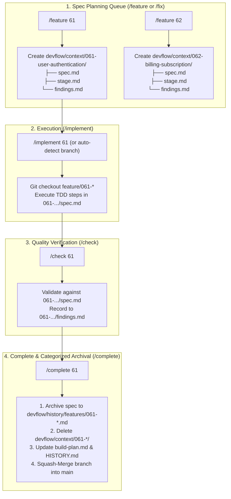

# Discovery Document: [DISC-20260826-004] Pure Multi-Run Task-Isolated Architecture (Abolish Root Single Living Spec)

> **Discovery ID**: `DISC-20260826-004`  
> **Topic**: Migration from Hybrid Single/Multi Spec to Pure Multi-Run Task-Isolated Architecture  
> **Date**: 2026-08-26  
> **Status**: `Proceed (Recommended for Immediate Delivery)`  
> **Target Scope**: Framework Core, Agent Instructions (`AGENTS.md`/`CLAUDE.md`), All Workflow Skills, Scaffolding Templates, and CLI  

---

## 1. Problem Statement & Motivation

ในปัจจุบัน สถาปัตยกรรมของ Nexus-DevFlow มีสถานะเป็น **Hybrid Model** ระหว่าง:
1. **Single Living Spec (Legacy/Root)**: มีไฟล์ `current-feature.md`, `current-stage.md`, `findings.md` วางอยู่ที่ `devflow/context/`
2. **Multi-Run Spec Queue**: มีโฟลเดอร์เฉพาะของแต่ละรันอยู่ที่ `devflow/context/{xxx-slug}/` (`spec.md`, `stage.md`, `findings.md`)

### ปัญหาที่เกิดขึ้นจริงในการใช้งาน (Pain Points):
- **AI Agent Default Bias**: เมื่อ AI Agent (Antigravity, Claude, Copilot, Codex, Gemini) ถูกเรียกด้วยคำสั่งพื้นฐาน (เช่น `/feature` หรือ `/implement`) AI จะอ่านเอกสาร `AGENTS.md` และ Skills แล้วพบคำว่า `current-feature.md` รวมถึงเห็นไฟล์ Stub อยู่ที่ Root ของ `devflow/context/` ส่งผลให้ AI **เขียนทับไฟล์ตรงกลางเสมอ** และละเลยโครงสร้างโฟลเดอร์ `devflow/context/{xxx-slug}/`
- **Global Bottleneck & Race Condition**: การมีไฟล์ตรงกลางทำให้ไม่สามารถทำ Spec ล่วงหน้าหลายๆ ตัว (Spec-Ahead) หรือทำงานแบบ Multi-task / Multi-Agent ได้อย่างแท้จริง เพราะไฟล์ตรงกลางจะเกิดการชนกัน (Context Collision)
- **Stale / Zombie State**: ไฟล์ Stub ที่ Root มักค้างสถานะเก่าหรือเกิด Merge Conflict เวลาสลับ Git Branch

---

## 2. Target Architecture: Pure Task-Isolated Living Spec

ยกเลิกไฟล์ตรงกลาง 3 ไฟล์ (`current-feature.md`, `current-stage.md`, `findings.md`) อย่างถาวร และปรับให้ทุกการทำงานเป็น **Task-Isolated Subdirectory 100%**:

```text
devflow/
├── 🔮 ideas.md                     # [Pillar 1: Future / Backlog]
├── 🗺️ project-plan.md              # [Pillar 1: Future]
├── 📋 build-plan.md                # [Pillar 1: Future]
│
├── ⚡ context/                      # [Pillar 2: Present / Active]
│   ├── project-overview.md         # 🌐 [Global Shared] Source of Truth กลาง
│   ├── coding-standards.md         # 🌐 [Global Shared] มาตรฐานโค้ดและ TDD
│   ├── ai-interaction.md           # 🌐 [Global Shared] กฎการทำงานของ AI
│   ├── glossary.md                 # 🌐 [Global Shared] โดเมนและศัพท์เทคนิค
│   │
│   ├── 061-user-authentication/    # ⚡ [Active Run 1 Workspace]
│   │   ├── spec.md                 # Living Spec + TDD Checklist
│   │   ├── stage.md                # Runtime Stage & Branch Pointer
│   │   └── findings.md             # Dedicated Audit Findings Ledger (P0-P3)
│   │
│   ├── 062-billing-subscription/   # ⚡ [Active Run 2 Workspace]
│   │   ├── spec.md
│   │   ├── stage.md
│   │   └── findings.md
│   │
│   └── 063-fix-navbar-overflow/    # ⚡ [Active Fix Workspace]
│       ├── spec.md
│       ├── stage.md
│       └── findings.md
│
└── 📦 history/                     # [Pillar 3: Past / History Archive]
    ├── features/                   # 061-user-authentication.md (ย้ายมาเมื่อ /complete)
    ├── fixes/                      # 063-fix-navbar-overflow.md
    ├── rollbacks/
    └── HISTORY.md                  # Master History Ledger
```

---

## 3. The Pure Multi-Run Lifecycle



---

## 4. Intelligent Context Resolution Rules (การหา Active Task อัตโนมัติ)

เมื่อผู้ใช้สั่งคำสั่งสั้นๆ เช่น `/implement`, `/check`, `/complete` โดยไม่ระบุ ID ระบบจะ Resolve ตามลำดับความสำคัญ (Priority Rules):

1. **Rule 1 (Current Git Branch Match)**:
   - หากปัจจุบันอยู่บน Branch `feature/061-user-authentication` ➔ Auto-target `061-user-authentication` ทันที
2. **Rule 2 (Single Active Task in Workspace)**:
   - หากใน `devflow/context/` มีโฟลเดอร์ Task เพียงโฟลเดอร์เดียว ➔ Auto-target โฟลเดอร์นั้นทันที
3. **Rule 3 (Explicit ID Argument or Fuzzy Matching)**:
   - ผู้ใช้ระบุเลข เช่น `/implement 61`, `/implement 061`, `/implement auth` ➔ Match เข้ากับ `061-user-authentication`
4. **Rule 4 (Interactive Selection / Queue Head)**:
   - หากอยู่บน Branch `main` และมีหลาย Task อยู่ในคิว ➔ แสดงรายการ Active Tasks ให้เลือก หรือแนะนำลำดับแรกในคิว

---

## 5. Comparative Trade-offs Analysis

| ประเด็น | Single Spec ตรงกลาง (เดิม) | Pure Multi-Run Architecture (ใหม่ที่นำเสนอ) |
| :--- | :--- | :--- |
| **โครงสร้าง Root ใน `devflow/context/`** | รก มี Stub 3 ไฟล์ค้างอยู่ตลอดเวลา | คลีน สะอาด มีเฉพาะ 4 Global Shared Docs |
| **การเขียน Spec ล่วงหน้า (Spec-Ahead)** | ทำไม่ได้ (จะทับไฟล์เดิม) | ทำได้ไม่จำกัด ร่างทิ้งไว้กี่ฟีเจอร์ก็ได้ |
| **การสลับงาน (Context Switching)** | ยุ่งยาก ต้อง complete หรือ reset ก่อน | สะดวก แค่ switch branch หรือระบุเลข ID |
| **Git Branch Isolation** | เสี่ยง Conflict ไฟล์ `current-feature.md` | แยกโฟลเดอร์ตามงาน 100% ปลอด Conflict |
| **พฤติกรรม AI Agent** | AI สับสน ชอบวิ่งเข้าไฟล์ตรงกลาง | AI ชัดเจน 100% บังคับทำงานในโฟลเดอร์ของงานเสมอ |
| **Quality Findings Ledger** | รวมอยู่ใน `findings.md` กลาง | แยก `findings.md` เฉพาะงาน สะอาด ตรวจสอบง่าย |

---

## 6. Implementation Scope & Action Items

1. **Delete Central Stubs**:
   - ลบ `devflow/context/current-feature.md`
   - ลบ `devflow/context/current-stage.md`
   - ลบ `devflow/context/findings.md`
2. **Update Core Directives & Docs**:
   - `AGENTS.md`, `CLAUDE.md`, `README.md`, `README.th.md`
   - `devflow/context/ai-interaction.md`, `devflow/reference/running-id-contract.md`
3. **Update All Workflow Skills (`.agents/skills/` & `.claude/skills/`)**:
   - `feature`, `fix`, `implement`, `check`, `complete`, `status`, `continuous`, `devflow`, `doctor`, `try`, `report-html`, `rollback`, `autopilot`, `discovery`, `audit`
4. **Refactor Engine Core (`packages/create-nexus-devflow`)**:
   - `branch-context.ts`, `current-work.ts`, `status.ts`, `doctor.ts`, `history.ts`, `drift-reconciler.ts`, `gatekeeper.ts`
   - ตัด Legacy fallback ไปหา `current-feature.md` ออกให้หมด
5. **Update Starter Templates & Tests**:
   - ปรับ Template ให้ไม่มีไฟล์ตรงกลาง และอัปเดต Test Suite ทั้งหมด

---

## 7. Discovery Recommendation & Next Step

- **Decision**: `Proceed`
- **Next Command**: เริ่มสร้าง Living Spec สำหรับการปรับปรุงสถาปัตยกรรมนี้ด้วย `/feature "Pure Multi-Run Task-Isolated Architecture"`
