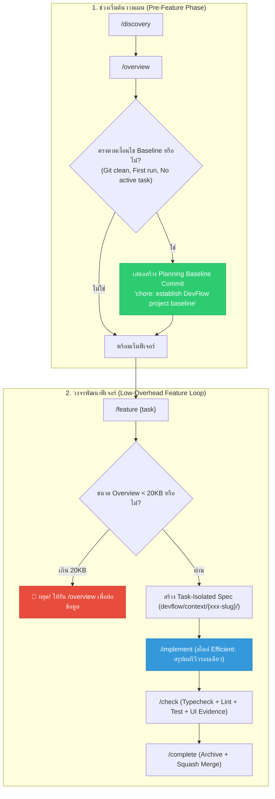

# 🧭 [DISC-20260902-002] การสำรวจและประเมินการซิงก์ Upstream AI Blueprint (v1.3.0 – v1.4.1)

> **Discovery ID**: `DISC-20260902-002`  
> **Topic**: Upstream AI Blueprint Synchronization & Context Efficiency Alignment (v1.3.0 – v1.4.1)  
> **Date**: 2026-09-02  
> **Status**: `Proceed` *(พร้อมเข้าสู่วงจรส่งมอบใน Feature 067)*  
> **Source**: Upstream Repository (`aiblueprinthq/ai-blueprint` Tags: `v1.3.0`, `v1.4.0`, `v1.4.1`) & Nexus-DevFlow (`v2.10.3`)  
> **Target Scope**: Context Overhead Reduction, Planning Baseline Commit, Overview Compactness Budget (20KB), Review Cadence Presets (Efficient/Guided/Custom), Skill Descriptions Optimization, Framework Contracts & Diagnostics

---

## 1. Context & Problem Statement

Nexus-DevFlow พัฒนาขึ้นโดยอ้างอิงและต่อยอดเป็น Super-set เหนือ **AI Blueprint** โดยการซิงก์ upstream ครั้งล่าสุดอยู่ที่เวอร์ชัน **v1.1.0 และ v1.2.0** (ในฟีเจอร์ `064-sync-upstream-ai-blueprint-v120` ซึ่งได้เพิ่ม Browser Tests / Playwright + MCP BrowserOS Neo และ Independent Audit Review)

จากการติดตามการเปลี่ยนแปลงล่าสุดใน Upstream Repository (`aiblueprinthq/ai-blueprint`) พบว่ามีการปล่อย 3 เวอร์ชันสำคัญ ได้แก่:

1. **AI Blueprint v1.3.0 (2026-09-01)**:
   - **Planning Baseline Commit (`ea92286`)**: เพิ่ม Step 4 ใน `/overview` เพื่อเสนอทำ Git commit สำหรับ Blueprint setup, config และแผนงานเริ่มต้น (`chore: establish Blueprint project baseline`) ก่อนเริ่ม Feature 1 โดยมี guardrail ตรวจสอบความสะอาดของ git staging อย่างเข้มงวด ไม่ปนโค้ดแอปพลิเคชัน และไม่ทำซ้ำเมื่อเริ่มพัฒนาฟีเจอร์แล้ว
2. **AI Blueprint v1.4.0 (2026-09-01)**:
   - **Context Overhead Reduction (`5f0acb6`)**: ปรับลด Token overhead ของ AI Session อย่างมีนัยสำคัญ:
     - ปรับลด Claude Code startup context ใน `CLAUDE.md` โดยนำเข้าเฉพาะ core instructions (`AGENTS.md`), durable overview และ active spec ส่วน `coding-standards.md` และ `ai-interaction.md` ให้โหลดเฉพาะเมื่อจำเป็น (JIT loading)
     - ย่อข้อความคำอธิบายทักษะ (Skill Descriptions) ทุกตัวให้กระชับ ชัดเจน ไม่เกิน 400 ตัวอักษร พร้อมตั้ง Regression Budget ในการตรวจสอบ
     - เปลี่ยนค่าเริ่มต้นของระบบ Workflow (`config.json`): เปลี่ยน `stepReview` เป็น `"feature"` (เดิมคือ `"every"`) และปิด `checkpointCommits` เป็น `"disabled"` เพื่อลดการตอบคำถามซ้ำซ้อนในทุก micro-step
     - เพิ่ม Onboarding Implementation Style Prompt ใน `/onboard`: มีตัวเลือก **Efficient (Recommended)**, **Guided**, และ **Custom** ซึ่งบันทึกลง low-level config โดยตรง
     - เพิ่มการตรวจวัด Context-size ใน `/doctor`
3. **AI Blueprint v1.4.1 (2026-09-01)**:
   - **Overview Compactness Budget (`be424a6`)**: กำหนดเพดานขนาดของ `project-overview.md` ไม่ให้เกิน **20,000 bytes** (ประมาณ 4,000–5,000 tokens)
   - เพิ่มการเตือนใน `/doctor` หาก overview เกินงบ
   - เพิ่ม Hard-Stop ใน `/feature`: หาก overview >= 20,000 bytes ให้หยุดและแจ้งผู้ใช้รัน `/overview` ใหม่เพื่อย่อข้อมูล และให้ `/feature` รียูส overview ที่โหลดอยู่ใน context แล้วโดยไม่อ่านซ้ำผ่าน tool

เป้าหมายของ Discovery นี้คือ **วิเคราะห์ผลกระทบ, กำหนดแนวทาง Port & Adapt ฟีเจอร์ทั้งสามเวอร์ชันเข้าสู่ Nexus-DevFlow v2.10.3** โดยยังคงรักษา **The 3-Pillars Architecture**, **Task-Isolated Living Spec Model (`devflow/context/{xxx-slug}/`)**, และมาตรฐานการสื่อสารภาษาไทยอย่างสมบูรณ์

---

## 2. Supporting Routes & Built-in Lenses

### 🔬 Lens 1: Research & Empirical Proof Lens (การเปรียบเทียบเชิงประจักษ์)

จากการตรวจสอบ Git Diff ระหว่าง `v1.2.0..v1.4.1` ของ `aiblueprinthq/ai-blueprint`:

```text
60 files changed, 937 insertions(+), 1112 deletions(-)
```

#### ก. การเปลี่ยนแปลงในฝั่ง Workflow Skills & Adapters
1. **`overview/SKILL.md`**:
   - เพิ่ม Step 4: "Offer the initial planning baseline commit"
   - ข้อความ Commit มาตรฐาน: `chore: establish Blueprint project baseline` (ใน DevFlow จะเป็น `chore: establish DevFlow project baseline`)
   - Pre-conditions: มี `HEAD`, อยู่บน Default branch, `project-overview.md` ใน HEAD ยังไม่มี source-hash, ยังไม่มี active task spec, ไม่มีประวัติใน history, ไม่มี checked items ใน build-plan, และไม่อยู่ในโหมด local-only
   - กฎ Compactness: ควบคุม `project-overview.md` ไม่ให้เกิน 20,000 bytes หากเกินให้ย่อข้อความหรือหยุดเพื่อแยกหัวข้อ
2. **`doctor/SKILL.md`**:
   - ตรวจสอบขนาดไบต์ของ `project-overview.md`: หาก >= 20,000 bytes ให้ระบุเป็น `oversized` และเตือนว่า `/feature` จะบล็อกการทำงาน
   - ตรวจสอบความกระชับของ Context และรายงานสถานะ Config
3. **`feature/SKILL.md`**:
   - ใน Step 2: ตรวจสอบขนาดไบต์ของ `project-overview.md` ก่อนอ่าน หาก >= 20,000 bytes ให้หยุดทันที
   - แนะนำให้ Reuse Overview ที่โหลดอยู่ใน prompt/context แล้ว แทนที่จะเรียกเครื่องมืออ่านซ้ำซ้อน
4. **`onboard/SKILL.md`**:
   - เพิ่มคำถาม **Implementation style**:
     1. **Efficient (Recommended)**: `stepReview: "feature"`, `checkpointCommits: "disabled"`
     2. **Guided**: `stepReview: "every"`, `checkpointCommits: "enabled"`
     3. **Custom**: ปรับแต่งแยกอิสระ
5. **Skill Descriptions & Token Reduction**:
   - ลดความยาว description ของทุก Skill ใน `.agents/` และ `.claude/` ให้กระชับ สื่อความหมายชัดเจน ตรงประเด็น ไม่เกิน 400 ตัวอักษรต่อสคิล

#### ข. การเปลี่ยนแปลงในฝั่ง Configuration & Core Library
1. **`packages/create-nexus-devflow/lib/project-config.ts` & `devflow/config.json`**:
   - อัปเดตค่า Defaults:
     - `workflow.stepReview`: เปลี่ยนจาก `"every"` เป็น `"feature"`
     - `workflow.checkpointCommits`: เปลี่ยนจาก `"enabled"` เป็น `"disabled"`
2. **`scripts/validate-framework.ts`**:
   - เพิ่มการตรวจสอบขนาดของ Skill descriptions (ไม่เกิน 400 ตัวอักษร) และตรวจสอบ total budget
   - เพิ่ม Contract assertions ยืนยันการมีอยู่ของกฎ 20,000 bytes ใน `overview`, `doctor`, `feature`
   - ยืนยัน Baseline commit contract ใน `overview`

---

### 📐 Lens 2: PRD & Scoping Lens (การกำหนดขอบเขตและข้อกำหนด)

#### ปัญหาที่แก้ไข (Problem Statement):
1. **Context Bloat**: การโหลดไฟล์กฎระเบียบและ Overview ขนาดใหญ่ซ้ำๆ ในทุก session ทำให้สิ้นเปลือง Token และบั่นทอนสมาธิของ AI Model
2. **Per-Step Interruption Friction**: ค่าเริ่มต้นเดิมของ `stepReview: "every"` ทำให้ Agent ต้องหยุดขอการอนุมัติในทุกๆ สเต็ปย่อยของการเขียนโค้ด ทำให้ผู้ใช้เหนื่อยล้า (Review Fatigue)
3. **Polluted Initial Feature Commits**: ฟีเจอร์แรกของโปรเจกต์มักมีไฟล์ setup, config, plans ปะปนกับโค้ดฟีเจอร์ ทำให้ Git History ไม่สะอาด

#### สิ่งที่อยู่ในขอบเขต (In-Scope for Feature 067):
1. **Planning Baseline Commit ใน `/overview`**:
   - เพิ่ม Step 4 ใน `.agents/skills/overview/SKILL.md` และ `.claude/skills/overview/SKILL.md`
   - ข้อความ Commit: `chore: establish DevFlow project baseline`
   - ปรับให้รองรับโครงสร้างโฟลเดอร์ `devflow/` และระบบ Task-Isolated Context
2. **Overview Compactness Guard (20,000 Bytes Limit)**:
   - อัปเดต `overview/SKILL.md`, `doctor/SKILL.md`, `feature/SKILL.md` ทั้งใน `.agents/` และ `.claude/`
   - เพิ่มการตรวจสอบและเตือนใน `scripts/validate-framework.ts`
3. **Workflow Configuration Defaults & Onboarding Presets**:
   - ปรับค่าเริ่มต้นใน `devflow/config.json` และ `packages/create-nexus-devflow/lib/project-config.ts` ให้เป็น `stepReview: "feature"` และ `checkpointCommits: "disabled"`
   - เพิ่มตัวเลือกสไตล์การทำงาน (Efficient, Guided, Custom) ใน `onboard/SKILL.md`
4. **Skill Descriptions Optimization & Regression Budget**:
   - ปรับปรุงข้อความ `description` ใน Frontmatter ของ Core Skills ทั้งหมดให้อยู่ในงบไม่เกิน 400 ตัวอักษร
   - เพิ่มการตรวจเช็คใน `scripts/validate-framework.ts`
5. **Claude Code Context Optimization**:
   - ปรับปรุงคำแนะนำใน `CLAUDE.md` และ `AGENTS.md` ให้สอดคล้องกับแนวคิด Just-In-Time context loading
6. **Verification & Tests**:
   - อัปเดตชุดทดสอบ `test/project-config.test.ts`, `test/status.test.ts`
   - รัน Static checks, Unit tests, Framework validation, และ Package smoke test ผ่าน 100%

#### สิ่งที่อยู่นอกขอบเขต (Out-of-Scope):
- การแก้ไขหรือลดทอนฟีเจอร์ BugHunter (ฟีเจอร์ 065)
- การปรับเปลี่ยนระบบ 3-Pillars Workspace หรือ Task-Isolated Living Spec Model (`devflow/context/{xxx-slug}/`)
- การบังคับให้ใช้ภาษาอังกฤษใน Artifacts (คงมาตรฐานภาษาไทย `th` ไว้ตามเดิม)

---

### ⚖️ Lens 3: Brainstorming Lens & Trade-off Comparison Table

| ทางเลือก (Options) | ข้อดี (Pros) | ข้อเสีย / ความเสี่ยง (Cons) | ข้อสรุป (Recommendation) |
| :--- | :--- | :--- | :--- |
| **Option A: Full Tailored Adaptation (ปรับแต่งทุกจุดให้สอดคล้องกับ DevFlow Architecture)** *(แนะนำ)* | • ได้ประโยชน์จากการประหยัด Context และ Token อย่างเต็มที่<br>• มี Baseline Commit ช่วยแยก Setup ออกจาก Feature 1<br>• ปรับ `stepReview: "feature"` ช่วยให้การพัฒนาลื่นไหล ไม่สะดุด<br>• เข้ากับ Task-Isolated Model และภาษาไทย 100% | ต้องปรับแก้และตรวจสอบเอกสาร Skill หลายจุด | **แนะนำอย่างยิ่ง (Recommended)** |
| **Option B: Selective Sync (นำเข้าเฉพาะ Config และ Baseline แต่ไม่จำกัด Overview 20KB)** | โค้ดที่ต้องแก้น้อยลง | เสี่ยงต่อปัญหา Token Bloat ในโปรเจกต์ขนาดใหญ่ และไม่ตรงกับมาตรฐาน Upstream ล่าสุด | **ไม่แนะนำ (Rejected)** |
| **Option C: Defer (ชะลอการซิงก์)** | ไม่ต้องทำงานเพิ่มในรอบนี้ | ขาดการปรับปรุงด้าน Context Efficiency ซึ่งเป็นหัวใจสำคัญของการประหยัดค่าใช้จ่ายและเพิ่มความเร็วของ Agent | **ไม่แนะนำ (Rejected)** |

---

### 🐛 Lens 4: Issue & Architecture Triage Lens (จุดเชื่อมต่อที่ต้องระวัง)

1. **Path & Namespace Translation**:
   - Upstream ใช้ `blueprint/` ➔ DevFlow ต้องแปลงเป็น `devflow/` ทุกจุดอย่างแม่นยำ
   - Baseline commit ของ Upstream เสนอ `chore: establish Blueprint project baseline` ➔ ของ DevFlow ต้องเป็น `chore: establish DevFlow project baseline`
2. **Task-Isolated Living Spec vs Legacy Single Feature File**:
   - Upstream ตรวจสอบ `blueprint/context/current-feature.md` ว่าว่างหรือไม่
   - ใน DevFlow สถาปัตยกรรมใช้ `devflow/context/{xxx-slug}/` (Task-Isolated Workspace) ดังนั้นเงื่อนไข Baseline ต้องตรวจว่าไม่มี task workspace ที่กำลัง Active อยู่ และไม่มีประวัติใน `devflow/history/features/`
3. **Core Skills Count & Manifest Sync**:
   - ปัจจุบัน DevFlow มี Core Skills จำนวน 31 สคิล (รวม `bughunter`, `browser-tests`, `convert-any-to-md`, ฯลฯ)
   - การปรับแต่ง Skill descriptions ต้องทำครบทั้ง 31 สคิลใน `.agents/` และ `.claude/` โดยคงแท็ก `[devflow]` ไว้ตามข้อตกลง

---

### 🏛️ Lens 5: Socratic Alignment & Architecture Decisions (ADR)

#### Architecture Decision 1: การเปลี่ยนค่าเริ่มต้นของ Workflow เป็น Efficient (`stepReview: "feature"`)
- **สถานะ**: `Accepted`
- **เหตุผล**: การขออนุมัติทุก micro-step เหมาะสำหรับงานที่มีความเสี่ยงสูงหรือโหมดจับคู่สอนงาน แต่สำหรับงานพัฒนาทั่วไป การสรุปผลและรีวิวเป็นรอบฟีเจอร์ (`feature`) ให้ความเร็วและความต่อเนื่องสูงกว่ามาก โดยผู้ใช้ยังสามารถเลือกเปลี่ยนกลับเป็น `"every"` ได้เสมอผ่าน `devflow/config.json` หรือคำสั่ง `/onboard` (ตัวเลือก Guided)

#### Architecture Decision 2: การจำกัดขนาด `project-overview.md` ไม่เกิน 20,000 Bytes
- **สถานะ**: `Accepted`
- **เหตุผล**: `project-overview.md` ถูกอ่านบ่อยครั้งที่สุดในทุกขั้นตอน การควบคุมขนาดให้อยู่ภายใต้ 20KB (ประมาณ 4,000–5,000 tokens) ช่วยป้องกันไม่ให้ System Prompt บวมจนเบียดบัง Context Window สำหรับการเขียนโค้ด

#### Architecture Decision 3: การเพิ่ม Planning Baseline Commit ใน `/overview`
- **สถานะ**: `Accepted`
- **เหตุผล**: ป้องกันไม่ให้ Git Commit ของ Feature 1 ปนเปื้อนด้วยไฟล์การตั้งค่าระบบ, กฎเกณฑ์, และแผนงาน ทำให้ Git Log และ Release History มีความชัดเจน เป็นระเบียบ

---

### 🎨 Lens 6: Visual Workflow & Context Optimization Flow



---

## 3. Decision & Approval Gate

- **Decision**: `Proceed`
- **Rationale**: การซิงก์ Upstream AI Blueprint v1.3.0 – v1.4.1 ช่วยเพิ่มประสิทธิภาพของ Agent ในการประหยัด Context/Token ลดความซ้ำซ้อนของการรีวิว เพิ่มความสะอาดของ Git History และยกระดับคุณภาพของ Living Spec โดยตรง สามารถปรับใช้กับสถาปัตยกรรม 3-Pillars ของ DevFlow ได้อย่างสมบูรณ์แบบ

---

## 4. Next Workflow Recommendation

หลังจาก Discovery นี้ได้รับการรับรอง ขอแนะนำให้เริ่มกระบวนการพัฒนาผ่าน **4-Stage Task-Isolated Living Spec Lifecycle**:

### แผนการส่งมอบ (Feature Delivery Plan):
- **Feature ID**: `067-sync-upstream-ai-blueprint-v130-v141`
- **Title**: ซิงก์ AI Blueprint Upstream v1.3.0 – v1.4.1 (Planning Baseline Commit, Context Overhead Reduction, Overview Compactness Guard 20KB, และ Efficient Workflow Presets)

### รายการงานย่อย (Implementation Checklist Tasks):
1. **Task 1: Core Config & Defaults**: ปรับปรุง `devflow/config.json` และ `packages/create-nexus-devflow/lib/project-config.ts` ให้ใช้ default `stepReview: "feature"` และ `checkpointCommits: "disabled"`
2. **Task 2: Overview Planning Baseline Commit**: เพิ่ม Step 4 ลงใน `overview/SKILL.md` (ทั้ง `.agents/` และ `.claude/`) รองรับการสร้าง `chore: establish DevFlow project baseline`
3. **Task 3: Overview 20KB Compactness Guard**: เพิ่มกฎ 20,000 bytes ใน `overview`, การแจ้งเตือนใน `doctor`, และการตรวจสอบ Hard-Stop พร้อม reuse overview ใน `feature`
4. **Task 4: Onboarding Presets & Claude Context Optimization**: เพิ่ม Implementation Style prompt (Efficient / Guided / Custom) ใน `onboard` และปรับปรุง `CLAUDE.md` / `AGENTS.md`
5. **Task 5: Skill Descriptions Optimization**: ปรับลดความยาว description ของทั้ง 31 Core Skills ให้อยู่ในงบ <= 400 ตัวอักษร
6. **Task 6: Framework Validation & Test Suite**: อัปเดต `scripts/validate-framework.ts`, `test/project-config.test.ts`, `test/status.test.ts` และรัน Full Verification Matrix

- **คำสั่งถัดไปที่แนะนำ**:
  ```text
  /feature 067-sync-upstream-ai-blueprint-v130-v141
  ```
