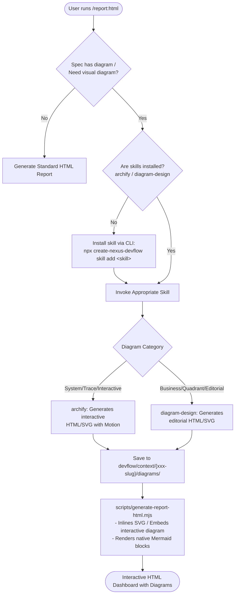

# 🧭 [DISC-20260902-003] การสำรวจและประเมินการผสาน Diagram เข้ากับคำสั่ง report-html (archify / diagram-design)

> **Discovery ID**: `DISC-20260902-003`  
> **Topic**: การเรียกสร้างและแสดงผล Diagram ใน `report-html` จาก skill `diagram-design` หรือ `archify` พร้อมกลไกตรวจสอบและติดตั้งอัตโนมัติ  
> **Date**: 2026-09-02  
> **Status**: `Proceed` *(พร้อมนำเข้าสู่ Build Plan หรือสร้าง Feature)*  
> **Target Scope**: `scripts/lib/render-html/`, `.agents/skills/report-html/SKILL.md`, `.agents/skills/archify/`, `.agents/skills/diagram-design/`, `packages/create-nexus-devflow/lib/skill-manager.ts`

---

## 1. Executive Summary & Problem Statement

### คำถามของผู้ใช้:
> *"คำสั่ง report-html กรณีถ้ามี diagram สามารถเรียกการสร้าง diagram มาแสดงใน html ด้วยได้ไหม จาก skill diagram-design หรือ archify ถ้าไม่มีให้ติดตั้งก่อน"*

### คำตอบสรุป (TL;DR):
**สามารถทำได้แน่นอน 100% และเป็นฟีเจอร์ที่ยกระดับคุณภาพรายงานอย่างมาก** โดยสถาปัตยกรรมของ Nexus-DevFlow รองรับการเชื่อมต่อนี้ได้อย่างสมบูรณ์:

1. **การแสดงผล Diagram ใน HTML Dashboard**:
   - `scripts/lib/render-html/template.html` **มี Mermaid.js v11 ติดตั้งไว้อยู่แล้ว** (`renderMermaid()`) แต่ parser ใน `md2html-report.mjs` ปัจจุบันยังมองข้าม tag ` ```mermaid ` กลายเป็นเพียง code block ธรรมดา การปรับแก้ parser ให้แปลงเป็น `<pre class="mermaid">` จะทำให้เรนเดอร์ไดอะแกรมได้ทันทีในหน้าเว็บ
   - สำหรับไดอะแกรมระดับมืออาชีพจาก **Archify** หรือ **Diagram-Design** (ที่เป็น Interactive HTML หรือ Inline SVG ใน `devflow/context/{xxx-slug}/diagrams/`): ตัว `report-html` สามารถอ่านและฝังลงใน Report เป็น Interactive Card / Embed Container หรือสร้าง Section เฉพาะได้
2. **การเรียกสร้าง Diagram จาก Skill**:
   - เมื่อ Agent หรือคำสั่ง `/report:html` พบว่างานมีโครงสร้างสถาปัตยกรรมหรือผู้ใช้ต้องการ diagram ตัว Agent สามารถเรียกใช้ **Archify** (สำหรับ Technical Architecture, Dataflow, Sequence trace, State machine) หรือ **Diagram-Design** (สำหรับ Business, Quadrant, Timeline, Flowchart) เพื่อ generate ไฟล์ diagram ลงในโฟลเดอร์งานก่อนแปลงเป็น HTML
3. **การตรวจสอบและติดตั้งอัตโนมัติหากยังไม่มี (Skill Auto-Detection & Installation)**:
   - ตรวจสอบความมีอยู่ของโฟลเดอร์ `.agents/skills/archify` และ `.agents/skills/diagram-design`
   - หากยังไม่ได้ติดตั้ง Nexus-DevFlow มี Built-in CLI รองรับอยู่แล้ว:
     ```bash
     npx create-nexus-devflow skill add archify
     # หรือ
     npx create-nexus-devflow skill add diagram-design
     # หรือติดตั้งชุดแนะนำทั้งหมด
     npx create-nexus-devflow skill add --recommended
     ```

---

## 2. Technical Investigation & Codebase Findings (Empirical Proof)

### 2.1 สภาพปัจจุบันของ `report-html`
จากการตรวจสอบโค้ดใน `scripts/lib/render-html/`:
1. **`template.html` (บรรทัด 1002-1049)**:
   ```html
   <script src="https://cdn.jsdelivr.net/npm/mermaid@11/dist/mermaid.min.js"></script>
   <script>
     function initMermaid() { ... }
     async function renderMermaid() {
       const els = document.querySelectorAll(".mermaid");
       ...
       await mermaid.run({ nodes: els });
     }
   </script>
   ```
   *หลักฐานชัดเจน*: ตัว Dashboard มี Mermaid library และฟังก์ชัน theme-aware mermaid พร้อมทำงานอยู่แล้ว
2. **`md2html-report.mjs` (บรรทัด 123-132)**:
   ```javascript
   if (trimmed.startsWith('```')) {
     ...
     html.push(`<pre><code>${escapeHtml(codeLines.join('\n'))}</code></pre>`);
     continue;
   }
   ```
   *ปัญหาที่พบ*: Parser ตัดทิ้ง code fence language ทำให้ ` ```mermaid ` ไม่ถูกครอบด้วย `<pre class="mermaid">` ส่งผลให้ Mermaid ไม่ถูกเรนเดอร์
3. **การจัดการไฟล์ไดอะแกรมภายนอก**:
   ยังไม่มีการสแกนหาโฟลเดอร์ `diagrams/` ภายใต้ task directory (`devflow/context/{xxx-slug}/diagrams/`) เพื่อนำไฟล์ `.svg` หรือ `.html` มา embed เป็น visual artifact ใน dashboard

### 2.2 สถานะของ Skill Ecosystem (`archify` & `diagram-design`)
1. ใน Repository ปัจจุบัน มีทั้ง:
   - [`.agents/skills/archify/SKILL.md`](file:///d:/devtools/nexus-devflow/.agents/skills/archify/SKILL.md)
   - [`.agents/skills/diagram-design/SKILL.md`](file:///d:/devtools/nexus-devflow/.agents/skills/diagram-design/SKILL.md)
2. ในแพ็กเกจ Installer [`packages/create-nexus-devflow/lib/skill-manager.ts`](file:///d:/devtools/nexus-devflow/packages/create-nexus-devflow/lib/skill-manager.ts):
   - ทั้ง `archify` และ `diagram-design` ถูกลงทะเบียนไว้ใน `KNOWN_SKILL_ALIASES` และ `RECOMMENDED_THIRD_PARTY_SKILLS` เรียบร้อยแล้ว ทำให้สามารถสั่งติดตั้งผ่านคำสั่ง `nexus-devflow skill add archify` ได้ทันที

---

## 3. Architecture & Integration Design



### 3.1 กลไกการเลือก Skill (Intelligent Routing)
| ประเภทความต้องการไดอะแกรม | Skill ที่เหมาะสม | ผลลัพธ์ที่ได้ |
|---|---|---|
| **System Architecture / Component Topology** | `archify` | Interactive HTML พร้อม Dark/Light theme toggle และ Node highlight |
| **API Call Sequence / Event-Driven Trace** | `archify` | Trace Motion (กด Play เลื่อนดู flow ข้อความได้) |
| **State Machine / Entity Lifecycle** | `archify` | Interactive State graph พร้อม Route probe |
| **Business Flow / Quadrant / Radar Chart** | `diagram-design` | Editorial HTML/SVG ระดับสิ่งพิมพ์ สวยงาม ไร้ dependency ซับซ้อน |
| **Quick Concept / In-line Sequence** | `Mermaid (Native)` | เรนเดอร์ตรงจาก markdown block ใน report ทันที |

### 3.2 กลไกการแสดงผลใน `report-html` (Visualization Options)
1. **Option 1: Native Mermaid Block Support (Quick Win)**
   - ปรับ `md2html-report.mjs` ให้เช็ก `trimmed.startsWith('```mermaid')` แล้วแปลงเป็น `<pre class="mermaid">`
2. **Option 2: Diagram Gallery / Tabs ใน Dashboard**
   - เมื่อ `report:html` ทำงาน ให้สแกนหาโฟลเดอร์ `devflow/context/{xxx-slug}/diagrams/` หรือ `devflow/history/.../diagrams/`
   - หากพบไฟล์ `.svg` ให้นำมา Inline แสดงผลพร้อมขยายดูภาพเต็มได้ (Lightbox / Zoom)
   - หากพบไฟล์ `.html` ให้นำมาฝังใน Responsive Container (`<iframe>` หรือ Sandboxed Card) พร้อมปุ่ม "Open Fullscreen"
3. **Option 3: Skill Handoff & Pre-Check ใน `report-html/SKILL.md`**
   - เพิ่มขั้นตอนใน Skill Contract: ก่อนสร้างรายงาน หากเอกสารกล่าวถึงสถาปัตยกรรม แต่ยังไม่มี Diagram ให้ Agent แนะนำหรือรัน `archify` / `diagram-design` สร้างไดอะแกรมประกอบรายงานโดยอัตโนมัติ

---

## 4. Implementation Blueprint (แผนการพัฒนา)

### ระยะที่ 1: ปรับปรุงตัวเรนเดอร์ `report-html` (Markdown & Template Fix)
1. **แก้ `scripts/lib/render-html/md2html-report.mjs`**:
   - เพิ่มการดักจับ ```` ```mermaid ```` เพื่อให้เรนเดอร์เป็น `<pre class="mermaid">${escapeHtml(code)}</pre>`
   - รองรับการสแกนโฟลเดอร์ `diagrams/` ใน Workspace ของ Task เพื่อดึงไดอะแกรมมาแสดงในแท็บ "System Diagrams"
2. **ปรับปรุง `template.html`**:
   - เพิ่ม CSS Styling สำหรับ Diagram Viewbox, Responsive Iframe Card และปุ่มสลับดูโค้ด/ดูไดอะแกรม

### ระยะที่ 2: เพิ่มความสามารถในการตรวจจับและติดตั้ง Skill ใน `report-html/SKILL.md`
1. อัปเดตคำแนะนำใน `.agents/skills/report-html/SKILL.md` และ `.claude/skills/report-html/SKILL.md`:
   - เมื่อผู้ใช้ระบุว่าต้องการ diagram หรือเอกสารมีรายละเอียดเชิงโครงสร้าง:
     - ตรวจสอบโฟลเดอร์ `.agents/skills/archify` หรือ `.agents/skills/diagram-design`
     - หากไม่พบ ให้รันคำสั่ง: `npx create-nexus-devflow skill add archify` (หรือ `diagram-design`)
     - เรียกใช้ Skill เพื่อวาดไดอะแกรมและบันทึกลง `devflow/context/{xxx-slug}/diagrams/` ก่อนคอมไพล์ HTML Report

---

## 5. Decision & Next Steps

### มติ (Decision):
**`Proceed`** — แนวคิดนี้เป็นไปได้จริง 100% สอดคล้องกับระบบที่มีอยู่เดิม และช่วยเติมเต็มประสบการณ์ Visual Engineering Dashboard ให้กับ Nexus-DevFlow

### แนะนำขั้นตอนถัดไป (Next Action):
- บันทึกงานนี้เป็น Feature ถัดไปใน `devflow/build-plan.md` หรือเริ่มทำผ่านคำสั่ง:
  ```bash
  /feature 068-report-html-diagram-integration
  ```
  *(หรือหากต้องการให้ลงมือทำทันที สามารถสั่งเริ่มได้เลยครับ)*
