# 🧭 [DISC-20260903-001] การสำรวจและประเมินการซิงก์ Upstream AI Blueprint (v1.5.0 – v1.5.1)

> **Discovery ID**: `DISC-20260903-001`  
> **Topic**: Upstream AI Blueprint Synchronization & Hardened Run State Engine (v1.5.0 – v1.5.1)  
> **Date**: 2026-09-03  
> **Status**: `Proceed` *(พร้อมเข้าสู่วงจรส่งมอบใน Feature 070)*  
> **Source**: Upstream Repository (`aiblueprinthq/ai-blueprint` Tags: `v1.5.0`, `v1.5.1` / Commits: `4f18fa4`, `ce5ecb2`) & Nexus-DevFlow (`v2.11.0`)  
> **Target Scope**: Hardened Dashboard Activity Helper (`run-state.mjs`), On-Demand Context Loading Protocol, Skill Reference Subdirectory Extraction, Package Update & Health Engine Alignment

---

## 1. Context & Problem Statement

Nexus-DevFlow ทำหน้าที่เป็น Super-set Framework เหนือ **AI Blueprint** โดยการซิงก์ครั้งล่าสุดอยู่ที่เวอร์ชัน **v1.4.1** (ใน Feature 067 และ Tooling Parity ใน Feature 068)

จากการติดตาม Upstream Repository (`aiblueprinthq/ai-blueprint`) พบว่ามีการปล่อย 2 เวอร์ชันสำคัญ ได้แก่:

1. **AI Blueprint v1.5.0 (`4f18fa4`)**:
   - **Load Blueprint Context On-Demand**: ปรับลดขนาดของ System/Session Prompt ขั้นสูงสุด โดยนำแนวปฏิบัติ JIT (Just-In-Time) Context Loading มาใช้อย่างเต็มรูปแบบ
   - **Extract Skill Reference Templates**: แยก Template ขนาดใหญ่ออกจากตัว `SKILL.md` ไปไว้ในโฟลเดอร์ย่อย `reference/` (เช่น `feature/reference/feature-spec-template.md`, `implement/reference/rollback-implementation.md`) เพื่อให้ AI โหลดเฉพาะตอนต้องเขียน Spec หรือ Rollback จริงๆ
   - **Context Reuse Protocol**: กำหนดข้อความมาตรฐานกำกับการรียูสบริบท `**Context reuse:** Reuse any required file already loaded...` ในทุกๆ สคิล
   - **Package Updater & Diagnostic Alignment**: ปรับปรุงกลไกการอัปเดต (`update.ts`) และการตรวจสอบความถูกต้อง

2. **AI Blueprint v1.5.1 (`ce5ecb2`)**:
   - **Harden Dashboard Activity State**: ปรับระบบจัดการสถานะกิจกรรม Dashboard (`run.json`) ให้มีความทนทานและปลอดภัยสูงสุด โดยสร้าง CLI Helper script อัตโนมัติ:
     ```text
     node .agents/skills/doctor/scripts/run-state.mjs <action> <options>
     node .claude/skills/doctor/scripts/run-state.mjs <action> <options>
     ```
   - กำหนดกฎเคร่งครัด: **ห้าม AI Agent สร้างหรือแก้ไข `run.json` ด้วยมือโดยตรงเด็ดขาด** แต่ให้สั่งการผ่าน `run-state.mjs` ซึ่งมี Schema Validation, Atomic File Writing, Text Truncation ป้องกันการบวม และ Exit Codes ที่ชัดเจน
   - รองรับ 4 คำสั่งหลัก: `start`, `update`, `finish`, และ `reset` พร้อม Argument validation ครบถ้วน
   - เพิ่มชุดทดสอบครบครัน `run-state-helper.test.ts` และปรับปรุง `doctor` ให้ตรวจสอบสุขภาพของ state file

เป้าหมายของ Discovery นี้คือ **วิเคราะห์โครงสร้างความแตกต่าง, กำหนดแผนงาน Port & Adapt นวัตกรรมของ v1.5.0 และ v1.5.1 เข้าสู่ Nexus-DevFlow** โดยยังคงรักษาเอกลักษณ์ **The 3-Pillars Architecture**, **Task-Isolated Living Spec Model (`devflow/context/{xxx-slug}/`)**, และมาตรฐานภาษาไทยอย่างสมบูรณ์

---

## 2. Supporting Routes & Built-in Lenses

### 🔬 Lens 1: Research & Empirical Proof Lens (การวิเคราะห์เชิงเปรียบเทียบ)

จากการตรวจสอบ Git Diff ระหว่าง `v1.4.1..v1.5.1` ของ `aiblueprinthq/ai-blueprint`:

```text
84 files changed, 2465 insertions(+), 1084 deletions(-)
```

#### ก. การเปรียบเทียบระบบ Dashboard Activity State
- **Upstream (v1.5.1)**: ใช้ `run-state.mjs` (Standalone ESM Script) ในโฟลเดอร์ `.agents/skills/doctor/scripts/` และ `.claude/skills/doctor/scripts/` โดยทำงานกับ `blueprint/.state/run.json`
- **DevFlow (ปัจจุบัน)**: มี Library TypeScript `packages/create-nexus-devflow/lib/run-state.ts` สำหรับ programmatic access แต่ในระดับ Agent CLI ยังอนุญาตให้เขียนไฟล์ `devflow/.state/run.json` ตรงๆ ซึ่งมีความเสี่ยงเรื่อง Schema Invalidation หรือ Race Condition
- **การปรับใช้ (Adaptation)**: ต้องพอร์ต `run-state.mjs` มาไว้ใน `.agents/skills/doctor/scripts/run-state.mjs` และ `.claude/skills/doctor/scripts/run-state.mjs` โดยเปลี่ยน Path เป้าหมายเป็น `devflow/.state/run.json` และรองรับ Canonical Commands ทั้งหมดของ DevFlow (เช่น `devflow`, `grill`, `brainstorm`, `idea`, `bughunter`, `archify`, `diagram-design`, `setup-tests`, `report-html`, `publish-devflow`)

#### ข. การเปรียบเทียบการแยก Reference Templates & On-Demand Loading
- **Upstream (v1.5.0)**:
  - แยก `feature-spec-template.md` ออกจาก `feature/SKILL.md` (ประหยัด ~3,000 bytes ต่อรอบการอ่าน skill)
  - แยก `rollback-implementation.md` ออกจาก `implement/SKILL.md`
- **DevFlow (ปัจจุบัน)**:
  - DevFlow ใช้สถาปัตยกรรม **Task-Isolated Living Spec Model** (`devflow/context/{xxx-slug}/spec.md`) ซึ่งมี Template เฉพาะตัวที่มีความครอบคลุมสูงกว่า
  - **การปรับใช้**: แยก Spec Template ของ DevFlow ไปไว้ใน `.agents/skills/feature/reference/spec-template.md` และ `.claude/skills/feature/reference/spec-template.md` พร้อมใส่ Directive ให้ Agent โหลดเฉพาะเมื่อต้องสร้างหรือวางโครงสร้าง spec ใหม่

---

## 3. Scoping & PRD Lens

### 3.1 Problem Statement
1. **Unprotected State Writes**: การให้ Agent เขียน `run.json` โดยตรง เสี่ยงต่อการเกิด Malformed JSON, ฟิลด์ตกหล่น, หรือข้อความยาวเกินไปจนทำลาย Dashboard UI
2. **Skill Prompt Overhead**: การใส่ Template และคู่มือ Rollback ไว้ใน `SKILL.md` โดยตรง ทำให้ทุกครั้งที่ Agent ถูกเรียก จะเสีย Token ในการอ่าน Template ที่ไม่ได้ใช้งานในทันที
3. **Missing Tooling Parity**: ขาดชุดทดสอบ `run-state-helper.test.ts` และการตรวจสอบ Contract ใน `scripts/validate-framework.ts`

### 3.2 In-Scope
1. **Port & Adapt `run-state.mjs`**:
   - สร้าง `.agents/skills/doctor/scripts/run-state.mjs` และ `.claude/skills/doctor/scripts/run-state.mjs`
   - ปรับแต่งให้รองรับโฟลเดอร์ `devflow/.state/run.json` และคำสั่งทั้งหมด 38 สคิลของ DevFlow
   - รองรับ Actions: `start`, `update`, `finish`, `reset`
2. **On-Demand Context Loading & Reference Extraction**:
   - เพิ่ม `**Context reuse:** Reuse any required file already loaded in project instructions...` ในทุก Skills
   - แยก Reference Templates สำหรับ `feature` และ `implement` (หรือ `rollback`)
3. **Doctor & Status Diagnostics Hardening**:
   - ปรับปรุง `doctor/SKILL.md` และ `status/SKILL.md` ให้แนะนำและใช้ `run-state.mjs`
   - เพิ่มการตรวจสอบและตรวจจับ Malformed run state พร้อมเสนอการ Reset อย่างปลอดภัย
4. **Framework Validation & Contract Tests**:
   - เพิ่ม `scripts/run-state-helper.test.ts` ทดสอบ CLI Helper ครบทุกคำสั่งและ Edge cases
   - อัปเดต `scripts/validate-framework.ts` ให้ Assert การมีอยู่ของ `run-state.mjs` และความสอดคล้องของ Skill References
   - อัปเดต `AGENTS.md` และ `CLAUDE.md` ให้บันทึกกฎการใช้ `run-state.mjs`

### 3.3 Out-of-Scope
- ไม่เปลี่ยนโครงสร้าง 3-Pillars หรือ Task-Isolated Workspace (`devflow/context/{xxx-slug}/`)
- ไม่กระทบสคิลพิเศษเฉพาะตัวของ DevFlow (`bughunter`, `archify`, `report-html`, `diagram-design`)

---

## 4. Trade-off Comparison Table

| ทางเลือก (Options) | ข้อดี (Pros) | ข้อเสีย / ความเสี่ยง (Cons) | ข้อสรุป (Recommendation) |
| :--- | :--- | :--- | :--- |
| **Option A: Full Hardened Parity (พอร์ต `run-state.mjs` + แยก Reference Templates + เพิ่ม Unit Tests ครบชุด)** | • Dashboard Activity State เสถียร 100% ไม่มีปัญหา JSON พัง<br>• ลด Token การอ่าน Skill ลง 20-30%<br>• สอดคล้องกับ Upstream AI Blueprint v1.5.1 สมบูรณ์แบบ | ต้องเพิ่มไฟล์และอัปเดตเอกสารสคิลทั้งระบบ | **แนะนำอย่างยิ่ง (Recommended)** |
| **Option B: Only Script Port (พอร์ตเฉพาะ `run-state.mjs` แต่ไม่แยก Templates)** | ได้ความปลอดภัยของ State แต่ยังไม่ประหยัด Token สูงสุด | เสียโอกาสในการ Optimize Context แบบ On-Demand | **ไม่แนะนำ (Rejected)** |
| **Option C: Defer** | ไม่ต้องทำอะไรเพิ่ม | เสี่ยงต่อ State corruption เมื่อ Dashboard ทำงาน | **ไม่แนะนำ (Rejected)** |

---

## 5. Architecture Decisions (ADR)

### ADR-1: Standardizing Activity State Writes via `run-state.mjs`
- **สถานะ**: `Accepted`
- **มติ**: AI Agents ทุกตัวที่ทำงานใน Nexus-DevFlow จะต้องใช้ `node .agents/skills/doctor/scripts/run-state.mjs` (หรือเวอร์ชัน `.claude/`) ในการอัปเดต `devflow/.state/run.json` เสมอ ห้ามเขียนไฟล์ดิบโดยตรง เพื่อการันตี Atomic Write และ Validation

### ADR-2: On-Demand Loading & Reference Splitting for Task-Isolated Specs
- **สถานะ**: `Accepted`
- **มติ**: แยก Spec template และ Rollback guides ออกเป็นไฟล์ใน `reference/` โฟลเดอร์ย่อย เพื่อให้ขนาดของ `SKILL.md` เล็กและกระชับที่สุด

---

## 6. Visual Architecture Diagram

```mermaid
flowchart TD
    subgraph AgentAction["🤖 AI Agent Execution Lifecycle"]
        Start["เริ่มคำสั่ง (e.g. /feature, /implement)"] --> RunStateStart["รัน CLI: node .agents/skills/doctor/scripts/run-state.mjs start"]
        RunStateStart --> Validate["Schema Validation & Atomic Write"]
        Validate --> StateFile[("devflow/.state/run.json")]
        
        StateFile --> Dashboard["📊 DevFlow Live Dashboard"]
        
        RunStateStart --> ExecWork["ทำงานตาม Task-Isolated Spec"]
        ExecWork --> Milestone["ถึงจุดสำคัญ (Milestone / Blocked)"]
        Milestone --> RunStateUpdate["รัน CLI: run-state.mjs update"]
        RunStateUpdate --> StateFile
        
        ExecWork --> FinishWork["งานเสร็จสิ้น"]
        FinishWork --> RunStateFinish["รัน CLI: run-state.mjs finish"]
        RunStateFinish --> StateFile
    end

    subgraph ContextOptimization["⚡ On-Demand Context Loading"]
        SkillCall["เรียกใช้ Skill"] --> CoreSkill["โหลดเฉพาะ SKILL.md (ย่อส่วน)"]
        CoreSkill --> CheckNeed{"ต้องการ Template หรือ Guide พิเศษหรือไม่?"}
        CheckNeed -- ต้องการ --> LoadRef["โหลด on-demand จาก reference/*.md"]
        CheckNeed -- ไม่ต้องการ --> SkipRef["ประหยัด Token Context"]
    end
```



---

## 7. Decision & Next Steps

- **Decision**: `Proceed`
- **Target Feature ID**: `070-sync-upstream-ai-blueprint-v150-v151`
- **Recommended Command**:
  ```text
  /feature 070-sync-upstream-ai-blueprint-v150-v151
  ```
