# 🧭 [DISC-20260907-001] การสำรวจและประเมินการซิงก์ Upstream AI Blueprint (v1.5.4 – v1.6.0)

> **Discovery ID**: `DISC-20260907-001`  
> **Topic**: Upstream AI Blueprint Synchronization & Automatic Independent Review Engine (v1.5.4 – v1.6.0)  
> **Date**: 2026-09-07  
> **Status**: `Proceed` *(พร้อมเข้าสู่วงจรส่งมอบใน Feature 073)*  
> **Source**: Upstream Repository (`aiblueprinthq/ai-blueprint` Tags: `v1.5.4`, `v1.6.0` / Commits: `54d6972` ถึง `e141963`) & Nexus-DevFlow (`v2.12.2`)  
> **Target Scope**: Automatic Independent Review Subagent Spawning, Post-Implementation Walkthroughs, Config Review Policies (`review.independentExecution`), Hardened Status & Dashboard Attention State Engine, Sortable Dashboard Findings & Roadmap Focus

---

## 1. Context & Problem Statement

Nexus-DevFlow ทำหน้าที่เป็น Super-set Framework เหนือ **AI Blueprint** โดยการซิงก์ครั้งล่าสุดอยู่ที่เวอร์ชัน **v1.5.3** (ใน Feature 072 - Manifest-Aware Adapter Selection)

จากการติดตาม Upstream Repository (`aiblueprinthq/ai-blueprint`) พบว่ามีการปล่อย 2 เวอร์ชันสำคัญ ได้แก่:

1. **AI Blueprint v1.5.4 (`f36abd0`)**:
   - **Post-Implementation Walkthroughs (`54d6972`)**: เพิ่มขั้นตอนตัวเลือก Walkthrough ทบทวนโค้ดหลังเสร็จสิ้นการ implement ใน `implement`, `autopilot`, `onboard` และ `ai-interaction.md` เพื่อให้ผู้ใช้สามารถรับชม Code Tour สรุปสถาปัตยกรรมและการตัดสินใจเชิงเทคนิคแบบ Read-only ได้ทันที
   - **Harden Project Status Reporting (`65ee2b1`)**: ปรับปรุงความทนทานของกลไกคำนวณสถานะโครงการ (`status.ts`, `history.ts`, `current-work.ts`) ให้ตรวจจับ Active Work, Multi-word Heading, Drift Detection และความถูกต้องแม่นยำ 100%
   - **Local CI Verification Clarification (`c3ed373`)**: ปรับปรุงเอกสารและ Verification Contract สำหรับคำสั่ง Verify ใน `ci` skill

2. **AI Blueprint v1.6.0 (`e141963`)**:
   - **Automatic Independent Review Engine (`0497634`)**: เพิ่มระบบตรวจทานอิสระแบบอัตโนมัติ (`review.independentExecution: "automatic" | "manual"`) ใน `config.json` โดยเมื่อเปิดใช้งาน (ค่าเริ่มต้นคือ `automatic` และ Gate เริ่มต้นคือ `when-sensitive`) ระบบจะ Spawn generic isolated child subagent ขึ้นมาทำการ Audit อย่างเป็นอิสระ พร้อมบันทึกหลักฐาน `Requested execution`, `Actual execution` (`manual` | `automatic`) และ `Reviewer context` (`fresh session` | `fresh subagent`) ลงใน `review.md`
   - **Roadmap Focus on Active Work (`c414ce1`)**: ปรับปรุง Dashboard ให้เน้นแสดงผลเฉพาะ Roadmap ที่กำลังทำงานและฟีเจอร์ถัดไปอย่างกระชับ
   - **Sortable Dashboard Findings Table (`4d4ccc1`)**: เพิ่มตารางแสดงผล Findings ที่สามารถ Sort / Filter ตาม Severity, Category และ File ใน Dashboard
   - **Prevent False Dashboard Attention States (`0916d72`)**: กำหนด Contract หัวเอกสารที่เข้มงวด (`# Feature: <title>`, `# Fix: <title>`, `# Rollback: Feature <id> - <title>`) เพื่อป้องกัน False Attention Badges ใน Dashboard

เป้าหมายของ Discovery นี้คือ **วิเคราะห์โครงสร้างความแตกต่าง, กำหนดแผนงาน Port & Adapt นวัตกรรมของ v1.5.4 และ v1.6.0 เข้าสู่ Nexus-DevFlow** โดยยังคงรักษาเอกลักษณ์ **The 3-Pillars Architecture**, **Task-Isolated Living Spec Model (`devflow/context/{xxx-slug}/`)**, และมาตรฐานภาษาไทยอย่างสมบูรณ์

---

## 2. Supporting Routes & Built-in Lenses

### 🔬 Lens 1: Research & Empirical Proof Lens (การวิเคราะห์เชิงเปรียบเทียบ)

จากการตรวจสอบ Git Diff ระหว่าง `b4eb32e..v1.6.0` ของ `aiblueprinthq/ai-blueprint`:

```text
33 files changed, 940 insertions(+), 180 deletions(-)
```

#### ก. การเปรียบเทียบระบบ Automatic Independent Review
- **Upstream (v1.6.0)**:
  - เพิ่มการตั้งค่า `review.independentExecution` (`"automatic"` | `"manual"`, default: `"automatic"`) ใน `blueprint/config.json`
  - ปรับค่าเริ่มต้นของ `qualityGates.regular.independentReview` และ `qualityGates.continuous.independentReview` เป็น `"when-sensitive"`
  - รองรับการบันทึกฟิลด์ Metadata ใน `review.md`:
    - `**Requested execution:** <manual | automatic>`
    - `**Actual execution:** <manual | automatic>`
    - `**Reviewer context:** <fresh session | fresh subagent>`
  - รองรับ Backward Compatibility สำหรับ Legacy Requests และ Receipts ที่ไม่มีฟิลด์ execution
- **DevFlow (ปัจจุบัน)**:
  - DevFlow มีระบบ Independent Review ใน `devflow/context/{xxx-slug}/review.md` แต่ยังเป็นแบบ Manual Handoff (`fresh session`) และ `qualityGates` ยังคง default เป็น `"manual"`
  - มี `packages/create-nexus-devflow/lib/review.ts` และ `project-config.ts` ที่ต้องขยาย Schema ให้รองรับ `review.independentExecution`
- **การปรับใช้ (Adaptation)**:
  - อัปเกรด `project-config.ts` ให้รองรับ `review.independentExecution`
  - ขยาย `review.ts` ให้รองรับ Schema ฟิลด์ `requestedExecution`, `actualExecution`, `reviewerContext` พร้อม Task-Isolated Path Resolver (`devflow/context/{xxx-slug}/review.md`)
  - อัปเดตสคิล `.agents/skills/audit/` และ `.claude/skills/audit/` รวมถึง `autopilot`, `continuous`, `implement`, `complete`, `doctor`, `onboard`, `status`

#### ข. การเปรียบเทียบระบบ Post-Implementation Walkthrough
- **Upstream (v1.5.4)**:
  - เพิ่มส่วน Walkthrough สรุปโค้ดหลังเสร็จสิ้นขั้นตอน Implement โดยเปิดโอกาสให้ผู้ใช้ขอดู Code Tour ได้ทั้งใน `stepReview: "feature"` และ `stepReview: "every"`
- **DevFlow (ปัจจุบัน)**:
  - DevFlow มีสเต็ปการ Implement ใน `implement/SKILL.md` แต่ยังไม่มี Prompt Hook สำหรับ Code Walkthrough ชัดเจน
- **การปรับใช้ (Adaptation)**:
  - เพิ่ม Prompt Guide และทางเลือก Walkthrough ใน `implement/SKILL.md`, `autopilot/SKILL.md` และ `devflow/context/ai-interaction.md`

#### ค. การเปรียบเทียบ Dashboard & Status Hardening
- **Upstream (v1.6.0)**:
  - เพิ่ม Sortable Findings Table, Roadmap Focus, และ Strict Spec Heading Validation ใน `dashboard.ts`, `status.ts`, `current-work.ts`, `history.ts`
- **DevFlow (ปัจจุบัน)**:
  - DevFlow มี Full Multi-Task Dashboard (`dashboard-page.ts`, `webview-studio.ts`) และ Task-Isolated Specs ใน `devflow/context/{xxx-slug}/spec.md`
- **การปรับใช้ (Adaptation)**:
  - ผสาน Strict Heading Contracts เข้าสู่ `current-work.ts` และ `status.ts`
  - ปรับปรุงการคำนวณ Status และ Attention State ให้รองรับ Spec หลายตัวพร้อมกันโดยไม่เกิด False Alert

---

## 3. Scoping & PRD Lens

### 3.1 Problem Statement
1. **Manual Review Bottleneck**: การตรวจทานอิสระ (Independent Review) ยังต้องพึ่งพาการเปิด New Session เท่านั้น ซึ่งทำให้การทำงานใน Autopilot หรือ Continuous Mode สะดุดเมื่อเจองานที่มีความเสี่ยงสูง
2. **Missing Post-Implementation Walkthrough**: ขาดคู่มือและคำแนะนำให้ AI นำเสนอ Code Tour เชิงสถาปัตยกรรมหลังส่งมอบงานเสร็จ
3. **Dashboard Attention State Drift**: การตั้งชื่อหัวข้อเอกสารที่หลากหลายอาจทำให้ Dashboard เข้าใจผิดว่าต้องมี Attention เกิดขึ้น

### 3.2 In-Scope
1. **Project Config & Review Schema Expansion**:
   - เพิ่ม `review.independentExecution` (`"automatic"` | `"manual"`, default: `"automatic"`) ใน `devflow/config.json`
   - ปรับ `qualityGates.regular.independentReview` และ `qualityGates.continuous.independentReview` ให้รองรับ `"when-sensitive"`
   - อัปเกรด `packages/create-nexus-devflow/lib/project-config.ts` และ `packages/create-nexus-devflow/lib/review.ts`
2. **Automatic Independent Review Subagent Protocol**:
   - อัปเดตสคิล `audit/SKILL.md` และ `audit/reference/independent-review.md` ให้รองรับการ Spawn Isolated Child Subagent
   - บันทึก Metadata ครบถ้วน: `Requested execution`, `Actual execution`, `Reviewer context`
   - อัปเดต `complete`, `autopilot`, `continuous`, `implement`, `doctor`, `onboard`, `status` สอดคล้องกันทั้ง `.agents/` และ `.claude/`
3. **Post-Implementation Walkthrough Protocol**:
   - อัปเดต `implement`, `autopilot`, `onboard`, `devflow/context/ai-interaction.md`, `AGENTS.md`, และ `CLAUDE.md`
4. **Dashboard & Status Hardening**:
   - ปรับปรุง `packages/create-nexus-devflow/lib/status.ts`, `current-work.ts`, `history.ts`, `dashboard.ts`
   - ปรับแต่ง Strict Heading Contract ใน `feature`, `fix`, `rollback`
5. **Contract Validation & Automated Test Suites**:
   - อัปเดต `scripts/validate-framework.ts` ให้ตรวจจับ Contracts ใหม่ทั้งหมด
   - เพิ่ม Unit Tests ใน `packages/create-nexus-devflow/test/` สำหรับ `project-config.test.ts`, `review.test.ts`, `status.test.ts`, `dashboard.test.ts`
   - ยืนยันการรัน `npm run check`, `npm test` และ `npm run test:package` ผ่าน 100%

### 3.3 Out-of-Scope
- ไม่เปลี่ยนแปลงโฟลเดอร์ 3-Pillars (`devflow/ideas.md`, `devflow/context/{xxx-slug}/`, `devflow/history/`)
- ไม่กระทบสคิลเฉพาะตัวของ DevFlow (`bughunter`, `archify`, `diagram-design`, `report-html`, `convert-any-to-md`, `analyze`)

---

## 4. Trade-off Comparison Table

| ทางเลือก (Options) | ข้อดี (Pros) | ข้อเสีย / ความเสี่ยง (Cons) | ข้อสรุป (Recommendation) |
| :--- | :--- | :--- | :--- |
| **Option A: Full Upstream Parity + Task-Isolated Adaptation (พอร์ตระบบ Automatic Independent Review + Walkthroughs + Dashboard Hardening ครบถ้วน)** | • เพิ่มความสามารถรัน Independent Review ผ่าน Subagent โดยอัตโนมัติ<br>• ปรับปรุงประสบการณ์ใช้งานด้วย Post-Implementation Walkthrough<br>• ขจัดปัญหา False Dashboard Attention State<br>• ซิงก์สมบูรณ์กับ Upstream AI Blueprint v1.6.0 | ต้องอัปเดตไฟล์สคิลและ Core Libraries หลายจุด | **แนะนำอย่างยิ่ง (Recommended)** |
| **Option B: Config & Review Only (พอร์ตเฉพาะ Config และ Review แต่ไม่แตะ Status/Dashboard)** | ทำได้รวดเร็ว | ขาดความสมบูรณ์ของ Dashboard และเสี่ยงต่อ False Attention State | **ไม่แนะนำ (Rejected)** |
| **Option C: Defer** | ไม่มีงานเพิ่ม | ขาดฟีเจอร์สำคัญและตามหลัง Upstream | **ไม่แนะนำ (Rejected)** |

---

## 5. Architecture Decisions (ADR)

### ADR-1: Automatic Independent Review Execution via Generic Runtime Subagent
- **สถานะ**: `Accepted`
- **มติ**: เมื่อ `review.independentExecution` เป็น `automatic` และมีงานที่เข้าเกณฑ์ Gate (หรือสั่งรัน `/audit independent current`), ระบบจะ Spawn generic isolated child subagent ผ่าน runtime ในปัจจุบัน โดยส่งมอบเฉพาะ Audit skill และ Review contract ในโปรเจกต์ ห้ามขึ้นกับ Global agent roles หรือ Prompts ภายนอก

### ADR-2: Post-Implementation Code Walkthrough Option
- **สถานะ**: `Accepted`
- **มติ**: เมื่อเสร็จสิ้นการ Implement และการทดสอบทั้งหมดผ่านแล้ว ให้ AI เสนอทางเลือก Read-only Code Walkthrough ให้ผู้ใช้ตัดสินใจเสมอ โดยไม่ขึ้นกับว่า `stepReview` จะถูกตั้งค่าเป็น `feature` หรือ `every`

### ADR-3: Strict Heading Contract for Task-Isolated Specs
- **สถานะ**: `Accepted`
- **มติ**: เอกสาร Spec จะต้องมีบรรทัดแรกที่ชัดเจนตามชนิดของงาน ได้แก่ `# Feature: <title>`, `# Fix: <title>`, หรือ `# Rollback: Feature <id> - <title>` เพื่อให้ Parser สามารถจำแนกและป้องกัน False Dashboard Attention

---

## 6. Visual Architecture Diagram

```mermaid
flowchart TD
    subgraph ReviewLifecycle["🔍 Independent Review Execution Lifecycle"]
        StartReview["เรียกตรวจทาน /audit independent current หรือ Quality Gate Trigger"] --> CheckConfig{"ตรวจสอบ devflow/config.json: review.independentExecution"}
        
        CheckConfig -- "automatic" --> CheckRuntime{"Runtime รองรับ Isolated Child Subagent หรือไม่?"}
        CheckRuntime -- รองรับ --> SpawnSubagent["🤖 Spawn Generic Isolated Subagent\n(โหลดเฉพาะ Audit Skill + Review Contract)"]
        SpawnSubagent --> WriteReceiptAuto["บันทึก review.md:\n• Requested: automatic\n• Actual: automatic\n• Context: fresh subagent"]
        
        CheckRuntime -- ไม่รองรับ / Fallback --> FallbackManual["Handoff เป็น Manual Checkpoint"]
        FallbackManual --> WriteReceiptManual["บันทึก review.md:\n• Requested: automatic\n• Actual: manual\n• Context: fresh session"]
        
        CheckConfig -- "manual" --> ManualReview["👤 Manual Review Handoff"]
        ManualReview --> WriteReceiptExplicitManual["บันทึก review.md:\n• Requested: manual\n• Actual: manual\n• Context: fresh session"]
        
        WriteReceiptAuto --> CompleteGate["🚪 /complete Review Gate Validation"]
        WriteReceiptManual --> CompleteGate
        WriteReceiptExplicitManual --> CompleteGate
    end

    subgraph ImplementationWalkthrough["🚶 Post-Implementation Walkthrough"]
        StepDone["Implement ครบทุก Tasks + Test ผ่าน"] --> OfferWT["เสนอ Read-only Walkthrough ให้ผู้ใช้"]
        OfferWT --> UserChoice{"ผู้ใช้ต้องการ Walkthrough หรือไม่?"}
        UserChoice -- ใช่ --> ShowTour["แสดง Architecture Code Tour & Key Decisions"]
        UserChoice -- ไม่ --> NextStage["เข้าสู่ /check หรือ /complete"]
        ShowTour --> NextStage
    end
```



---

## 7. Decision & Next Steps

- **Decision**: `Proceed`
- **Target Feature ID**: `073-sync-upstream-ai-blueprint-v154-v160`
- **Recommended Command**:
  ```text
  /feature 073-sync-upstream-ai-blueprint-v154-v160
  ```
