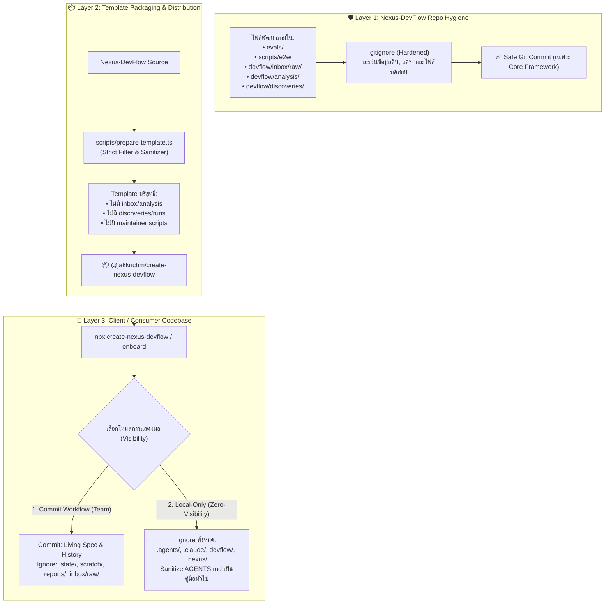

# 🧭 [DISC-20260907-002] การสำรวจและวางระบบความสะอาดของไฟล์พัฒนา DevFlow และการแยกแยะไฟล์ไม่ให้ Client เห็น (Client Isolation & Git Hygiene)

> **Discovery ID**: `DISC-20260907-002`  
> **Topic**: DevFlow Internal Development Files Hygiene, Git Ignore Hardening, and Client Repo Isolation  
> **Date**: 2026-09-07  
> **Status**: `Proceed` *(พร้อมเข้าสู่วงจรส่งมอบใน Feature 074)*  
> **Source**: ผู้ใช้ขอสำรวจแนวทางทำความสะอาดไฟล์พัฒนาของ DevFlow ไม่ให้ Client เห็น และไม่นำไฟล์ขยะ/ไฟล์ทดสอบ/ข้อมูลดิบขึ้น Git  
> **Target Scope**: `.gitignore` Hardening, Template Packaging Filter (`prepare-template.ts`), Inbox Raw File Isolation, และ Zero-Visibility Local-Only Mode Enhancements

---

## 1. Context & Problem Statement

ในการใช้งานและการพัฒนา **Nexus-DevFlow** มีบริบทการทำงานที่ต้องแบ่งแยกความรับผิดชอบและขอบเขตความปลอดภัยออกเป็น 3 เลเยอร์อย่างเด็ดขาด:

1. **เลเยอร์ที่ 1: คลังโค้ดผู้พัฒนาเฟรมเวิร์ก (Nexus-DevFlow Framework Repository)**:
   - มีการพัฒนาสคิล, เครื่องมือ CLI (`packages/create-nexus-devflow`), สคริปต์ทดสอบ (`scripts/`), ชุดประเมินผล (`evals/`), เอกสารการซิงก์ upstream (`devflow/inbox/`, `devflow/analysis/`), และบันทึกการสำรวจ (`devflow/discoveries/`)
   - **ปัญหา**: หากไม่มีการควบคุม `.gitignore` อย่างรัดกุม ไฟล์ชั่วคราว, ไบนารี diff, แคชการทดสอบ หรือไฟล์ที่ไม่เกี่ยวข้องอาจหลุดเข้าไปใน Git commit ของตัวเฟรมเวิร์ก

2. **เลเยอร์ที่ 2: กระบวนการแพ็กเกจแจกจ่ายเทมเพลต (Packaging & Distribution Pipeline)**:
   - เมื่อรัน `npm run prepare:template` เพื่อเตรียม Bundle สำหรับ `npx @jakkrichm/create-nexus-devflow` ตัวสคริปต์ `prepare-template.ts` จะต้องคัดลอกเฉพาะ Starter Templates ที่จำเป็น สะอาด และปลอดภัย
   - **ปัญหา**: ปัจจุบัน `prepare-template.ts` กรอง `devflow/runs/`, `devflow/history/`, `devflow/discoveries/`, `devflow/.vendor/` แล้ว แต่ยัง **ไม่มีการกรอง `devflow/inbox/`, `devflow/analysis/`, `devflow/scratch/`, `devflow/tmp/`** ซึ่งอาจทำให้ไฟล์วิเคราะห์ภายในของผู้พัฒนาหลุดเข้าไปอยู่ในโปรเจกต์ของ Client ที่ติดตั้ง DevFlow ใหม่

3. **เลเยอร์ที่ 3: โปรเจกต์ของลูกค้า/ผู้ใช้งานปลายทาง (Client / Consumer Project Context)**:
   - ผู้ใช้ปลายทางที่นำ DevFlow ไปติดตั้งในโค้ดเบสของตนเอง มีความต้องการ 2 รูปแบบ:
     - **แบบที่ 1 (Committed Workflow)**: ต้องการแชร์ Living Spec, Backlog และประวัติการส่งมอบ (`devflow/ideas.md`, `devflow/project-plan.md`, `devflow/build-plan.md`, `devflow/history/`, `devflow/context/`) กับทีมงาน แต่ต้อง **ละเว้น (Ignore)** ไฟล์รันชั่วคราว (`devflow/.state/`, `devflow/scratch/`, `devflow/reports/`, `devflow/.vendor/`, `.nexus/`, `prototypes/`, ข้อมูล Raw Inbox ที่อาจมีเอกสารลับของลูกค้า) ออกจาก Git อย่างถาวร
     - **แบบที่ 2 (Local-Only / Zero-Visibility Mode)**: นักพัฒนาต้องการใช้ความสามารถของ AI Blueprint / DevFlow ทำงานในโปรเจกต์ของลูกค้า โดย **ไม่ให้ลูกค้าหรือผู้ตรวจโค้ดภายนอกเห็นโฟลเดอร์ `.agents/`, `.claude/`, `devflow/`, `CLAUDE.md`, `.nexus/`** ใน Git Repository หรือ Pull Request เลย และปรับ `AGENTS.md` ให้เป็นไฟล์คู่มือมาตรฐานทั่วไป

เป้าหมายของ Discovery นี้คือ **วิเคราะห์โครงสร้างไฟล์ทั้งหมด, ออกแบบเกราะป้องกัน 3 ชั้น (3-Layer Defense-in-Depth), ปรับปรุง `.gitignore`, เสริมความปลอดภัยให้ `prepare-template.ts`, และยกระดับคำแนะนำ Workflow Visibility** ให้ผู้ใช้มั่นใจได้ 100% ว่าโค้ดเบสสะอาด ไม่มีไฟล์หลุด และแยกแยะความเป็นส่วนตัวได้อย่างสมบูรณ์

---

## 2. Supporting Routes & Built-in Lenses

### 🔬 Lens 1: Research & Empirical Proof Lens (การสำรวจและตรวจสอบ Codebase จริง)

จากการสแกนและตรวจสอบไฟล์ในระบบปัจจุบัน:

#### ก. การตรวจสอบ `.gitignore` ปัจจุบันของ Nexus-DevFlow
- **ส่วนที่ทำได้ดีแล้ว**:
  - ละเว้น `devflow/runs/*`, `devflow/discoveries/*`, `devflow/reports/*`, `devflow/research/*`, `devflow/scratch/*`, `devflow/decisions/*`, `devflow/tmp/*`, `devflow/temp/*`, `devflow/brainstorm/*`, `devflow/backups/*`
  - ละเว้น `.devflow/`, `devflow/.state/`, `devflow/.vendor/`, `.nexus/*`, `.agent-backup/`, `prototypes/*`, `test-results/`, `coverage/`
- **ช่องโหว่และจุดที่ยังขาด**:
  1. `devflow/inbox/*/raw/*` หรือ `devflow/inbox/`: เมื่อใช้สคิล `/analyze` แล้วผู้ใช้นำไฟล์ดิบ (PDF, Word, Excel, รูปภาพสเปก) มาวาง ไฟล์เหล่านี้อาจมีข้อมูลความลับ (Sensitive Data / PII / Credentials) ซึ่ง **ยังไม่ได้ถูกระบุใน `.gitignore`** ส่งผลให้เสี่ยงต่อการ `git add` ไฟล์ดิบขึ้นไป
  2. `devflow/analysis/*`: ไฟล์ผลการวิเคราะห์สเปกดิบยังไม่ได้อยู่ใน `.gitignore`
  3. `evals/results/` หรือ test sandbox outputs ในระหว่างการทดสอบ E2E

#### ข. การตรวจสอบ `prepare-template.ts` (ตัวเตรียม npm template)
- จากการอ่าน `packages/create-nexus-devflow/scripts/prepare-template.ts` (lines 35–100):
  ```typescript
  // ปัจจุบันมีการกรอง:
  normalized.startsWith("devflow/.state/")
  normalized.startsWith("devflow/context/") (คัดเฉพาะ 4 context หลัก)
  normalized.startsWith("devflow/runs/")
  normalized.startsWith("devflow/history/")
  normalized.startsWith("devflow/discoveries/")
  normalized.startsWith("devflow/decisions/")
  normalized.startsWith("devflow/research/")
  normalized.startsWith("devflow/.vendor/")
  ```
  ⚠️ **จุดบกพร่อง**: ยังขาดการกรอง:
  - `devflow/inbox/`
  - `devflow/analysis/`
  - `devflow/scratch/`
  - `devflow/tmp/`
  - `devflow/temp/`
  - `devflow/brainstorm/`
  - `devflow/backups/`
  - `devflow/reports/`
  - `prototypes/`
  
  หากในระหว่างพัฒนา มีไฟล์ค้างอยู่ในโฟลเดอร์เหล่านี้ จะถูกก๊อปปี้เข้าไปใน template ของ `@jakkrichm/create-nexus-devflow` ทันที

#### ค. การตรวจสอบ Onboard & Adopt Skill Contract
- ใน `.agents/skills/onboard/SKILL.md` และ `.agents/skills/adopt/SKILL.md`:
  - มี Step 6 ถาม DevFlow visibility (`1. Commit DevFlow workflow files` vs `2. Keep DevFlow workflow files local`)
  - แต่ยังขาดการให้รายการ `.gitignore` ที่ครอบคลุมถึง `devflow/inbox/*/raw/` สำหรับโปรเจกต์ที่เลือกแบบ Commit

---

## 3. Scoping & PRD Lens

### 3.1 Problem Statement
1. **Raw Document Leakage Risk**: ลูกค้าหรือนักพัฒนาที่นำไฟล์ Requirements ดั้งเดิม (มีข้อมูลลูกค้า/สเปกลับ) มาวางใน `devflow/inbox/` เสี่ยงที่จะเผลอ `git add` ขึ้น Remote Git
2. **Template Contamination Risk**: การบิลด์แพ็กเกจ npm อาจนำเอาไฟล์วิเคราะห์และไฟล์ inbox จากเครื่องผู้พัฒนาหลุดเข้าไปใน Starter Template
3. **Client Visibility Transparency**: ผู้ใช้ต้องการความชัดเจนในการทำให้โปรเจกต์ที่ส่งมอบลูกค้า "สะอาด 100%" (Zero-Visibility) โดยไม่มีร่องรอยการสั่งงาน AI ตกค้าง

### 3.2 In-Scope
1. **Hardening `.gitignore` (ทั้งใน Repo ตัวเอง และ Template/Onboard)**:
   - เพิ่มการละเว้น `devflow/inbox/*/raw/*` (หรือ `devflow/inbox/raw/`) และ `devflow/analysis/`
   - เพิ่มการละเว้น sandbox, test logs, eval results, และ scratch files
2. **Hardening `prepare-template.ts`**:
   - เพิ่ม Filter กรองโฟลเดอร์ชั่วคราวและโฟลเดอร์วิเคราะห์ทั้งหมด (`inbox`, `analysis`, `scratch`, `tmp`, `temp`, `brainstorm`, `reports`, `prototypes`, `evals`) ไม่ให้หลุดเข้า Starter Template
   - เพิ่ม Automated Test ยืนยันความสะอาดของ Template ก่อน Publish
3. **Clean-up Repository Utility & Verification**:
   - ตรวจสอบและลบไฟล์ชั่วคราวที่ตกค้างใน `nexus-devflow` (เช่น raw diffs ใน `devflow/inbox/` ที่ไม่ได้ใช้งาน)
   - อัปเดต `scripts/validate-framework.ts` หรือ `scripts/smoke-package.ts` ให้มี Health Check ตรวจสอบความสะอาดของ `.gitignore` และ Template
4. **Enhanced Local-Only (Zero-Visibility) Guide**:
   - ปรับปรุงคู่มือใน `onboard/SKILL.md`, `adopt/SKILL.md`, และ `README.md` ให้มีคำอธิบายและ Script แนะนำการสลับเป็น Local-Only Mode และการทำความสะอาดไฟล์ที่เผลอ Commit ไปแล้วด้วย `git rm --cached`

### 3.3 Out-of-Scope
- ไม่เปลี่ยนแปลง Core Workflow Lifecycle (`/feature` -> `/implement` -> `/check` -> `/complete`)
- ไม่กระทบกลไก The 3-Pillars Model ของ DevFlow

---

## 4. Trade-off Comparison Table

| ทางเลือก (Options) | ข้อดี (Pros) | ข้อเสีย / ข้อควรระวัง (Cons) | ข้อสรุป (Recommendation) |
| :--- | :--- | :--- | :--- |
| **Option A: 3-Layer Defense-in-Depth (ปรับ `.gitignore` + Hardening `prepare-template.ts` + ยกระดับ Onboard/Adopt Isolation Contracts)** | • ป้องกันข้อมูลรั่วไหล 100% ทั้งในระดับ Repo, Package, และ Client Codebase<br>• มี Automated Test คอย Guard ก่อนการ Release ทุกครั้ง<br>• รองรับทั้งแบบทีมร่วมพัฒนาและแบบ Local-Only Zero-Visibility | ต้องแก้ไขโค้ด 3-4 จุดและเพิ่มเทสใน `prepare-template.test.ts` | **แนะนำอย่างยิ่ง (Recommended)** |
| **Option B: GitIgnore Only (แก้เฉพาะ `.gitignore` ใน Repo หลัก)** | แก้ไขรวดเร็ว | ไม่ช่วยป้องกัน Template Contamination ใน npm package และไม่ได้ช่วยโปรเจกต์ของ Client ที่ Onboard ไป | **ไม่เพียงพอ (Rejected)** |
| **Option C: Manual Clean Before Publish** | ไม่ต้องแก้โค้ด | มี Human Error สูงมาก เสี่ยงต่อการลืมและเกิดข้อมูลรั่วไหล | **ไม่ปลอดภัย (Rejected)** |

---

## 5. Architecture Decisions (ADR)

### ADR-1: Strict 3-Layer Isolation Boundary
- **สถานะ**: `Accepted`
- **มติ**: การจัดการความสะอาดของไฟล์ต้องแบ่งเป็น 3 เลเยอร์:
  1. *Repo Layer*: `.gitignore` ของ `nexus-devflow` ต้องครอบคลุมไฟล์พัฒนาทั้งหมด
  2. *Build Layer*: `prepare-template.ts` ต้องมี Whitelist / Denylist ที่เข้มงวดเพื่อผลิต Starter Template ที่บริสุทธิ์
  3. *Client Layer*: สคิล `/onboard` และ `/adopt` ต้องสร้าง `.gitignore` ที่ถูกต้องและปลอดภัยให้ Client เสมอ

### ADR-2: Raw Requirement & Secret Quarantine Policy
- **สถานะ**: `Accepted`
- **มติ**: โฟลเดอร์ `devflow/inbox/*/raw/` หรือเอกสารดิบใดๆ ที่ถูกนำเข้ามาเพื่อ parse ผ่าน `/analyze` หรือ `/convert-any-to-md` จะต้องถูกระบุใน `.gitignore` เสมอ เพื่อป้องกันไม่ให้ข้อมูลสเปกความลับของลูกค้าถูก Commit ขึ้น Git โดยไม่ตั้งใจ

### ADR-3: Zero-Visibility Sanitize Protocol
- **สถานะ**: `Accepted`
- **มติ**: สำหรับโปรเจกต์ที่เลือก **Local-Only Workflow**, ระบบจะต้อง:
  - ละเว้น `.agents/`, `.claude/`, `devflow/`, `CLAUDE.md`, `.nexus/`, `prototypes/`
  - ปรับ `AGENTS.md` ให้เป็นคู่มือมาตรฐาน (Standard Project Guide) ที่ไม่มีคำอธิบายเกี่ยวกับ AI Blueprint หรือ DevFlow Skills เพื่อไม่ให้ภายนอกรับรู้ว่าใช้ AI Workflow

---

## 6. Visual Architecture Diagram



---

## 7. Decision & Next Steps

- **Decision**: `Proceed`
- **Target Feature ID**: `074-devflow-development-files-hygiene-and-client-isolation`
- **Recommended Command**:
  ```text
  /feature 074-devflow-development-files-hygiene-and-client-isolation
  ```
