# 🧭 [DISC-20260911-001] การสำรวจและประเมินการซิงก์ Upstream AI Blueprint (v1.6.1)

> **Discovery ID**: `DISC-20260911-001`  
> **Topic**: Upstream AI Blueprint v1.6.1 Synchronization — 5 Core Stability & Security Pillars  
> **Date**: 2026-09-11  
> **Status**: `Proceed` *(พร้อมกำหนดแผนงานส่งมอบใน Feature 086)*  
> **Source**: Upstream Repository (`aiblueprinthq/ai-blueprint` Tag: `v1.6.1` / Commits: `eb24e36` ถึง `dc2cb64`) & Nexus-DevFlow (`v2.16.3`)  
> **Target Scope**: 
> 1. Installer Destination Validation & Symlink Rejection (`eb24e36`)
> 2. Safe Completion Interruption Recovery Protocol (`ab869aa`, `completion-recovery.md`)
> 3. Rebuild History Preservation & Multi-Attempt Pathing (`1969281`, `build-history.md`, `--build-N`)
> 4. Local-Only Spec Independent Review & Snapshot Verification (`d7441ec`, `specSnapshot`)
> 5. Status Evidence Alignment & Blocker Classification (`fa14872`, `classifyWorkEvidence`)
> 6. Build Plan Normalization & AI Attribution Clarification (`6817de6`, `b1309ff`)

---

## 1. Context & Problem Statement

Nexus-DevFlow ทำหน้าที่เป็น Super-set Agentic Framework เหนือ **AI Blueprint** โดยผสานสถาปัตยกรรม **The 3-Pillars Workspace Architecture** และ **Task-Isolated Living Spec Model** เข้ากับเครื่องมือและสคิลวิศวกรรมเฉพาะทาง (เช่น `analyze`, `bughunter`, `archify`, `diagram-design`, `ponytail`)

จากการตรวจสอบการเคลื่อนไหวล่าสุดของ Upstream Repository (`aiblueprinthq/ai-blueprint`) พบว่ามีการปล่อยเวอร์ชันอัปเดตสำคัญคือ **AI Blueprint v1.6.1 (`dc2cb64`)** ซึ่งแก้ไขจุดอ่อนเชิงความปลอดภัย ความทนทานต่อข้อผิดพลาดระหว่างส่งมอบงาน และความแม่นยำของสถานะโครงการใน 5 ประเด็นวิกฤต:

1. **Installer Destination Vulnerability**: ตัวติดตั้งแพ็กเกจเดิม (`create-nexus-devflow`) คัดลอกไฟล์ลงในโฟลเดอร์ปลายทางโดยไม่ได้ตรวจสอบว่า Path นั้นเป็น Symbolic Link หรือไม่ หรือมีข้อขัดแย้งเชิงประเภท (Directory vs File) หรือไม่ ซึ่งเปิดโอกาสให้เกิดการโจมตีประเภท Symlink Traversal / Arbitrary File Overwrite หรือทิ้งสถานะติดตั้งค้างคาครึ่งๆ กลางๆ (Partial Install)
2. **Fragile Completion Flow on Disconnection / Interruption**: เมื่อรันคำสั่ง `/complete` แล้วเกิดการสะดุดหรือหลุดการเชื่อมต่อ (Session Crash, Agent timeout, Process interruption) กลไกเดิมไม่มีการบันทึก Checkpoint เชิงโครงสร้าง ทำให้เกิดความเสี่ยงที่การเขียน Archive จะเกิดขึ้นซ้ำ หรือเริ่มงานฟีเจอร์ถัดไปก่อนที่ Git commit และ Squash-merge จะเสร็จสมบูรณ์
3. **History Collision upon Feature Rebuilds**: ในกรณีที่ฟีเจอร์หนึ่งเคยถูกส่งมอบและถูก Rollback คืนประวัติไปแล้ว เมื่อมีการนำฟีเจอร์นั้นกลับมา Rebuild หรือพัฒนาใหม่ กลไกการตั้งชื่อไฟล์ Archive เดิมจะทำให้ไฟล์ใหม่เขียนทับ Archive เดิม ทำลายหลักฐานการตรวจสอบและ Findings Reference ย้อนหลัง
4. **Local-Only Living Spec Review Friction**: การตรวจสอบอิสระ (`/audit independent current`) ในอดีตผูกติดกับ Git Commit Tree ทำให้ Living Spec หรือเอกสารประกอบที่ตั้งใจเก็บไว้แบบ Local-Only (เช่น อยู่ใน `.state/` หรือถูก gitignore) ไม่สามารถสร้างหลักฐานการตรวจทานที่น่าเชื่อถือได้
5. **False Ready State in Status & Dashboard**: ระบบประเมินสถานะโครงการ (`project-status-engine.ts`) และ Dashboard อาจแสดงสถานะพร้อมส่งมอบ (`Ready for completion`) แม้ว่าขั้นตอน Verification จะล้มเหลว (`verification failed`) หรือตรวจพบว่าเอกสาร Findings หรือ Review ชำรุด (Malformed / Unsafe Symlink) ทำให้เสี่ยงต่อการหลุดของโค้ดที่ไม่ผ่านเกณฑ์

---

## 2. Supporting Routes & Built-in Lenses

### 🔬 Lens 1: Research & Empirical Proof Lens (การวิเคราะห์เชิงเปรียบเทียบและการตรวจสอบ Codebase)

จากการตรวจสอบ Git Diff ระหว่าง `v1.6.0 (e141963)` และ `v1.6.1 (dc2cb64)` ใน `aiblueprinthq/ai-blueprint`:
- รวมทั้งสิ้น **8 Commits**, มีการเปลี่ยนแปลง **50 Files**, เพิ่มโค้ด **2,728 บรรทัด** และลบโค้ด **474 บรรทัด**
- เพิ่มเอกสารสัญญาใหม่ 2 ฉบับ:
  - `completion-recovery.md` (254 บรรทัด) ใน `.agents/skills/complete/reference/` และ `.claude/`
  - `build-history.md` (79 บรรทัด) ใน `.agents/skills/feature/reference/` และ `.claude/`

#### รายละเอียดเชิงเปรียบเทียบในแต่ละเสาหลัก:

| เสาหลัก | กลไกใน Upstream v1.6.1 | สภาพปัจจุบันใน Nexus-DevFlow (v2.16.3) | แนวทางการนำมาปรับใช้ (Adaptation Strategy) |
| :--- | :--- | :--- | :--- |
| **1. Installer Validation** | ฟังก์ชัน `validateInstallDestinations()` และ `assertDestinationType()` ตรวจจับ Symlinks และปฏิเสธการติดตั้งทันทีหากพบ Symlink หรือ Type ไม่ตรง | `packages/create-nexus-devflow/bin/create-nexus-devflow.ts` ยังใช้การตรวจจับพื้นฐานด้วย `fs.existsSync` | นำฟังก์ชัน `assertDestinationType` และการตรวจจับ Symlinks มาใส่ใน `create-nexus-devflow.ts` ก่อนการ Copy ไฟล์ template ทั้งหมด |
| **2. Completion Recovery** | ตรวจจับและฝัง JSON Comment Annotation `<!-- blueprint:completion {...} -->` พร้อมระบุ Phase (1: Archive, 2: Commit, 3: Merged) ตรวจสอบความถูกต้องด้วย UTF-8 byte length, SHA-256 และ Git Source Tree | `/complete` มีการจัดเก็บ Task-Isolated Run ใน `devflow/context/{xxx-slug}/` แล้วย้ายเข้า `devflow/history/` แต่ยังขาด JSON Recovery Comment และ Fallback Phase Reader เมื่อเกิด Interrupt | เพิ่มสัญญา `completion-recovery.md` โดยปรับให้เข้ากับ Task-Isolated Living Spec (`devflow/context/{xxx-slug}/spec.md`), ฝัง `<!-- devflow:completion {...} -->` และเพิ่ม Recovery Handlers ใน `/complete` และ `/continuous` |
| **3. Rebuild History** | ตรวจจับ Feature ID จาก `From build-plan:` รองรับการตั้งชื่อไฟล์แบบ `NN-slug--build-N.md` สำหรับ Attempt N > 1 | จัดเก็บแบบ `devflow/history/features/{xxx-slug}.md` ซึ่งจะเกิดชื่อชนกันหากสร้างซ้ำ | เพิ่มสัญญา `build-history.md` ใน `feature/` และ `rollback/` เพื่อรองรับ suffix `--build-N` อย่างเป็นระบบ |
| **4. Local-Only Spec Review** | เพิ่มฟิลด์ `specSnapshot` (`blueprint/.state/review-specs/${targetCommit}-${specHash}.md`) ตรวจความถูกต้องของ Spec ที่ไม่ถูก commit ลง Git | `packages/create-nexus-devflow/lib/review.ts` ยังขาดฟิลด์ `specSnapshot` | ขยาย Parser และ Verifier ใน `review.ts` ให้รองรับ `specSnapshot` ทั้งในการตรวจความสดใหม่และการบันทึก Receipt |
| **5. Status Evidence Alignment** | ฟังก์ชัน `classifyWorkEvidence()` ตรวจสถานะ `verified`, `verification failed`, `verification incomplete`, `malformed_findings`, `unsafe_findings_path` | `project-status-engine.ts` ยังแยกส่วนตรวจ และไม่ได้บล็อกสถานะ Ready เมื่อพบ `verification failed` | บูรณาการ `classifyWorkEvidence` เข้าสู่ `project-status-engine.ts` และปรับ Next Action ให้ชี้ไปที่ `/implement` เมื่อ verification failed หรือ `/doctor` เมื่อพบ faults |

---

### 💡 Lens 2: Brainstorming Lens (Divergent & Convergent Options)

#### ตัวเลือกเชิงกลยุทธ์ (Options Exploration):

- **Option A: Full Upstream Parity & Hardened DevFlow Lifecycle (แนะนำ)**:
  - พอร์ตครบทั้ง 5 เสาหลักเข้าสู่ Nexus-DevFlow
  - ปรับปรุงตัวติดตั้ง `create-nexus-devflow` ให้มีระบบป้องกัน Symlink Traversal
  - สร้างสัญญา `completion-recovery.md` และ `build-history.md` ที่รองรับ Task-Isolated Living Spec โมเดล
  - ขยาย `review.ts` และ `project-status-engine.ts` ให้ตรงกับ Upstream 100%
  - ผลลัพธ์: ระบบมีความปลอดภัยสูงสุด ทนทานต่อการขัดข้อง และไม่มีทางเกิดข้อมูลสูญหาย
- **Option B: Core Engines Only (พอร์ตเฉพาะส่วน Status และ Review)**:
  - แก้ไขเฉพาะ `review.ts` และ `project-status-engine.ts` ข้ามส่วน Installer และ Completion Recovery
  - ข้อเสีย: ยังคงเสี่ยงต่อ Symlink Traversal ในตัวติดตั้ง และเสี่ยงต่อการหลุดสถานะเมื่อ `/complete` ขัดข้อง
- **Option C: Defer (คงสถานะเดิม)**:
  - ไม่แนะนำ เนื่องจาก Upstream v1.6.1 ได้รับการเผยแพร่แล้ว การปล่อยให้ความต่างของสัญญาสะสมจะส่งผลกระทบต่อความเสถียร

#### ตารางเปรียบเทียบข้อดี-ข้อเสีย (Trade-off Matrix):

| ทางเลือก | ข้อดี (Pros) | ข้อเสีย / ความเสี่ยง (Cons) | ข้อสรุป (Recommendation) |
| :--- | :--- | :--- | :--- |
| **Option A (Full Upstream Parity)** | • ยกระดับความปลอดภัยของตัวติดตั้ง ป้องกัน Symlink Attack<br>• ป้องกันข้อมูลสูญหายเมื่อการส่งมอบงานสะดุดด้วย Recovery Engine<br>• ขจัดปัญหาชื่อซ้ำเมื่อ Rebuild ฟีเจอร์ที่เคย Rollback<br>• สถานะบน Dashboard และ CLI ถูกต้องแม่นยำ 100% | มีจุดแก้ไขหลายไฟล์ทั้งในสคิลและ Core TypeScript Libraries | **แนะนำอย่างยิ่ง (Recommended)** |
| **Option B (Core Engines Only)** | ทำได้รวดเร็ว | ทิ้งช่องโหว่ด้านความปลอดภัยและการสูญหายของบริบทในขั้นตอนส่งมอบ | **ปฏิเสธ (Rejected)** |
| **Option C (Defer)** | ไม่ต้องเขียนโค้ดเพิ่ม | เกิดปัญหา Upstream Drift และความคลาดเคลื่อนของสัญญา | **ปฏิเสธ (Rejected)** |

---

### 📋 Lens 3: PRD & Scoping Lens

#### 3.1 Problem Statement
ผู้ใช้และ AI Agent ต้องการความมั่นใจว่าการติดตั้งแพ็กเกจจะปลอดภัย ไม่สามารถถูกเจาะผ่าน Symbolic Links ได้, กระบวนการส่งมอบงานจะไม่สูญหายหรือทิ้งสถานะค้างคาเมื่อเกิดอุบัติเหตุในเซสชัน, ประวัติการพัฒนาในอดีตจะไม่ถูกเขียนทับเมื่อมีการ Rebuild, และสถานะของโครงการที่แสดงผลจะต้องสอดคล้องกับหลักฐานการทดสอบจริงเสมอ

#### 3.2 Target Personas
- **Developer / Agent Operator**: ผู้ใช้งานคำสั่ง `/feature`, `/complete`, `/status` ที่ต้องการความแน่นอนและเสถียรภาพสูงสุด
- **Platform Maintainer**: ผู้ดูแลโครงสร้างพื้นฐาน Nexus-DevFlow ที่ต้องรับประกันว่าโค้ดติดตั้งมีความปลอดภัยระดับ Enterprise
- **Senior QA / Auditor**: ผู้ตรวจทานความสมบูรณ์ของ Verification Matrix และ Independent Review Receipts

#### 3.3 In-Scope Boundaries
1. **Installer Security Layer**:
   - ปรับปรุง `packages/create-nexus-devflow/bin/create-nexus-devflow.ts` เพิ่มการตรวจ `validateInstallDestinations()` และ `assertDestinationType()` ปฏิเสธ Symlink Paths ทั้งหมด
   - เพิ่มชุดทดสอบ `install.test.ts` ตรวจสอบสถานการณ์ Symlink หลากหลายรูปแบบ
2. **Completion Recovery Protocol**:
   - สร้างไฟล์สัญญา `.agents/skills/complete/reference/completion-recovery.md` และ `.claude/skills/complete/reference/completion-recovery.md`
   - ปรับปรุง `complete/SKILL.md` และ `continuous/SKILL.md` ให้ฝังและอ่าน `<!-- devflow:completion {...} -->`
   - รองรับการกู้คืนครบทั้ง 3 Phase (1: Archive Pending Work Commit, 2: Branch Work Commit Pending Merge, 3: Default Branch Merged Pending Workspace Cleanup)
3. **Rebuild History Preservation**:
   - สร้างไฟล์สัญญา `.agents/skills/feature/reference/build-history.md` และ `.claude/skills/feature/reference/build-history.md`
   - ปรับปรุง `feature/SKILL.md`, `rollback/SKILL.md` และ `continuous/SKILL.md` ให้รองรับรูปแบบการตั้งชื่อ `--build-N`
4. **Local-Only Spec Review & Snapshot Verification**:
   - อัปเกรด `packages/create-nexus-devflow/lib/review.ts` ให้รองรับ `specSnapshot` และการอ่าน Hash จาก `devflow/.state/review-specs/`
   - ปรับปรุง `audit/SKILL.md` และ `audit/reference/independent-review.md`
5. **Status Evidence Alignment**:
   - อัปเกรด `packages/create-nexus-devflow/lib/project-status-engine.ts` และ `packages/create-nexus-devflow/lib/dashboard.ts` ให้มี `classifyWorkEvidence()`
   - บล็อกสถานะ Ready เมื่อพบ `verification failed`, `verification incomplete`, `malformed_findings`, `unsafe_findings_path`, หรือ `malformed_review`
   - ปรับคำสั่งถัดไปให้ชี้ไปที่ `/implement` หรือ `/doctor` อย่างถูกต้อง
6. **Build Plan Simplification & AI Attribution Guidance**:
   - ปรับปรุง `overview/SKILL.md`, `AGENTS.md`, `CLAUDE.md`, และ `devflow/context/ai-interaction.md`

#### 3.4 Out-of-Scope Boundaries
- ไม่เปลี่ยนแปลงโครงสร้าง The 3-Pillars Core Directories (`devflow/ideas.md`, `devflow/context/{xxx-slug}/`, `devflow/history/`)
- ไม่แตะต้องสคิลเฉพาะทางที่ติดตั้งเสริม (`bughunter`, `archify`, `diagram-design`, `ponytail`)
- ไม่กระทบต่อการทำงานของ MCP Engine (`mcp-server-engine.ts`)

---

### 🐛 Lens 4: Issue & Bug Triage Lens (การประเมินความเสี่ยงและระดับความรุนแรง)

| รหัสความเสี่ยง | อาการและผลกระทบ (Symptom & Impact) | ระดับความรุนแรง | การแก้ไขและป้องกันใน Feature 086 |
| :--- | :--- | :--- | :--- |
| **SEC-01** | **Symlink Path Traversal ในตัวติดตั้ง**: หากมี Symlink ชี้ออกนอก Workspace ตัวติดตั้งอาจเขียนทับไฟล์ระบบสำคัญ | **Critical / High (P1)** | เพิ่ม `assertDestinationType` สแกนทุก Entry ก่อนคัดลอกไฟล์จริง หากพบ Symlink ให้หยุดการทำงานทันที |
| **RES-01** | **Completion Interruption Context Loss**: หากการส่งมอบงานสะดุดระหว่างเขียน Archive และ Squash-merge งานอาจค้างและหลุด Flow | **High (P1)** | เพิ่ม `completion-recovery.md` ฝัง JSON Signature และสร้างฟังก์ชัน Resume ตาม Phase ที่ค้างอยู่ |
| **DAT-01** | **History Overwrite on Rebuilt Features**: ฟีเจอร์ที่ถูกทำซ้ำหลัง Rollback จะเขียนทับ Archive เดิม ทำให้ประวัติการตรวจสอบสูญหาย | **Medium (P2)** | เพิ่มกฎการตั้งชื่อ `--build-N` ป้องกันการชนกันของ Path ใน `devflow/history/features/` |
| **DAT-02** | **Tampered Local-Only Living Spec**: Spec ที่ไม่ได้ commit ลง Git อาจถูกแก้ไขโดยไม่ผ่านการตรวจสอบความสมบูรณ์ | **Medium (P2)** | บันทึกและตรวจ SHA-256 Snapshot ใน `devflow/.state/review-specs/` |
| **LOG-01** | **False Ready State on Verification Failure**: โค้ดที่ไม่ผ่านการทดสอบอาจถูกระบุว่าพร้อมส่งมอบบน Dashboard และ CLI | **Medium (P2)** | นำ `classifyWorkEvidence` มาควบคุมสถานะ Completion Ready โดยเด็ดขาด |

---

### 🗣️ Lens 5: Socratic Alignment & Domain Terms (Glossary & ADRs)

#### นิยามคำศัพท์และ Domain Terms ใหม่:
- **Completion Recovery Protocol**: กระบวนการตรวจสอบและกู้คืนขั้นตอนการส่งมอบงานที่สะดุดหรือหลุดการเชื่อมต่อ โดยใช้หลักฐานจาก Git Tree, Hash ของ Spec และ JSON Recovery Comment
- **Build Attempt Suffix (`--build-N`)**: รูปแบบการตั้งชื่อไฟล์ Archive สำหรับงานที่สร้างขึ้นใหม่หลังจากการ Rollback (เช่น `04-export--build-2.md`) เพื่อไม่ให้ทำลายประวัติเดิม
- **Spec Snapshot**: ไฟล์บันทึกสำเนาและ Hash ของ Living Spec ใน `devflow/.state/review-specs/` เพื่อยืนยันว่า Spec ไม่ถูกดัดแปลงในกรณีที่ทำงานแบบ Local-Only
- **Work Evidence Classification**: การจำแนกความถูกต้องของหลักฐานการตรวจสอบและรายงานข้อบกพร่อง เพื่อกำหนดความพร้อมส่งมอบของฟีเจอร์อย่างปลอดภัย

#### Architecture Decision Records (ADRs):

- **ADR-0011: Mandatory Pre-Install Destination Verification**:
  - *Context*: ป้องกันการเจาะระบบผ่าน Symbolic Links และป้องกันสถานะ Half-Installed
  - *Decision*: สแกนทุกไฟล์และโฟลเดอร์ปลายทางด้วย `fs.lstat` ก่อนเริ่มคัดลอกไฟล์ใดๆ หากพบ Symbolic Link หรือ Type ไม่ตรงกัน ให้ Revert และปฏิเสธการติดตั้งทันที
- **ADR-0012: Safe Resumable Completion via Embedded Hash Signatures**:
  - *Context*: การส่งมอบงานอาจถูกขัดจังหวะด้วยปัญหาเครือข่ายหรือเซสชันของ Agent
  - *Decision*: ฝัง JSON Comment `<!-- devflow:completion {...} -->` ที่มี `specBytes`, `specSha256`, `sourceTree` ลงใน Archive และใช้สัญญานี้เป็นจุดอ้างอิงในการกู้คืนงานเสมอ
- **ADR-0013: Immutable History Preservation for Rebuilt Features**:
  - *Context*: ฟีเจอร์ที่ถูก Rollback แล้วนำกลับมาสร้างใหม่ต้องไม่ทำลายประวัติเดิม
  - *Decision*: สงวนชื่อไฟล์เดิมไว้ และบังคับใช้ส่วนขยาย `--build-N` สำหรับ Attempt ถัดไปเสมอ

---

### 🎨 Lens 6: Visual Architecture & Diagram Design Lens

สถาปัตยกรรมและแผนภาพการทำงานของระบบซิงก์ส่วนขยาย Upstream v1.6.1 ถูกสร้างและบันทึกไว้ในรูปแบบ **Standalone Light Theme HTML Playbook**:
- **ไฟล์แผนภาพแบบโต้ตอบ**: [devflow/discoveries/DISC-20260911-001-sync-upstream-ai-blueprint-v161/diagrams/sync-upstream-v161-architecture.html](file:///d:/devtools/nexus-devflow/devflow/discoveries/DISC-20260911-001-sync-upstream-ai-blueprint-v161/diagrams/sync-upstream-v161-architecture.html)

```mermaid
flowchart TD
    subgraph S1["🛡️ 1. ขั้นตอนติดตั้ง (Installer Validation)"]
        ScanPath["ตรวจสอบ Path ปลายทางทั้งหมด"] --> CheckSymlink{"เป็น Symbolic Link\nหรือ Incompatible Type?"}
        CheckSymlink -- ใช่ --> RejectInstall["🛑 ปฏิเสธการติดตั้งทันที\n(ป้องกัน Symlink Escape & Partial Install)"]
        CheckSymlink -- ไม่ใช่ --> ProceedCopy["คัดลอกไฟล์ Template และบันทึก Manifest"]
    end

    subgraph S2["📚 2. การสร้างและกู้คืนประวัติ (Build History)"]
        CreateSpec["เริ่มสร้าง Spec / Rebuild Feature"] --> CheckHistory{"เคยมี Archive เดิม\nใน History หรือไม่?"}
        CheckHistory -- มี --> UseBuildSuffix["ตั้งชื่อไฟล์ด้วย --build-N\n(เช่น NN-slug--build-2.md)"]
        CheckHistory -- ไม่มี --> NormalPath["ตั้งชื่อไฟล์ปกติ (NN-slug.md)"]
    end

    subgraph S3["🔍 3. ตรวจทานอิสระ (Local-Only Review)"]
        RunReview["รัน /audit independent current"] --> CheckGitState{"Spec ถูก Commit ใน Git หรือไม่?"}
        CheckGitState -- ไม่ได้ Commit (Local-Only) --> MakeSnapshot["บันทึก Snapshot ใน .state/review-specs/\nและผูก specSnapshot ใน Receipt"]
        CheckGitState -- Commit แล้ว --> StandardReview["ตรวจทานผ่าน Git Tree Hash ปกติ"]
    end

    subgraph S4["⚖️ 4. ตรวจสอบหลักฐานสถานะ (Status Evidence)"]
        ClassifyEvidence["classifyWorkEvidence()"] --> EvidenceCheck{"ผลการตรวจสอบ\nและสถานะ Findings/Review"}
        EvidenceCheck -- "Verification Failed" --> BlockerImplement["❌ บล็อกสถานะ Ready\nNext Action ➔ /implement"]
        EvidenceCheck -- "Malformed / Unsafe" --> BlockerDoctor["⚠️ บล็อกสถานะ Ready\nNext Action ➔ /doctor"]
        EvidenceCheck -- "Verified & Clean" --> AllowComplete["✅ สถานะ Ready for Completion\nNext Action ➔ /complete"]
    end

    subgraph S5["🔄 5. การส่งมอบและการกู้คืน (Completion Recovery)"]
        StartComplete["รัน /complete"] --> EmbedAnnotation["ฝัง JSON Recovery Signature ใน Archive\n<!-- devflow:completion {...} -->"]
        EmbedAnnotation --> CompletePhase{"เกิดเหตุขัดข้อง\nระหว่างทำงานหรือไม่?"}
        CompletePhase -- ขัดข้องใน Phase 1/2/3 --> ResumeRecovery["กู้คืนงานจาก Archive Signature\nและ Git State อย่างปลอดภัย"]
        CompletePhase -- สำเร็จราบรื่น --> CleanContext["Archive สมบูรณ์, Clean Context Workspace\nและ Squash-Merge เข้าสู่ Main"]
    end
```



---

## 3. Target Delivery Scope & Work Breakdown (Feature 086)

กำหนดหมายเลขส่งมอบเป็น **Phase 36: Feature 086-sync-upstream-ai-blueprint-v161** `[Size: M]`:

### ก. กลุ่มงาน Installer Security & Testing (`packages/create-nexus-devflow/`)
- เพิ่ม `validateInstallDestinations()` และ `assertDestinationType()` ใน `bin/create-nexus-devflow.ts`
- เพิ่มชุดทดสอบ `packages/create-nexus-devflow/test/install.test.ts` ครอบคลุมการปฏิเสธ Symlink ทั้ง Dangling, File, Directory และ Incompatible types

### ข. กลุ่มงาน Completion Recovery Protocol (`skills/complete/`, `skills/continuous/`)
- สร้าง `.agents/skills/complete/reference/completion-recovery.md` และ `.claude/skills/complete/reference/completion-recovery.md`
- ปรับปรุง `complete/SKILL.md` และ `continuous/SKILL.md` ให้รองรับการเตรียม Archive พร้อม JSON Signature `<!-- devflow:completion {...} -->` และขั้นตอน Resume Recovery

### ค. กลุ่มงาน Build History Preservation (`skills/feature/`, `skills/rollback/`)
- สร้าง `.agents/skills/feature/reference/build-history.md` และ `.claude/skills/feature/reference/build-history.md`
- ปรับปรุง `feature/SKILL.md` และ `rollback/SKILL.md` ให้รองรับการตรวจสอบ Attempt ซ้ำและการกำหนดชื่อไฟล์ `--build-N`

### ง. กลุ่มงาน Local-Only Independent Review (`lib/review.ts`, `skills/audit/`)
- อัปเกรด `packages/create-nexus-devflow/lib/review.ts` ให้รองรับ `specSnapshot` และการอ่าน Snapshot จาก `devflow/.state/review-specs/`
- เพิ่มชุดทดสอบใน `packages/create-nexus-devflow/test/review.test.ts`

### จ. กลุ่มงาน Status Engine Evidence Alignment (`lib/status.ts`, `lib/dashboard.ts`)
- บูรณาการ `classifyWorkEvidence()` เข้าสู่ `packages/create-nexus-devflow/lib/project-status-engine.ts` และ `packages/create-nexus-devflow/lib/status.ts`
- ปรับปรุง `dashboard.ts` ป้องกัน False Ready Alerts
- เพิ่มชุดทดสอบใน `packages/create-nexus-devflow/test/status.test.ts` และ `dashboard.test.ts`

### ฉ. การปรับปรุงเอกสารและ Verification Framework
- อัปเกรด `scripts/check-upstream-drift.ts`, `scripts/validate-framework.ts`
- อัปเดต `devflow/context/ai-interaction.md`, `AGENTS.md`, `CLAUDE.md`, และ `README.md`
- รันชุดทดสอบความถูกต้อง `npm run check:static`, `npm test`, `npm run test:package` ผ่าน 100%

---

## 4. Decision & Next Steps

- **Decision**: `Proceed` (มีหลักฐานและความพร้อมครบถ้วน)
- **Proposed Phase in Build Plan**: **Phase 36: Sync Upstream v1.6.1 (Installer Symlink Rejection, Completion Recovery Engine, Rebuild History Preservation, Local-Only Spec Review & Status Evidence Alignment)**
- **Target Feature ID**: `086-sync-upstream-ai-blueprint-v161`
- **Recommended Command**:
  ```text
  /feature 086-sync-upstream-ai-blueprint-v161
  ```
