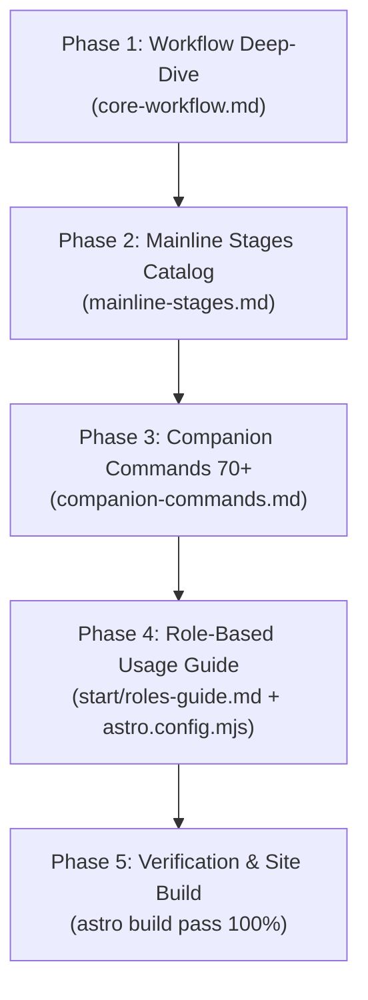

# Phase 30: Implementation Plan

- **Running ID**: `RUN-011-sync-comprehensive-docs-to-website`
- **Title**: แผนการดำเนินงานปรับปรุงและสังเคราะห์เนื้อหาบนเว็บไซต์คู่มือ Nexus-DevFlow จากคลังเอกสารทางการในโฟลเดอร์ `docs/`
- **Source Spec**: [20-spec.md](20-spec.md)
- **Artifact Language**: th
- **Complexity**: Standard
- **Status**: Approved
- **Created Date**: 2026-08-18
- **Owner**: DevFlow Documentation & DX Team

---

## 1. ข้อมูลการวางแผนและบริบท (Planning Context & Evidence)

- **เป้าหมาย**: ปรับปรุงหน้าเว็บไซต์คู่มือทั้งหมดให้สะท้อนข้อเท็จจริงล่าสุดจากโฟลเดอร์ `docs/` (`USAGE.md`, `workspace-artifacts.md`, `example-runs.md`, `markdown-metadata-contract.md`, `manual-review-workflow-spec.md`, `workflow-surface-map.md`, `team-presets.md`, `governance-rules.md`)
- **รูปแบบการนำเสนอ**: ใช้การอธิบายเชิงลึกแบบ Non-Table เสริมด้วยกล่องผังขั้นตอนการทำงาน (Interactive HTML Pipeline Flow) และ Checklist UI สำหรับการติดตามงาน
- **เกณฑ์การตัดสินใจด้านการทดสอบ (Test Decision Gate)**: เนื่องจากงานนี้เป็นการปรับปรุงไฟล์เอกสาร Markdown (`.md`/`.mdx`) และการตั้งค่า Starlight การตรวจสอบหลักจึงใช้การ Verify การบิลด์เว็บไซต์จริง (`astro build`) และการตรวจทานความครบถ้วนของเนื้อหา

---

## 2. ลำดับขั้นตอนการดำเนินงาน (Ordered Implementation Phases)



---

### 🔹 Phase 1: ปรับปรุงหน้า Core Workflow Timeline และผังขั้นตอน
- **เป้าหมาย**: อธิบายกระบวนการ 8 ขั้นตอน (`00-discover` ถึง `70-release`) เชิงลึกแบบ Non-Table พร้อม Interactive HTML Diagram
- **ไฟล์ที่แก้ไข**: `website/src/content/docs/workflow/core-workflow.md`
- **งานย่อย (Subtasks)**:
  1. เพิ่มกล่อง Interactive HTML Pipeline Flow สำหรับแสดง Discovery & Delivery Mainline
  2. ขยายความทั้ง 8 Stages ครบ 5 มิติ (Purpose, Inputs, Loop, Artifacts, Review Gate Criteria)
  3. เพิ่มคำอธิบาย ID Isolation และการแยก Namespace ระหว่าง Discovery ID กับ Running ID
- **Test Decision**: `Not Required (Documentation)`
- **Verification**: ตรวจทาน Markdown Syntax และความถูกต้องของเนื้อหา

---

### 🔹 Phase 2: ปรับปรุงหน้า Mainline Stages Command Reference
- **เป้าหมาย**: จัดทำคู่มือคำสั่ง 00-70 พร้อมไวยากรณ์ Universal Invocation ครบทุกเครื่องมือ
- **ไฟล์ที่แก้ไข**: `website/src/content/docs/commands/mainline-stages.md`
- **งานย่อย (Subtasks)**:
  1. เพิ่มตัวอย่างคำสั่งครอบคลุมทั้ง Claude/Antigravity (`/`), OpenAI Codex (`$`), และ Plain CLI
  2. เพิ่มตารางเส้นทางการสืบค้นร่วม (Supporting Routes) สำหรับ Stage 00
  3. ใส่ตัวอย่างพาธ Artifact และมาตรฐาน Checklist Layer
- **Test Decision**: `Not Required (Documentation)`
- **Verification**: ตรวจทาน Command Syntax ให้ตรงกับ `.agents/skills/`

---

### 🔹 Phase 3: ปรับปรุงหน้า Companion Commands ครบ 8 หมวดหมู่ (70+ Skills)
- **เป้าหมาย**: รวบรวมและแจกแจงคำสั่งตาม 8 หมวดหมู่วิศวกรรมซอฟต์แวร์
- **ไฟล์ที่แก้ไข**: `website/src/content/docs/commands/companion-commands.md`
- **งานย่อย (Subtasks)**:
  1. จัดกลุ่ม 70+ Skills ใน `.agents/skills/` ออกเป็น 8 หมวดหมู่
  2. อธิบายหน้าที่ วิธีการเรียกใช้ และ Use Case ตัวอย่างของแต่ละ Command
- **Test Decision**: `Not Required (Documentation)`
- **Verification**: ตรวจสอบว่าไม่มีชื่อ Skill ตกหล่นหรือมี Skill ปลอม

---

### 🔹 Phase 4: สร้างหน้า Role-Based Guides และเชื่อมต่อ Sidebar
- **เป้าหมาย**: จัดทำคู่มือเฉพาะทางสำหรับแต่ละระดับบทบาท (Junior ถึง Manager)
- **ไฟล์ที่สร้าง/แก้ไข**:
  - สร้างใหม่: `website/src/content/docs/start/roles-guide.md`
  - แก้ไข: `website/astro.config.mjs`
- **งานย่อย (Subtasks)**:
  1. เขียนเนื้อหา 4 Path: Junior Developer, Senior Engineer, Tech Lead, และ PM/EM
  2. เพิ่มรายการเมนู `Role-Based Guides` ใน Sidebar หมวด `Start`
- **Test Decision**: `Manual/Command Only`
- **Verification**: ตรวจสอบการแสดงผลเมนูบน Sidebar ของเว็บไซต์

---

### 🔹 Phase 5: การตรวจสอบความสมบูรณ์และการ Build เว็บไซต์
- **เป้าหมาย**: ยืนยันว่าเว็บไซต์สามารถ Build ได้อย่างสมบูรณ์แบบ
- **คำสั่งที่ใช้**: `npm run docs:build` (หรือ `astro build` ใน `website/`)
- **เกณฑ์ความสำเร็จ**:
  - ผลการบิลด์สำเร็จ 100% (สร้าง 17+ static HTML pages)
  - ไม่มี Broken Link หรือ Pagefind Index Warning
- **Test Decision**: `Manual/Command Only`

---

## 3. แผนการติดตามความคืบหน้าด้วย Checklist (Checklist Tracking)

จะทำการสร้างไฟล์ติดตามสถานะงานในโฟลเดอร์ `checklists/`:
- `devflow/runs/RUN-011-sync-comprehensive-docs-to-website/checklists/implementation-checklist.md`
- `devflow/runs/RUN-011-sync-comprehensive-docs-to-website/checklists/verification-checklist.md`

---

## 4. คำสั่งขั้นตอนถัดไป (Next Stage Command)

```text
/40-implement RUN-011-sync-comprehensive-docs-to-website
```
