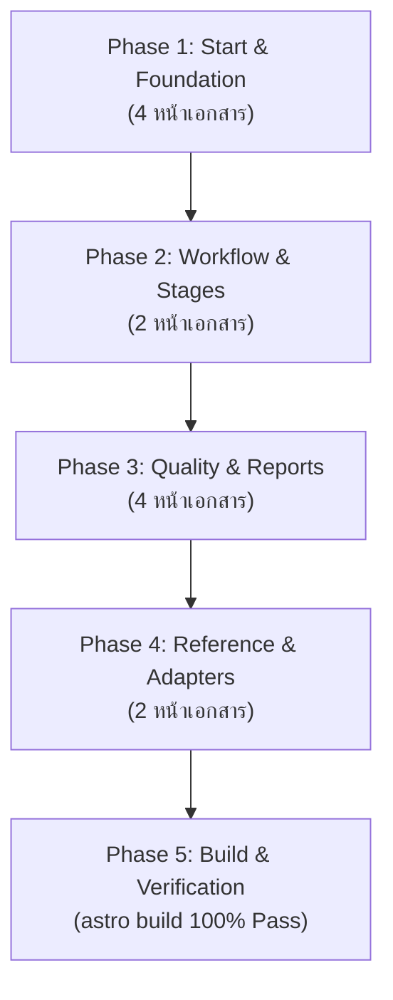

# Phase 30: Implementation Plan

- **Running ID**: `RUN-012-recheck-and-enrich-website-docs`
- **Title**: แผนงาน Recheck ตรวจสอบ ปรับโครงสร้างลำดับเนื้อหา และเสริมคำอธิบายเชิงลึก (Deep Enrichment) ทั้ง 12 หน้าเอกสารบนเว็บไซต์ Documentation
- **Source Spec**: [20-spec.md](20-spec.md)
- **Artifact Language**: th
- **Complexity**: Standard
- **Status**: Approved
- **Created Date**: 2026-08-18
- **Owner**: DevFlow Documentation & DX Team

---

## 1. ข้อมูลการวางแผนและบริบท (Planning Context & Evidence)

- **เป้าหมาย**: ปรับปรุงหน้าเว็บไซต์คู่มือทั้ง 12 หน้าที่ระบุไว้ ให้มีเนื้อหาที่ครบถ้วน ลึกซึ้ง มีโครงสร้างหัวข้อแบบ Step-by-Step, มีตัวอย่างประกอบ, Code Blocks, Alerts และ Flow ที่อ่านเข้าใจง่าย สอดคล้องกับมาตรฐาน DevFlow 2.0
- **ลำดับการลงมือทำ (Execution Sequencing)**:
  1. **Phase 1: Start & Foundation** (4 หน้า: Getting Started, Existing Codebase, Project Context, Updating DevFlow)
  2. **Phase 2: Workflow & Mainline Stages** (2 หน้า: Review Gates & Discipline, Mainline Stages 00-70)
  3. **Phase 3: Quality, Verification & Reports** (4 หน้า: Senior QA Verification, The Findings Ledger, Manual Review with /try, Interactive HTML Reports)
  4. **Phase 4: Reference & Tool Adapters** (2 หน้า: Multi-AI Adapters, File & Directory Reference)
  5. **Phase 5: Automated Verification & Site Build** (ทดสอบบิลด์เว็บไซต์จริงด้วย `npm --prefix website run build` หรือ `npx astro build`)
- **เกณฑ์การตัดสินใจด้านการทดสอบ (Test Decision Gate)**: เนื่องจากเป็นงานปรับปรุงเอกสาร Documentation และ Markdown Files ทั้งหมด จึงระบุเป็น `Not Required (Documentation)` แต่มี Verification Step บังคับในการ Build เว็บไซต์จริงให้ผ่าน 100%

---

## 2. ลำดับขั้นตอนการดำเนินงาน (Ordered Implementation Phases)

---

### 🔹 Phase 1: Start & Foundation (4 หน้า)
- **เป้าหมาย**: อธิบายการเริ่มต้นใช้งาน, Brownfield Adoption, Context Management, และการ Update อย่างละเอียด
- **ไฟล์ที่แก้ไข**:
  1. `website/src/content/docs/start/getting-started.md`
  2. `website/src/content/docs/start/existing-codebase.md`
  3. `website/src/content/docs/start/project-context.md`
  4. `website/src/content/docs/start/updating-devflow.md`
- **งานย่อย (Subtasks)**:
  - **Task 1.1**: ปรับปรุง `getting-started.md` อธิบาย Overlay Model, ขั้นตอน npx, Onboard Checklist, วงจรสเตจ 8 ขั้นตอน พร้อมตัวอย่างการเริ่มงานแรก
  - **Task 1.2**: ปรับปรุง `existing-codebase.md` เปรียบเทียบ `/onboard` vs `/adopt`, 5 ขั้นตอนของ `/adopt`, การจัดการ Baseline Findings
  - **Task 1.3**: ปรับปรุง `project-context.md` เจาะลึก 4 ไฟล์หลัก (`project-overview`, `coding-standards`, `ai-interaction`, `current-stage`), การป้องกัน Context Drift
  - **Task 1.4**: ปรับปรุง `updating-devflow.md` วิธีการอัปเกรดด้วย `/check-for-updates`, การรักษา Custom Skills ไม่ให้ถูกทับ, Migration Checklist
- **Test Decision**: `Not Required (Documentation)`
- **Verification**: ตรวจทาน Markdown syntax, Starlight callouts, และโครงสร้างเนื้อหา

---

### 🔹 Phase 2: Workflow & Mainline Stages (2 หน้า)
- **เป้าหมาย**: อธิบายกฎเหล็ก Review Gates และกระบวนการ 8 สเตจเชิงลึก
- **ไฟล์ที่แก้ไข**:
  1. `website/src/content/docs/workflow/review-gates.md`
  2. `website/src/content/docs/commands/mainline-stages.md`
- **งานย่อย (Subtasks)**:
  - **Task 2.1**: ปรับปรุง `review-gates.md` เจาะลึก 4 Review Gates (Discovery, Spec/Plan, QA/Findings, Release), Human-in-the-loop, สิ่งที่ AI ห้ามทำโดยพลการ
  - **Task 2.2**: ปรับปรุง `mainline-stages.md` อธิบายแต่ละ Stage ครบ 5 ส่วน (Purpose, Input, Loop, Output Artifacts, Gate Criteria)
- **Test Decision**: `Not Required (Documentation)`
- **Verification**: ตรวจทาน Markdown syntax และความสอดคล้องกับ DevFlow Core

---

### 🔹 Phase 3: Quality, Verification & Reports (4 หน้า)
- **เป้าหมาย**: เจาะลึกระบบ Senior QA, Findings Ledger, Manual Review และ Interactive HTML Reports
- **ไฟล์ที่แก้ไข**:
  1. `website/src/content/docs/quality/senior-qa-verification.md`
  2. `website/src/content/docs/quality/findings-ledger.md`
  3. `website/src/content/docs/quality/manual-review.md`
  4. `website/src/content/docs/quality/interactive-reports.md`
- **งานย่อย (Subtasks)**:
  - **Task 3.1**: ปรับปรุง `senior-qa-verification.md` สวมบท Senior QA ใน `50-verify`, กฎ Empirical Evidence, 4-Lane Verification, `50-verify-impact.md`
  - **Task 3.2**: ปรับปรุง `findings-ledger.md` โครงสร้าง `findings.md`, ระดับ P0-P3, วงจรชีวิต open/fixed/closed, กฎการ Block Release
  - **Task 3.3**: ปรับปรุง `manual-review.md` วัตถุประสงค์ `/try`, โครงสร้าง 3 สเต็ป (Where to go, What to click, What to expect), ตัวอย่าง Web/API/CLI
  - **Task 3.4**: ปรับปรุง `interactive-reports.md` เจาะลึก `60-report.html`, ฟังก์ชัน Interactive, การนำไปใช้ของ Stakeholders
- **Test Decision**: `Not Required (Documentation)`
- **Verification**: ตรวจทาน Markdown syntax และความถูกต้องของข้อมูล

---

### 🔹 Phase 4: Reference & Tool Adapters (2 หน้า)
- **เป้าหมาย**: อธิบายสถาปัตยกรรม Multi-AI Adapters และสารานุกรมไฟล์ทั้งหมด
- **ไฟล์ที่แก้ไข**:
  1. `website/src/content/docs/reference/tool-adapters.md`
  2. `website/src/content/docs/reference/file-reference.md`
- **งานย่อย (Subtasks)**:
  - **Task 4.1**: ปรับปรุง `tool-adapters.md` อธิบาย `.agents/`, `.claude/`, Universal Invocation Syntax (`/`, `$`, Plain), Custom Rules
  - **Task 4.2**: ปรับปรุง `file-reference.md` สารานุกรมไฟล์/โฟลเดอร์ทั้งหมด, ตาราง Path, หน้าที่, AI vs Human Edited, Lifecycles
- **Test Decision**: `Not Required (Documentation)`
- **Verification**: ตรวจทานความถูกต้องของพาธไฟล์และไวยากรณ์

---

### 🔹 Phase 5: Verification & Site Build Pass
- **เป้าหมาย**: ตรวจสอบการ Build เว็บไซต์ทั้งหมดให้ผ่าน 100% ไร้ Broken Links หรือ Parser Errors
- **Command**: `npm --prefix website run build` (หรือ `cd website && npm run build`)
- **Test Decision**: `Manual/Command Only`
- **Verification**: คำสั่งบิลด์ต้อง Exit code 0 และไม่มี Syntax/Markdown Errors

---

## 3. แผนที่การตรวจสอบและการส่งมอบ (Artifact Verification & Handoff)

- **Implementation Checklist**: [`checklists/implementation-checklist.md`](checklists/implementation-checklist.md)
- **Verification Checklist**: [`checklists/verification-checklist.md`](checklists/verification-checklist.md)
- **คำสั่งถัดไป**: `40-implement RUN-012-recheck-and-enrich-website-docs`
