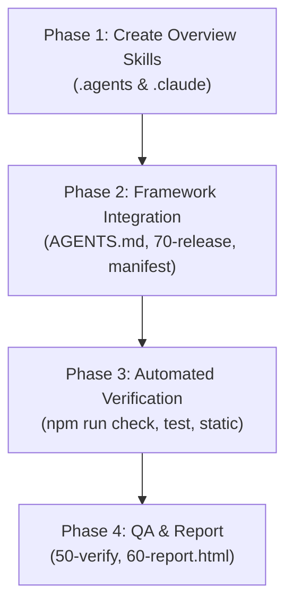

# Phase 30: Implementation Plan

- **Running ID**: `RUN-013-add-overview-and-context-sync-skill`
- **Title**: แผนงานพัฒนา Skill `/overview` และระบบ Living Context Sync สำหรับ Nexus-DevFlow
- **Source Spec**: [20-spec.md](20-spec.md)
- **Artifact Language**: th
- **Complexity**: Standard
- **Status**: Approved
- **Created Date**: 2026-08-20
- **Owner**: DevFlow Core Framework Team

---

## 1. ข้อมูลการวางแผนและบริบท (Planning Context & Evidence)

- **เป้าหมาย**: สร้าง Skill `/overview` ให้กับ Nexus-DevFlow ครบทั้ง 2 Agent Adapters (`.agents/` และ `.claude/`), ลงทะเบียนคำสั่งใน `AGENTS.md` และ `CLAUDE.md`, เชื่อมโยงเข้ากับขั้นตอน `70-release`, รวมเข้ากับ Template Bundler และผ่านการตรวจสอบความถูกต้อง 100%
- **ลำดับการลงมือทำ (Execution Sequencing)**:
  1. **Phase 1: Create Overview Skill Adapters** (สร้าง `.agents/skills/overview/SKILL.md` และ `.claude/skills/overview/SKILL.md`)
  2. **Phase 2: Framework Integration & Command Registration** (อัปเดต `AGENTS.md`, `CLAUDE.md`, `70-release` skills, และ `agent-bundle.manifest.json`)
  3. **Phase 3: Automated Verification & Test Suite** (รัน `npm run check:static`, `npm test`, `npm run check`)
  4. **Phase 4: QA Verification & Digest Report** (`50-verify.md`, `60-report.md`, `60-report.html`)

---

## 2. ลำดับขั้นตอนการดำเนินงาน (Ordered Implementation Phases)



---

### 🔹 Phase 1: Create Overview Skill Adapters
- **เป้าหมาย**: สร้าง Skill `/overview` ที่มีขั้นตอนการทำงานและกฎเกณฑ์ครบถ้วน 4 ขั้นตอน
- **ไฟล์ที่สร้าง**:
  1. `.agents/skills/overview/SKILL.md`
  2. `.claude/skills/overview/SKILL.md`
- **งานย่อย (Subtasks)**:
  - **Task 1.1**: สร้าง `.agents/skills/overview/SKILL.md` ระบุ Frontmatter, Step 1 (Scan Reality), Step 2 (Scan History), Step 3 (Synthesize Overview), Step 4 (Review & Report)
  - **Task 1.2**: สร้าง `.claude/skills/overview/SKILL.md` ให้มีเนื้อหาสอดคล้องกับ `.agents/` 100%
- **Test Decision**: `Required (Static Contract & Lint)`

---

### 🔹 Phase 2: Framework Integration & Command Registration
- **เป้าหมาย**: เชื่อมโยงคำสั่ง `overview` เข้ากับสารบัญระบบและการส่งต่องาน
- **ไฟล์ที่แก้ไข**:
  1. `AGENTS.md`
  2. `CLAUDE.md`
  3. `.agents/skills/70-release/SKILL.md`
  4. `.claude/skills/70-release/SKILL.md`
  5. `agent-bundle.manifest.json` (ถ้ามีผลกับการ bundle)
- **งานย่อย (Subtasks)**:
  - **Task 2.1**: อัปเดต `AGENTS.md` เพิ่ม `overview` ใน Public Companion Commands และ Invocation Table
  - **Task 2.2**: อัปเดต `CLAUDE.md`
  - **Task 2.3**: อัปเดต `70-release` skills ทั้ง 2 adapter แนะนำการรัน `/overview` เมื่อจบ Release
  - **Task 2.4**: อัปเดต `agent-bundle.manifest.json` เพิ่มรายการ skill `overview`
- **Test Decision**: `Required (Static Contract Check)`

---

### 🔹 Phase 3: Automated Verification
- **เป้าหมาย**: รันชุดทดสอบเพื่อยืนยันว่าไม่มีจุดแตกหัก
- **งานย่อย (Subtasks)**:
  - **Task 3.1**: รัน `npm run check:static`
  - **Task 3.2**: รัน `npm test`
  - **Task 3.3**: รัน `npm run check`
- **Test Decision**: `Required (All Suites Pass)`

---

## 3. คำสั่งถัดไป (Next Workflow Recommendation)

เริ่มลงมือพัฒนาตามแผนในขั้นตอน Implement:

```text
/40-implement RUN-013-add-overview-and-context-sync-skill
```
