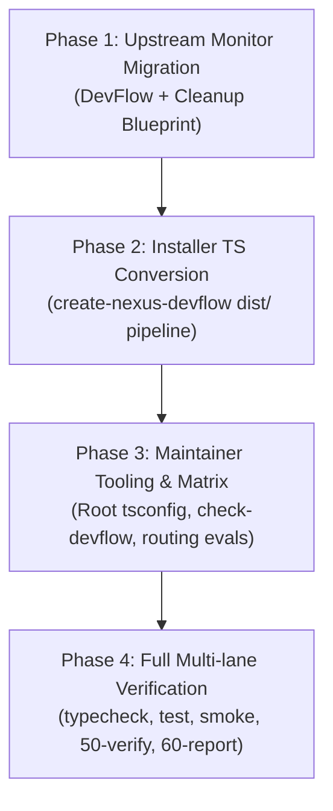

# Phase 30: Implementation Plan

- **Running ID**: `RUN-014-typescript-migration-and-upstream-monitor-for-devflow`
- **Title**: แผนงานยกระดับสถาปัตยกรรม DevFlow สู่ TypeScript และย้ายระบบ Check AI Blueprint Upstream Monitor
- **Source Spec**: [20-spec.md](20-spec.md)
- **Artifact Language**: th
- **Complexity**: High
- **Status**: Approved
- **Created Date**: 2026-08-20
- **Owner**: DevFlow Core Framework Team

---

## 1. ข้อมูลการวางแผนและบริบท (Planning Context & Evidence)

- **เป้าหมาย**:
  1. ย้ายระบบ Upstream Monitor (`check-upstream.yml`, สคริปต์ตรวจจับ, tracking) จาก `nexus-blueprint` มาที่ `nexus-devflow`
  2. พอร์ตแพ็กเกจ Installer `@jakkrichm/create-nexus-devflow` ให้เป็น TypeScript (`tsconfig.json`, `dist/bin/`, `lib/update.ts`)
  3. ปรับปรุง Maintainer Tooling และ Verification Suite ของ DevFlow ให้มี Type Safety สมบูรณ์ (`tsc --noEmit`, `tsx`) พร้อมผ่านการตรวจสอบ 100%
- **ลำดับการลงมือทำ (Execution Sequencing)**:
  1. **Phase 1: Upstream Monitor Migration & Cleanup** (ติดตั้งที่ DevFlow, ลบจาก Blueprint)
  2. **Phase 2: Installer Package TypeScript Conversion** (`packages/create-nexus-devflow`)
  3. **Phase 3: Maintainer Tooling & Verification Matrix** (Root `tsconfig.json`, scripts, routing evals)
  4. **Phase 4: Full Multi-lane Verification & Reporting** (`npm run check`, `50-verify.md`, `60-report.md`, `60-report.html`)

---

## 2. แผนผังลำดับขั้นตอนการดำเนินงาน (Execution Flow)



---

## 3. รายละเอียดงานในแต่ละ Phase (Detailed Phase Breakdown)

### 🔹 Phase 1: Upstream Monitor Migration & Cleanup
- **เป้าหมาย**: ย้ายระบบตรวจสอบ Upstream AI Blueprint มาไว้ที่ DevFlow และถอดออกจาก Blueprint
- **งานย่อย (Subtasks)**:
  - **Task 1.1**: เพิ่ม `.github/workflows/check-upstream.yml` ใน `nexus-devflow` (Schedule 07:01 BKK, `contents: read`, `issues: write`)
  - **Task 1.2**: เพิ่ม `scripts/upstream-monitor.ts`, `scripts/update-upstream-issue.ts`, `scripts/lib/upstream-monitor.ts`, `scripts/lib/validate-upstream-monitor.ts`
  - **Task 1.3**: สร้าง `.nexus/upstream-ai-blueprint.json` บันทึก Baseline Tracking ล่าสุด
  - **Task 1.4**: เพิ่ม Maintainer Skill `.agents/skills/sync-upstream/` และ `.claude/skills/sync-upstream/` ใน DevFlow
  - **Task 1.5**: ถอด `.github/workflows/check-upstream.yml` ออกจาก `nexus-blueprint`
- **Test Decision**: `Required (Static contract & Workflow contract tests)`

---

### 🔹 Phase 2: Installer Package TypeScript Conversion (`create-nexus-devflow`)
- **เป้าหมาย**: ปรับปรุง `@jakkrichm/create-nexus-devflow` สู่ TypeScript พร้อม Compilation Pipeline
- **งานย่อย (Subtasks)**:
  - **Task 2.1**: สร้าง `packages/create-nexus-devflow/tsconfig.json` (`outDir: "dist"`)
  - **Task 2.2**: ปรับปรุง `packages/create-nexus-devflow/package.json` (bin: `dist/bin/create-nexus-devflow.js`, scripts: `build`, `test`, `prepack`, `postpack`)
  - **Task 2.3**: แปลง `bin/create-nexus-devflow.ts`, `lib/update.ts`, `lib/starter-templates.ts`
  - **Task 2.4**: แปลง `scripts/prepare-template.ts` (กรอง `sync-upstream` ออก) และ `scripts/clean-template.ts`
  - **Task 2.5**: แปลง `test/update.test.ts` และทดสอบ `npm test`
- **Test Decision**: `Required (Unit tests 100% pass)`

---

### 🔹 Phase 3: Root Maintainer Tooling & Verification Matrix
- **เป้าหมาย**: ปรับปรุง Maintainer Infrastructure ของ DevFlow ให้มี Type Safety และชุดทดสอบที่แข็งแกร่ง
- **งานย่อย (Subtasks)**:
  - **Task 3.1**: สร้าง Root `tsconfig.json` ใน `nexus-devflow`
  - **Task 3.2**: อัปเดต `package.json` dependencies (`tsx`, `@types/node`, `typescript`) และ verification scripts
  - **Task 3.3**: แปลง Runner: `scripts/check-devflow.ts`, `scripts/validate-framework.ts`, `scripts/smoke-package.ts`
  - **Task 3.4**: แปลงและปรับปรุงโมดูล `scripts/evals/routing.ts` และ `routing.test.ts` (TF-IDF evals วัดผลความแม่นยำของคำสั่ง DevFlow)
- **Test Decision**: `Required (Typecheck + Evals + Smoke tests)`

---

### 🔹 Phase 4: Full Multi-lane Verification & Reporting
- **เป้าหมาย**: รันการทดสอบทุกระดับและสร้าง Delivery Digest Report
- **งานย่อย (Subtasks)**:
  - **Task 4.1**: รัน `npm install` ใน DevFlow
  - **Task 4.2**: รัน `npm run typecheck` (`tsc --noEmit`)
  - **Task 4.3**: รัน `npm run check:static`
  - **Task 4.4**: รัน `npm test` ใน `create-nexus-devflow`
  - **Task 4.5**: รัน `npm run test:routing`
  - **Task 4.6**: รัน `npm run test:package`
  - **Task 4.7**: รัน `npm run check` (All green)
  - **Task 4.8**: สร้าง `50-verify.md`, `60-report.md`, `60-report.html` และอัปเดต `current-stage.md`
- **Test Decision**: `Required (Complete Gate Pass)`

---

## 4. คำสั่งถัดไป (Next Workflow Recommendation)

เริ่มดำเนินการในขั้นตอน Implement ตามลำดับ Checklist:

```text
/40-implement RUN-014-typescript-migration-and-upstream-monitor-for-devflow
```
