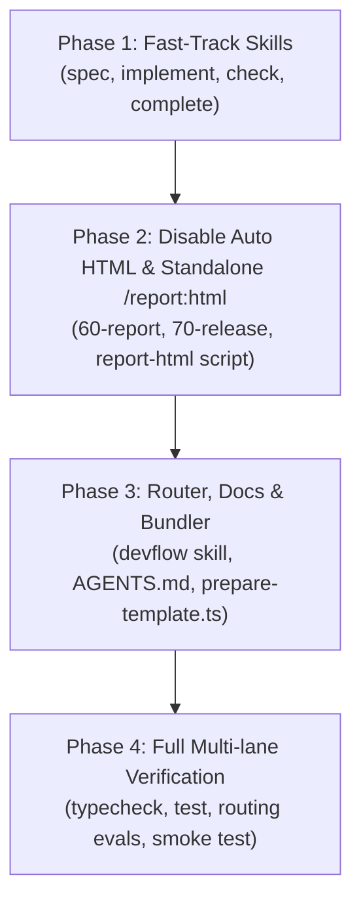

# Phase 30: Implementation Plan

- **Running ID**: `RUN-015-fast-track-and-living-blueprint`
- **Title**: แผนงานพัฒนาระบบ Fast-Track (Blueprint Mode), Single Living Spec (`blueprint.md`) และยกเลิก Auto HTML Report
- **Source Spec**: [20-spec.md](20-spec.md)
- **Artifact Language**: th
- **Complexity**: Standard
- **Status**: Approved
- **Created Date**: 2026-08-20
- **Owner**: DevFlow Core Framework Team

---

## 1. ข้อมูลการวางแผนและบริบท (Planning Context & Evidence)

- **เป้าหมายหลัก**:
  1. พัฒนา 4 Skills ใหม่สำหรับ **Fast-Track (Blueprint Mode)**: `/spec` *(พร้อม aliases `/feature`, `/fix`)*, `/implement`, `/check`, และ `/complete` ในทั้ง `.agents/skills/` และ `.claude/skills/`
  2. กำหนดมาตรฐาน **Single Living Spec (`blueprint.md`)** ที่รวม Specification, Plan, Checklist, Implementation Log, Verification Evidence, และ Release Handoff ไว้ในไฟล์เดียว
  3. **ยกเลิกการสร้าง `report.html` และ `60-report.html` อัตโนมัติ** ในทุกขั้นตอนของ Mainline และเพิ่ม Standalone Command `/report:html`
  4. ปรับปรุง **Router (`/devflow`)**, `AGENTS.md`, `CLAUDE.md`, `scripts/prepare-template.ts` และ Routing Evals ให้สอดคล้อง 100%
- **ลำดับการลงมือทำ (Execution Sequencing)**:
  1. **Phase 1: Fast-Track Skills Development (`spec`, `implement`, `check`, `complete`)**
  2. **Phase 2: Disable Auto HTML Report & Standalone `/report:html` Command**
  3. **Phase 3: Router (`devflow`), Project Documents & Installer Bundler**
  4. **Phase 4: Multi-lane Verification & Routing Evals (`npm run check`)**

---

## 2. แผนผังลำดับขั้นตอนการดำเนินงาน (Execution Flow)



---

## 3. รายละเอียดงานในแต่ละ Phase (Detailed Phase Breakdown)

### 🔹 Phase 1: Fast-Track Skills Development (`spec`, `implement`, `check`, `complete`)
- **เป้าหมาย**: สร้าง Skills ใหม่ 4 ขั้นตอนของ Fast-Track ใน `.agents/skills/` และ `.claude/skills/`
- **งานย่อย (Subtasks)**:
  - **Task 1.1**: สร้าง `.agents/skills/spec/SKILL.md` และ `.claude/skills/spec/SKILL.md` (รองรับ aliases: `/spec`, `/feature`, `/fix` จอง Run และสร้าง `blueprint.md`)
  - **Task 1.2**: สร้าง `.agents/skills/implement/SKILL.md` และ `.claude/skills/implement/SKILL.md` (ลงมือเขียนโค้ดตาม Checklist + TDD และบันทึก Section 4)
  - **Task 1.3**: สร้าง `.agents/skills/check/SKILL.md` และ `.claude/skills/check/SKILL.md` (รัน Senior QA Multi-lane Evidence และบันทึก Section 5)
  - **Task 1.4**: สร้าง `.agents/skills/complete/SKILL.md` และ `.claude/skills/complete/SKILL.md` (Safety Pass, สรุป Release Digest ลง Section 6, ทำ Git Merge โดยไม่มี Auto HTML)
- **Test Decision**: `Required (Static Skill Contract & Routing Evals)`

---

### 🔹 Phase 2: Disable Auto HTML Report & Standalone `/report:html` Command
- **เป้าหมาย**: ยกเลิกการ auto-generate HTML ใน Mainline เดิม และสร้างคำสั่งแยกสำหรับ HTML Report
- **งานย่อย (Subtasks)**:
  - **Task 2.1**: ปรับปรุง `.agents/skills/60-report/SKILL.md` และ `.claude/skills/60-report/SKILL.md` ให้สร้างเฉพาะ `60-report.md`
  - **Task 2.2**: ปรับปรุง `.agents/skills/70-release/SKILL.md` และ `.claude/skills/70-release/SKILL.md`
  - **Task 2.3**: สร้าง Skill `.agents/skills/report-html/SKILL.md` และ `.claude/skills/report-html/SKILL.md` (alias `/report:html`)
  - **Task 2.4**: เพิ่ม `scripts/report-html.ts` และ npm script `"report:html"` ใน Root `package.json`
- **Test Decision**: `Required (CLI script tests & static contracts)`

---

### 🔹 Phase 3: Router (`devflow`), Project Documents & Installer Bundler
- **เป้าหมาย**: ปรับปรุง Router และเอกสารโครงสร้าง Dual-Track
- **งานย่อย (Subtasks)**:
  - **Task 3.1**: ปรับปรุง `.agents/skills/devflow/SKILL.md` และ `.claude/skills/devflow/SKILL.md` ให้นำทางทั้ง Fast-Track และ Deep-Track
  - **Task 3.2**: อัปเดต `AGENTS.md` และ `CLAUDE.md` อธิบาย Dual-Track Architecture
  - **Task 3.3**: อัปเดต `scripts/prepare-template.ts` ให้แพ็กรวม Skills ใหม่เข้า installer package
- **Test Decision**: `Required (Installer unit tests & smoke tests)`

---

### 🔹 Phase 4: Full Multi-lane Verification & Routing Evals
- **เป้าหมาย**: รันชุดตรวจสอบและวัดผลความแม่นยำของคำสั่งทั้งหมด
- **งานย่อย (Subtasks)**:
  - **Task 4.1**: เพิ่ม test dataset ใน `evals/routing/` สำหรับ `spec`, `implement`, `check`, `complete`, `report-html`
  - **Task 4.2**: รัน `npm run typecheck` (`tsc --noEmit`)
  - **Task 4.3**: รัน `npm run check:static`
  - **Task 4.4**: รัน `npm test` ใน `packages/create-nexus-devflow`
  - **Task 4.5**: รัน `npm run test:routing`
  - **Task 4.6**: รัน `npm run test:package`
  - **Task 4.7**: รัน `npm run check` (All green 100%)
- **Test Decision**: `Required (Complete Verification Gate)`

---

## 4. คำสั่งถัดไป (Next Workflow Recommendation)

เริ่มดำเนินการในขั้นตอน Implement ตามลำดับ Checklist:

```text
/40-implement RUN-015-fast-track-and-living-blueprint
```
