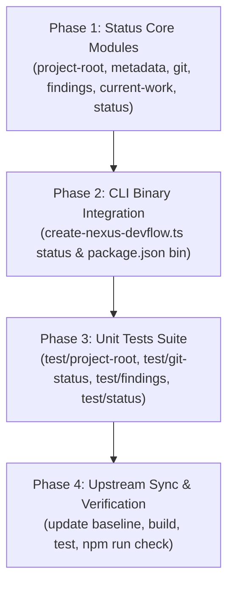

# Phase 30: Implementation Plan

- **Running ID**: `RUN-019-sync-upstream-status-cli-and-project-detection`
- **Title**: แผนงานติดตั้ง Status CLI, Project Detection, Findings Ledger และ Sync Upstream Baseline
- **Source Spec**: [20-spec.md](20-spec.md)
- **Artifact Language**: th
- **Complexity**: Standard
- **Status**: Approved
- **Created Date**: 2026-08-20
- **Owner**: DevFlow Core Framework Team

---

## 1. ข้อมูลการวางแผนและบริบท (Planning Context & Evidence)

- **เป้าหมาย**:
  1. พัฒนาโมดูล Core Status Libraries ใน `packages/create-nexus-devflow/lib/` สำหรับตรวจจับโฟลเดอร์ Root, Metadata, Git status, Findings blocker และ Current work
  2. เชื่อมต่อคำสั่ง CLI `nexus-devflow status` / `create-nexus-devflow status` พร้อมตัวเลือก `--json`
  3. เพิ่ม Unit Test Suite ครอบคลุมทุกโมดูลใน `packages/create-nexus-devflow/test/`
  4. อัปเดต Upstream Baseline ใน `.nexus/upstream-ai-blueprint.json` เป็น Commit `c394e3b` (v0.9.1) และผ่านการ Verify ทุกขั้นตอน
- **ลำดับการลงมือทำ (Execution Sequencing)**:
  1. **Phase 1: Status Core Modules Implementation** (`packages/create-nexus-devflow/lib/`)
  2. **Phase 2: CLI Binary & Entrypoint Integration** (`packages/create-nexus-devflow/bin/` + `package.json`)
  3. **Phase 3: Unit Tests Suite** (`packages/create-nexus-devflow/test/`)
  4. **Phase 4: Upstream Baseline Sync & Full Verification** (`.nexus/upstream-ai-blueprint.json`, `npm run check`, `CHANGELOG.md`)

---

## 2. แผนผังลำดับขั้นตอนการดำเนินงาน (Execution Flow)



---

## 3. รายละเอียดงานในแต่ละ Phase (Detailed Phase Breakdown)

### 🔹 Phase 1: พัฒนา Core Modules ใน `packages/create-nexus-devflow/lib/`
- **เป้าหมาย**: สร้างโมดูลวิเคราะห์สถานะโปรเจกต์แบบ Pure TypeScript (Zero External Dependency)
- **งานย่อย (Subtasks)**:
  - **Task 1.1**: สร้าง `packages/create-nexus-devflow/lib/project-root.ts`
    - ค้นหา Root Directory จาก Path ปัจจุบันขึ้นไปแบบ Recursive
    - ตรวจหาโฟลเดอร์ `devflow/` หรือ `devflow/.state/manifest.json` หรือ `AGENTS.md` / `.agents/`
  - **Task 1.2**: สร้าง `packages/create-nexus-devflow/lib/project-metadata.ts`
    - อ่านชื่อโปรเจกต์, Root, Version และตรวจจับ Adapters (`codex`, `claude`)
  - **Task 1.3**: สร้าง `packages/create-nexus-devflow/lib/git-status.ts`
    - ตรวจจับ Git Repository, Clean/Dirty, Changed Files, Branch, Last Commit, Ahead/Behind
  - **Task 1.4**: สร้าง `packages/create-nexus-devflow/lib/findings.ts`
    - อ่าน `devflow/context/findings.md`, แยก Severity `P0`-`P3`, นับสถานะ, และตรวจจับ Blocker findings
  - **Task 1.5**: สร้าง `packages/create-nexus-devflow/lib/current-work.ts`
    - รองรับการอ่านความคืบหน้าของ Dual-Track (`spec.md` หรือ stage artifacts / `current-stage.md`)
    - คำนวณ Checklists Steps และดึง Next Active Step
  - **Task 1.6**: สร้าง `packages/create-nexus-devflow/lib/status.ts`
    - รวบรวมข้อมูลสถานะ, ประเมิน Health, คำนวณ Completion Readiness, แนะนำ Next Action
    - ฟอร์แมต Output สวยงามด้วย ANSI Color (Cyan, Green, Yellow, Red, Bold) และรองรับ `--json`
- **Test Decision**: `Required (Unit tests for each module)`

---

### 🔹 Phase 2: CLI Binary & Entrypoint Integration
- **เป้าหมาย**: เพิ่มคำสั่ง `status` ให้กับ CLI Binary ของแพ็กเกจ
- **งานย่อย (Subtasks)**:
  - **Task 2.1**: ปรับปรุง `packages/create-nexus-devflow/bin/create-nexus-devflow.ts`
    - เพิ่มการจัดการ Subcommand `status`
    - เพิ่ม Flags `--json`, `--target`, `--help`, `--version`
    - เพิ่มข้อความช่วยเหลือ `printHelp()` สำหรับ `status`
  - **Task 2.2**: ปรับปรุง `packages/create-nexus-devflow/package.json`
    - กำหนด `bin` สำหรับ `create-nexus-devflow`, `nexus-devflow`, และ `devflow`
    - ปรับ Script `test` ให้รันเทสทุกไฟล์ใน `test/*.test.ts`
- **Test Decision**: `Required (CLI execution tests)`

---

### 🔹 Phase 3: พัฒนาชุดทดสอบ Unit Tests Suite
- **เป้าหมาย**: เขียน Unit Tests ครอบคลุมทุกโมดูลเพื่อให้ได้ความน่าเชื่อถือสูงสุด
- **งานย่อย (Subtasks)**:
  - **Task 3.1**: สร้าง `packages/create-nexus-devflow/test/project-root.test.ts`
    - ทดสอบการค้นหา Root ใน Root Directory, Subdirectory, Mock DevFlow Tree, และกรณีอยู่นอกโปรเจกต์
  - **Task 3.2**: สร้าง `packages/create-nexus-devflow/test/project-metadata.test.ts`
    - ทดสอบการอ่าน Manifest, การตรวจจับ Adapters, และกรณี Manifest เสียหาย
  - **Task 3.3**: สร้าง `packages/create-nexus-devflow/test/git-status.test.ts`
    - ทดสอบการอ่าน Git Status ใน Repo จริงและกรณี Non-Git
  - **Task 3.4**: สร้าง `packages/create-nexus-devflow/test/findings.test.ts`
    - ทดสอบการ Parse Findings หลากหลายรูปแบบ, การคำนวณ Blockers, และ Malformed warnings
  - **Task 3.5**: สร้าง `packages/create-nexus-devflow/test/status.test.ts`
    - ทดสอบการประกอบสถานะ, การคำนวณ Health, Next Action, และการ Render ANSI / JSON
- **Test Decision**: `Required (Run npm test to achieve 100% pass)`

---

### 🔹 Phase 4: Sync Upstream Baseline & Full Verification
- **เป้าหมาย**: อัปเดต Upstream Tracking, Build Package, และรัน Verification Gate ทั้งหมด
- **งานย่อย (Subtasks)**:
  - **Task 4.1**: อัปเดต `.nexus/upstream-ai-blueprint.json` ให้ `lastReviewedCommit` เป็น `c394e3b5b0b6c1990282278147b517466708ff41`
  - **Task 4.2**: รัน `npm run build` ใน `packages/create-nexus-devflow` เพื่อคอมไพล์ TypeScript สู่ `dist/`
  - **Task 4.3**: รัน `npm test` ใน `packages/create-nexus-devflow`
  - **Task 4.4**: รัน `npm run check` ที่ Root เพื่อยืนยันว่า Typecheck, Static Contracts, Evals และ Smoke Tests ผ่าน 100%
  - **Task 4.5**: อัปเดต `CHANGELOG.md`
- **Test Decision**: `Required (Full Gate Verification)`

---

## 4. คำสั่งถัดไป (Next Workflow Recommendation)

เข้าสู่ขั้นตอนลงมือปฏิบัติการและเขียนโค้ดจริงใน Phase 40:

```text
/40-execute RUN-019-sync-upstream-status-cli-and-project-detection
```
