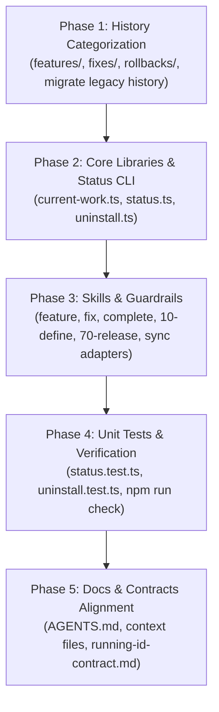

# Phase 30: Implementation Plan

- **Running ID**: `021-categorized-history-and-clean-living-spec-architecture`
- **Title**: แผนงานปรับโครงสร้างสถาปัตยกรรม 3 เสาหลัก (3-Pillars Model), Categorized History (`features/`, `fixes/`, `rollbacks/`), ตัด Prefix `RUN-`, วาง Living Spec ใน `devflow/context/`, และติดตั้ง Single Active Run Guardrail
- **Source Spec**: [20-spec.md](20-spec.md)
- **Artifact Language**: th
- **Complexity**: Standard (Multi-module & Skills refinement)
- **Status**: Approved
- **Created Date**: 2026-08-21
- **Owner**: DevFlow Core Engineering Team

---

## 1. ข้อมูลการวางแผนและบริบท (Planning Context & Evidence)

- **เป้าหมาย**:
  1. ยกระดับโครงสร้าง DevFlow สู่ **"The 3-Pillars Unified Architecture"** (อนาคต: `ideas.md`, ปัจจุบัน: `context/`, อดีต: `history/`)
  2. ตัดโฟลเดอร์ `devflow/runs/` ออกจากระบบ
  3. ติดตั้ง Categorized History (`features/`, `fixes/`, `rollbacks/`) พร้อมระบบ AI Auto-Routing
  4. ปรับ Sequential Numbering เป็น `xxx-slug` (ตัด Prefix `RUN-` ออก)
  5. ติดตั้ง Single Active Run Guardrail บล็อกการเปิดงานซ้อน
  6. ปรับปรุง Core Modules ใน `packages/create-nexus-devflow/lib/`, Skills ใน `.agents/skills/` และ `.claude/skills/`, และชุดทดสอบ Unit Tests
- **ลำดับการลงมือทำ (Execution Sequencing)**:
  - **Phase 1**: History Categorization & Directory Structure Setup (`devflow/history/`)
  - **Phase 2**: Core Libraries & Status CLI Updates (`packages/create-nexus-devflow/lib/`)
  - **Phase 3**: Mainline Skills & Guardrails Refinement (`.agents/skills/` & `.claude/skills/`)
  - **Phase 4**: Automated Unit Tests & Verification Gates (`packages/create-nexus-devflow/test/` & `npm run check`)
  - **Phase 5**: Documentation, Context & Contract Alignment (`AGENTS.md`, `README.md`, `context/`, `running-id-contract.md`)

---

## 2. แผนผังลำดับขั้นตอนการดำเนินงาน (Execution Flow)

---

## 3. รายละเอียดงานในแต่ละ Phase (Detailed Phase Breakdown)

### 🔹 Phase 1: History Categorization & Directory Structure Setup
- **เป้าหมาย**: สร้างโฟลเดอร์หมวดหมู่ใน `devflow/history/` และย้ายประวัติเดิมเข้าสู่โครงสร้างใหม่
- **งานย่อย (Subtasks)**:
  - **Task 1.1**: สร้างโฟลเดอร์และไฟล์ README ใน `devflow/history/`:
    - `devflow/history/features/README.md`
    - `devflow/history/fixes/README.md`
    - `devflow/history/rollbacks/README.md`
  - **Task 1.2**: ย้ายประวัติเดิม (`RUN-001` ถึง `RUN-020`) จาก `devflow/runs/` เข้าสู่ `devflow/history/features/` และ `devflow/history/fixes/` พร้อมแปลงชื่อเป็น `xxx-slug`
  - **Task 1.3**: อัปเดตตาราง Master Ledger ใน `devflow/history/HISTORY.md` ให้มีคอลัมน์ `Category/Type` และลิงก์ไปยัง Path ใหม่
- **Test Decision**: `Required (Verify file existence and markdown links)`

---

### 🔹 Phase 2: Core Libraries & Status CLI Updates (`packages/create-nexus-devflow/lib/`)
- **เป้าหมาย**: อัปเดตโมดูล Core Libraries ให้รองรับสถาปัตยกรรม 3 เสาหลักและ ID แบบ `xxx-slug`
- **งานย่อย (Subtasks)**:
  - **Task 2.1**: ปรับปรุง `lib/current-work.ts`:
    - ตรวจจับ Active Living Spec จาก `devflow/context/current-feature.md` (ถ้าไม่ใช่ Stub) เป็นอันดับแรก
    - ตรวจจับ Deep-Track Active Run จาก `devflow/context/current-run/`
    - อัปเดต Regex ให้รองรับทั้ง `^\d{3}-` และ `^RUN-\d{3}-`
    - คืนค่า `state: "idle"` เมื่อ `current-feature.md` เป็น Stub และไม่มี `current-run/`
  - **Task 2.2**: ปรับปรุง `lib/status.ts`:
    - สรุปสถานะโครงการจากโครงสร้างใหม่และจัดรูปแบบแสดงผล ANSI / JSON
  - **Task 2.3**: ปรับปรุง `lib/uninstall.ts`:
    - อัปเดตรายการ Clean Footprint ให้ครอบคลุม `devflow/context/` และ `devflow/history/`
    - ตรวจสอบให้แน่ใจว่าธง `--keep-history` ปกป้อง `devflow/history/` ทั้งหมด
- **Test Decision**: `Required (Unit tests in packages/create-nexus-devflow/test/)`

---

### 🔹 Phase 3: Mainline Skills & Guardrails Refinement
- **เป้าหมาย**: ปรับปรุงทักษะการทำงานของ AI ให้ใช้สถาปัตยกรรม 3 เสาหลักและติดตั้ง Guardrail
- **งานย่อย (Subtasks)**:
  - **Task 3.1**: ปรับปรุง `feature/SKILL.md` & `fix/SKILL.md`:
    - ตรวจสอบ Single Active Run Guardrail (ปฏิเสธหากมีงานค้าง)
    - สร้าง ID รูปแบบ `xxx-slug`
    - เขียน Living Spec ลงใน `devflow/context/current-feature.md`
  - **Task 3.2**: ปรับปรุง `implement/SKILL.md` & `check/SKILL.md`:
    - ชี้เป้าหมายการอ่าน/เขียน Checklists และ Evidence ไปที่ `devflow/context/current-feature.md`
  - **Task 3.3**: ปรับปรุง `complete/SKILL.md`:
    - ดำเนินการ Safety Pass
    - ย้าย/Archive `devflow/context/current-feature.md` ➔ ไปที่ `devflow/history/{features|fixes|rollbacks}/{xxx-slug}.md`
    - รวบรวม Resolved Findings แปะท้าย Archive
    - รีเซ็ต `devflow/context/current-feature.md` กลับเป็น Stub ว่าง
    - อัปเดต `devflow/history/HISTORY.md`
  - **Task 3.4**: ปรับปรุง `10-define/SKILL.md` & `70-release/SKILL.md`:
    - สร้าง Deep-Track Run ใน `devflow/context/current-run/`
    - เมื่อรัน `70-release` ย้ายโฟลเดอร์ไปที่ `devflow/history/{category}/{xxx-slug}/`
  - **Task 3.5**: ปรับปรุง `report-html/SKILL.md` และ `scripts/lib/render-html/`:
    - รองรับการเรนเดอร์ HTML จาก `context/current-feature.md` และ `history/`
  - **Task 3.6**: รัน `npm run sync:adapters` เพื่อซิงก์ `.agents/skills/` ➔ `.claude/skills/`
- **Test Decision**: `Required (npm run sync:adapters && npm run test:routing)`

---

### 🔹 Phase 4: Automated Unit Tests & Verification Gates
- **เป้าหมาย**: ปรับปรุงและรันชุดทดสอบทั้งหมดให้ผ่าน 100%
- **งานย่อย (Subtasks)**:
  - **Task 4.1**: ปรับปรุง `packages/create-nexus-devflow/test/status.test.ts`
  - **Task 4.2**: ปรับปรุง `packages/create-nexus-devflow/test/uninstall.test.ts`
  - **Task 4.3**: ปรับปรุง `packages/create-nexus-devflow/test/findings.test.ts`
  - **Task 4.4**: รัน `npm test` ใน `packages/create-nexus-devflow` (ให้ผ่าน 100%)
  - **Task 4.5**: รัน Master Verification Gate `npm run check`
- **Test Decision**: `Required (All test suites pass)`

---

### 🔹 Phase 5: Documentation, Context & Contract Alignment
- **เป้าหมาย**: ปรับปรุงเอกสารคู่มือและสัญญาของ DevFlow ทั้งหมดให้สอดคล้องกัน
- **งานย่อย (Subtasks)**:
  - **Task 5.1**: อัปเดต `devflow/reference/running-id-contract.md`
  - **Task 5.2**: อัปเดต `devflow/context/project-overview.md`, `coding-standards.md`, `ai-interaction.md`
  - **Task 5.3**: อัปเดต `AGENTS.md`, `README.md`, `README.th.md`
- **Test Decision**: `Required (Verify documentation links and descriptions)`

---

## 4. ปัจจัยความเสี่ยงและการควบคุม (Risks & Control Points)

| ความเสี่ยง | ระดับ | มาตรการควบคุม |
| :--- | :--- | :--- |
| **การสูญหายของประวัติเก่าตอนย้าย** | สูง | ย้ายไฟล์อย่างระมัดระวัง ตรวจสอบความครบถ้วนของ `001` ถึง `020` ก่อนลบโฟลเดอร์เดิม |
| **ความไม่สอดคล้องระหว่าง `.agents` และ `.claude`** | ปานกลาง | ใช้คำสั่ง `npm run sync:adapters` ตรวจสอบความสอดคล้องเสมอ |

---

## 5. คำสั่งถัดไปที่อนุญาต (Next Allowed Command)

- สเตจถัดไป: `40-execute 021-categorized-history-and-clean-living-spec-architecture` (หรือ `/40-execute 021`)
