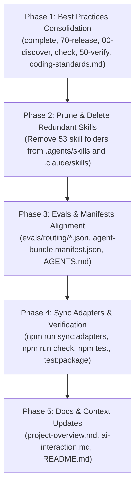

# Phase 30: Implementation Plan

- **Running ID**: `023-prune-unused-skills-and-consolidate`
- **Title**: แผนงานยกระดับและลดรูปโครงสร้าง Skills ของ Nexus-DevFlow ให้ Lean & Clean: รวมส่วนดีเข้า Core Workflows และลบ Skill ส่วนเกิน (<50% และ <25%) ออกทั้งหมด
- **Source Spec**: [20-spec.md](20-spec.md)
- **Artifact Language**: th
- **Complexity**: Standard (Multi-module Skills Refinement & Deletion)
- **Status**: Approved
- **Created Date**: 2026-08-21
- **Owner**: DevFlow Core Engineering Team

---

## 1. ข้อมูลการวางแผนและบริบท (Planning Context & Evidence)

- **เป้าหมาย**:
  1. ปรับลดขนาดและจำนวน Skill จาก 81 รายการ ให้เหลือประมาณ **25-28 รายการ** (ลดลง ~68%) ให้มีความ Lean และ Ergonomics คล้าย AI Blueprint
  2. รวม Best Practices สำคัญจาก 17 Skills ที่ถูกรวม (Conventional Commits, SemVer, Keep a Changelog, Scrutinize QA, Security Audit, API/DB Design) เข้าสู่ Core Skills และ `coding-standards.md`
  3. ลบ 36 Skills ในกลุ่ม Direct Delete และ 17 Skills ในกลุ่ม Consolidated ออกจาก `.agents/skills/` และ `.claude/skills/`
  4. อัปเดต Evals Routing Tests, Manifests, และ Sync Adapters
  5. ผ่านการตรวจสอบ Multi-Lane Verification ทั้งหมด 100% (`npm run check`, `npm test`, `npm run test:package`)
- **ลำดับการลงมือทำ (Execution Sequencing)**:
  - **Phase 1**: Best Practices Consolidation into Core Skills & Coding Standards
  - **Phase 2**: Pruning & Deletion of Redundant Skills in `.agents/skills/` & `.claude/skills/`
  - **Phase 3**: Evals Routing Tests, Manifests & Template Alignment
  - **Phase 4**: Adapter Synchronization & Multi-Lane Verification
  - **Phase 5**: Documentation & Project Context Updates

---

## 2. แผนผังลำดับขั้นตอนการดำเนินงาน (Execution Flow)

---

## 3. รายละเอียดงานในแต่ละ Phase (Detailed Phase Breakdown)

### 🔹 Phase 1: Best Practices Consolidation into Core Skills & Coding Standards
- **เป้าหมาย**: ดูดซับสาระสำคัญและ Checklist จาก Skill กลุ่ม `< 50%` เข้าสู่ Core Workflows
- **งานย่อย (Subtasks)**:
  - **Task 1.1**: ปรับปรุง `complete/SKILL.md` และ `70-release/SKILL.md`:
    - ผสานขั้นตอน Conventional Commits (`feat(...)`, `fix(...)`, etc.) และ Imperative mood
    - ผสานขั้นตอนคำนวณ SemVer Version Bump (Major, Minor, Patch)
    - ผสานขั้นตอนเขียน `CHANGELOG.md` ตามมาตรฐาน Keep a Changelog
    - ผสาน Pull Request Template & Squash Merge Checklist
  - **Task 1.2**: ปรับปรุง `00-discover/SKILL.md`:
    - ฝัง Checklist และแนวทางการรัน Sub-routes: `Brainstorm` (Trade-off matrix), `Research` (Empirical proof), `PRD` (User stories & Scope boundaries), และ `Issue-Triage` ในตัว
  - **Task 1.3**: ปรับปรุง `check/SKILL.md` และ `50-verify/SKILL.md`:
    - ผสาน 9arm Scrutinize QA Checklist (Edge cases, Boundary checks, Off-by-one, Null/Undefined)
    - ผสาน Security Review Checklist (OWASP Top 10, Secrets in code, Input sanitization)
    - ผสาน Static Analysis & Multi-lane verification matrix
  - **Task 1.4**: ปรับปรุง `devflow/context/coding-standards.md`:
    - เพิ่มมาตรฐาน Database Design & Migration Safety
    - เพิ่มมาตรฐาน Stable API & Interface Design
    - เพิ่มมาตรฐาน Deep Modules & Information Hiding
    - เพิ่มมาตรฐาน TypeScript Strict Typing (ห้ามใช้ `any`)
    - เพิ่มมาตรฐาน Refactoring & Simplify (Early returns, Flatten nested conditionals)
  - **Task 1.5**: ปรับปรุง `60-report/SKILL.md`:
    - ผสานขั้นตอน Retrospective Lessons Learned & Gotchas Extraction (ทดแทน `insight`)
- **Test Decision**: `Required (Inspect markdown files for completeness and heading integrity)`

---

### 🔹 Phase 2: Pruning & Deletion of Redundant Skills
- **เป้าหมาย**: ลบโฟลเดอร์ Skill ส่วนเกินรวม 53 โฟลเดอร์ออกจากทั้ง `.agents/skills/` และ `.claude/skills/`
- **งานย่อย (Subtasks)**:
  - **Task 2.1**: ลบโฟลเดอร์ใน `.agents/skills/`:
    - `bash-linux`, `powershell-windows`, `python-patterns`, `nodejs-best-practices`, `tailwind-patterns`, `nextjs-react-expert`, `frontend-ui-engineering`, `seo-fundamentals`, `mobile-design`, `server-management`, `domain-modeling`, `i18n-localization`, `ui-ux-pro-max`, `architecture`
    - `spec`, `spec-driven-development`, `goal`, `help`, `app-builder`, `agent`, `behavioral-modes`, `parallel-agents`, `context-engineering`, `skill-development`
    - `commit`, `pr`, `merge`, `changelog`, `deploy`, `package-json-generator`, `preview`, `followup`, `insight`, `issue-triage`, `competitor-analysis`, `documentation-and-adrs`, `mcp-builder`, `handoff`, `roadmap-strategy`, `review`, `security-review`, `lint-and-validate`, `simplify`, `database-design`, `api-and-interface-design`, `codebase-design`, `type-design`, `brainstorm`, `research`, `prd`
  - **Task 2.2**: ลบโฟลเดอร์ที่ตรงกันใน `.claude/skills/`
  - **Task 2.3**: ตรวจสอบและแก้ไข Stale/Broken References ใน Skills ที่เหลืออยู่ทั้งหมด
- **Test Decision**: `Required (Verify remaining directory count is ~25-28 and no dangling links)`

---

### 🔹 Phase 3: Evals Routing Tests, Manifests & Template Alignment
- **เป้าหมาย**: ลบ Routing Test Cases เก่าที่ตรงกับ Skill ที่ถูกลบออก และอัปเดต Manifests
- **งานย่อย (Subtasks)**:
  - **Task 3.1**: ลบไฟล์ Test Cases `.json` ใน `evals/routing/` ของ Skill ที่ถูกลบออก
  - **Task 3.2**: อัปเดต `agent-bundle.manifest.json`
  - **Task 3.3**: อัปเดต `packages/create-nexus-devflow/lib/update.ts` ให้มีรายการ Companion Commands ที่เป็นปัจจุบัน
  - **Task 3.4**: อัปเดต `AGENTS.md` และ `CLAUDE.md` ให้มีรายชื่อคำสั่งที่ถูกต้อง
- **Test Decision**: `Required (npm run test:routing passes 100%)`

---

### 🔹 Phase 4: Adapter Synchronization & Multi-Lane Verification
- **เป้าหมาย**: ซิงก์ Adapter และทดสอบระบบทั้งหมดให้ผ่าน 100%
- **งานย่อย (Subtasks)**:
  - **Task 4.1**: รัน `npm run sync:adapters`
  - **Task 4.2**: รัน `npm run check:static`
  - **Task 4.3**: รัน `npm run test:routing`
  - **Task 4.4**: รัน `npm test`
  - **Task 4.5**: รัน `npm run test:package`
  - **Task 4.6**: รัน Master Verification Gate `npm run check`
- **Test Decision**: `Required (All 5 verification lanes pass 100%)`

---

### 🔹 Phase 5: Documentation & Project Context Updates
- **เป้าหมาย**: อัปเดตเอกสารคู่มือการใช้งานของ Nexus-DevFlow
- **งานย่อย (Subtasks)**:
  - **Task 5.1**: อัปเดต `devflow/context/project-overview.md` และ `ai-interaction.md`
  - **Task 5.2**: อัปเดต `README.md` และ `README.th.md` ให้สะท้อนรายการ Skill แบบ Lean ใหม่
- **Test Decision**: `Required (Verify links and markdown readability)`

---

## 4. ปัจจัยความเสี่ยงและการควบคุม (Risks & Control Points)

| ความเสี่ยง | ระดับ | มาตรการควบคุม |
| :--- | :--- | :--- |
| **การเผลอลบ Core Skill ที่จำเป็น** | สูง | ยึดรายการ Core Skills 25-28 ตัวจาก `20-spec.md` อย่างเคร่งครัด ห้ามลบ Fast-Track หรือ Deep-Track เด็ดขาด |
| **Routing Evaluation พังหลังลบ Skill** | ปานกลาง | ลบไฟล์ `.json` ใน `evals/routing/` ให้สอดคล้องกับ Skill ที่ถูกลบออก และรัน `npm run test:routing` ทุกครั้ง |
| **Parity ไม่ตรงกันระหว่าง `.agents` และ `.claude`** | ปานกลาง | รัน `npm run sync:adapters` เพื่อคัดลอกทักษะทั้งหมดแบบ 1:1 |

---

## 5. คำสั่งถัดไปที่อนุญาต (Next Allowed Command)

- สเตจถัดไป: `40-execute 023-prune-unused-skills-and-consolidate` (หรือ `/40-execute 023`)
