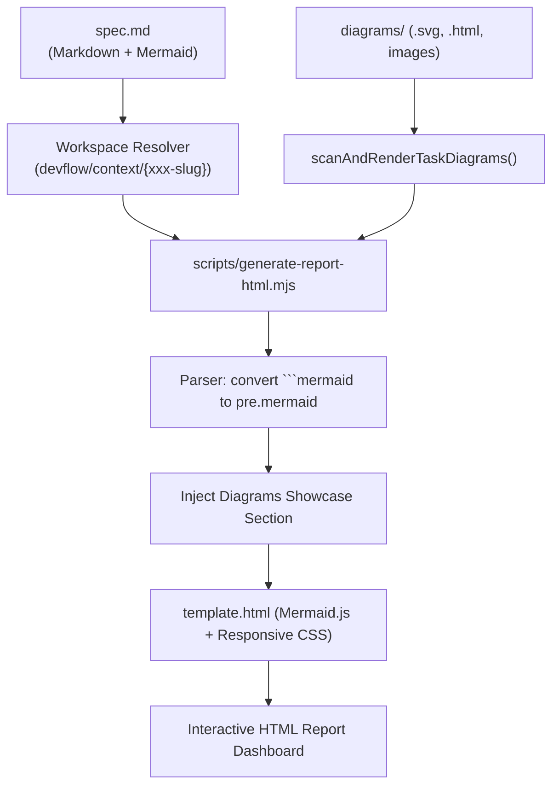

# 📐 [069-report-html-diagram-integration] Standalone HTML Report Diagram Integration & Skill Auto-Install

> **Status**: Completed / Delivered  
> **Track**: Fast-Track (Task-Isolated Living Spec Mode - Feature)  
> **Category**: Feature  
> **Source**: `devflow/build-plan.md: Feature 22` & `devflow/discoveries/DISC-20260902-003-report-html-diagram-integration/discovery.md`  
> **Branch**: `feature/069-report-html-diagram-integration`  
> **Started Date**: 2026-09-02  
> **Delivered Date**: 2026-09-02  
> **Owner**: DevFlow Core Framework Team & AI  

---

## 1. Specification & Scope

### 1.1 Problem Statement
1. คำสั่งสร้างรายงานเดี่ยว `/report:html` (หรือ `npm run report:html`) ไม่แสดงผลไดอะแกรม Mermaid แม้ใน `template.html` จะมีไลบรารี Mermaid.js อยู่แล้ว เนื่องจาก Parser ใน `md2html-report.mjs` ตัดแท็กคลาส `mermaid` ออก ทำให้กลายเป็น `<pre><code>` ธรรมดา
2. หากงานหรือการสำรวจมีไดอะแกรมระดับสถาปัตยกรรมที่สร้างจาก `archify` หรือ `diagram-design` (ในโฟลเดอร์ `diagrams/` ของ Task) ตัวรายงาน HTML ยังไม่มีกลไกตรวจจับและนำไฟล์ `.svg` หรือ `.html` มา embed เป็น Visual Diagram Section
3. สกิล `report-html` ยังขาดคำแนะนำและขั้นตอนการตรวจสอบความมีอยู่ของสกิล `archify` / `diagram-design` รวมถึงการเรียกติดตั้งอัตโนมัติด้วยคำสั่ง `nexus-devflow skill add` เมื่อต้องการสร้างไดอะแกรม
4. ตัว Resolve Workspace ของ `report:html` ยังไม่ได้ค้นหาใน `devflow/context/{xxx-slug}` ของ Task-Isolated Living Spec อย่างเป็นทางการ

### 1.2 In-Scope
1. **Markdown Parser Enhancement (`md2html-report.mjs`, `markdown.mjs`)**:
   - ปรับปรุง Markdown Parser ให้ตรวจจับ ` ```mermaid ` และเรนเดอร์เป็น `<pre class="mermaid">${escapeHtml(code)}</pre>`
   - พัฒนาฟังก์ชัน `scanAndRenderTaskDiagrams(workspaceDir, locale)` ตรวจจับและนำไฟล์ `.svg`, `.html`, และรูปภาพในโฟลเดอร์ `diagrams/` มาสร้างเป็น **System & Architecture Diagrams Showcase Section** พร้อมแทรกลงในสารบัญ (TOC)
2. **Template CSS Styling (`template.html`)**:
   - เพิ่ม CSS Styles สำหรับ Diagram Container, Zoom/Expand, Responsive Iframe Sandboxing (`sandbox="allow-scripts allow-same-origin"`) และ Dark/Light Theme Support
3. **Task-Isolated Workspace Resolver (`report-stage.mjs`)**:
   - เพิ่มการค้นหาใน `devflow/context/{xxx-slug}` ทั้งเมื่อระบุ ID หรือเมื่อรันคำสั่งโดยไม่ใส่อาร์กิวเมนต์
4. **Skill Specifications & Auto-Install Instructions**:
   - ปรับปรุงคู่มือสัญญาใน `.agents/skills/report-html/SKILL.md` และ `.claude/skills/report-html/SKILL.md` ให้มีคำสั่งตรวจเช็คและ auto-install `archify` / `diagram-design` ผ่าน CLI
5. **Comprehensive Automated Tests**:
   - เพิ่มชุดการทดสอบครอบคลุมใน `scripts/test-generate-report-html.mjs`

### 1.3 Out-of-Scope
- การแก้ไขโค้ดภายในตัวไลบรารีภายนอก `archify` หรือ `diagram-design`
- การเปิด auto-generate HTML ในระหว่าง `/complete` (ยังคงนโยบาย Explicit on-demand ตามเดิม)

---

## 2. Technical Architecture & Contracts



### Acceptance Criteria (AC) Verification
- [x] **AC-1**: โค้ดบล็อก ` ```mermaid ` ในเอกสารถูกแปลงเป็น `<pre class="mermaid">` พร้อมเรนเดอร์ใน Dashboard
- [x] **AC-2**: ไฟล์ SVG หรือ HTML ใน `devflow/context/{xxx-slug}/diagrams/` ถูกนำมาแสดงผลเป็น Visual Diagram Container ใน `report.html`
- [x] **AC-3**: คำสั่ง `npm run report:html -- {ID}` สามารถค้นหาและประมวลผล Active Task ใน `devflow/context/{xxx-slug}/` ได้อย่างถูกต้อง
- [x] **AC-4**: อัปเดตสคิล `.agents/skills/report-html/SKILL.md` และ `.claude/skills/report-html/SKILL.md` ระบุขั้นตอนการตรวจและติดตั้ง `archify` / `diagram-design`
- [x] **AC-5**: ชุดทดสอบ `npm run report:html:test` และ `npm test` รันผ่านทั้งหมด 100%

---

## 3. Implementation Summary & Evidence

- **Task 1: Workspace Resolver & Native Mermaid Support**:
  - รองรับการแปลง ` ```mermaid ` สู่ `<pre class="mermaid">` ทั้งใน `md2html-report.mjs` และ `markdown.mjs`
  - ปรับปรุง `resolveReportWorkspaceDir()` ใน `report-stage.mjs` ให้ค้นหาโฟลเดอร์งานใน `devflow/context/` ก่อน
- **Task 2: Task Diagrams Showcase Scanner & Embed Integration**:
  - พัฒนา `scanAndRenderTaskDiagrams()` ใน `md2html-report.mjs` รองรับไฟล์ `.svg`, `.html`, `.png`, `.jpg`, `.webp`
  - เพิ่ม CSS สไตล์ระดับพรีเมียมใน `template.html` รองรับทั้ง Light และ Dark mode
- **Task 3: Skill Specifications & Auto-Install Instructions**:
  - อัปเดต `.agents/skills/report-html/SKILL.md` และ `.claude/skills/report-html/SKILL.md` ให้มีคำสั่งติดตั้งสกิลผ่าน `npx create-nexus-devflow skill add <skill>`
  - ผ่านการตรวจสอบสัญญาและขนาดข้อความผ่าน `npm run check:static`
- **Task 4: Multi-Lane Verification & Live Proof**:
  - ผ่านการทดสอบ `npm run report:html:test`
  - ผ่านการทดสอบ `npm test` (138 tests)
  - ผ่านการทดสอบ `npm run test:package`
  - สร้างไฟล์ตัวอย่าง `diagrams/architecture.svg` และเรนเดอร์รายงานจริงด้วย `npm run report:html -- 068` ได้ไฟล์ผลลัพธ์ `report.html`

---

## 4. Multi-Lane Verification Matrix

| Lane | Command / Verification Target | Result | Notes / Proof |
| :--- | :--- | :--- | :--- |
| **Typecheck & Contracts** | `npm run check:static` | ✅ PASS | 31 Core Skills สมบูรณ์, Descriptions <= 400 chars |
| **HTML Report & Diagram Tests** | `npm run report:html:test` | ✅ PASS | ทดสอบ Mermaid, SVG Embed, HTML Iframe ผ่าน 100% |
| **Unit Tests** | `npm test` | ✅ PASS | ผ่านครบทั้งหมด 138/138 tests |
| **Package Smoke** | `npm run test:package` | ✅ PASS | ทดสอบ Scaffolding & Overlay 101 files ผ่าน |
| **Live Proof** | `npm run report:html -- 068` | ✅ PASS | สร้างไฟล์ `report.html` พร้อม Mermaid และ Diagrams Showcase สำเร็จ |

---

## 5. Release Digest & Retrospective

- **What Changed**: เพิ่มการเรนเดอร์ Mermaid Block สู่ `<pre class="mermaid">` ในตัวเรนเดอร์รายงาน HTML, สร้างระบบตรวจจับไฟล์ไดอะแกรมใน `diagrams/` (`scanAndRenderTaskDiagrams`) และ embed ลงในรายงานพร้อมแทรกลงในสารบัญ (TOC), ขยาย `report-stage.mjs` ให้รองรับการค้นหา Task ใน `devflow/context/{xxx-slug}` ทั้งเมื่อระบุ ID หรือไม่ระบุ, อัปเดตคำแนะนำใน `.agents/skills/report-html/SKILL.md` และ `.claude/skills/report-html/SKILL.md` ให้มีคำสั่งตรวจเช็คและ auto-install `archify` / `diagram-design` ผ่าน CLI, และเขียนชุดการทดสอบครอบคลุมใน `scripts/test-generate-report-html.mjs`
- **Key Decisions**: ใช้ Responsive Iframe พร้อม `sandbox="allow-scripts allow-same-origin"` สำหรับไดอะแกรมแบบ Interactive HTML เพื่อป้องกัน Style/DOM Leakage และใช้ Native SVG embed สำหรับ `.svg` เพื่อความคมชัดสูงสุด
- **Lessons Learned**: โครงสร้าง `template.html` เดิมมี Mermaid.js v11 ติดตั้งไว้อยู่แล้ว การปรับปรุง parser ทำให้เปิดใช้พลังของ Mermaid ได้ทันทีโดยไม่ต้องโหลด script ซ้ำซ้อน
- **Known Limitations**: หากต้องการวาดไดอะแกรมใหม่ ต้องเรียกใช้สกิล `archify` หรือ `diagram-design` ให้สร้างไฟล์ใน `diagrams/` ก่อนรันคำสั่งรายงาน
